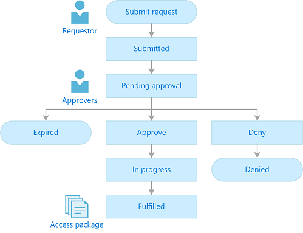

# Approve or deny access requests in Azure AD entitlement management (Preview)

> [!IMPORTANT]
> Azure Active Directory (Azure AD) entitlement management is currently in public preview.
> This preview version is provided without a service level agreement, and it's not recommended for production workloads. Certain features might not be supported or might have constrained capabilities.
> For more information, see [Supplemental Terms of Use for Microsoft Azure Previews](https://azure.microsoft.com/support/legal/preview-supplemental-terms/).

With Azure AD entitlement management, you can configure policies to require approval for access packages, and choose one or more approvers. This article describes how designated approvers can approve or deny requests for access packages.

## Prerequisites

- Approver of an access request

## Approval process

A user that needs access to an access package must submit a request. Depending on the configuration of the policy, the access package might require an approval process. When a user submits an access request, their request is in the **submitted** state. This triggers the approval process, and moves the request to the **pending approval** state.

The access package approvers are notified of the user's access request. There may be a single approver, multiple approvers, or a group of approvers defined in the policy. Only one approver needs to review the access request, and submit the approve or deny decision.

If the access request is approved, the request is in the **approved** state. Entitlement management starts the process of provisioning the user's access to each resource in the access package. This moves the request to the **provisioning** state. When the user is provisioned access to all the resources in the access packages, they are notified of their access to the access package.

If the access request is denied, the user gets notified of the deny decision. This changes the request to a **denied** state.

## Open the access request

The first step to approve or deny access requests is to find and open the access request pending approval. There are two ways to open the access request.

1. Look for an email from Microsoft that asks you to review an access request. Here is an example email.

1. Click the **Review access request** link to open the access request.

If you don't have the email, you can find the access requests pending your approval by following these steps.

1. Sign in to the My Access portal at [https://myaccess.microsoft.com](https://myaccess.microsoft.com).

1. In the left menu, click **Approvals** to a list of access requests pending approval.

## Approve or deny the access request

After you open an access request pending approval, you can see details that will help you make an approve or deny decision.

1. In the **Details** column, click **View** to open the Access request pane.

1. Click **Details** to see details about the access request.

    The details include the user's name, organization, access start and end date if provided, business justification, when the request was submitted, and when the request will expire.

1. Click **Approve** or **Deny**.

1. If necessary, enter reason.

1. Click **Submit** to submit your decision.

    If a policy is configured with multiple approvers, only one approver needs to make a decision about the pending approval. After an approver has submitted their decision to the access request, the request is completed and is no longer available for the other approvers to approve or deny the request. The other approvers can see the request decision and the decision maker in their My Access portal. At this time, only single-stage approval is supported.

    If none of the configured approvers are able to approve or deny the access request, the request expires (times out) after the configured request duration. The user gets notified that their access request has expired and that they need to resubmit the access request.

## Next steps

- [Email notifications](entitlement-management-notifications.md)
