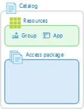
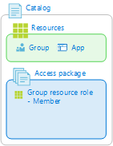
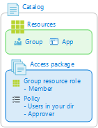
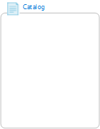
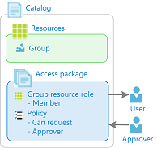
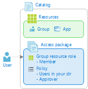

# Common scenarios in Azure AD entitlement management (Preview)

> [!IMPORTANT]
> Azure Active Directory (Azure AD) entitlement management is currently in public preview.
> This preview version is provided without a service level agreement, and it's not recommended for production workloads. Certain features might not be supported or might have constrained capabilities.
> For more information, see [Supplemental Terms of Use for Microsoft Azure Previews](https://azure.microsoft.com/support/legal/preview-supplemental-terms/).

There are several ways that you can configure entitlement management for your organization. However, if you're just getting started, it's helpful to understand the common scenarios for administrators, approvers, and requestors.

## Administrator setup

### Allow users in your directory to request resources

- Users in your directory in specific groups can request access
- Time-limited access
- Approval process

> [!div class="mx-tableFixed"]
> | Step | Example | Who can perform |
> | --- | --- | --- |
> | **1.** Open entitlement management |  | User admin Catalog owner |
> | **2.** Add resources to a catalog<ul><li>Groups</li><li>Applications</li><li>SharePoint sites</li></ul> |  | User admin Catalog owner |
> | **3.** Create an access package in catalog |  | User admin Catalog owner |
> | **4.** Add resource roles to access package |  | User admin Catalog owner Access package manager |
> | **5.** Create a policy<ul><li>For users in your directory</li><li>Require approval</li><li>Expiration settings</li></ul> |  | User admin Catalog owner Access package manager |

### Allow users in your directory to request resources managed by another department

- Users in your directory in specific groups can request access
- Another department will manage the resources that can be requested
- Time-limited access
- Approval process

> [!div class="mx-tableFixed"]
> | Step | Example | Who can perform |
> | --- | --- | --- |
> | **1.** Open entitlement management |  | User admin Catalog creator |
> | **2.** If necessary, create a new catalog for the department | | User admin Catalog creator |
> | **3.** Add catalog owners |  | User admin Catalog owner |
> | **4.** Add resources to catalog<ul><li>Groups</li><li>Applications</li><li>SharePoint sites</li></ul> |  | User admin Catalog owner |
> | **5.** Create an access package in catalog |  | User admin Catalog owner |
> | **6.** Add resource roles to access package |  | User admin Catalog owner Access package manager |
> | **7.** Create a policy<ul><li>For users in your directory</li><li>Require approval</li><li>Expiration settings</li></ul> |  | User admin Catalog owner Access package manager |

### Directly assign users in your directory to resources

- No users in your directory can request access
- Time-limited access
- No approval process

> [!div class="mx-tableFixed"]
> | Step | Example | Who can perform |
> | --- | --- | --- |
> | **1.** Open entitlement management |  | User admin Catalog owner Access package manager |
> | **2.** Open the access package |  | User admin Catalog owner Access package manager |
> | **3.** Create a policy<ul><li>None (admin direct assignments only)</li><li>Expiration settings</li></ul> |  | User admin Catalog owner Access package manager |
> | **4.** Create an assignment to add the users to the access package<ul><li>Start and end dates</li></ul> |  | User admin Catalog owner Access package manager |

### Allow specific users from your business partners to request resources

- Specific users from your business partners (including users not yet in your directory) can request access
- Self-service request
- Approval process

### Allow users from your business partners to request resources

- Any users from your business partners (including users not yet in your directory) can request access
- Self-service request
- Colleagues can share request link with peers
- Approval process

> [!div class="mx-tableFixed"]
> | Step | Example | Who can perform |
> | --- | --- | --- |
> | **1.** Open entitlement management |  | User admin Catalog owner |
> | **2.** Add resources to a catalog<ul><li>Groups</li><li>Applications</li><li>SharePoint sites</li></ul> |  | User admin Catalog owner |
> | **3.** Create an access package in catalog |  | User admin Catalog owner |
> | **4.** Add resource roles to access package |  | User admin Catalog owner Access package manager |
> | **5.** Create a policy<ul><li>For users not in your directory</li><li>Require approval</li><li>Expiration settings</li></ul> |  | User admin Catalog owner Access package manager |
> | **6.** Send **My Access portal link** to request access package to your business partner<ul><li>Business partner can share link with their users</li></ul> |  | User admin Catalog owner Access package manager |

### Allow anyone to request resources

- Anyone (including social) can request access, for example to submit a contract bid
- Self-service request
- Colleagues can share request link with peers
- Approval process

### Allow users from your business partners to sign up for an Azure AD account

- Any users from your business partners not yet in your directory to sign up for an Azure AD account in your directory
- Self-service sign up
- Automatically removed after a predetermined time

## Administrator updates

### Change the available resources

> [!div class="mx-tableFixed"]
> | Step | Example | Who can perform |
> | --- | --- | --- |
> | **1.** Open entitlement management |  | User admin Catalog owner Access package manager |
> | **2.** Open the access package |  | User admin Catalog owner Access package manager |
> | **3.** Add or remove resource roles |  | User admin Catalog owner Access package manager |

## Administrator audit

### View who has an assignment to resources

- View which users have access to an access package
- View which users access has expired

> [!div class="mx-tableFixed"]
> | Step | Example | Who can perform |
> | --- | --- | --- |
> | **1.** Open entitlement management |  | User admin Catalog owner Access package manager |
> | **2.** Open an access package |  | User admin Catalog owner Access package manager |
> | **2.** View **Assignments** |  | User admin Catalog owner Access package manager |

### View resources a user has access to

- Understand how a user got access to a resource
- When they request and who approved

> [!div class="mx-tableFixed"]
> | Step | Example | Who can perform |
> | --- | --- | --- |
> | **1.** Open entitlement management |  | User admin Catalog owner Access package manager |
> | **2.** View **User assignments report** |  | User admin Catalog owner Access package manager |

## Approvers

### Approve requests to access resources

- View requests pending approval
- Approve or deny requests to access packages

> [!div class="mx-tableFixed"]
> | Step | Example | Who can perform |
> | --- | --- | --- |
> | **1.** Sign in to the My Access portal |  | Approver |
> | **2.** Find access package in pending approvals |  | Approver |
> | **3.** Approve access request |  | Approver |

## Requestors

### Request access to resources

- View available access packages and make requests

> [!div class="mx-tableFixed"]
> | Step | Example | Who can perform |
> | --- | --- | --- |
> | **1.** Sign in to the My Access portal |  | Requestor |
> | **2.** Find access package |  | Requestor |
> | **3.** Request access |  | Requestor |

### Request resources with a direct link

> [!div class="mx-tableFixed"]
> | Step | Example | Who can perform |
> | --- | --- | --- |
> | **1.** Open the access package link you received |  | Requestor |
> | **2.** Sign in to the My Access portal |  | Requestor |
> | **3.** Request access |  | Requestor |

### View resources you already have access to

### View history of your requests

### Share a resource request link with a colleague

## Next steps

- [Tutorial: Create your first access package](entitlement-management-access-package-first.md)
