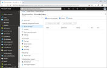
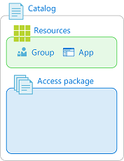
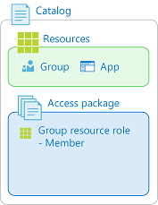
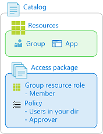
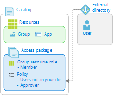
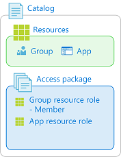
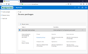
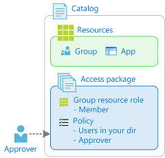
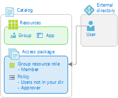

# Common scenarios in Azure AD entitlement management (Preview)

> [!IMPORTANT]
> Azure Active Directory (Azure AD) entitlement management is currently in public preview.
> This preview version is provided without a service level agreement, and it's not recommended for production workloads. Certain features might not be supported or might have constrained capabilities.
> For more information, see [Supplemental Terms of Use for Microsoft Azure Previews](https://azure.microsoft.com/support/legal/preview-supplemental-terms/).

There are several ways that you can configure entitlement management for your organization. However, if you're just getting started, it's helpful to understand the common scenarios for administrators, approvers, and requestors.

## Administrators

### I'm new to entitlement management and I want help with getting started

> [!div class="mx-tableFixed"]
> | Steps | Example |
> | --- | --- |
> | [Follow tutorial to create your first access package](entitlement-management-access-package-first.md) |  |

### I want to allow users in my directory to request access to groups, applications, or SharePoint sites

> [!div class="mx-tableFixed"]
> | Steps | Example |
> | --- | --- |
> | **1.** [Create a new access package in a catalog](entitlement-management-access-package-create.md#start-new-access-package) |  |
> | **2.** [Add resource roles to access package](entitlement-management-access-package-edit.md#add-resource-roles)<ul><li>Groups</li><li>Applications</li><li>SharePoint sites</li></ul> |  |
> | **3.** [Add a policy](entitlement-management-access-package-edit.md#policy-for-users-in-your-directory)<ul><li>For users in your directory</li><li>Require approval</li><li>Expiration settings</li></ul> |  |

### I want to allow users from my business partners directory (including users not yet in my directory) to request access to groups, applications, or SharePoint sites

> [!div class="mx-tableFixed"]
> | Steps | Example |
> | --- | --- |
> | **1.** [Create a new access package in a catalog](entitlement-management-access-package-create.md#start-new-access-package) |  |
> | **2.** [Add resource roles to access package](entitlement-management-access-package-edit.md#add-resource-roles) |  |
> | **3.** [Add a policy for external users](entitlement-management-access-package-edit.md#policy-for-users-not-in-your-directory)<ul><li>For users not in your directory</li><li>Require approval</li><li>Expiration settings</li></ul> |  |
> | **4.** [Send the My Access portal link to request the access package to your business partner](entitlement-management-access-package-edit.md#copy-my-access-portal-link)<ul><li>Business partner can share link with their users</li></ul> |  |

### I want to change the groups, applications, or SharePoint sites in an access package

> [!div class="mx-tableFixed"]
> | Steps | Example |
> | --- | --- |
> | **1.** Open the access package |  |
> | **2.** [Add or remove resource roles](entitlement-management-access-package-edit.md#add-resource-roles) |  |

### I want to view who has an assignment to groups, applications, or SharePoint sites

> [!div class="mx-tableFixed"]
> | Steps | Example |
> | --- | --- |
> | **1.** Open an access package |  |
> | **2.** [View Assignments](entitlement-management-access-package-edit.md#view-who-has-an-assignment)<ul><li>View which users have access to an access package</li><li>View which user's access has expired</li></ul> |  |

### I want to view groups, applications, or SharePoint sites a user has access to

> [!div class="mx-tableFixed"]
> | Steps | Example |
> | --- | --- |
> | [View User assignments report](entitlement-management-reports.md)<ul><li>View when they requested and who approved</li></ul> |  |

## Approvers

### I want to approve requests to access groups, applications, or SharePoint sites

> [!div class="mx-tableFixed"]
> | Steps | Example |
> | --- | --- |
> | **1.** [Open request in My Access portal](entitlement-management-request-approve.md#open-request) |  |
> | **2.** [Approve access request](entitlement-management-request-approve.md#approve-or-deny-request) |  |

## Requestors

### I want to view the groups, applications, or SharePoint sites available to me and request access

> [!div class="mx-tableFixed"]
> | Steps | Example |
> | --- | --- |
> | **1.** [Sign in to the My Access portal](entitlement-management-request-access.md#sign-in-to-the-my-access-portal) |  |
> | **2.** Find access package |  |
> | **3.** [Request access](entitlement-management-request-access.md#request-an-access-package) |  |

### I'm an external user and I want to request access to groups, applications, or SharePoint sites with a direct link

> [!div class="mx-tableFixed"]
> | Steps | Example |
> | --- | --- |
> | **1.** [Find the My Access portal link you received](entitlement-management-access-package-edit.md#copy-my-access-portal-link) |  |
> | **2.** [Sign in to the My Access portal](entitlement-management-request-access.md#sign-in-to-the-my-access-portal) |  |
> | **3.** [Request access](entitlement-management-request-access.md#request-an-access-package) |  |

### I want to view the groups, applications, or SharePoint sites I already have access to

> [!div class="mx-tableFixed"]
> | Steps | Example |
> | --- | --- |
> | **1.** [Sign in to the My Access portal](entitlement-management-request-access.md#sign-in-to-the-my-access-portal) |  |
> | **2.** View active access packages |  |

## Next steps

- [Tutorial: Create your first access package](entitlement-management-access-package-first.md)
- [Delegate tasks](entitlement-management-delegate.md)
