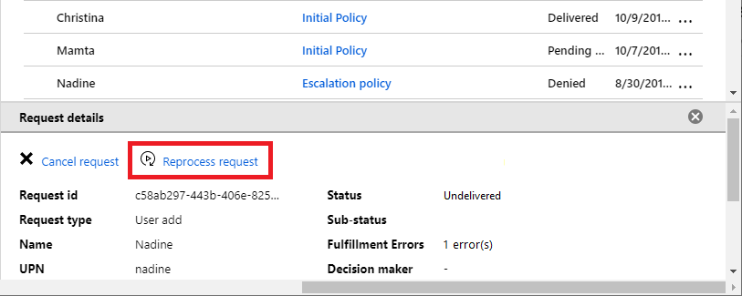

# Troubleshoot Azure AD entitlement management

This article describes some items you should check to help you troubleshoot Azure Active Directory (Azure AD) entitlement management.

## Administration

* If you get an access denied message when configuring entitlement management, and you are a Global administrator, ensure that your directory has an [Azure AD Premium P2 (or EMS E5) license](entitlement-management-overview.md#license-requirements).

* If you get an access denied message when creating or viewing access packages, and you are a member of a Catalog creator group, you must [create a catalog](entitlement-management-catalog-create.md) prior to creating your first access package.

## Resources

* Roles for applications are defined by the application itself and are managed in Azure AD. If an application does not have any resource roles, entitlement management assigns users to a **Default Access** role.

    Note that the Azure portal may also show service principals for services that cannot be selected as applications.  In particular, **Exchange Online** and **SharePoint Online** are services, not applications that have resource roles in the directory, so they cannot be included in an access package.  Instead, use group-based licensing to establish an appropriate license for a user who needs access to those services.

* For a group to be a resource in an access package, it must be able to be modifiable in Azure AD.  Groups that originate in an on-premises Active Directory cannot be assigned as resources because their owner or member attributes cannot be changed in Azure AD.   Groups that originate in Exchange Online as Distribution groups cannot be modified in Azure AD either. 

* SharePoint Online document libraries and individual documents cannot be added as resources.  Instead, create an [Azure AD security group](../fundamentals/active-directory-groups-create-azure-portal.md), include that group and a site role in the access package, and in SharePoint Online use that group to control access to the document library or document.

* If there are users that have already been assigned to a resource that you want to manage with an access package, be sure that the users are assigned to the access package with an appropriate policy. For example, you might want to include a group in an access package that already has users in the group. If those users in the group require continued access, they must have an appropriate policy for the access packages so that they don't lose their access to the group. You can assign the access package by either asking the users to request the access package containing that resource, or by directly assigning them to the access package. For more information, see [Change request and approval settings for an access package](entitlement-management-access-package-request-policy.md).

* When you remove a member of a team, they are removed from the Office 365 Group as well. Removal from the team's chat functionality might be delayed. For more information, see [Group membership](https://docs.microsoft.com/microsoftteams/office-365-groups#group-membership).

* Ensure your directory is not configured for multi-geo. Entitlement management currently does not support multi-geo locations for SharePoint Online. SharePoint Online sites must be in the default geo-location to be governed with entitlement management. For more information, see [Multi-Geo Capabilities in OneDrive and SharePoint Online](https://docs.microsoft.com/Office365/Enterprise/multi-geo-capabilities-in-onedrive-and-sharepoint-online-in-office-365).

## Access packages

* If you attempt to delete an access package or policy and see an error message that says there are active assignments, if you don't see any users with assignments, check to see whether any recently deleted users still have assignments. During the 30-day window after a user is deleted, the user account can be restored.   

## External users

* When an external user wants to request access to an access package, make sure they are using the **My Access portal link** for the access package. For more information, see [Share link to request an access package](entitlement-management-access-package-settings.md). If an external user just visits **myaccess.microsoft.com** and does not use the full My Access portal link, then they will see the access packages available to them in their own organization and not in your organization.

* If an external user is unable to request access to an access package or is unable to access resources, be sure to check your [settings for external users](entitlement-management-external-users.md#settings-for-external-users).

* If a new external user, that has not previously signed in your directory, receives an access package including a SharePoint Online site, their access package will show as not fully delivered until their account is provisioned in SharePoint Online. For more information about sharing settings, see [Review your SharePoint Online external sharing settings](entitlement-management-external-users.md#review-your-sharepoint-online-external-sharing-settings).

## Requests

* When a user wants to request access to an access package, be sure that they are using the **My Access portal link** for the access package. For more information, see [Share link to request an access package](entitlement-management-access-package-settings.md).

* If you open the My Access portal with your browser set to in-private or incognito mode, this might conflict with the sign-in behavior. We recommend that you do not use in-private or incognito mode for your browser when you visit the My Access portal.

* When a user who is not yet in your directory signs in to the My Access portal to request an access package, be sure they authenticate using their organizational account. The organizational account can be either an account in the resource directory, or in a directory that is included in one of the policies of the access package. If the user's account is not an organizational account, or the directory where they authenticate is not included in the policy, then the user will not see the access package. For more information, see [Request access to an access package](entitlement-management-request-access.md).

* If a user is blocked from signing in to the resource directory, they will not be able to request access in the My Access portal. Before the user can request access, you must remove the sign-in block from the user's profile. To remove the sign-in block, in the Azure portal, click **Azure Active Directory**, click **Users**, click the user, and then click **Profile**. Edit the **Settings** section and change **Block sign in** to **No**. For more information, see [Add or update a user's profile information using Azure Active Directory](../fundamentals/active-directory-users-profile-azure-portal.md).  You can also check if the user was blocked due to an [Identity Protection policy](../identity-protection/howto-unblock-user.md).

* In the My Access portal, if a user is both a requestor and an approver, they will not see their request for an access package on the **Approvals** page. This behavior is intentional - a user cannot approve their own request. Ensure that the access package they are requesting has additional approvers configured on the policy. For more information, see [Change request and approval settings for an access package](entitlement-management-access-package-request-policy.md).

### View a request's delivery errors

**Prerequisite role:** Global administrator, User administrator, Catalog owner, or Access package manager

1. In the Azure portal, click **Azure Active Directory** and then click **Identity Governance**.

1. In the left menu, click **Access packages** and then open the access package.

1. Click **Requests**.

1. Select the request you want to view.

    If the request has any delivery errors, the request status will be **Undelivered** or **Partially delivered**.

    If there are any delivery errors, a count of delivery errors will be displayed in the request's detail pane.

1. Click the count to see all of the request's delivery errors.

### Reprocess a request

If an error is met after triggering an access package reprocess request, you must wait while the system reprocesses the request. The system tries multiple times to reprocess for several hours, so you can't force reprocessing during this time. 

You can only reprocess a request that has a status of **Delivery failed** or **Partially delivered** and a completed date of less than one week.

- If the error is fixed during the trials window, the request status will change to **Delivering**. The request will reprocess without additional actions from the user.

- If the error wasn't fixed during the trials window, the request status may be **Delivery failed** or **partially delivered**. You can then use the **reprocess** button. You'll have seven days to reprocess the request.

**Prerequisite role:** Global administrator, User administrator, Catalog owner, or Access package manager

1. In the Azure portal, click **Azure Active Directory** and then click **Identity Governance**.

1. In the left menu, click **Access packages** and then open the access package.

1. Click **Requests**.

1. Click the request you want to reprocess.

1. In the request details pane, click **Reprocess request**.

    

### Cancel a pending request

You can only cancel a pending request that has not yet been delivered or whose delivery has failed.

**Prerequisite role:** Global administrator, User administrator, Catalog owner, or Access package manager

1. In the Azure portal, click **Azure Active Directory** and then click **Identity Governance**.

1. In the left menu, click **Access packages** and then open the access package.

1. Click **Requests**.

1. Click the request you want to cancel.

1. In the request details pane, click **Cancel request**.

## Multiple policies

* Entitlement management follows least privilege best practices. When a user requests access to an access package that has multiple policies that apply, entitlement management includes logic to help ensure stricter or more specific policies are prioritized over generic policies. If a policy is generic, entitlement management might not display the policy to the requestor or might automatically select a stricter policy.

* For example, consider an access package with two policies for internal employees in which both policies apply to the requestor. The first policy is for specific users that include the requestor. The second policy is for all users in a directory that the requestor is a member of. In this scenario, the first policy is automatically selected for the requestor because it is more strict. The requestor is not given the option to select the second policy.

* When multiple policies apply, the policy that is automatically selected or the policies that are displayed to the requestor is based on the following priority logic:

    | Policy priority | Scope |
    | --- | --- |
    | P1 | Specific users and groups in your directory OR Specific connected organizations |
    | P2 | All members in your directory (excluding guests) |
    | P3 | All users in your directory (including guests) OR Specific connected organizations |
    | P4 | All connected organizations OR All users (all connected organizations + any new external users) |
    
    If any policy is in a higher priority category, the lower priority categories are ignored. For an example of how multiple policies with same priority are displayed to the requestor, see [Select a policy](entitlement-management-request-access.md#select-a-policy).

## Next steps

- [Govern access for external users](entitlement-management-external-users.md)
- [View reports of how users got access in entitlement management](entitlement-management-reports.md)
