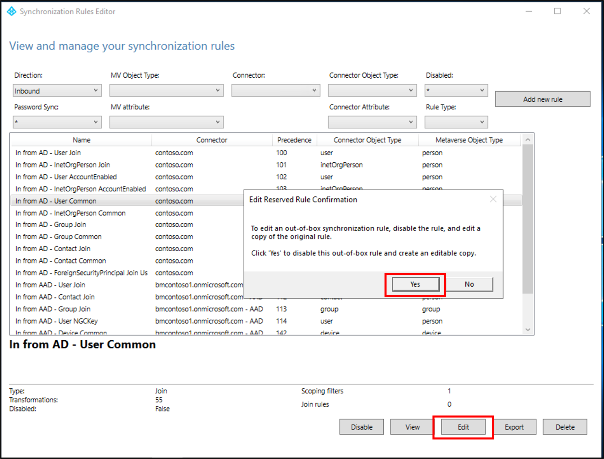
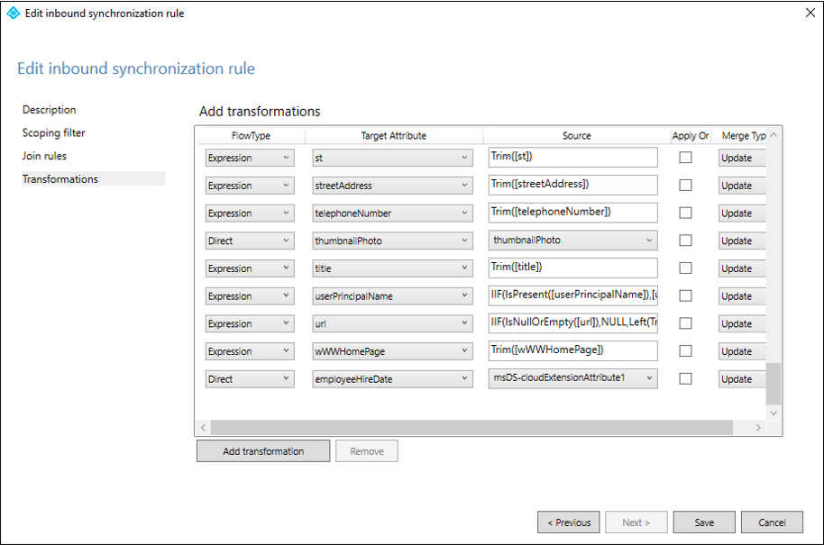

# How to synchronize attributes for Lifecycle workflows'
Workflows, contain specific processes, which run automatically against users, as they move through their life cycle, within the organization.

These workflows are triggered based on user attributes in Azure AD.  For instance, the classic [on-boarding pre-hire scenario](lifecycle-workflow-templates.md#onboard-pre-hire-employee) uses the `EmployeeHireDate` attribute.

This attribute, however, is not automatically populated using such synchronization methods as Azure AD Connect or Azure AD Connect cloud sync.

This document explains how to setup synchronization from on-premises Azure AD Connect cloud sync and Azure AD Connect for the required attributes.  This document only demonstrates synchronization for the `EmployeeHireDate` attribute. For additional attributes, see the [Lifecyce workflows template](lifecycle-workflow-templates.md) document.

## How to create a custom synch rule in Azure AD Connect cloud sync for EmployeeHireDate

 1.  In the Azure portal, select **Azure Active Directory**.
 2.  Select **Azure AD Connect**.
 3.  Select **Manage cloud sync**.
 4. Under **Configuration**, select your configuration.
 5. Select **Click to edit mappings**.  This link opens the **Attribute mappings** screen.
 6. Select **Add attribute**.
 7. Fill in the following information: 
     
     - Mapping Type: Direct
     - Source attribute: msDS-cloudExtensionAttribute1
     - Default value: Leave blank
     - Target attribute: employeeHireDate
     - Apply this mapping: Always

    a. Click **Apply**.
1. Back on the **Attribute mappings** screen, you should see your new attribute mapping.  
2. Select **Save schema**.

For more information on attributes see [Attribute mapping in Azure AD Connect cloud sync.](../cloud-sync/how-to-attribute-mapping.md)

## How to create a custom synch rule in Azure AD Connect for EmployeeHireDate
The following example will walk you through setting up a custom synchronization rule that synchronizes the Active Directory attribute to the employeeHireDate attribute in Azure AD.

 1. Open a PowerShell window as administrator and run `Set-ADSyncScheduler -SyncCycleEnabled $false`.
 2. Go to Start\Azure AD Connect\ and open the Synchronization Rules Editor
 3. Ensure the the direction at the top is set to **Inbond**.
 3.  In the Synchronization Rules Editor, locate **In from AD - User Common** and click **Edit**.
 4. You will see a pop-up that says, in order to edit this rule, should disable it and create a copy.  Click **Yes**.
   
 6.  A new windows should appear that has Name **In from AD - User Common - Cloned (date time)**. Change the precedence to a number below 100 and Click **Next**.
 7. On the **Scoping filter** screen, click **Next.**
 8. On the **Join rules** screen, click **Next**.
 9. On the **Transformations** screen, Under **Add transformations,** scroll to the bottom, click **Add transformation** and enter the following information.
   
	- FlowType:  Direct
	- Target Attribute: employeeHireDate
	- Source:  msDS-cloudExtensionAttribute1

 9. Click **Save**.  If you get an Expression warning, click **Yes**.
 10. On the warning about a full import, click **OK**.
 11. At the top of the Synchronization Rules Editor, select **Outbound**.
 12. Locate **Out to AAD - User Identity** and click **Edit**
 13. You will see a pop-up that says, in order to edit this rule, should disable it and create a copy.  Click **Yes**.
 14.  A new windows should appear that has Name **Out to AAD - User Identity - Cloned (date time)**.  Change the precedence to a number below 100 (but not thee same number used above) and Click **Next**.
 15. On the **Scoping filter** screen, click **Next.**
 16. On the **Join rules** screen, click **Next**.
 17. On the **Transformations** screen, Under **Add transformations,** scroll to the bottom, click **Add transformation** and enter the following information.
	   
     - FlowType:  Direct
     - Target Attribute: employeeHireDate
     - Source:  employeeHireDate
  
 18. Click **Save**.  If you get an Expression warning, click **Yes**.
 19. On the warning about a full import, click **OK**.
 20. Open a PowerShell window as administrator and run `Set-ADSyncScheduler -SyncCycleEnabled $true`.

For additional information see [How to customize a synchronization rule](../hybrid/how-to-connect-create-custom-sync-rule.md) and [Make a change to the default configuration.](../hybrid/how-to-connect-sync-change-the-configuration.md)

## Next steps
- [What are lifecycle workflows?](what-are-lifecycle-workflows.md)
- [Create a custom workflow using the Azure Portal](tutorial-onboard-custom-workflow-portal.md)
- [Create a Lifecycle workflow](create-lifecycle-workflow.md)