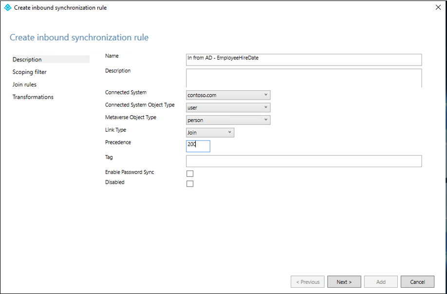
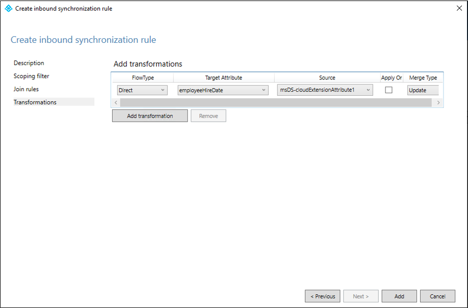
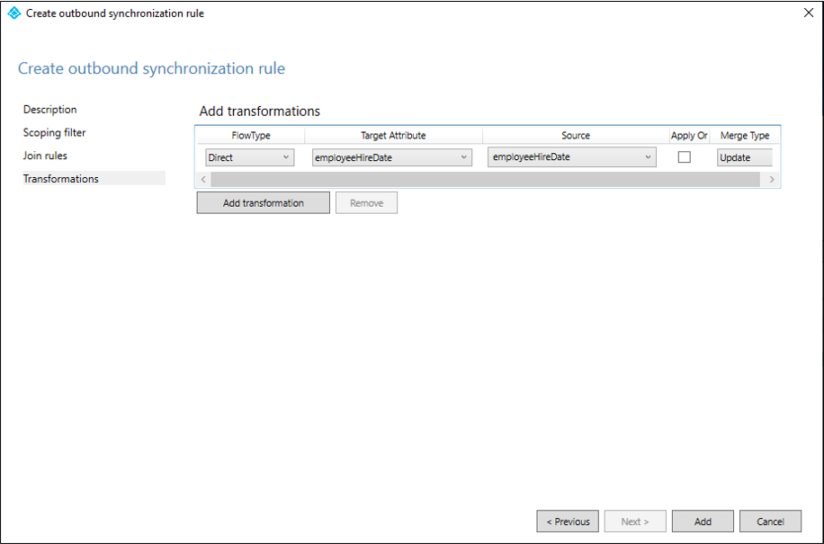
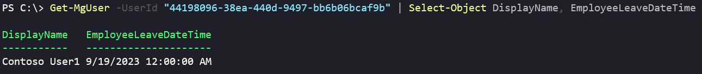

# How to synchronize attributes for Lifecycle workflows

Workflows contain specific tasks, which can run automatically against users based on the specified execution conditions. Automatic workflow scheduling is supported based on the employeeHireDate and employeeLeaveDateTime user attributes in Microsoft Entra ID.

To take full advantage of Lifecycle Workflows, user provisioning should be automated, and the scheduling relevant attributes should be synchronized. 

## Scheduling relevant attributes

The following table shows the scheduling (trigger) relevant attributes and the methods of  synchronization that are supported.

|Attribute|Type|Supported in HR Inbound Provisioning|Support in Microsoft Entra Connect Cloud Sync|Support in Microsoft Entra Connect Sync| 
|-----|-----|-----|-----|-----|
|employeeHireDate|DateTimeOffset|Yes|Yes|Yes|
|employeeLeaveDateTime|DateTimeOffset|Yes|Yes|Yes|

> [!NOTE]
> Manually setting the employeeLeaveDateTime for cloud-only users requires special permissions. For more information, see: [Configure the employeeLeaveDateTime property for a user](/graph/tutorial-lifecycle-workflows-set-employeeleavedatetime)

This document explains how to set up synchronization from on-premises Microsoft Entra Connect cloud sync or Microsoft Entra Connect for the required attributes.

>[!NOTE]
> There's no corresponding EmployeeHireDate or EmployeeLeaveDateTime attribute in Active Directory. If you're synchronizing from on-premises AD, you'll need to identify an attribute in AD that can be used. This attribute must be a string.


## Understanding EmployeeHireDate and EmployeeLeaveDateTime formatting

The EmployeeHireDate and EmployeeLeaveDateTime contain dates and times that must be formatted in a specific way.  This means that you may need to use an expression to convert the value of your source attribute to a format that will be accepted by the EmployeeHireDate or EmployeeLeaveDateTime.  The following table outlines the format that is expected and provides an example expression on how to convert the values.

|Scenario|Expression/Format|Target|More Information|
|-----|-----|-----|-----|
|Workday to Active Directory User Provisioning|FormatDateTime([StatusHireDate], "yyyy-MM-ddzzz", "yyyyMMddHHmmss.fZ")|On-premises AD string attribute|[Attribute mappings for Workday](../saas-apps/workday-inbound-tutorial.md#below-are-some-example-attribute-mappings-between-workday-and-active-directory-with-some-common-expressions)|
|SuccessFactors to Active Directory User Provisioning|FormatDateTime([endDate], ,"M/d/yyyy hh:mm:ss tt","yyyyMMddHHmmss.fZ")|On-premises AD string attribute|[Attribute mappings for SAP Success Factors](../saas-apps/sap-successfactors-inbound-provisioning-tutorial.md)|
|Custom import to Active Directory|Must be in the format "yyyyMMddHHmmss.fZ"|On-premises AD string attribute||
|Microsoft Graph User API|Must be in the format "YYYY-MM-DDThh:mm:ssZ"|EmployeeHireDate and EmployeeLeaveDateTime||
|Workday to Microsoft Entra user provisioning|Can use a direct mapping.  No expression is needed but may be used to adjust the time portion of EmployeeHireDate and EmployeeLeaveDateTime|EmployeeHireDate and EmployeeLeaveDateTime||
|SuccessFactors to Microsoft Entra user provisioning|Can use a direct mapping.  No expression is needed but may be used to adjust the time portion of EmployeeHireDate and EmployeeLeaveDateTime|EmployeeHireDate and EmployeeLeaveDateTime||

For more information on expressions, see [Reference for writing expressions for attribute mappings in Microsoft Entra ID](../app-provisioning/functions-for-customizing-application-data.md)

The expression examples in the table use endDate for SAP and StatusHireDate for Workday.  However, you may opt to use different attributes.

For example, you might use StatusContinuousFirstDayOfWork instead of StatusHireDate for Workday.  In this instance your expression would be:  

   `FormatDateTime([StatusContinuousFirstDayOfWork], , "yyyy-MM-ddzzz", "yyyyMMddHHmmss.fZ")`


The following table has a list of suggested attributes and their scenario recommendations.

|HR Attribute|HR System|Scenario|Microsoft Entra attribute|
|-----|-----|-----|-----|
|StatusHireDate|Workday|Joiner|EmployeeHireDate|
|StatusContinuousFirstDayOfWork|Workday|Joiner|EmployeeHireDate|	
StatusDateEnteredWorkforce|Workday|Joiner|EmployeeHireDate|
StatusOriginalHireDate|Workday|Joiner|EmployeeHireDate|
|StatusEndEmploymentDate|Workday|Leaver|EmployeeLeaveDateTime|
|StatusResignationDate|Workday|Leaver|EmployeeLeaveDateTime|
|StatusRetirementDate|Workday|Leaver|EmployeeLeaveDateTime|
|StatusTerminationDate|Workday|Leaver|EmployeeLeaveDateTime|
|startDate|SAP SF|Joiner|EmployeeHireDate|
|firstDateWorked|SAP SF|Joiner|EmployeeHireDate|
|lastDateWorked|SAP SF|Leaver|EmployeeLeaveDateTime|
|endDate|SAP SF|Leaver|EmployeeLeaveDateTime|

For more attributes, see the [Workday attribute reference](../app-provisioning/workday-attribute-reference.md) and [SAP SuccessFactors attribute reference](../app-provisioning/sap-successfactors-attribute-reference.md)

## Importance of time
To ensure timing accuracy of scheduled workflows it’s crucial to consider:

- The time portion of the attribute must be set accordingly, for example the `employeeHireDate` should have a time at the beginning of the day like 1AM or 5AM and the `employeeLeaveDateTime` should have time at the end of the day like 9PM or 11PM
- The Workflows won't run earlier than the time specified in the attribute, however the [tenant schedule (default 3h)](customize-workflow-schedule.md) may delay the workflow run.  For instance, if you set the `employeeHireDate` to 8AM but the tenant schedule doesn't run until 9AM, the workflow won't be processed until then.  If a new hire is starting at 8AM, you would want to set the time to something like (start time - tenant schedule) to ensure it runs before the employee arrives.
- It's recommended, that if you're using temporary access pass (TAP), that you set the maximum lifetime to 24 hours.  Doing this will help ensure that the TAP hasn't expired after being sent to an employee who may be in a different timezone.  For more information, see [Configure Temporary Access Pass in Microsoft Entra ID to register Passwordless authentication methods.](../authentication/howto-authentication-temporary-access-pass.md#enable-the-temporary-access-pass-policy)
- When importing the data, you should understand if and how the source provides time zone information for your users to potentially make adjustments to ensure timing accuracy.


## Create a custom sync rule in Microsoft Entra Connect cloud sync for EmployeeHireDate
 The following steps guide you through creating a synchronization rule using cloud sync.
 1.  In the Microsoft Entra admin center, browse to > **Hybrid management** > **Microsoft Entra Connect**.
 1.  Select **Manage Microsoft Entra cloud sync**.
 1. Under **Configuration**, select your configuration.
 1. Select **Click to edit mappings**.  This link opens the **Attribute mappings** screen.
 1. Select **Add attribute**.
 1. Fill in the following information: 
     - Mapping Type: Direct
     - Source attribute: msDS-cloudExtensionAttribute1
     - Default value: Leave blank
     - Target attribute: employeeHireDate
     - Apply this mapping: Always
     :::image type="content" source="media/how-to-lifecycle-workflow-sync-attributes/edit-cloud-attribute-mapping.png" alt-text="Screenshot of the cloud attribute mapping.":::
 1. Select **Apply**.
 1. Back on the **Attribute mappings** screen, you should see your new attribute mapping.  
 1. Select **Save schema**.

For more information on attributes, see [Attribute mapping in Microsoft Entra Connect cloud sync.](../hybrid/cloud-sync/how-to-attribute-mapping.md)

## How to create a custom sync rule in Microsoft Entra Connect for EmployeeHireDate
The following example walks you through setting up a custom synchronization rule that synchronizes the Active Directory attribute to the employeeHireDate attribute in Microsoft Entra ID.
   1. Open a PowerShell window as administrator and run `Set-ADSyncScheduler -SyncCycleEnabled $false` to disable the scheduler.
   1. Go to Start\Azure AD Connect\ and open the Synchronization Rules Editor
   1. Ensure the direction at the top is set to **Inbound**.
   1. Select **Add Rule.**
   1. On the **Create Inbound synchronization rule** screen, enter the following information and select **Next**.
      - Name:  In from AD - EmployeeHireDate
      - Connected System:  contoso.com
      - Connected System Object Type: user
      - Metaverse Object Type: person
      - Precedence: 20
     
   1. On the **Scoping filter** screen, select **Next.**
   1. On the **Join rules** screen, select **Next**.
   1. On the **Transformations** screen, Under **Add transformations,** enter the following information.
      - FlowType:  Direct
      - Target Attribute: employeeHireDate
      - Source:  msDS-cloudExtensionAttribute1
     
   1.  Select **Add**.
   1. In the Synchronization Rules Editor, ensure the direction at the top is set to **Outbound**.
   1. Select **Add Rule.**  
   1. On the **Create Outbound synchronization rule** screen, enter the following information and select **Next**.
       - Name:  Out to Microsoft Entra ID - EmployeeHireDate
       - Connected System:  &lt;your tenant&gt;
       - Connected System Object Type: user
       - Metaverse Object Type: person
       - Precedence: 21
   1. On the **Scoping filter** screen, select **Next.**
   1. On the **Join rules** screen, select **Next**.
   1. On the **Transformations** screen, Under **Add transformations,** enter the following information.
       - FlowType:  Direct
       - Target Attribute: employeeHireDate
       - Source:  employeeHireDate
     
   1.  Select **Add**.
   1. Close the Synchronization Rules Editor
   1. Enable the scheduler again by running `Set-ADSyncScheduler -SyncCycleEnabled $true`.

> [!NOTE]
>- **msDS-cloudExtensionAttribute1** is an example source.
>- **Starting with [Microsoft Entra Connect 2.0.3.0](../hybrid/connect/reference-connect-version-history.md#functional-changes-10), `employeeHireDate` is added to the default 'Out to Microsoft Entra ID' rule, so steps 10-16 are not required.**
>- **Starting with [Microsoft Entra Connect 2.1.19.0](../hybrid/connect/reference-connect-version-history.md#functional-changes-1), `employeeLeaveDateTime` is added to the default 'Out to Microsoft Entra ID' rule, so steps 10-16 aren't required.**

For more information, see [How to customize a synchronization rule](../hybrid/connect/how-to-connect-create-custom-sync-rule.md) and [Make a change to the default configuration.](../hybrid/connect/how-to-connect-sync-change-the-configuration.md)

## Edit attribute mapping in the provisioning application

Once you have set up your provisioning application, you're able to edit its attribute mapping. When the app is created, you get a list of default mappings between your HRM and Active Directory. From there you can either edit the existing mapping, or add new mapping. 

To update this mapping, you'd do the following:

1. Sign in to the [Microsoft Entra admin center](https://entra.microsoft.com) as at least a [Global Administrator](../roles/permissions-reference.md#global-administrator).

1. Browse to **Identity** > **Applications** > **Enterprise applications**.

1. Open your provisioned application.

1. Select Provisioning  and then select **Edit attribute Mapping**.

1.  Select **Show advanced options**, and then select edit Attribute list for On Premise Active Directory.
    :::image type="content" source="media/how-to-lifecycle-workflow-sync-attributes/edit-on-prem-attribute.png" alt-text="Screenshot of editing on-premises attribute.":::
1.  Add your source attribute(s) created as Type String, and select on the CheckBox for required.
    :::image type="content" source="media/how-to-lifecycle-workflow-sync-attributes/edit-attribute-list.png" alt-text="Screenshot of source api list.":::
    > [!NOTE]
    > The number, and name, of source attributes added will depend on which attributes you are syncing from Active Directory.
1.  Select Save. 

1. From there you must map the HRM attributes to the added Active Directory attributes. To do this, Add New Mapping using an Expression. 

1. Your expression must match the formatting found in the [Understanding EmployeeHireDate and EmployeeLeaveDateTime formatting](how-to-lifecycle-workflow-sync-attributes.md#understanding-employeehiredate-and-employeeleavedatetime-formatting) section.
    :::image type="content" source="media/how-to-lifecycle-workflow-sync-attributes/attribute-formatting-expression.png" alt-text="Screenshot of setting attribute format.":::
1. Select ok.

<a name='how-to-verify-these-attribute-values-in-azure-ad'></a>

## How to verify these attribute values in Microsoft Entra ID
To review the values set on these properties on user objects in Microsoft Entra ID, you can use the [Microsoft Graph PowerShell SDK](/powershell/microsoftgraph/installation?view=graph-powershell-1.0&preserve-view=true). For example:

```PowerShell
# Import Module
Import-Module Microsoft.Graph.Users

# Define the necessary scopes
$Scopes =@("User.Read.All", "User-LifeCycleInfo.Read.All")

# Connect using the scopes defined and select the Beta API Version
Connect-MgGraph -Scopes $Scopes
Select-MgProfile -Name beta

# Query a user, using its user ID, and return the desired properties
Get-MgUser -UserId "44198096-38ea-440d-9497-bb6b06bcaf9b" | Select-Object DisplayName, EmployeeLeaveDateTime
```


## Next steps
- [What are lifecycle workflows?](what-are-lifecycle-workflows.md)
- [Create a custom workflow using the Microsoft Entra admin center](tutorial-onboard-custom-workflow-portal.md)
- [Configure API-driven inbound provisioning app (Public preview)](../app-provisioning/inbound-provisioning-api-configure-app.md)
- [Create a Lifecycle workflow](create-lifecycle-workflow.md)

