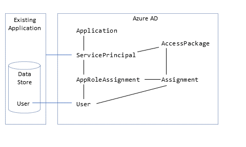

# Govern the users of an application that does not support provisioning - Microsoft PowerShell

There are three common scenarios in which it's necessary to populate Microsoft Entra ID with existing users of an application before you use the application with a Microsoft Entra ID Governance feature such as [access reviews](access-reviews-application-preparation.md).

 - Application migrated to Microsoft Entra ID after using its own identity provider
 - Application that doesn't use Microsoft Entra ID as its only identity provider
 - Application does not use Microsoft Entra ID as its identity provider nor does it support provisioning

For more information on those first two scenarios, where the application supports provisioning, or uses an LDAP directory, SQL database, has a SOAP or REST API or relies upon Microsoft Entra ID as its identity provider, see the article [govern an application's existing users](identity-governance-applications-existing-users.md). That article covers how to use identity governance features for existing users of those categories of applications.

This article covers the third scenario. For some legacy applications it might not be feasible to remove other identity providers or local credential authentication from the application, or enable support for provisioning protocols for those applications. For those applications, if you want to use Microsoft Entra ID to review who has access to that application, or remove someone's access from that application, you'll need to create assignments in Microsoft Entra ID that represent application users.  This article covers that scenario of an application that does not use Microsoft Entra ID as its identity provider and does not support provisioning.

## License requirements
[!INCLUDE [active-directory-entra-governance-license.md](../../../includes/active-directory-entra-governance-license.md)]

## Terminology

This article illustrates the process for managing application role assignments by using the [Microsoft Graph PowerShell cmdlets](https://www.powershellgallery.com/packages/Microsoft.Graph). It uses the following Microsoft Graph terminology.



In Microsoft Entra ID, a service principal (`ServicePrincipal`) represents an application in a particular organization's directory. `ServicePrincipal` has a property called `AppRoles` that lists the roles that an application supports, such as `Marketing specialist`. `AppRoleAssignment` links a user to a service principal and specifies which role that user has in that application.

You might also be using [Microsoft Entra entitlement management](entitlement-management-overview.md) access packages to give users time-limited access to the application. In entitlement management, `AccessPackage` contains one or more resource roles, potentially from multiple service principals. `AccessPackage` also has assignments (`Assignment`) for users to the access package. 

When you create an assignment for a user to an access package, Microsoft Entra entitlement management automatically creates the necessary `AppRoleAssignment` instances for the user to each application. For more information, see the [Manage access to resources in Microsoft Entra entitlement management](/powershell/microsoftgraph/tutorial-entitlement-management) tutorial on how to create access packages through PowerShell.

## Before you begin

- You must have one of the following licenses in your tenant:

  - Microsoft Entra ID P2 or Microsoft Entra ID Governance
  - Enterprise Mobility + Security E5 license

- You need to have an appropriate administrative role. If this is the first time you're performing these steps, you need the Global Administrator role to authorize the use of Microsoft Graph PowerShell in your tenant.
- Your application needs a service principal in your tenant. If a service principal does not already exist, then you can register an application to represent it in Microsoft Entra ID.

## Collect existing users from an application

The first step toward ensuring that all users are recorded in Microsoft Entra ID is to collect the list of existing users who have access to the application.  

Some applications might have a built-in command to export a list of current users from the data store. In other cases, the application might rely on an external directory or database.

In some environments, the application might be located on a network segment or system that isn't appropriate for managing access to Microsoft Entra ID. So you might need to extract the list of users from that application, directory or database, and then transfer it as a file to another system that can be used for Microsoft Entra interactions.

If your application has an LDAP directory or SQL database, then see [Collect existing users from an application](identity-governance-applications-existing-users.md#collect-existing-users-from-an-application) for recommendations on how to extract the user collection.

Otherwise, if the application does not have a directory or database, you will need to contact the owner of the application and have them supply a list of users.  This could be in a format such as a CSV file, with one line per user.  Ensure that one field of each user in the file contains a unique identifier, such as an email address, that is also present on users in Microsoft Entra ID.

If this system doesn't have the Microsoft Graph PowerShell cmdlets installed or doesn't have connectivity to Microsoft Entra ID, transfer the CSV file that contains the list of users to a system that has the [Microsoft Graph PowerShell cmdlets](https://www.powershellgallery.com/packages/Microsoft.Graph) installed.

<a name='confirm-azure-ad-has-users-that-match-users-from-the-application'></a>

## Confirm Microsoft Entra ID has users that match users from the application

Now that you have a list of all the users obtained from the application, you'll match those users from the application's data store with users in Microsoft Entra ID.  

[!INCLUDE [active-directory-identity-governance-applications-retrieve-users.md](../../../includes/active-directory-identity-governance-applications-retrieve-users.md)]

## Register the application

If the application is already registered in Microsoft Entra ID, then continue to the next step.

The account you're using must have permission to manage applications in Microsoft Entra ID. Any of the following Microsoft Entra roles include the required permissions:
  - [Application administrator](../roles/permissions-reference.md#application-administrator)
  - [Application developer](../roles/permissions-reference.md#application-developer)
  - [Cloud application administrator](../roles/permissions-reference.md#cloud-application-administrator)

1. Create the application and service principal.

   For example, if the enterprise application is named `CORPDB1`, enter the following commands:

   ```powershell
   $azuread_app_name = "CORPDB1"
   $azuread_app = New-MgApplication -DisplayName $azuread_app_name
   $azuread_sp = New-MgServicePrincipal -DisplayName $azuread_app_name -AppId $azuread_app.AppId
   ```

1. Add a role to the application, and tag the application as integrated with Microsoft Entra ID so that its assignments can be reviewed. For example, if the role name is `General`, provide that value in the following PowerShell commands:

   ```powershell
   $ar0 = New-Object Microsoft.Graph.PowerShell.Models.MicrosoftGraphAppRole
   $ar0.AllowedMemberTypes += "User"
   $ar0.Description = "General role"
   $ar0.DisplayName = "General"
   $ar0.id = New-Guid
   $ar0.IsEnabled = $true
   $ar0.Value = "General"
   $ara = @()
   $ara += $ar0

   $azuread_app_tags = @()
   $azuread_app_tags += "WindowsAzureActiveDirectoryIntegratedApp"

   $azuread_app_update = Update-MgApplication -ApplicationId $azuread_app.Id -AppRoles $ara -Tags $azuread_app_tags
   ```

## Check for users who are not already assigned to the application

The previous steps have confirmed that all the users in the application's data store exist as users in Microsoft Entra ID. However, they might not all currently be assigned to the application's roles in Microsoft Entra ID. So the next steps are to see which users don't have assignments to application roles.

1. Look up the service principal ID for the application's service principal.

   For example, if the enterprise application is named `CORPDB1`, enter the following commands:

   ```powershell
   $azuread_app_name = "CORPDB1"
   $azuread_sp_filter = "displayName eq '" + ($azuread_app_name -replace "'","''") + "'"
   $azuread_sp = Get-MgServicePrincipal -Filter $azuread_sp_filter -All
   ```

1. Retrieve the users who currently have assignments to the application in Microsoft Entra ID.

   This builds upon the `$azuread_sp` variable set in the previous command.

   ```powershell
   $azuread_existing_assignments = @(Get-MgServicePrincipalAppRoleAssignedTo -ServicePrincipalId $azuread_sp.Id -All)
   ```

1. Compare the list of user IDs from the previous section to those users currently assigned to the application:

   ```powershell
   $azuread_not_in_role_list = @()
   foreach ($id in $azuread_match_id_list) {
      $found = $false
      foreach ($existing in $azuread_existing_assignments) {
         if ($existing.principalId -eq $id) {
            $found = $true; break;
         }
      }
      if ($found -eq $false) { $azuread_not_in_role_list += $id }
   }
   $azuread_not_in_role_count = $azuread_not_in_role_list.Count
   Write-Output "$azuread_not_in_role_count users in the application's data store are not assigned to the application roles."
   ```

   If zero users are *not* assigned to application roles, indicating that all users *are* assigned to application roles, you don't need to make any further changes before performing an access review.

   However, if one or more users aren't currently assigned to the application roles, you'll need to continue the procedure and add them to one of the application's roles.

1. Select the role of the application to assign the remaining users to.

   An application might have more than one role. Use this command to list the available roles:

   ```powershell
   $azuread_sp.AppRoles | where-object {$_.AllowedMemberTypes -contains "User"} | ft DisplayName,Id
   ```

   Select the appropriate role from the list, and obtain its role ID. For example, if the role name is `General`, provide that value in the following PowerShell commands:

   ```powershell
   $azuread_app_role_name = "General"
   $azuread_app_role_id = ($azuread_sp.AppRoles | where-object {$_.AllowedMemberTypes -contains "User" -and $_.DisplayName -eq $azuread_app_role_name}).Id
   if ($null -eq $azuread_app_role_id) { write-error "role $azuread_app_role_name not located in application manifest"}
   ```

<a name='create-app-role-assignments-in-azure-ad'></a>

## Create app role assignments in Microsoft Entra ID

For Microsoft Entra ID to match the users in the application with the users in Microsoft Entra ID, you need to create application role assignments in Microsoft Entra ID.

When an application role assignment is created in Microsoft Entra ID for a user to an application, and the application does not support provisioning, then

- The user will remain in the application indefinitely unless they're updated outside Microsoft Entra ID, or until the assignment in Microsoft Entra ID is removed.
- On the next review of that application's role assignments, the user will be included in the review.
- If the user is denied in an access review, their application role assignment will be removed.

1. Create application role assignments for users who don't currently have role assignments:

   ```powershell
   foreach ($u in $azuread_not_in_role_list) {
      $res = New-MgServicePrincipalAppRoleAssignedTo -ServicePrincipalId $azuread_sp.Id -AppRoleId $azuread_app_role_id -PrincipalId $u -ResourceId $azuread_sp.Id 
   }
   ```

1. Wait one minute for changes to propagate within Microsoft Entra ID.

1. Query Microsoft Entra ID to obtain the updated list of role assignments:

   ```powershell
   $azuread_existing_assignments = @(Get-MgServicePrincipalAppRoleAssignedTo -ServicePrincipalId $azuread_sp.Id -All)
   ```

1. Compare the list of user IDs from the previous section to those users now assigned to the application:

   ```powershell
   $azuread_still_not_in_role_list = @()
   foreach ($id in $azuread_match_id_list) {
      $found = $false
      foreach ($existing in $azuread_existing_assignments) {
         if ($existing.principalId -eq $id) {
            $found = $true; break;
         }
      }
      if ($found -eq $false) { $azuread_still_not_in_role_list += $id }
   }
   $azuread_still_not_in_role_count = $azuread_still_not_in_role_list.Count
   if ($azuread_still_not_in_role_count -gt 0) {
      Write-Output "$azuread_still_not_in_role_count users in the application's data store are not assigned to the application roles."
   }
   ```

   If any users aren't assigned to application roles, check the Microsoft Entra audit log for an error from a previous step.

## Select appropriate reviewers

[!INCLUDE [active-directory-identity-governance-applications-select-reviewers.md](../../../includes/active-directory-identity-governance-applications-select-reviewers.md)]

## Create the review of the application role assignments

Once the users are in the application roles, and you have the reviewers identified, then you can configure Microsoft Entra ID to [start a review](access-reviews-application-preparation.md#create-the-reviews).

Follow the instructions in the [guide for creating an access review of groups or applications](create-access-review.md), to create the review of the application's role assignments.  Configure the review to apply results when it completes.

## Retrieve the assignments that are updated when the reviews are complete

1. When the review completes, you can retrieve the updated list of users with application role assignments.

   ```powershell
   $res = (Get-MgServicePrincipalAppRoleAssignedTo -ServicePrincipalId $azuread_sp.Id -All)
   ```

1. The columns `PrincipalDisplayName` and `PrincipalId` contain the display names and Microsoft Entra user IDs of each user who retains an application role assignment.

## Configure entitlement management integration with ServiceNow for ticketing (optional)

If you have ServiceNow then you can optionally configure automated ServiceNow ticket creation, using the [entitlement management integration](entitlement-management-ticketed-provisioning.md) via Logic Apps.  In that scenario, entitlement management can automatically create ServiceNow tickets for manual provisioning of users who have received access package assignments.

## Next steps

 - [Prepare for an access review of users' access to an application](access-reviews-application-preparation.md)
 - [Automated ServiceNow ticket creation with entitlement management integration](entitlement-management-ticketed-provisioning.md)
