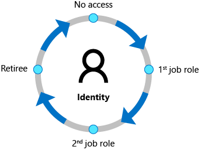
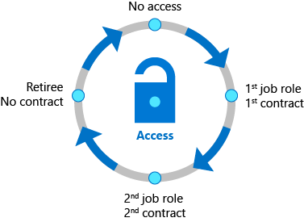
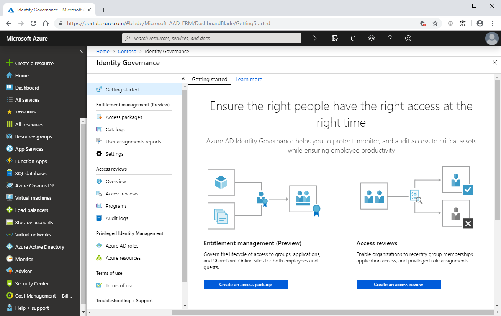

# What is Microsoft Entra ID Governance?

Microsoft Entra ID Governance allows you to balance your organization's need for security and employee productivity with the right processes and visibility. It provides you with capabilities to ensure that the right people have the right access to the right resources. These and related Azure AD and Enterprise Mobility + Security features allows you to mitigate access risk by protecting, monitoring, and auditing access to critical assets while ensuring employee and business partner productivity.  

ID Governance gives organizations the ability to do the following tasks across employees, business partners and vendors, and across services and applications both on-premises and in clouds:

- Govern the identity lifecycle
- Govern access lifecycle
- Secure privileged access for administration

Specifically, it is intended to help organizations address these four key questions:

- Which users should have access to which resources?
- What are those users doing with that access?
- Are there effective organizational controls for managing access?
- Can auditors verify that the controls are working?

## Identity lifecycle

Identity Governance helps organizations achieve a balance between *productivity* - How quickly can a person have access to the resources they need, such as when they join my organization? And *security* - How should their access change over time, such as due to changes to that person's employment status?  Identity lifecycle management is the foundation for Identity Governance, and effective governance at scale requires modernizing the identity lifecycle management infrastructure for applications.

For many organizations, identity lifecycle for employees is tied to the representation of that user in an HCM (human capital management) system.  Azure AD Premium, through inbound provisioning, automatically maintains user identities for people represented in Workday and SuccessFactors in both Active Directory and Azure Active Directory, as described in the  [cloud HR application to Azure Active Directory user provisioning planning guide](../app-provisioning/plan-cloud-hr-provision.md).  Azure AD Premium also includes [Microsoft Identity Manager](/microsoft-identity-manager/), which can import records from on-premises HCM systems such as SAP HCM, Oracle eBusiness, and Oracle PeopleSoft.

Increasingly, scenarios require collaboration with people outside your organization. [Azure AD B2B](/azure/active-directory/b2b/) collaboration enables you to securely share your organization's applications and services with guest users and external partners from any organization, while maintaining control over your own corporate data.  [Microsoft Entra entitlement management](entitlement-management-overview.md) enables you to select which organization's users are allowed to request access and be added as B2B guests to your organization's directory, and ensures that these guests are removed when they no longer need access.

Organizations are able to automate the identity lifecycle management process by using [Lifecycle Workflows](what-are-lifecycle-workflows.md). Workflows can be created to automatically run tasks for a user before they enter the organization, as they change states during their time in the organization, and as they leave the organization. For example, a workflow can be configured to send an email with a temporary password to a new user's manager, or a welcome email to the user on their first day.

## Access lifecycle

Organizations need a process to manage access beyond what was initially provisioned for a user when that user's identity was created.  Furthermore, enterprise organizations need to be able to scale efficiently to be able to develop and enforce access policy and controls on an ongoing basis.

Typically, IT delegates access approval decisions to business decision makers.  Furthermore, IT can involve the users themselves.  For example, users that access confidential customer data in a company's marketing application in Europe need to know the company's policies. Guest users may be unaware of the handling requirements for data in an organization to which they've been invited.

Organizations can automate the access lifecycle process through technologies such as [dynamic groups](../enterprise-users/groups-dynamic-membership.md), coupled with user provisioning to [SaaS apps](../saas-apps/tutorial-list.md) or [apps integrated with SCIM](../app-provisioning/use-scim-to-provision-users-and-groups.md). Microsoft Entra can also provision access to apps that use [AD groups](../enterprise-users/groups-write-back-portal.md), [other on-premises directories](../app-provisioning/on-premises-ldap-connector-configure.md) or [databases](../app-provisioning/on-premises-sql-connector-configure.md).  Organizations can also control which [guest users have access to on-premises applications](../external-identities/hybrid-cloud-to-on-premises.md).  These access rights can then be regularly reviewed using recurring [Microsoft Entra access reviews](access-reviews-overview.md).   [Microsoft Entra entitlement management](entitlement-management-overview.md) also enables you to define how users request access across packages of group and team memberships, application roles, and SharePoint Online roles.  For more information, see the [simplifying identity governance tasks with automation](#simplifying-identity-governance-tasks-with-automation) section below to select the appropriate Microsoft Entra features for your access lifecycle automation scenarios.

Lifecycle access can be automated using workflows. [Workflows can be created](create-lifecycle-workflow.md) to automatically add user to groups, where access to applications and resources are granted. Users can also be moved when their condition within the organization changes to different groups, and can even be removed entirely from all groups.

When a user attempts to access applications, Microsoft Entra enforces [Conditional Access](../conditional-access/index.yml) policies. For example, Conditional Access policies can include displaying a [terms of use](../conditional-access/terms-of-use.md) and [ensuring the user has agreed to those terms](../conditional-access/require-tou.md) prior to being able to access an application. For more information, see [govern access to applications in your environment](identity-governance-applications-prepare.md).

## Privileged access lifecycle

Historically, privileged access has been described by other vendors as a separate capability from Identity Governance. However, at Microsoft, we think governing privileged access is a key part of Identity Governance especially given the potential for misuse associated with those administrator rights can cause to an organization. The employees, vendors, and contractors that take on administrative rights need to be governed.

[Microsoft Entra Privileged Identity Management (PIM)](../privileged-identity-management/pim-configure.md) provides additional controls tailored to securing access rights for resources, across Microsoft Entra, Azure, and other Microsoft Online Services.  The just-in-time access, and role change alerting capabilities provided by Microsoft Entra PIM, in addition to multi-factor authentication and Conditional Access, provide a comprehensive set of governance controls to help secure your company's resources (directory, Microsoft 365, and Azure resource roles). As with other forms of access, organizations can use access reviews to configure recurring access re-certification for all users in administrator roles.

## Governance capabilities in other Microsoft Entra features

In addition to the features listed above, additional Microsoft Entra features frequently used to provide identity governance scenarios include:

| Capability | Scenario |Feature
| ------- | --------------------- |-----|
|Identity lifecycle (employees)|Admins can enable user account provisioning from Workday or SuccessFactors cloud HR, or on-premises HR.|[cloud HR to Azure AD user provisioning](../app-provisioning/plan-cloud-hr-provision.md)|
|Identity lifecycle (guests)|Admins can enable self-service guest user onboarding from another Azure AD tenant, direct federation, One Time Passcode (OTP) or Google accounts.  Guest users are automatically provisioned and deprovisioned subject to lifecycle policies.|[Entitlement management](entitlement-management-overview.md) using [B2B](../external-identities/what-is-b2b.md)|
|Entitlement management|Resource owners can create access packages containing apps, Teams, Azure AD and Microsoft 365 groups, and SharePoint Online sites.|[Entitlement management](entitlement-management-overview.md)|
|Lifecycle Workflows|Admins can enable the automation of the lifecycle process based user conditions.|[Lifecycle Workflows](what-are-lifecycle-workflows.md)|
|Access requests|End users can request group membership or application access. End users, including guests from other organizations, can request access to access packages.|[Entitlement management](entitlement-management-overview.md)|
|Workflow|Resource owners can define the approvers and escalation approvers for access requests and approvers for role activation requests.  |[Entitlement management](entitlement-management-overview.md) and [PIM](../privileged-identity-management/pim-configure.md)|
|Policy and role management|Admin can define Conditional Access policies for run-time access to applications.  Resource owners can define policies for user's access via access packages.|[Conditional Access](../conditional-access/overview.md) and [Entitlement management](entitlement-management-overview.md) policies|
|Access certification|Admins can enable recurring access recertification for: SaaS apps, on-premises apps, cloud group memberships, Azure AD or Azure Resource role assignments. Automatically remove resource access, block guest access and delete guest accounts.|[Access reviews](access-reviews-overview.md), also surfaced in [PIM](../privileged-identity-management/pim-create-azure-ad-roles-and-resource-roles-review.md)|
|Fulfillment and provisioning|Automatic provisioning and deprovisioning into Azure AD connected apps, including via SCIM, LDAP, SQL and into SharePoint Online sites. |[user provisioning](../app-provisioning/user-provisioning.md)|
|Reporting and analytics|Admins can retrieve audit logs of recent user provisioning and sign on activity. Integration with Azure Monitor and 'who has access' via access packages.|[Azure AD reports](../reports-monitoring/overview-reports.md) and [monitoring](../reports-monitoring/overview-monitoring.md)|
|Privileged access|Just-in-time and scheduled access, alerting, approval workflows for Azure AD roles (including custom roles) and Azure Resource roles.|[Azure AD PIM](../privileged-identity-management/pim-configure.md)|
|Auditing|Admins can be alerted of creation of admin accounts.|[Microsoft Entra PIM alerts](../privileged-identity-management/pim-how-to-configure-security-alerts.md)|

## License requirements
[!INCLUDE [active-directory-entra-governance-license.md](../../../includes/active-directory-entra-governance-license.md)]

## Getting started

Check out the [Getting started tab](https://portal.azure.com/#view/Microsoft_AAD_ERM/DashboardBlade/~/GettingStarted) of **Identity Governance** in the Azure portal to start using entitlement management, access reviews, Privileged Identity Management, and Terms of use, and see some common use cases.

There are also tutorials for [managing access to resources in entitlement management](entitlement-management-access-package-first.md), [onboarding external users to Azure AD through an approval process](entitlement-management-onboard-external-user.md), [governing access to your applications](identity-governance-applications-prepare.md) and the [application's existing users](identity-governance-applications-existing-users.md).

If you have any feedback about Identity Governance features, click **Got feedback?** in the Azure portal to submit your feedback. The team regularly reviews your feedback.

While there's no perfect solution or recommendation for every customer, the following configuration guides also provide the baseline policies Microsoft recommends you follow to ensure a more secure and productive workforce.

- [Prerequisites for configuring Azure AD for identity governance](identity-governance-applications-prepare.md)
- [Plan an access reviews deployment to manage resource access lifecycle](deploy-access-reviews.md)
- [Identity and device access configurations](/microsoft-365/enterprise/microsoft-365-policies-configurations)
- [Securing privileged access](../roles/security-planning.md)

You may also wish to engage with one of Microsoft's [services and integration partners](services-and-integration-partners.md) to plan your deployment or integrate with the applications and other systems in your environment.

## Simplifying identity governance tasks with automation

Once you've started using these identity governance features, you can easily automate common identity governance scenarios. The following table shows how to get started for each scenario:

| Scenario to automate | Automation guide |
| ------- | --------------------- |
| Creating, updating and deleting AD and Azure AD user accounts automatically for employees |[Plan cloud HR to Azure AD user provisioning](../app-provisioning/plan-cloud-hr-provision.md)|
| Updating the membership of a group, based on changes to the member user's attributes | [Create a dynamic group](../enterprise-users/groups-create-rule.md)|
| Assigning licenses | [group-based licensing](../enterprise-users/licensing-groups-assign.md) |
| Adding and removing a user's group memberships, application roles, and SharePoint site roles, based on changes to the user's attributes | [Configure an automatic assignment policy for an access package in entitlement management](entitlement-management-access-package-auto-assignment-policy.md) (preview)|
| Adding and removing a user's group memberships, application roles, and SharePoint site roles, on a specific date | [Configure lifecycle settings for an access package in entitlement management](entitlement-management-access-package-lifecycle-policy.md)|
| Running custom workflows when a user requests or receives access, or access is removed | [Trigger Logic Apps in entitlement management](entitlement-management-logic-apps-integration.md) (preview) |
| Regularly having memberships of guests in Microsoft groups and Teams reviewed, and removing guest memberships that are denied |[Create an access review](create-access-review.md) |
| Removing guest accounts that were denied by a reviewer |[Review and remove external users who no longer have resource access](access-reviews-external-users.md) |
| Removing guest accounts that have no access package assignments |[Manage the lifecycle of external users](entitlement-management-external-users.md#manage-the-lifecycle-of-external-users) |
| Provisioning users into on-premises and cloud applications that have their own directories or databases | [Configure automatic user provisioning](../app-provisioning/user-provisioning.md) with user assignments or [scoping filters](../app-provisioning/define-conditional-rules-for-provisioning-user-accounts.md) |
| Other scheduled tasks | [Automate identity governance tasks with Azure Automation](identity-governance-automation.md) and Microsoft Graph via the [Microsoft.Graph.Identity.Governance](https://www.powershellgallery.com/packages/Microsoft.Graph.Identity.Governance/) PowerShell module|

## Appendix - least privileged roles for managing in Identity Governance features

It's a best practice to use the least privileged role to perform administrative tasks in Identity Governance. We recommend that you use Microsoft Entra PIM to activate a role as needed to perform these tasks. The following are the least privileged [directory roles](../roles/permissions-reference.md) to configure Identity Governance features:

| Feature | Least privileged role |
| ------- | --------------------- |
| Entitlement management | Identity Governance Administrator |
| Access reviews | User Administrator (with the exception of access reviews of Azure or Azure AD roles, which require Privileged Role Administrator) |
| Privileged Identity Management | Privileged Role Administrator |
| Terms of use | Security Administrator or Conditional Access Administrator |

>[!NOTE]
>The least privileged role for Entitlement management has changed from the User Administrator role to the Identity Governance Administrator role.

## Next steps

- [What is Microsoft Entra entitlement management?](entitlement-management-overview.md)
- [What are Microsoft Entra access reviews?](access-reviews-overview.md)
- [What is Microsoft Entra Privileged Identity Management?](../privileged-identity-management/pim-configure.md)
- [What can I do with Terms of use?](../conditional-access/terms-of-use.md)
