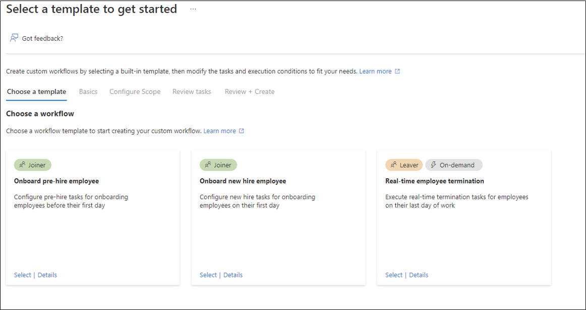

# Understanding lifecycle workflows 
The following reference doc provides an overview of a lifecycle workflow.

  [](media/lifecycle-workflows-concept-parts/workflow-2.png#lightbox)

## Parts of a workflow 
A workflow can be broken down in to the following three main parts.

|Workflow part|Description|
|-----|-----|
|General information|This portion of a workflow covers basic information such as display name and a description of what the workflow does.|
|Tasks|Tasks are the actions that will be taken when a workflow is executed.|
|Execution conditions| The execution condition section of a workflow sets up</br>- who(scope) the workflow runs against</br>- when(trigger) the workflow runs|

## Templates
Creating a workflow via the portal requires the use of a template.  A LCW template is a framework that is used for pre-defined tasks and helps automate the creation of a workflow.  

  [](media/lifecycle-workflows-concept-parts/workflow-3.png#lightbox)

The template will define the task that is to be used and then guide you through the creation of the workflow.   The template provides input for description information and execution condition information.  

>[!NOTE]
>Depending on the template you select, the options that will be available may vary.  This document uses the **Onboardiing pre-hire employee** template to illustrate the parts of a workflow.

For more information, see [Lifecycle workflow templates.](lifecycle-workflow-templates.md)

## The Basics

After selecting a template, on the basics screen:
 - provide the information that will be used in the description portion of the workflow
 - the trigger, defines the when portion of the execution condition.

 [](media/lifecycle-workflows-concept-parts/workflow-4.png#lightbox)

### Workflow details
Under the workflow details section you can provide the following information.

 |Name|Description|
 |-----|-----|
 |Name|The name of the workflow.|
 |Description|A brief description that describes the workflow.|

### Trigger details
Under the trigger details section you can provide the following information.

 |Name|Description|
 |-----|-----|
 |Days for event|The number of days before or after the date specified in the **Event user attribute**.|

This section defines **when** the workflow will run.  Currently, there are two supported types of triggers:
  
- Trigger and scope based - runs the task on all users in scope once the workflow is triggered.
- On-demand - can be run immediately.  Typically used for real-time employee terminations.

## Configure scope
After defining the basics tab, on the configure scope screen:
 - provide the information, that will be used in the execution condition, to determine who the workflow will run against.  
 - add additional expressions to create more complexed filtering

This section determines **who** the workflow will run against.

 [](media/lifecycle-workflows-concept-parts/workflow-5.png#lightbox)

You can add additional expressions using **And/Or** to create complexed conditionals and apply the workflow more granularly across your organization.

 [](media/lifecycle-workflows-concept-parts/workflow-8.png#lightbox)

For more information see [Create a lifecycle workflow.](create-lifecycle-workflow.md)


## Review tasks
After defining the scope, on the review tasks screen:
 - verify that the correct template was selected and the task associated with the workflow are correct.  
 - add additional tasks other than the ones in the template

[](media/lifecycle-workflows-concept-parts/workflow-6.png#lightbox)

You can use the **Add task** button to add additional tasks for the workflow.  Simply select the additional tasks from the list provided.

 [](media/lifecycle-workflows-concept-parts/workflow-6.png#lightbox)

For additional information see [Lifecycle workflow tasks](lifecycle-workflow-tasks.md)

## Review and create
After reviewing the tasks, on the review and create screen:
 - verify all of the information is correct and create the workflow.

 Based on what was defined in the previous sections our workflow will now do the following:
   -  it is named **on-board pre-hire employee**
   -  based on the date in the **EmployeeHireDate** attribute, it will trigger **seven** (7) days prior to the date
  - it will run against users who have **marketing** for the **department** attriute value
 - it will generate a **TAP (temporary access password)** and send an email to the user in the **manager** attribute of the pre-hire employee 

 [](media/lifecycle-workflows-concept-parts/workflow-7.png#lightbox)

## Scheduling
A workflow is not scheduled to run by default. To enable the workflow it needs to be scheduled.

To verify whether the workflow is scheduled, you can view the **Scheduled** column.  

To enable the workflow, simply click the **Enable schedule** option for the workflow.

Once scheduled the workflow will be evaluated every 3 hours to determine whether or not it should run based on the execution conditions.

 [](media/lifecycle-workflows-concept-parts/workflow-10.png#lightbox)


### On-demand scheduling
A workflow can be run on-demand for testing or in situations where it is required.

Simply use the **Run on demand** feature to execute the workflow immediately.  The workflow must be enabled before you can run it on demand.

[!NOTE]
> A workflow that is run on demand for any user does not take into account whether or not a user meets the workflow's execution.  It will apply the task regardless of whether the exectuion conditions are met or not.

For more information, see [Run a workflow on-demand](on-demand-workflow.md)
## Managing the workflow
By clicking on a workflow you created, you can manage the workflow.

You can select which portion of the workflow you wish to update or change using the left nav bar.  Simply select the section you wish to update.

[](media/lifecycle-workflows-concept-parts/workflow-11.png#lightbox)

For additional information see [Manage lifecycle workflow properties](manage-workflow-properties.md)

## Versioning
Workflow versions are separate workflows built using the same information of an original workflow, but with updated parameters so that they're reported differently within logs. Workflow versions can change the actions or even scope of an existing workflow.

You can view versioning information by selecting **Versions** under **Manage** from the left.

[](media/lifecycle-workflows-concept-parts/workflow-12.png#lightbox)

For additional information see [Lifecycle Workflow versioning](lifecycle-workflow-versioning.md)

## Developer information
This document covers the parts of a lifecycle workflow 

For additional information see the [Workflow API Reference](lifecycle-workflows-dev-reference.md)

## Next steps
- [Create a custom workflow using the Azure Portal](tutorial-create-custom-workflow-portal.md)
- [Create a Lifecycle workflow](create-lifecycle-workflow.md)
```