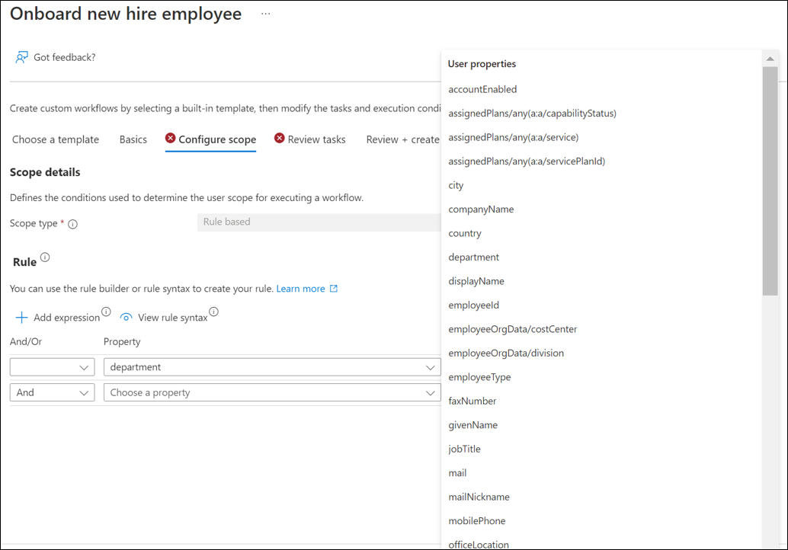
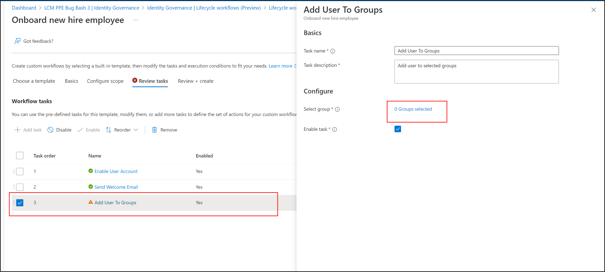
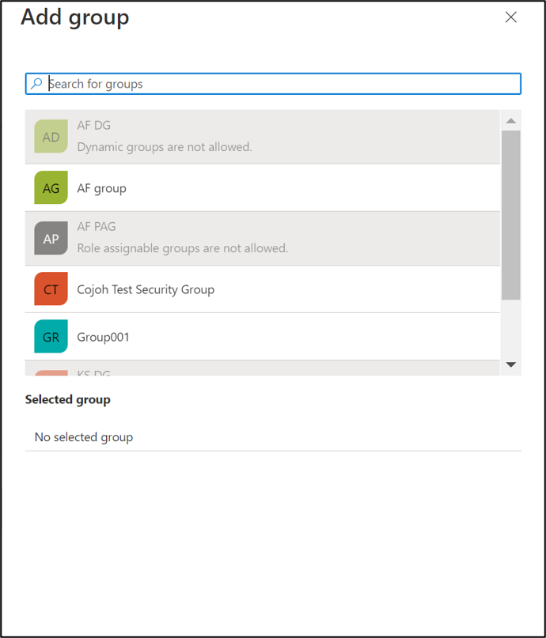

# Plan a Lifecycle Workflow deployment

[Lifecycle Workflows](what-are-lifecycle-workflows.md) help your organization to manage Microsoft Entra users by increasing automation. With Lifecycle Workflows, you can:

-  **Extend** your HR-driven provisioning process with other workflows that simplify and automate tasks.  
- **Centralize** your workflow process so you can easily create and manage workflows all in one location.
- **Troubleshoot** workflow scenarios with the Workflow history and Audit logs with minimal effort.
- **Manage** user lifecycle at scale.  As your organization grows, the need for other resources to manage user lifecycles is lowered.
- **Reduce** or remove manual tasks that were done in the past with automated Lifecycle Workflows
- **Apply** logic apps to extend workflows for more complex scenarios using your existing Logic apps

Lifecycle Workflows are an [Microsoft Entra ID Governance](identity-governance-overview.md) capability. The other capabilities are [entitlement management](entitlement-management-overview.md), [access reviews](access-reviews-overview.md),[Privileged Identity Management (PIM)](../privileged-identity-management/pim-configure.md), and [terms of use](../conditional-access/terms-of-use.md). Together, they help you address these questions:

 - Which users should have access to which resources?
 - What are those users doing with that access?
 - Is there effective organizational control for managing access?
 - Can auditors verify that the controls are working?
 - Are users ready to go on day one or do they have access removed in a timely manner? 
 
Planning your Lifecycle Workflow deployment is essential to make sure you achieve your desired governance strategy for users in your organization.

For more information on deployment plans, see [Microsoft Entra deployment plans](../architecture/deployment-plans.md)

## License requirements

[!INCLUDE [Microsoft Entra ID Governance license](../../../includes/active-directory-entra-governance-license.md)]

>[!Note]
>Be aware that if your license expires, any workflows that you have created will stop working.
>
>Workflows that are in progress when a license expires will continue to execute, but no new ones will be processed.

### Plan the Lifecycle Workflow deployment project

Consider your organizational needs to determine the strategy for deploying Lifecycle Workflows in your environment.

### Engage the right stakeholders

When technology projects fail, they typically do so because of mismatched expectations on impact, outcomes, and responsibilities. To avoid these pitfalls, [ensure that you're engaging the right stakeholders](../architecture/deployment-plans.md) and that project roles are clear.

For Lifecycle Workflows, you'll likely include representatives from the following teams within your organization:

- **IT administration** manages your IT infrastructure and administers your cloud investments and software as a service (SaaS) apps. This team:

   * Reviews Lifecycle Workflows to infrastructure and apps, including Microsoft 365 and Microsoft Entra ID.
   * Schedules and runs Lifecycle Workflows on users.
   * Ensures that programmatic Lifecycle Workflows, via GRAPH or extensibility, are governed and reviewed.

- **Security Owner**	ensures that the plan meets the security requirements of your organization.  This team:
    - Ensure Lifecycle Workflows meet organizational security policies

 - **Compliance manager** ensures that the organization follows internal policy and complies with regulations. This team:

   * Requests or schedules new Lifecycle Workflow reviews.
   * Assesses processes and procedures for reviewing Lifecycle Workflows, which include documentation and record keeping for compliance.
   * Reviews results of past reviews for most critical resources.
- **HR Representative** - Assists with attribute mapping and population in HR provisioning scenarios.  This team:
    * Helps determine attributes that are used to populate employeeHireDate and employeeLeaveDateTime.
    * Ensures source attributes are populated and have values
    * Identifies and suggests alternate attributes that could be mapped to employeeHireDate and employeeLeaveDateTime 

- **Development teams** build and maintain applications for your organization. This team:
   * Develops custom workflows using GRAPH
   * Integrates Lifecycle Workflows with Logic Apps via extensibility.

### Plan communications

Communication is critical to the success of any new business process. Proactively communicate to users how and when their experience will change. Tell them how to gain support if they experience issues.

### Communicate changes in accountability

Lifecycle Workflows support shifting responsibility of manual processes to business owners. Establish clear process and understanding of each team’s responsibilities. Decoupling these processes from the IT department drives more accuracy and automation. This shift is a cultural change in the resource owner's accountability and responsibility. Proactively communicate this change and ensure resource owners are trained and able to use the insights to make good decisions.

## Introduction to Lifecycle Workflows

This section introduces Lifecycle Workflow concepts you should know before you plan your deployment.

## Prerequisites to deploying Lifecycle Workflows

The following information is important information about your organization and the technologies that need to be in place prior to deploying Lifecycle Workflows.  Ensure that you can answer yes to each of the items before attempting to deploy Lifecycle Workflows.

|Item|Description|Documentation|
|-----|-----|-----|
|Inbound Provisioning|You have a process to create user accounts for employees in Microsoft Entra such as HR inbound, SuccessFactors, or MIM.   Alternatively you have a process to create user accounts in Active Directory and those accounts are provisioned to Microsoft Entra ID.|[Workday to Active Directory](../saas-apps/workday-inbound-tutorial.md)  [Workday to Microsoft Entra ID](../saas-apps/workday-inbound-tutorial.md)  [SuccessFactors to Active Directory](../saas-apps/sap-successfactors-inbound-provisioning-tutorial.md)  [SuccessFactors to Microsoft Entra ID](../saas-apps/sap-successfactors-inbound-provisioning-cloud-only-tutorial.md)  [Microsoft Entra Connect](../hybrid/connect/whatis-azure-ad-connect-v2.md)  [Microsoft Entra Connect cloud sync](../hybrid/cloud-sync/what-is-cloud-sync.md)|[API-driven inbound provisioning (Public preview)](inbound-provisioning-api-configure-app.md)|
|Attribute synchronization|The accounts in Microsoft Entra ID have the employeeHireDate and employeeLeaveDateTime attributes populated.  The values may be populated when the accounts are created from an HR system or synchronized from AD using Microsoft Entra Connect or cloud sync. You have extra attributes that are used to determine the scope such as department, populated or the ability to populate, with data.|[How to synchronize attributes for Lifecycle Workflows](how-to-lifecycle-workflow-sync-attributes.md)

## Understanding parts of a workflow

Before you begin planning a Lifecycle Workflow deployment, you should become familiar with the parts of workflow and the terminology around Lifecycle Workflows.

The [Understanding Lifecycle Workflows](understanding-lifecycle-workflows.md) document, uses the portal to explain the parts of a workflow. The [Developer API reference Lifecycle Workflows](lifecycle-workflows-developer-reference.md) document, uses a GRAPH example to explain the parts of a workflow. 

You can use this document to become familiar with the parts of workflow prior to deploying them.

## Limitations and constraints

The following table provides information that you need to be aware of as you create and deploy Lifecycle workflows.

|Item|Description|
|-----|-----|
|Workflows|50 workflow limit per tenant|
|Number of custom tasks|limit of 25 per workflow|
|Value range for offsetInDays|Between -180 and 180 days|
|Workflow execution schedule|Default every 3 hours - can be set to run anywhere from 1 to 24 hours|
|Custom task extensions|Limit of 100|
|On-demand user limit|You can run an on-demand workflow against a maximum of 10 users|
|Extensibility callback timeout limit|Min 3 minutes - Maximum 5 hours|

The following is additional information you should be aware of.

 -    You can't enable the schedule for the Real-Time **Leaver** and **Mover** scenario.  This is by design.

## Lifecycle workflow creation checklist
The following table provides a quick checklist of steps you can use when designing and planning your workflows.

|Step|Description|
|-----|-----|
|[Determine your scenario](#determine-your-scenario)|Determine what scenario you're addressing with a workflow|
|[Determine the execution conditions](#determine-the-execution-conditions)|Determine who and when the workflow runs|
|[Review the tasks](#review-the-tasks)|Review and add additional tasks to the workflow|
|[Create your workflow](#create-your-workflow)|Create your workflow after planning and design.|
|[Plan a pilot](#plan-a-pilot)|Plan to pilot, run, and test your workflow.|

## Determine your scenario
Before building a Lifecycle Workflow in the portal, you should determine which scenario or scenarios you wish to deploy.  You can use the following table to see a current list of the available scenarios.  These are based on the templates that are available in the portal and list the task associated with each one.

|Scenario|Predefined Tasks|
|-----|-----|
|Onboard prehire employee| Generate TAP and Send Email|	
|Onboard new hire employee|Enable User Account Send Welcome Email Add User To Groups|
|Real-time employee termination|Remove user from all groups Remove user from all Teams Delete User Account|
|Pre-Offboarding of an employee|Remove user from selected groups Remove user from selected Teams|
|Offboard an employee|Disable User Account Remove user from all groups Remove user from all Teams|
|Post-Offboarding of an employee|Remove all licenses for user Remove user from all Teams Delete User Account|
|Real-time employee change|Run a Custom Task Extension|
|Real-time employee termination|Remove users from all Groups and Teams and delete the user account|

For more information on the built-in templates, see [Lifecycle Workflow templates.](lifecycle-workflow-templates.md)

## Determine the execution conditions
Now that you've determined your scenarios, you need to look at what users in your organization the scenarios apply to.

An Execution condition is the part of a workflow that defines the scope of **who** and the trigger of **when** a workflow will be performed.

The [scope](understanding-lifecycle-workflows.md#configure-scope) determines who the workflow runs against.  This is defined by a rule that will filter users based on a condition.  For example, the rule, `"rule": "(department eq 'sales')"` runs the task only on users who are members of the sales department.

The [trigger](understanding-lifecycle-workflows.md#trigger-details) determines when the workflow runs.  This can either be, on-demand, which is immediate, or time based.  Most of the predefined templates in the portal are time based.  

### Attribute information
The scope of a workflow uses attributes under the rule section.  You can add the following extra conditionals to further refine **who** the tasks are applied to.
  - And
  - And not
  - Or
  - Or not
  
You can also choose from the numerous user attributes as well.

However before selecting an attribute to use in your execution condition, you need to ensure that the attribute is either populated with data or that you can begin populating it with the required data.

Not all of these attributes are populated by default so you should verify with your HR administrator or IT administrators when using HR inbound cloud only provisioning, Microsoft Entra Connect, or cloud sync.

### Time information 
The following is some important information regarding time zones that you should be aware of when designing workflows.
- Workday and SAP SF will always send the time in Coordinated Universal Time or UTC.
-  if you're in a single time zone it's recommended that you hardcode the time portion to something that works for you.  An example would be 5am for new hire scenarios and 10pm for last day of work scenarios.
- It's recommended, that if you're using temporary access pass (TAP), that you set the maximum lifetime to 24 hours.  Doing this will help ensure that the TAP hasn't expired after being sent to an employee who may be in a different timezone.  For more information, see [Configure Temporary Access Pass in Microsoft Entra ID to register Passwordless authentication methods.](../authentication/howto-authentication-temporary-access-pass.md#enable-the-temporary-access-pass-policy)

For more information, see [How to synchronize attributes for Lifecycle Workflows](../governance/how-to-lifecycle-workflow-sync-attributes.md)

## Review the tasks
Now that we've determined the scenario and the who and when, you should consider whether the predefined tasks are sufficient or are you going to need extra tasks.  The following table has a list of the predefined tasks that are currently in the portal.  Use this table to determine if you want to add more tasks.

|Task|Description|Relevant Scenarios|
|-----|-----|-----|
|Add user to groups|Add user to selected groups| Joiner - Leaver - Mover|
|Add user to selected teams| Add user to Teams| Joiner - Leaver - Mover|
|Delete User Account| Delete user account in Microsoft Entra ID| Leaver|
|Disable User Account| Disable user account in the directory| Joiner - Leaver|
|Enable User Account| Enable user account in the directory| Joiner - Leaver|
|Generate TAP and Send Email| Generate Temporary Access Pass and send via email to user's manager| Joiner|
|Remove all licenses of user| Remove all licenses assigned to the user| Leaver|
|Remove user from all groups| Remove user from all Microsoft Entra group memberships| Leaver|
|Remove user from all Teams| Remove user from all Teams memberships| Leaver|
|Remove user from selected groups| Remove user from membership of selected Microsoft Entra groups| Joiner - Leaver - Mover|
|Remove user from selected Teams| Remove user from membership of selected Teams| Joiner - Leaver - Mover|
|Run a Custom Task Extension| Run a Custom Task Extension to callout to an external system| Joiner - Leaver - Mover|
|Send email after user's last day| Send offboarding email to user's manager after the last day of work| Leaver|
|Send email before user's last day| Send offboarding email to user's manager before the last day of work| Leaver|
|Send email on user's last day| Send offboarding email to user's manager on the last day of work| Leaver|
|Send Welcome Email| Send welcome email to new hire| Joiner|
|Send onboarding reminder email|Send onboarding reminder email to user’s manager| Joiner|
|Request user access package assignment|Request user assignement to selected access packages|Joiner-Mover|
|Remove access package assignement for user|Remove user assignment from selected access packages| Leaver=Mover|
|Remove all access package assignments for user|Remove all access packages assigned to the user|Leaver|
|Cancel all pending access package assignement requests for users|Cancel all pending access package assignement requests for users|Leaver|

For more information on tasks, see [Lifecycle Workflow tasks](lifecycle-workflow-tasks.md).

### Group and team tasks
If you're using a group or team task, the workflow needs you to specify the group or groups.  In the following screenshot, you see the yellow triangle on the task indicating that it's missing information.  

 

By clicking on the task, you are presented with a navigation bar to add or remove groups.  Select the "x groups selected" link to add groups.

 

### Custom task extensions
Lifecycle Workflows allow you to create workflows that can be triggered based on joiner, mover, or leaver scenarios. While Lifecycle Workflows provide several built-in tasks to automate common scenarios throughout the lifecycle of users, eventually you may reach the limits of these built-in tasks. With the extensibility feature, you are able to utilize the concept of custom task extensions to call-out to external systems as part of a Lifecycle Workflow. 

When creating custom task extensions, the scenarios for how it interacts with Lifecycle Workflows can be one of three ways:

- **Fire-and-forget scenario**- The Logic App is started, and the sequential task execution immediately continues with no response expected from the Logic App. 
- **Sequential task execution waiting for response from the Logic App** - The Logic app is started, and the sequential task execution waits on the response from the Logic App.
- **Sequential task execution waiting for the response of a 3rd party system**- The Logic app is started, and the sequential task execution waits on the response from a 3rd party system that triggers the Logic App to tell the Custom Task extension whether or not it ran successfully. 
- For more information on custom extensions, see [Lifecycle Workflow extensibility](lifecycle-workflow-extensibility.md)

## Create your workflow
Now that you have design and planned your workflow, you can create it in the portal.  For detailed information on creating a workflow, see [Create a Lifecycle workflow.](create-lifecycle-workflow.md)

## Plan a pilot

We encourage customers to initially pilot Lifecycle Workflows with a small group of users or a single test user. Piloting can help you adjust processes and communications as needed. It can help you increase users' and reviewers' ability to meet security and compliance requirements.

In your pilot, we recommend that you:

* Start with Lifecycle Workflows where the results are applied to a small subset of users.
* Monitor audit logs to ensure all events are properly audited.

For more information, see [Best practices for a pilot.](../architecture/deployment-plans.md).

#### Test and run the workflow
Once you've created a workflow, you should test it by running the workflow [on-demand](on-demand-workflow.md)

Using the on-demand feature allows you to test and evaluate whether the Lifecycle Workflow is working as intended.

Once you have completed testing, you can either rework the Lifecycle Workflow or get ready for a broader distribution.

### Audit logs
You can also get more information from the audit logs.  These logs can be accessed in the portal under Microsoft Entra ID/monitoring.  For more information, see [Audit logs in Microsoft Entra ID](../reports-monitoring/concept-audit-logs.md) and [Lifecycle workflow history.](lifecycle-workflow-history.md)

#### Example Lifecycle Workflow plan

|Stage|Description|
| - | - |
|Determine the scenario| A prehire workflow that sends email to new manager. |
|Determine the execution conditions|The workflow runs on new employees in the sales department, two (2) days before the employeeHireDate.|
|Review the tasks.|We use the predefined tasks in the workflow.  No extra tasks are added.|
|Create the workflow in the portal|Use the predefined template for new hire in the portal.|
|Enable and test the workflow| Use the on-demand feature to test the workflow on one user.|
|Review the test results|Review the test results and ensure the Lifecycle Workflow is working as intended.|
|Roll out the workflow to a broader audience|Communicate with stakeholders, letting them know that is going live and that HR will no longer need to send an email to the hiring manager.

## Next steps

Learn about the following related technologies:

* [How to synchronize attributes for Lifecycle Workflows](how-to-lifecycle-workflow-sync-attributes.md)
* [Understanding Lifecycle Workflows](understanding-lifecycle-workflows.md)
* [Lifecycle Workflow templates.](lifecycle-workflow-templates.md)
