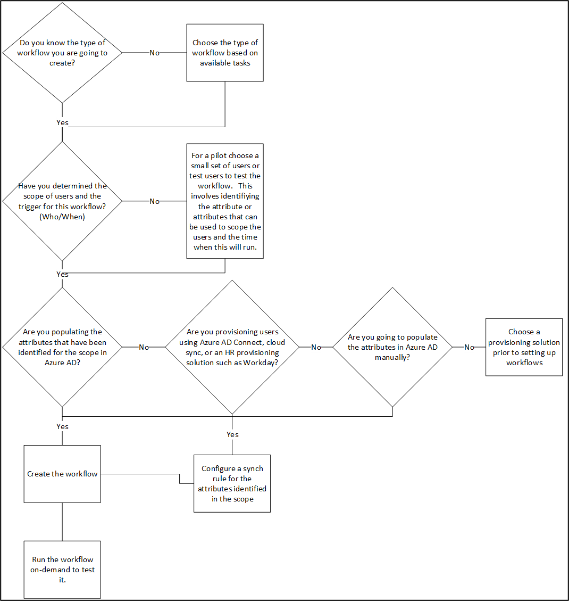

# Plan an Azure Active Directory Lifecycle workflow deployment

[Lifecycle Workflows](what-are-lifecycle-workflows.md) help your organization to manage Azure AD users by increasing automation. With lifecycle workflows, you can:

-  **Extend** your HR-driven provisioning process with other workflows that simplify and automate tasks.  
- **Centralize** your workflow process so you can easily create and manage workflows all in one location.
- **Troubleshoot** workflow scenarios with the Workflow history and Audit logs with minimal effort.
- **Manage** user lifecycle at scale.  As your organization grows, the need for other resources to manage user lifecycles is minimalized.
- integrate
- **Reduce** or remove manual tasks that were done in the past with automated lifecycle workflows
- **Apply** logic apps to extend workflows for more complex scenarios using your existing Logic apps

Lifecycle workflows are an [Azure AD Identity Governance](identity-governance-overview.md) capability. The other capabilities are [entitlement management](entitlement-management-overview.md), [access reviews](access-reviews-overview.md),[Privileged Identity Management (PIM)](../privileged-identity-management/pim-configure.md), and [terms of use](../conditional-access/terms-of-use.md). Together, they help you address these questions:

 - Which users should have access to which resources?
 - What are those users doing with that access?
 - Is there effective organizational control for managing access?
 - Can auditors verify that the controls are working?
 - Are users ready to go on day one or do they have access removed in a timely manner? 
 
Planning your lifecycle workflow deployment is essential to make sure you achieve your desired governance strategy for users in your organization.

### Licenses

You need a valid Azure AD Premium (P2) license for each person, other than Global administrators or User administrators, who will create lifecycle workflows. 

[!INCLUDE [Azure AD Premium P2 license](../../../includes/active-directory-p2-license.md)]

You might also need other Identity Governance features, such as [entitlement management](entitlement-management-overview.md), [access reviews](access-reviews-overview.md) or PIM. In that case, you might also need related licenses. For more information, see [Azure Active Directory pricing](https://www.microsoft.com/security/business/identity-access-management/azure-ad-pricing).

## Prerequisites

[!INCLUDE [Azure AD Premium P2 license](../../../includes/active-directory-p2-license.md)]

The following **Delegated permissions** and **Application permissions** are required for access to Lifecycle Workflows:

> [!IMPORTANT]
> The Microsoft Graph API permissions shown below are currently hidden from user interfaces such as Graph Explorer and Azure AD’s API permissions UI for app registrations. In such cases you can fall back to Entitlement Managements permissions which also work for Lifecycle Workflows (“EntitlementManagement.Read.All” and “EntitlementManagement.ReadWrite.All”). The Entitlement Management permissions will stop working with Lifecycle Workflows in future versions of the preview.

|Column1  |Display String  |Description  |Admin Consent Required  |
|---------|---------|---------|---------|
|LifecycleWorkflows.Read.All     | Read all Lifecycle workflows, tasks, user states| Allows the app to list and read all workflows, tasks, user states related to lifecycle workflows on behalf of the signed-in user.| Yes
|LifecycleWorkflows.ReadWrite.All     | Read and write all lifecycle workflows, tasks, user states.| Allows the app to create, update, list, read and delete all workflows, tasks, user states related to lifecycle workflows on behalf of the signed-in user.| Yes

## Plan the lifecycle workflow deployment project

Consider your organizational needs to determine the strategy for deploying lifecycle workflows in your environment.

### Engage the right stakeholders

When technology projects fail, they typically do so because of mismatched expectations on impact, outcomes, and responsibilities. To avoid these pitfalls, [ensure that you're engaging the right stakeholders](../fundamentals/active-directory-deployment-plans.md) and that project roles are clear.

For lifecycle workflows, you'll likely include representatives from the following teams within your organization:

* **IT administration** manages your IT infrastructure and administers your cloud investments and software as a service (SaaS) apps. This team:

   * Reviews lifecycle workflows to infrastructure and apps, including Microsoft 365 and Azure AD.
   * Schedules and runs lifecycle workflows on users.
   * Ensures that programmatic lifecycle workflows, via GRAPH or extensibility, are governed and reviewed.

* **Development teams** build and maintain applications for your organization. This team:

   * Develops custom workflows using GRAPH
   * Integrates lifecycle workflows with Logic Apps via extensibility.

* **Business units** manage projects and own applications. This team:

   * Reviews and approves or denies lifecycle workflows for users before implementation.
   * Schedules and does reviews of existing lifecycle workflows to assertain their continued viability.

* **Corporate governance** ensures that the organization follows internal policy and complies with regulations. This team:

   * Requests or schedules new lifecycle workflow reviews.
   * Assesses processes and procedures for reviewing lifecycel workflows, which includes documentation and record keeping for compliance.
   * Reviews results of past reviews for most critical resources.

### Plan communications

Communication is critical to the success of any new business process. Proactively communicate to users how and when their experience will change. Tell them how to gain support if they experience issues.

#### Communicate changes in accountability

Lifecycle workflows support shifting responsibility of manual processes to to business owners. Decoupling these processes from the IT department drives more accuracy and automation.  This shift is a cultural change in the resource owner's accountability and responsibility. Proactively communicate this change and ensure resource owners are trained and able to use the insights to make good decisions.

## Introduction to lifecycle workflows

This section introduces lifecycle workflow concepts you should know before you plan your deployment.

## Understanding parts of a workflow.
Before you begin planning a lifecycle workflow deployment, you should familarize yourself with the parts of workflow and the terminology around lifecycle workflows.

The [Parts of lifecycle workflows](lifecycle-workflows-concept-parts.md) document, uses a GRAPH example to explain the parts of a workflow.  However the information is relevant for people who create lifecycle workflows within the portal because it breaksdown and explains the various pieces.

You can use this document to familiarize yourself with the parts of workflow prior to deploying them.

## Plan a pilot

We encourage customers to initially pilot lifecycle workflows with a small group of users or a single test user. Piloting can help you adjust processes and communications as needed. It can help you increase users' and reviewers' ability to meet security and compliance requirements.

In your pilot, we recommend that you:

* Start with lifecycle workflows where the results are applied to a small subset of users.
* Monitor audit logs to ensure all events are properly audited.

For more information, see [Best practices for a pilot](../fundamentals/active-directory-deployment-plans.md).

### Pilot decision tree
Use the following diagram to help you in developing your pilot. 

#### What type of lifecycle workflows can I create?
One of the first things you need to determine is the type of workflow you are going to create.  

Typical lifecycle workflows scenarios include:

- Joiner - when an individual comes into scope of needing access.  An example is a new employee joining a company or organization.
- Mover - when an individual moves between boundaries within an organization. This movement may require more access or authorization.  An example would be a user who was in marketing is now a member of the sales organization.
- Leaver - when an individual leaves the scope of needing access, access may need to be removed. Examples would be an employee who is retiring or an employee who has been terminated.

Lifecycle Workflows come with many pre-configured tasks that are designed to automate common lifecycle management scenarios. 
You can review the list of available tasks in the [Lifecycle workflows tasks](lifecycle-workflow-tasks.md) document.  Use these to determine the type of lifecycle you wish to create.

#### Define the scope and triggers
The tasks above define the type of workflow that you want to create.  For example, I want a workflow that sends a new hire employee' manager an email when they start.

The tasks are specific actions that run automatically when a workflow is triggered. An Execution condition is the part of a workflows that defines the scope of **who** and the trigger of **when** a workflow will be performed.

The [scope](lifecycle-workflows-concept-parts.md#scope) determines who the workflow runs against.  This is defined by a rule that will filter users based on a condition.  For example, the rule, `"rule": "(department eq 'sales')"` will run the task only on users who are members of the sales department.

#### Populating the correct attributes
Workflows, contain specific processes, which run automatically against users, as they move through their life cycle, within the organization.

These workflows are triggered based on user attributes in Azure AD.  For instance, the classic [on-boarding pre-hire scenario](lifecycle-workflow-templates.md#onboard-pre-hire-employee) uses the EmployeeHireDate attribute.

This attribute, however, is not automatically populated using such synchronization methods as Azure AD Connect or Azure AD Connect cloud sync.

So, you must plan on how to populate these attributes. 

#### Test and run the workflow
Once you have created a workflow, you should test it by running the workflow [on-demand](on-demand-workflow.md)

Using the on-demand feature will allow you to test and evaluate whether the lifecycle workflow is working as intended.

Once you have completed testing, you can either re-work the lifecycle workflow or get ready for a broader distribution.

#### Example lifecycle workflow plan

|Stage|Description|
| - | - |
|Plan the type of lifecycle workflow| A pre-hire workflow that sends email to new manager. |
|Scope and trigger|The workflow will run on new employees, 2 days before the employeeHireDate.|
|Populate the employeeHireDate attribute in Azure AD|Currently this is not set up and we will need to populate this attribute using Azure AD Connect cloud sync.|
|Create the workflow in the portal|Use the pre-defined template for new hire in the portal.|
|Enable and test the workflow| Use the on-demand feature to test the workflow on one user.|
|Review the test results|Review the test results and ensure the lifecycle workflow is working as intended.|
|Roll out the workflow to a broader audience|Communicate with stakeholders, letting them know that is going live and that HR will no longer need to send an email to the hiring manager.

### Plan for Extensibility
Lifecycle Workflows allow you to create workflows that can be triggered based on joiner, mover, or leaver scenarios. While Lifecycle Workflows provide several built-in tasks to automate common scenarios throughout the lifecycle of users, eventually you may reach the limits of these built-in tasks. With the extensibility feature, you'll be able to utilize the concept of custom task extensions to call-out to external systems as part of a Lifecycle workflow. 

When creating custom task extensions, the scenarios for how it will interact with Lifecycle Workflows can be one of three ways:

- **Fire-and-forget scenario**- The Logic App is started, and the sequential task execution immediately continues with no response expected from the Logic App. 
- **Sequential task execution waiting for response from the Logic App** - The Logic app is started, and the sequential task execution waits on the response from the Logic App.
- **Sequential task execution waiting for the response of a 3rd party system**- The Logic app is started, and the sequential task execution waits on the response from a 3rd party system that triggers the Logic App to tell the Custom Task extension whether or not it ran successfully. 

For more information on custom extensions, see [Lifecycle workflow extensibility (Preview)](lifecycle-workflow-extensibility.md)

### Who will create and manage lifecycle workflows?

The administrative role required to create, manage, or read a lifecycle workflow is global administrator. 

For more information, see [Administrator role permissions in Azure AD](../roles/permissions-reference.md).

## Next steps

Learn about the following related technologies:

* [What is Azure AD entitlement management?](entitlement-management-overview.md)
* [What is Azure AD Privileged Identity Management?](../privileged-identity-management/pim-configure.md)
