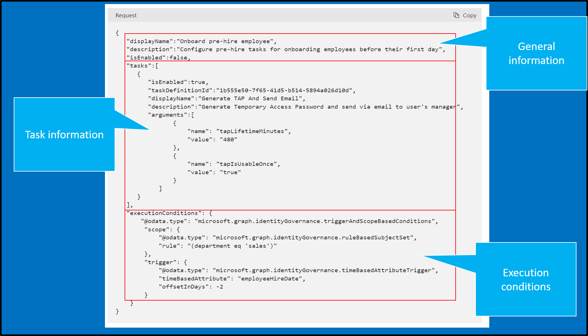

# Developer API reference lifecycle workflows 
The following reference doc provides an overview of how a lifecycle workflow is constructed.  The examples here are using workflows that are created using GRAPH and not in the portal.  The concepts are however the same.  For information using the portal, see [Understanding lifecycle workflows](understanding-lifecycle-workflows.md)

## Parts of a workflow 
Lifecycle Workflows enables you to use workflows for managing the lifecycle of your Azure AD users. In order to create a workflow, you must either specify pre-defined or custom information. Pre-defined workflows can be selected in the Azure AD portal.  

A workflow can be broken down in to three main parts.
   - General information
   - task information
   - execution conditions

  [](media/understanding-lifecycle-workflows/workflow-1.png#lightbox)

### General information
This portion of a workflow covers basic information such as display name and a description of what the workflow does. 

This portion of the workflow supports the following information.

| Parameters | Description |
|:--- |:---:|
|displayName|The name of the workflow|
|description|A description of the workflow|
|isEnabled|Boolean that determines whether the workflow or a task with in a workflow is enabled|

### Task information
The task section describes the actions that will be taken when a workflow is executed.  The actual task is defined by the taskDefinitionID.  

Lets examine the tasks section of a sample workflow.

```Request body
   "tasks":[ 
      {
         "isEnabled":true, 
         "taskDefinitionId":"1b555e50-7f65-41d5-b514-5894a026d10d", 
         "displayName":"Generate TAP And Send Email", 
         "description":"Generate Temporary Access Password and send via email to user's manager", 
         "arguments":[ 
                { 
                    "name": "tapLifetimeMinutes", 
                    "value": "480" 
                }, 
                { 
                    "name": "tapIsUsableOnce", 
                    "value": "true" 
                } 
            ]  
      }
   ], 
```


This task uses 1b555e50-7f65-41d5-b514-5894a026d10d, which is the taskDefinitionID for [Generate Temporary Access Pass and send via email to user's manager](lifecycle-workflow-tasks.md#generate-temporary-access-pass-and-send-via-email-to-users-manager).  This is a pre-defined task created by Microsoft and will send a user's manager an email that contains a temporary access pass.  This task requires the following more arguments.

|Parameter |Definition  |
|---------|---------|
|tapLifetimeMinutes     | The lifetime of the temporaryAccessPass in minutes starting at startDateTime. Minimum 10, Maximum 43200 (equivalent to 30 days).   |
|tapIsUsableOnce     |  Determines whether the pass is limited to a one time use. If true, the pass can be used once; if false, the pass can be used multiple times within the temporaryAccessPass lifetime.   |

This portion of the workflow supports the following parameters.  The arguments section will be based on the actual task defined by the taskDefinitionID.

| Parameters | Description |
|:--- |:---:|
|isEnabled|Boolean that determines whether the workflow or a task with in a workflow is enabled|
|tasks|The actions that the workflow will take when it's executed by the extensible lifecycle manager|
|taskDefinitionID|The unique ID corresponding to a supported task|
|arguments|Used to specify the activation duration of the TAP and toggle between one-time use or multiple uses|


For additional information on pre-defined tasks, see [Lifecycle Workflow tasks and definitions](lifecycle-workflow-tasks.md)


### Execution conditions

The execution condition section of a workflow sets up 
  - Who(scope) the workflow runs against
  - When(trigger) the workflow runs

Lets examine the execution conditions of a sample workflow.

```Request body
{
    "executionConditions": {
       "@odata.type": "microsoft.graph.identityGovernance.triggerAndScopeBasedConditions",
        "scope": {
            "@odata.type": "microsoft.graph.identityGovernance.ruleBasedSubjectSet",
            "rule": "(department eq 'sales')"
        },
        "trigger": {
            "@odata.type": "microsoft.graph.identityGovernance.timeBasedAttributeTrigger",
            "timeBasedAttribute": "employeeHireDate",
            "offsetInDays": -2
        }
    } 
} 
```

The first portion `microsoft.graph.identityGovernance.triggerAndScopeBasedConditions` tells the workflow execution that there are two settings that comprise the execution condition:
   - Scope, which determines the subject set for a workflow execution.
   - Trigger, which determines when a workflow will be executed

The `triggerAndScopeBasedConditions` method is an extension of `microsoft.graph.identityGovernance.workflowExecutionConditions` which is the base type for execution settings for a workflow.

#### Scope

Now, lets look at the first property, `scope`.  The scope uses `microsoft.graph.identityGovernance.ruleBasedSubjectSet`.

The `ruleBasedSubjectSet` is a scope based on a filter rule for identifying in-scope subjects. This determines who the workflow runs against.

The `ruleBasedSubjectSet` method is an extension of `microsoft.graph.subjectSet`.

The `ruleBasedSubjectSet` has the following properties:

| Property | Description |
|:--- |:---:|
|rule|Filter rule for the scope where the syntax is based on the filter query.|

So in our example above, we see  the property of our scope is `"rule": "(department eq 'sales')"`.

This means that `ruleBasedSubjectSet` will filter based on the rule property we set, which is that the department attribute of a user equals sales.


 #### Trigger

Now, lets look at the second property, `trigger`.  The trigger uses `microsoft.graph.identityGovernance.timeBasedAttributeTrigger`.

The `timeBasedAttributeTrigger` is a trigger based on a time-based attribute for initiating workflow execution. The combination of scope and trigger conditions determine when a workflow is executed and on which identities.

The `timeBasedAttributeTrigger` method is an extension of `microsoft.graph.identityGovernance.workflowExecutionTrigger` which is the base type for execution settings for a workflow.

The `timeBasedAttributeTrigger` has the following properties:

| Property | Description |
|:--- |:---:|
|timeBasedAttribute|Determines which time-based identity property to reference.|
|offsetInDays|How many days before or after the time-based attribute specified. For example, if the attribute is employeeHireDate and offsetInDays is -1, then the workflow should trigger 1 day before employee hire date.|

So in our example above, we see  the properties of our trigger are `timeBasedAttribute": "employeeHireDate` and `offsetInDays": -2`.

This means that our workflow will trigger two days before the value specified in the employeeHireDate attribute.

#### Summary
So now, when we put both the scope and trigger together, we get an execution condition that will:
 - Carry out the tasks defined in the workflow, two days before the users employeeHireDate and only for the users in the sales department.

### Workflow parameter reference
The following table is a summary of the parameters of a workflow.  You can use this a reference for general workflow information or when creating and customizing workflows. 

| Parameters | Description |
|:--- |:---:|
|displayName|The name of the workflow|
|description|A description of the workflow|
|isEnabled|Boolean that determines whether the workflow or a task with in a workflow is enabled|
|tasks|The actions that the workflow will take when it's executed by the extensible lifecycle manager|
|taskDefinitionID|The unique ID corresponding to a supported task|
|arguments|Used to specify the activation duration of the TAP and toggle between one-time use or multiple uses|
|executionConditions|Defines for who (scope) and when (trigger) the workflow runs.|
|scope|Defines who the workflow should run against|
|trigger|Defines when the workflow should run|


### Workflow example

The following is a full example of a workflow.  It is in the form of a POST API call that will create a pre-hire workflow, which will generate a TAP and send it via email to the user's manager.

 ```http
 POST https://graph.microsoft.com/beta/identityGovernance/lifecycleManagement/workflows
 ```

```Request body
{
   "displayName":"Onboard pre-hire employee", 
   "description":"Configure pre-hire tasks for onboarding employees before their first day", 
   "isEnabled":false, 
   "tasks":[ 
      {
         "isEnabled":true, 
         "taskDefinitionId":"1b555e50-7f65-41d5-b514-5894a026d10d", 
         "displayName":"Generate TAP And Send Email", 
         "description":"Generate Temporary Access Password and send via email to user's manager", 
         "arguments":[ 
                { 
                    "name": "tapLifetimeMinutes", 
                    "value": "480" 
                }, 
                { 
                    "name": "tapIsUsableOnce", 
                    "value": "true" 
                } 
            ]  
      }
   ], 
   "executionConditions": {
       "@odata.type": "microsoft.graph.identityGovernance.triggerAndScopeBasedConditions",
        "scope": {
            "@odata.type": "microsoft.graph.identityGovernance.ruleBasedSubjectSet",
            "rule": "(department eq 'sales')"
        },
        "trigger": {
            "@odata.type": "microsoft.graph.identityGovernance.timeBasedAttributeTrigger",
            "timeBasedAttribute": "employeeHireDate",
            "offsetInDays": -2
        }
    } 
} 
```
## Next steps
- [Create a custom workflow using the Azure portal](tutorial-onboard-custom-workflow-portal.md)
- [Create a Lifecycle workflow](create-lifecycle-workflow.md)
