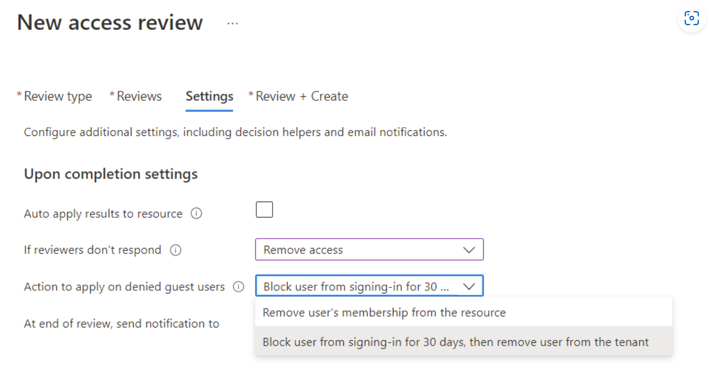

# Manage guest access with access reviews

With access reviews, you can easily enable collaboration across organizational boundaries by using the [Microsoft Entra B2B feature](../external-identities/what-is-b2b.md). Guest users from other tenants can be [invited by administrators](../external-identities/add-users-administrator.md) or by [other users](../external-identities/what-is-b2b.md). This capability also applies to social identities such as Microsoft accounts.

You also can easily ensure that guest users have appropriate access. You can ask the guests themselves or a decision maker to participate in an access review and re-certify (or attest) to the guests' access. The reviewers can give their input on each user's need for continued access, based on suggestions from Microsoft Entra ID. When an access review is finished, you can then make changes and remove access for guests who no longer need it.

> [!NOTE]
> This document focuses on reviewing guest users' access. If you want to review all users' access, not just guests, see [Manage user access with access reviews](manage-user-access-with-access-reviews.md). If you want to review users' membership in administrative roles, such as global administrator, see [Start an access review in Microsoft Entra Privileged Identity Management](../privileged-identity-management/pim-create-roles-and-resource-roles-review.md).

## Prerequisites

- Microsoft Entra ID P2 or Microsoft Entra ID Governance

For more information, [License requirements](access-reviews-overview.md#license-requirements).

## Create and perform an access review for guests

First, you must be assigned one of the following roles:
- global administrator
- User administrator
- (Preview) Microsoft 365 or Microsoft Entra Security Group owner of the group to be reviewed

Then, go to the [Identity Governance page](https://portal.azure.com/#blade/Microsoft_AAD_ERM/DashboardBlade/) to ensure that access reviews is ready for your organization.

Microsoft Entra ID enables several scenarios for reviewing guest users.

You can review either:

 - A group in Microsoft Entra ID that has one or more guests as members.
 - An application connected to Microsoft Entra ID that has one or more guest users assigned to it. 

When reviewing guest user access to Microsoft 365 groups, you can either create a review for each group individually, or turn on automatic, recurring access reviews of guest users across all Microsoft 365 groups. The following video provides more information on recurring access reviews of guest users: 

> [!VIDEO https://www.youtube.com/embed/3D2_YW2DwQ8]

You can then decide whether to ask each guest to review their own access or to ask one or more users to review every guest's access.

 These scenarios are covered in the following sections.

### Ask guests to review their own membership in a group

You can use access reviews to ensure that users who were invited and added to a group continue to need access. You can easily ask guests to review their own membership in that group.

1. To create an access review for the group, select the review to include guest user members only and that members review themselves. For more information, see [Create an access review of groups or applications](create-access-review.md).

2. Ask each guest to review their own membership. By default, each guest who accepted an invitation receives an email from Microsoft Entra ID with a link to the access review. Microsoft Entra ID has instructions for guests on how to [review access to groups or applications](perform-access-review.md).

3. After the reviewers give input, stop the access review and apply the changes. For more information, see [Complete an access review of groups or applications](complete-access-review.md).

4. In addition to those users who denied their own need for continued access, you can also remove users who didn't respond. Non-responding users potentially no longer receive email.

5. If the group isn't used for access management, you also can remove users who weren't selected to participate in the review because they didn't accept their invitation. Not accepting might indicate that the invited user's email address had a typo. If a group is used as a distribution list, perhaps some guest users weren't selected to participate because they're contact objects.

### Ask an authorized user to review a guest's membership in a group

You can ask an authorized user, such as the owner of a group, to review a guest's need for continued membership in a group.

1. To create an access review for the group, select the review to include guest user members only. Then specify one or more reviewers. For more information, see [Create an access review of groups or applications](create-access-review.md).

2. Ask the reviewers to give input. By default, they each receive an email from Microsoft Entra ID with a link to the access panel, where they [review access to groups or applications](perform-access-review.md).

3. After the reviewers give input, stop the access review and apply the changes. For more information, see [Complete an access review of groups or applications](complete-access-review.md).

### Ask guests to review their own access to an application

You can use access reviews to ensure that users who were invited for a particular application continue to need access. You can easily ask the guests themselves to review their own need for access.

1. To create an access review for the application, select the review to include guests only and that users review their own access. For more information, see
 [Create an access review of groups or applications](create-access-review.md).

2. Ask each guest to review their own access to the application. By default, each guest who accepted an invitation receives an email from Microsoft Entra ID. That email has a link to the access review in your organization's access panel. Microsoft Entra ID has instructions for guests on how to [review access to groups or applications](perform-access-review.md).

3. After the reviewers give input, stop the access review and apply the changes. For more information, see [Complete an access review of groups or applications](complete-access-review.md).

4. In addition to users who denied their own need for continued access, you also can remove guest users who didn't respond. Non-responding users potentially no longer receive email. You also can remove guest users who weren't selected to participate, especially if they weren't recently invited. Those users didn't accept their invitation and so didn't have access to the application. 

### Ask an authorized user to review a guest's access to an application

You can ask an authorized user, such as the owner of an application, to review guest's need for continued access to the application.

1. To create an access review for the application, select the review to include guests only. Then specify one or more users as reviewers. For more information, see [Create an access review of groups or applications](create-access-review.md).

2. Ask the reviewers to give input. By default, they each receive an email from Microsoft Entra ID with a link to the access panel, where they [review access to groups or applications](perform-access-review.md).

3. After the reviewers give input, stop the access review and apply the changes. For more information, see [Complete an access review of groups or applications](complete-access-review.md).

### Ask guests to review their need for access, in general

In some organizations, guests might not be aware of their group memberships.

> [!NOTE]
> Earlier versions of the portal didn't permit administrative access by users with the UserType of Guest. In some cases, an administrator in your directory might have changed a guest's UserType value to Member by using PowerShell. If this change previously occurred in your directory, the previous query might not include all guest users who historically had administrative access rights. In this case, you need to either change the guest's UserType or manually include the guest in the group membership.

1. Create a security group in Microsoft Entra ID with the guests as members, if a suitable group doesn't already exist. For example, you can create a group with a manually maintained membership of guests. Or, you can create a dynamic group with a name such as "Guests of Contoso" for users in the Contoso tenant who have the UserType attribute value of Guest.  For efficiency, ensure the group is predominately guests - don't select a group that has member users, as member users don't need to be reviewed.  Also, keep in mind that a guest user who is a member of the group can see the other members of the group.

2. To create an access review for that group, select the reviewers to be the members themselves. For more information, see [Create an access review of groups or applications](create-access-review.md).

3. Ask each guest to review their own membership. By default, each guest who accepted an invitation receives an email from Microsoft Entra ID with a link to the access review in your organization's access panel. Microsoft Entra ID has instructions for guests on how to [review access to groups or applications](perform-access-review.md).  Those guests who didn't accept their invite appears in the review results as "Not Notified".

4. After the reviewers give input, stop the access review. For more information, see [Complete an access review of groups or applications](complete-access-review.md).

5. You can automatically delete the guest users Microsoft Entra B2B accounts as part of an access review when you're configuring an Access review for **Select Team + Groups**. This option isn't available for **All Microsoft 365 groups with guest users**.

To do so, select **Auto apply results to resource** as this will automatically remove the user from the resource. **If reviewer don't respond** should be set to **Remove access** and **Action to apply on denied guest users** should also be set to **Block from signing in for 30 days then remove user from the tenant**.

This will immediately block sign in to the guest user account and then automatically delete their Microsoft Entra B2B account after 30 days.

## Next steps

- [Create an access review of groups or applications](create-access-review.md)
