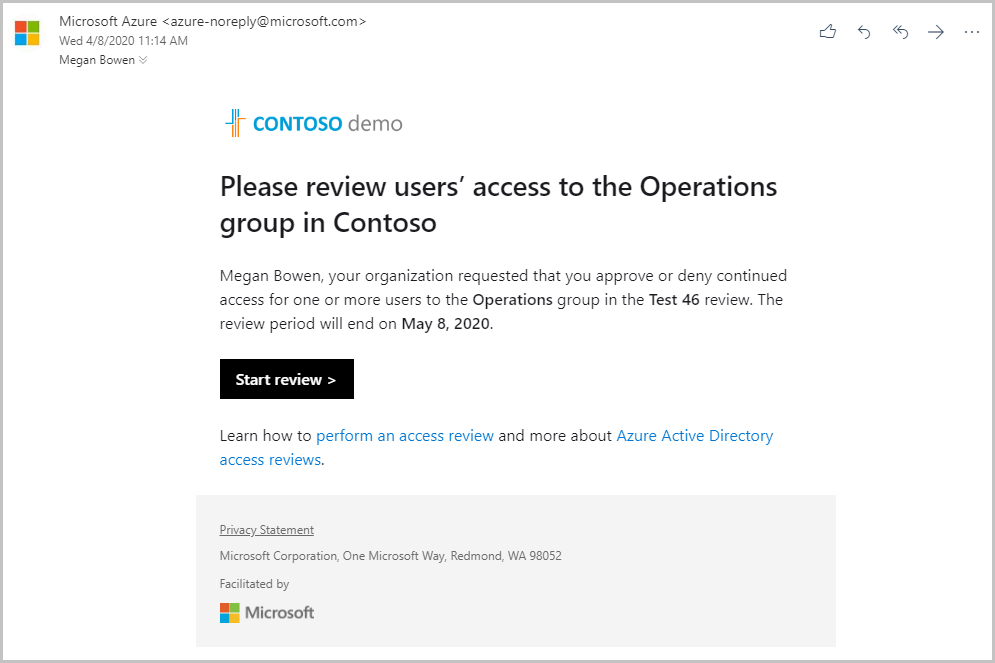
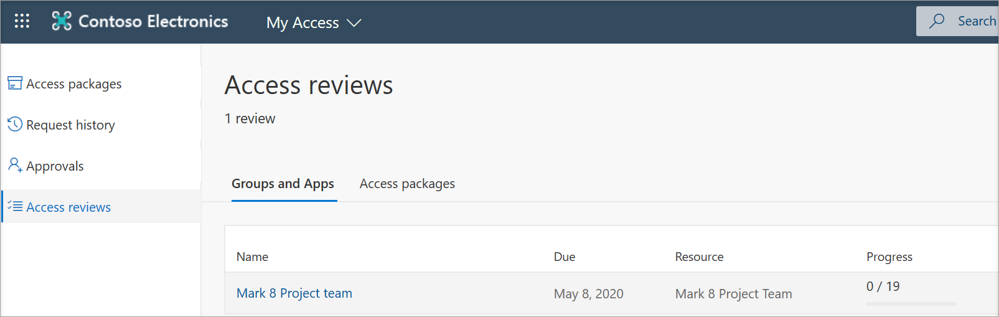
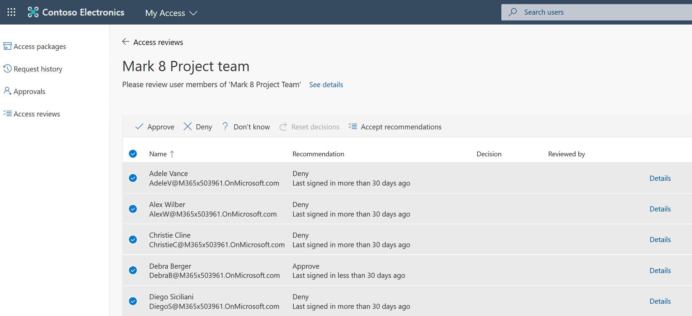
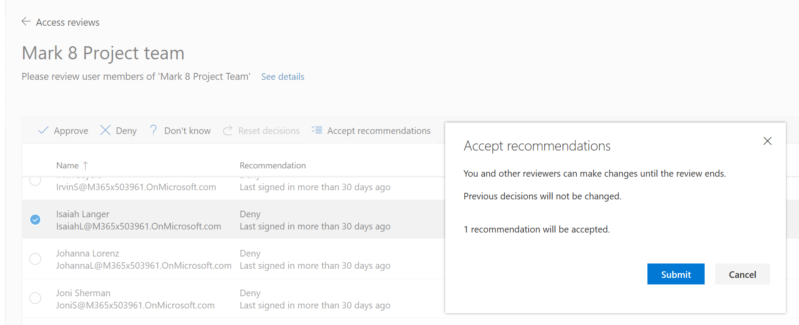
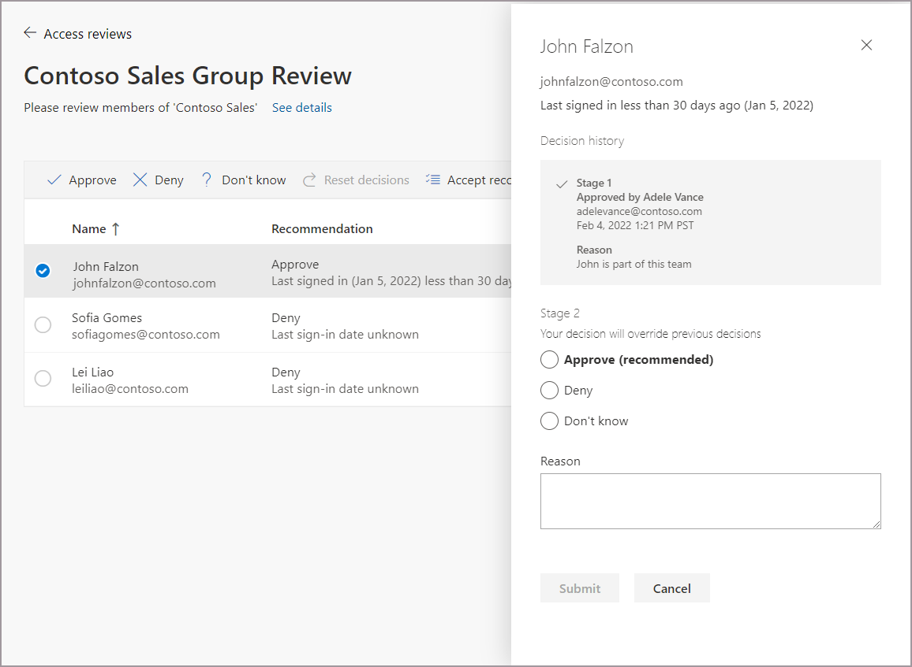

# Review access to groups and applications in access reviews

Microsoft Entra ID simplifies how enterprises manage access to groups and applications in Microsoft Entra ID and other Microsoft web services with a feature called access reviews. This article covers how a designated reviewer performs an access review for members of a group or users with access to an application. If you want to review access to an access package, read [Review access of an access package in entitlement management](entitlement-management-access-reviews-review-access.md).

## Perform access review by using My Access
You can review access to groups and applications via My Access. My Access is a user-friendly portal for granting, approving, and reviewing access needs.

### Use email to go to My Access

>[!IMPORTANT]
> There could be delays in receiving email. In some cases, it could take up to 24 hours. Add azure-noreply@microsoft.com to your safe recipients list to make sure that you're receiving all emails.

1. Look for an email from Microsoft asking you to review access. Here's an example email message:

   

1. Select the **Start review** link to open the access review.

### Go directly to My Access

You can also view your pending access reviews by using your browser to open My Access.

1. Sign in to My Access at https://myaccess.microsoft.com/.

2. Select **Access reviews** from the left menu to see a list of pending access reviews assigned to you.

## Review access for one or more users

After you open My Access under **Groups and Apps**, you can see:

- **Name**: The name of the access review.
- **Due**: The due date for the review. After this date, denied users could be removed from the group or app being reviewed.
- **Resource**: The name of the resource under review.
- **Progress**: The number of users reviewed over the total number of users part of this access review.

Select the name of an access review to get started.

After it opens, you'll see the list of users in scope for the access review.

> [!NOTE]
> If the request is to review your own access, the page will look different. For more information, see [Review access for yourself to groups or applications](review-your-access.md).

There are two ways that you can approve or deny access:

- You can manually approve or deny access for one or more users.
- You can accept the system recommendations.

### Manually review access for one or more users

1. Review the list of users and decide whether to approve or deny their continued access.

1. Select one or more users by selecting the circle next to their names.

1. Select **Approve** or **Deny** on the bar.

   If you're unsure if a user should continue to have access, you can select **Don't know**. The user gets to keep their access, and your choice is recorded in the audit logs. Keep in mind that any information you provide is available to other reviewers. They can read your comments and take them into account when they review the request.

    

1. The administrator of the access review might require you to supply a reason for your decision in the **Reason** box, even when a reason isn't required. You can still provide a reason for your decision. The information that you include is available to other approvers for review.

1. Select **Submit**.

   You can change your response at any time until the access review has ended. If you want to change your response, select the row and update the response. For example, you can approve a previously denied user or deny a previously approved user.

 > [!IMPORTANT]
 > - If a user is denied access, they aren't removed immediately. The user is removed when the review period has ended or when an administrator stops the review.
 > - If there are multiple reviewers, the last submitted response is recorded. Consider an example where an administrator designates two reviewers: Alice and Bob. Alice opens the access review first and approves a user's access request. Before the review period ends, Bob opens the access review and denies access on the same request previously approved by Alice. The last decision denying the access is the response that gets recorded.

### Review access based on recommendations

To make access reviews easier and faster for you, we also provide recommendations that you can accept with a single selection. There are two ways that the system generates recommendations for the reviewer. One method is by the user's sign-in activity. If a user has been inactive for 30 days or more, the system recommends that the reviewer deny access. 

The other method is based on the access that the user's peers have. If the user doesn't have the same access as their peers, the system recommends that the reviewer deny that user access.

If you have **No sign-in within 30 days** or **Peer outlier** enabled, follow these steps to accept recommendations:

1. Select one or more users, and then select **Accept recommendations**.

    

   Or to accept recommendations for all unreviewed users, make sure that no users are selected and then select the **Accept recommendations** button on the top bar.

1. Select **Submit** to accept the recommendations.

> [!NOTE]
> When you accept recommendations, previous decisions won't be changed.

### Review access for one or more users in a multi-stage access review (preview)

If the administrator has enabled multi-stage access reviews, there will be two or three total stages of review. Each stage of review has a specified reviewer.

You'll either review access manually or accept the recommendations based on sign-in activity for the stage you're assigned as the reviewer.

If you're the second-stage or third-stage reviewer, you'll also see the decisions made by the reviewers in the prior stages, if the administrator enabled this setting when creating the access review. The decision made by a second-stage or third-stage reviewer will overwrite the previous stage. So, the decision that the second-stage reviewer makes will overwrite the first stage. And the third-stage reviewer's decision will overwrite the second stage.

 

Approve or deny access as outlined in [Review access for one or more users](#review-access-for-one-or-more-users).

> [!NOTE]
> The next stage of the review won't become active until the duration specified during the access review setup has passed. If the administrator believes a stage is done but the review duration for this stage has not expired yet, they can use the **Stop current stage** button in the overview of the access review in the Microsoft Entra admin center. This action will close the active stage and start the next stage.

### Review access for B2B direct connect users in Teams shared channels and Microsoft 365 groups (preview)

To review access of B2B direct connect users, use the following instructions:

1. As the reviewer, you should receive an email that requests you to review access for the team or group. Select the link in the email, or go directly to https://myaccess.microsoft.com/.

1. Follow the instructions in [Review access for one or more users](#review-access-for-one-or-more-users) to make decisions to approve or deny the users access to the teams.

> [!NOTE]
> Unlike internal users and B2B collaboration users, B2B direct connect users and teams _don't_ have recommendations based on last sign-in activity to make decisions when you perform the review.

If a team you review has shared channels, all B2B direct connect users and teams that access those shared channels are part of the review. This includes B2B collaboration users and internal users. When a B2B direct connect user or team is denied access in an access review, the user loses access to every shared channel in the team. To learn more about B2B direct connect users, read [B2B direct connect](../external-identities/b2b-direct-connect-overview.md).

## Set up what will happen if no action is taken on access review
When the access review is set up, the administrator has the option to use advanced settings to determine what will happen if a reviewer doesn't respond to an access review request.

The administrator can set up the review so that if reviewers don't respond at the end of the review period, all unreviewed users can have an automatic decision made on their access. This includes the loss of access to the group or application under review.

## Next steps

- [Complete an access review of groups or applications](complete-access-review.md)
