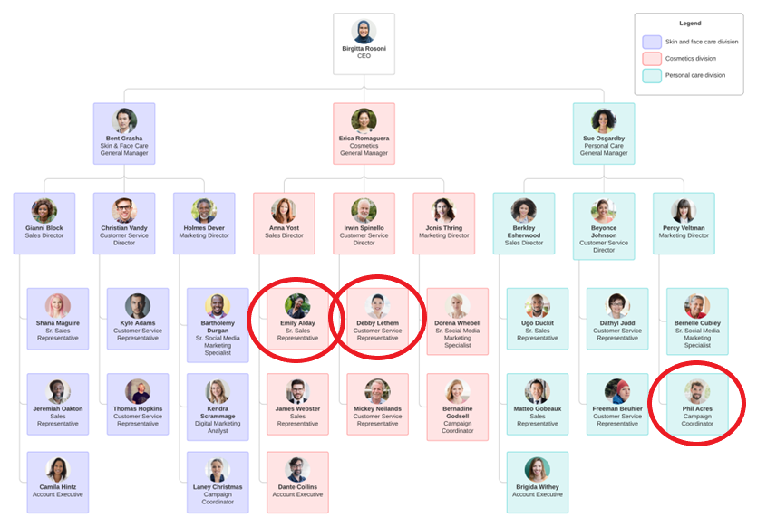

# Review recommendations for Access reviews 

Decision makers who review users' access and perform access reviews can use system based recommendations to help them decide whether to continue their access or deny their access to resources. For more information about how to use review recommendations, see [Enable decision helpers](create-access-review.md#next-settings).

## Prerequisites
 
- Azure AD Premium P2
 
For more information, see [License requirements](access-reviews-overview.md#license-requirements).

## Inactive user recommendations
A user is considered 'inactive' if they have not signed into the tenant within the last 30 days. This behavior is adjusted for reviews of application assignments, which checks each user's last activity in the app as opposed to the entire tenant. When inactive user recommendations are enabled for an access review, the last sign-in date for each user will be evaluated once the review starts, and any user that has not signed-in within 30 days will be given a recommended action of Deny. Additionally, when these decision helpers are enabled, reviewers will be able to see the last sign-in date for all users being reviewed. This sign-in date (as well as the resulting recommendation) is determined when the review begins and will not get updated while the review is in-progress.

## User-to-Group Affiliation (preview)
Making the review experience easier and more accurate empowers IT admins and reviewers to make more informed decisions. This Machine Learning based recommendation opens the journey to automate access reviews, thereby enabling intelligent automation and reducing access rights attestation fatigue.

User-to-Group Affiliation in an organization’s chart is defined as two or more users who share similar characteristics in an organization's reporting structure.

This recommendation detects user affiliation with other users within the group, based on organization's reporting-structure similarity. The recommendation relies on a scoring mechanism which is calculated by computing the user’s average distance with the remaining users in the group. Users who are very distant from all the other group members based on their organization's chart, are considered to have "low affiliation" within the group.

If this decision helper is enabled by the creator of the access review, reviewers can receive User-to-Group Affiliation recommendations for group access reviews.

> [!NOTE]
> This feature is only available for users in your directory. A user should have a manager attribute and should be a part of an organizational hierarchy for the User-to-group Affiliation to work.

The following image has an example of an organization's reporting structure in a cosmetics company: 

Based on the reporting structure in the example image, users who are statistically significant amount of distance away from other users within the group, would get a "Deny" recommendation by the system if  the User-to-Group Affiliation recommendation was selected by the reviewer for group access reviews. 

For example, Phil who works within the Personal care division is in a group with Debby, Irwin, and Emily who all work within the Cosmetics division. The group is called *Fresh Skin*. If an Access Review for the group Fresh Skin is performed, based on the reporting structure and distance away from the other group members, Phil would be considered to have low affiliation. The system will create a **Deny** recommendation in the group access review.

## Next Steps
- [Create an access review](create-access-review.md)
- [Review access to groups or applications](perform-access-review.md)