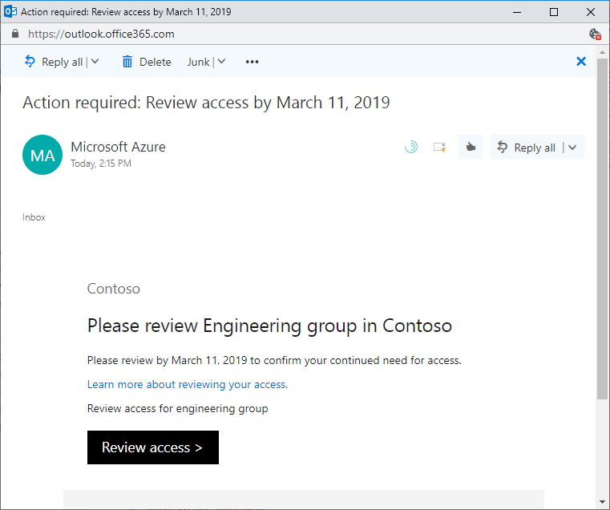
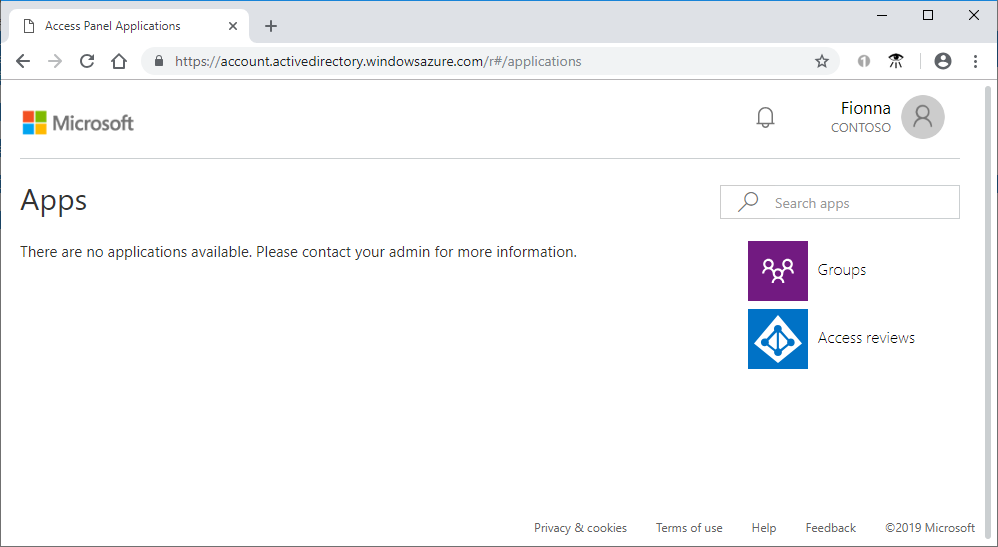
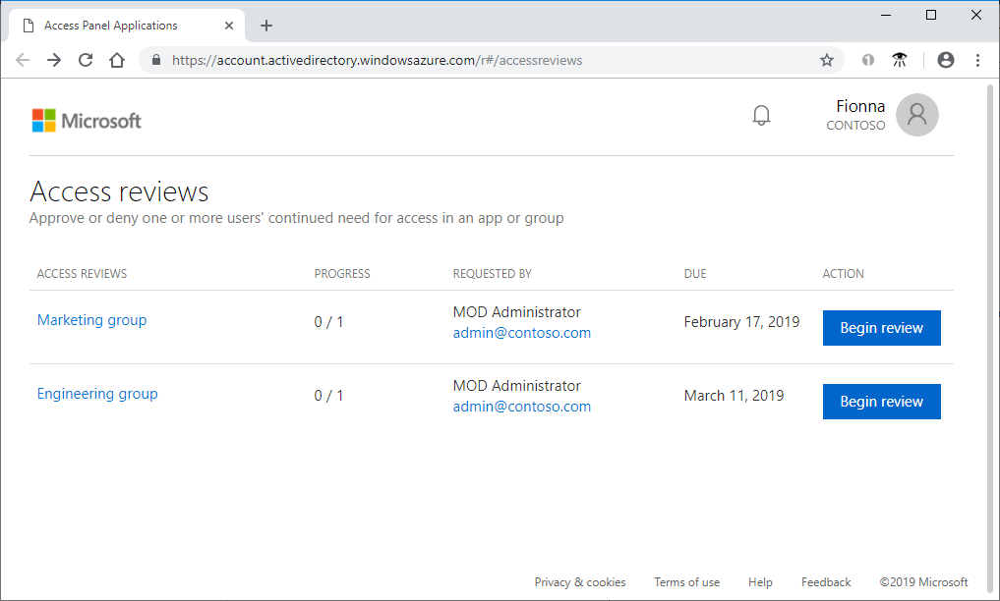
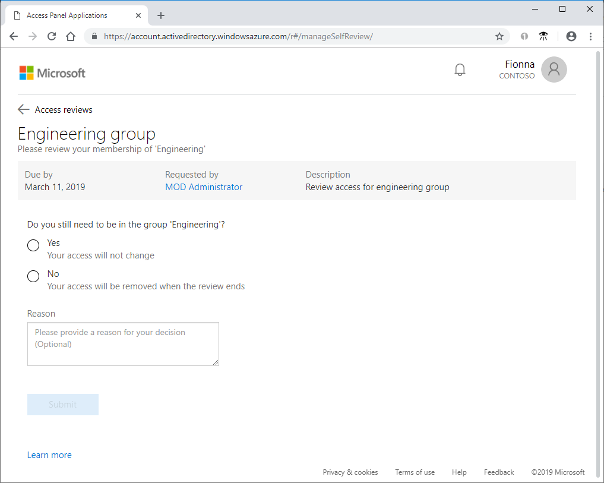
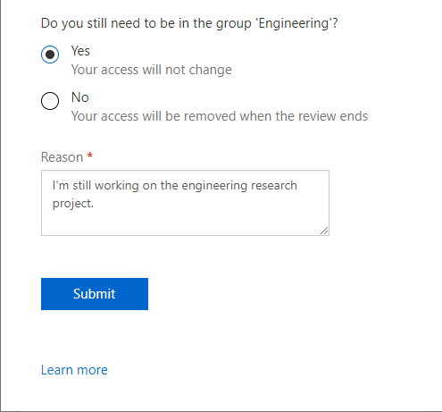
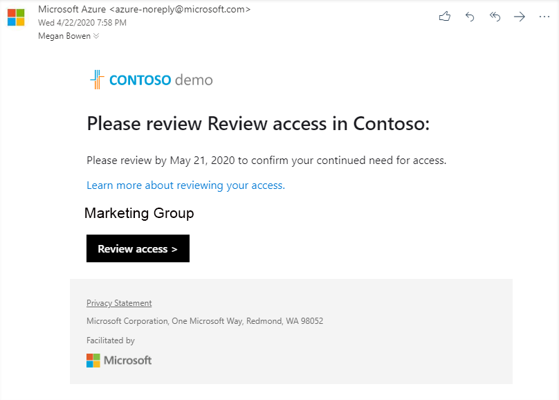
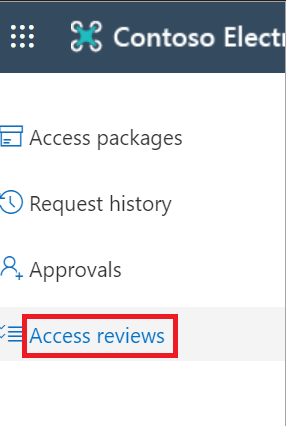
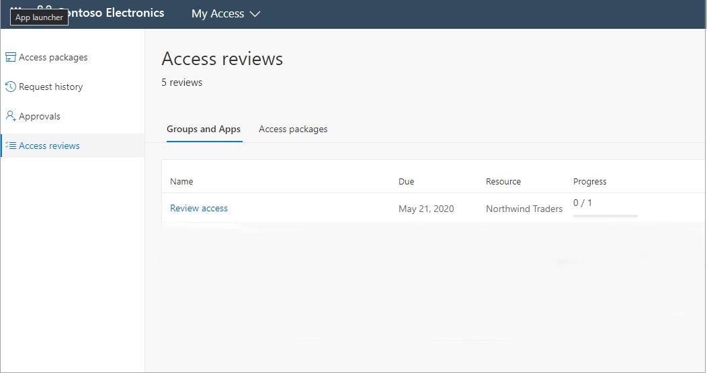

# Review access for yourself to groups or applications in access reviews

Microsoft Entra ID simplifies how enterprises manage access to groups or applications in Microsoft Entra ID and other Microsoft Online Services with a feature called access reviews.

This article describes how to review your own access to a group or an application.

## Review your access using My Apps

The first step to perform an access review is to find and open the access review.

>[!IMPORTANT]
> There could be delays in receiving email and it some cases it could take up to 24 hours. Add azure-noreply@microsoft.com to your safe recipients list to make sure that you are receiving all emails.

1. Look for an email from Microsoft that asks you to review access. Here's an example email to review your access to a group.

    

1. Select the **Review access** link to open the access review.

If you don't have the email, you can find your pending access reviews by following these steps.

1. Sign in to the My Apps portal at [https://myapps.microsoft.com](https://myapps.microsoft.com).

    

1. In the upper-right corner of the page, select the user symbol, which displays your name and default organization. If more than one organization is listed, select the organization that requested an access review.

1. On the right side of the page, select the **Access reviews** tile to see a list of the pending access reviews.

    If the tile isn't visible, there are no access reviews to perform for that organization and no action is needed at this time.

    

1. Select the **Begin review** link for the access review you want to perform.

### Perform the access review

Once you have opened the access review, you can see your access.

1. Review your access and decide whether you still need access.

    If the request is to review access for others, the page looks different. For more information, see [Review access to groups or applications](perform-access-review.md).

    

1. Select **Yes** to keep your access or select **No** to remove your access.

1. If you select **Yes**, you might need to specify a justification in the **Reason** box.

    

1. Select **Submit**.

    Your selection is submitted and you're returned to the My Apps portal.

    If you want to change your response, reopen the access reviews page and update your response. You can change your response at any time until the access review has ended.

    > [!NOTE]
    > If you indicated that you no longer need access, you aren't removed immediately. You are removed when the review has ended or when an administrator stops the review.

## Review your own access using My Access (New)

You can try the new experience with the updated user interface in My Access a couple of different ways:

### My Apps portal

1. Sign in to the My Apps portal at [https://myapps.microsoft.com](https://myapps.microsoft.com).

    

2. Select the **Access reviews** tile to see a list of pending access reviews.

    > [!NOTE]
    > If the **Access reviews** tile isn't visible, there are no access reviews to perform for that organization and no action is needed at this time.

3. Select on **Try it!** in the banner at the top of the page to go to the new My Access experience.

    

4. Continue in the section **Perform the access review**

### Email

>[!IMPORTANT]
> There could be delays in receiving email and it some cases it could take up to 24 hours. Add azure-noreply@microsoft.com to your safe recipients list to make sure that you are receiving all emails.

1. Look for an email from Microsoft asking you to review access. You can see an example email message below:

 

2. Select the **Review access** link to open the access review.

3. Continue in the section **Perform the access review**

>[!NOTE]
>If clicking start review takes you to **My Apps** follow the steps listed in the section above titled **My Apps Portal**.

### Directly at My Access

You can also view your pending access reviews by using your browser to open My Access.

1. Sign  in to the My Access at https://myaccess.microsoft.com/

2. Select **Access reviews** from the menu on the left side bar to see a list of pending access reviews assigned to you.

   

### Perform the access review

1. Under Groups and Apps you can see:
    
    - **Name** The name of the access review.
    - **Due** The due date for the review. After this date denied users could be removed from the group or app being reviewed.
    - **Resource** The name of the resource under review.
    - **Progress** The number of users reviewed over the total number of users part of this access review.
    
2. Select on the name of an Access review to get started.

   

3. Review your access and decide whether you still need access.

    If the request is to review access for others, the page looks different. For more information, see [Review access to groups or applications](perform-access-review.md).

    

1. Select **Yes** to keep your access or select **No** to remove your access.

1. If you select **Yes**, you might need to specify a justification in the **Reason** box.

    

1. Select **Submit**.

    Your selection is submitted and you're returned to the My Access page.

    If you want to change your response, reopen the access reviews page and update your response. You can change your response at any time until the access review has ended.

    > [!NOTE]
    > If you indicated that you no longer need access, you aren't removed immediately. You are removed when the review has ended or when an administrator stops the review.

## Next steps

- [Complete an access review of groups or applications](complete-access-review.md)
