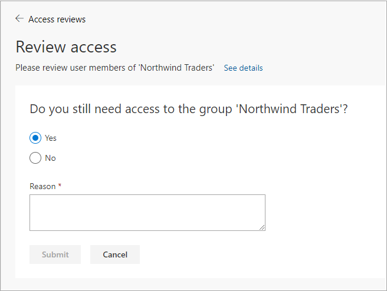

# Self-review of access packages and resources in Microsoft entitlement management

Microsoft entitlement management simplifies how enterprises manage access to groups, applications, and SharePoint sites. This article describes how you can do a self-review of your assigned access packages.

## Review your own access by using My Access

You can review your own access to a group, application, or access package in two ways.

### Use email

>[!IMPORTANT]
> There could be delays in receiving email, and in some cases it could take up to 24 hours. Add azure-noreply@microsoft.com to your safe recipients list to make sure you receive all emails.

1. Look for an email from Microsoft that asks you to review access. Here's an example email message.

   

1. Select **Review access** to open the access review.

1. Continue in the section **Perform the access review**.

### Use My Access

You can also view your pending access reviews by using your browser to open **My Access**.

1. Sign in to [My Access](https://myaccess.microsoft.com/).

1. On the menu on the left, select **Access reviews** to see a list of pending access reviews assigned to you.

   

## Do the access review

1. Under **Groups and Apps**, you can see:

    - **Name**: The name of the access review.
    - **Due**: The due date for the review. After this date, denied users could be removed from the group or app being reviewed.
    - **Resource**: The name of the resource under review.
    - **Progress**: The number of users reviewed out of the total number of users who are part of this access review.

1. Select the name of an access review to get started.

   

1. Review your access and decide if you still need access.

    If the request is to review access for others, the page looks different. For more information, see [Review access to groups or applications](perform-access-review.md).

    

1. Select **Yes** to keep your access, or select **No** to remove your access.

1. If you select **Yes**, you might need to specify a justification in the **Reason** box.

    

1. Select **Submit**.

    Your selection is submitted, and you're returned to the **My Access** page.

    If you want to change your response, reopen the **Access reviews** page and update your response. You can change your response at any time until the access review has ended.

    > [!NOTE]
    > If you indicated that you no longer need access, you aren't removed immediately. You're removed when the review has ended or when an administrator stops the review.

## Next steps

[Complete an access review of groups or applications](complete-access-review.md)
