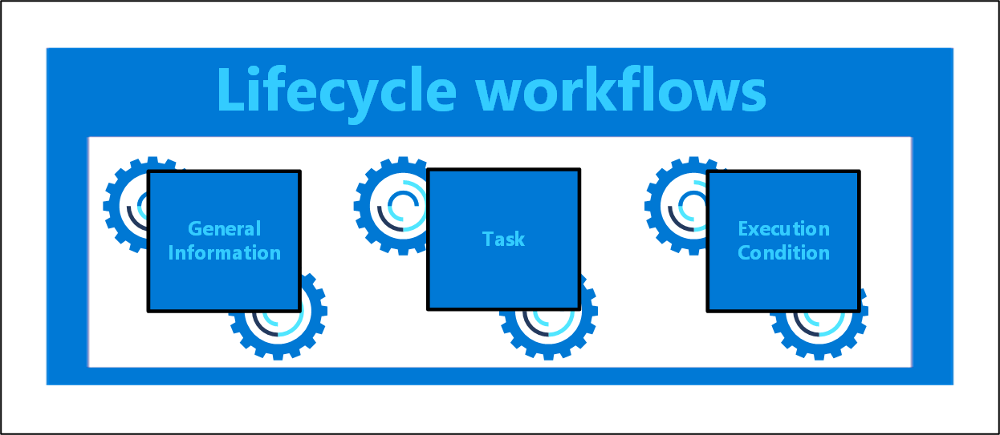
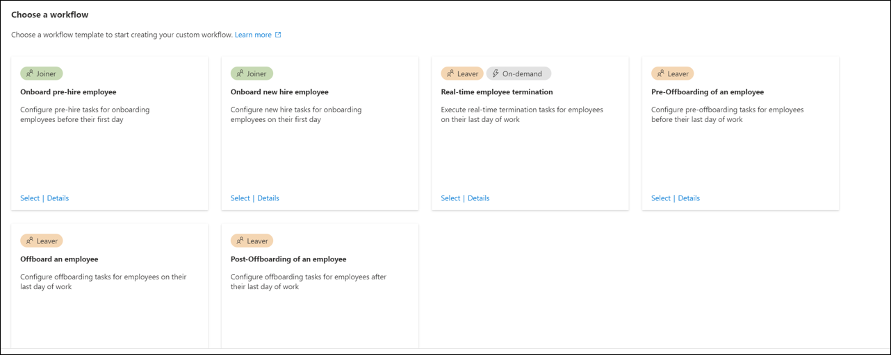
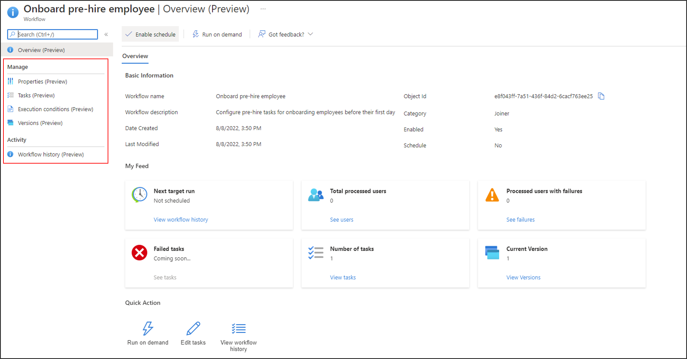
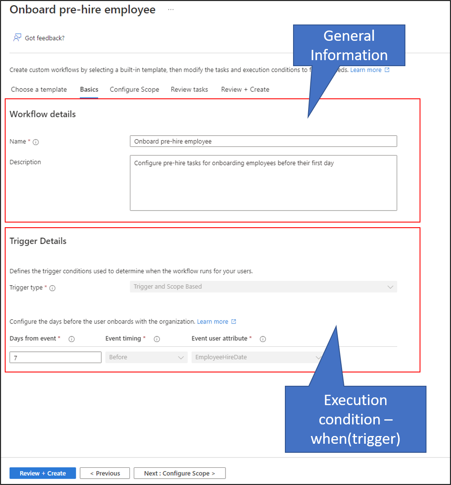
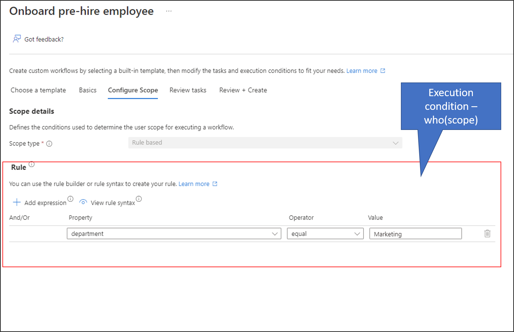
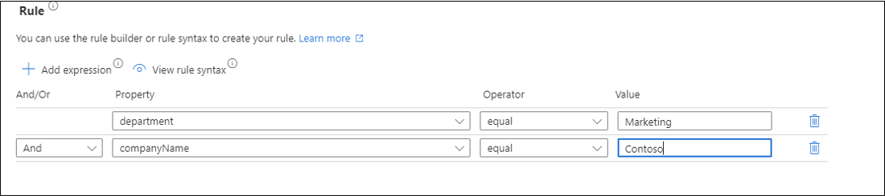
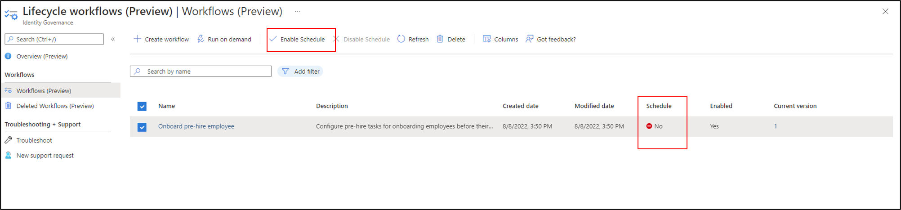
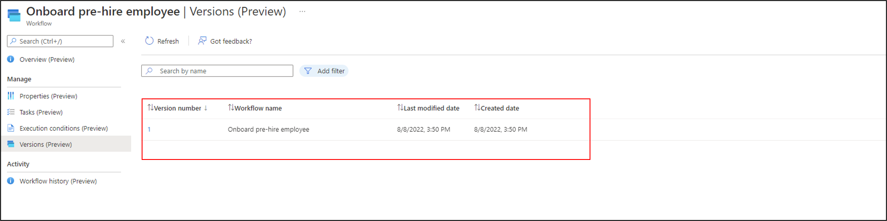

# Understanding lifecycle workflows 

The following document provides an overview of a workflow created using Lifecycle Workflows. Workflows automate tasks based on the joiner-mover-leaver(JML) cycle of lifecycle management, and split tasks for users into categories of where they fall in the lifecycle of an organization. These categories extend into templates, where they can be quickly customized to suit the needs of users in your organization. For more information, see: [What are Lifecycle Workflows?](what-are-lifecycle-workflows.md).

  

## License requirements 

[!INCLUDE [Microsoft Entra ID Governance license](../../../includes/active-directory-entra-governance-license.md)]

## Permissions and Roles

For a full list of supported delegated and application permissions required to use Lifecycle Workflows, see: [Lifecycle workflows permissions](/graph/permissions-reference#lifecycle-workflows-permissions).

For delegated scenarios, the admin needs one of the following [Microsoft Entra roles](/azure/active-directory/users-groups-roles/directory-assign-admin-roles#available-roles):

- Global administrator
- Global reader
- Lifecycle workflows administrator

## Limits

|Category  |Limit  |
|---------|---------|
|Number of Workflows     |   50 per tenant      |
|Number of Tasks     |  25 per workflow       |
|Number of Custom Task Extensions     |  100 per tenant       |
|offsetInDays range of triggerAndScopeBasedConditions executionConditions     |  180 days       |
|Workflow schedule interval in hours     |   1-24 hours      |
|Number of users per on-demand selection	     |  10       |
|durationBeforeTimeout range of custom task extensions     |   5 minutes-3 hours      |

> [!NOTE]
> If creating, or updating, a workflow via API the offsetInDays range will be between -180-180 days. The negative value will signal happening before the timeBasedAttribute, while the positive value will signal happening afterwards.

## Parts of a workflow 

A workflow can be broken down into the following three main parts:

|Workflow part|Description|
|-----|-----|
|General information|This portion of a workflow covers basic information such as display name, and a description of what the workflow does.|
|Tasks|Tasks are the actions that are taken when a workflow is executed.|
|Execution conditions| Defines when(trigger), and for who(scope), a scheduled workflow runs. For more information on these two parameters, see  [Trigger details](understanding-lifecycle-workflows.md#trigger-details) and [Configure Scope](understanding-lifecycle-workflows.md#configure-scope).|

## Templates

Creating a workflow via the Microsoft Entra admin center requires the use of a template. A Lifecycle Workflow template is a framework that is used for predefined tasks, and helps automate the creation of a workflow.  

  

The template, depending on its category, will define which tasks are available to be used, and then guide you through the creation of the workflow. The template provides input for basic description, execution conditions, and task information.  

>[!NOTE]
>Depending on the template you select, the options that will be available may vary. The images in this document uses the [**Onboarding pre-hire employee**](lifecycle-workflow-templates.md#onboard-pre-hire-employee) template to illustrate the parts of a workflow.

For more information, see [Lifecycle workflow templates.](lifecycle-workflow-templates.md)

## Workflow overview

Every workflow has its own overview section, where you can either take quick actions with the workflow, or view its details. This overview section is split into the three following parts:

- Basic Information
- My Feed
- Quick Action

In this section you learn what each section tells you, and what actions you're able to take from this information.

### Basic Information

When selecting a workflow, the overview provides you with a list of basic details in the **Basic Information** section. These basic details provide you with information such as the workflow category, its ID, when it was modified, and when it's scheduled to run again. This information is important in providing quick details surrounding its current usage for administrative purposes. Basic information is also live data, meaning any quick change action that you take place on the overview page, is shown immediately within this section.

Within the **Basic Information** you can view the following information:

 |Name|Description|
 |-----|-----|
 |Name|The name of the workflow.|
 |Description|A brief description that describes the workflow.|
 |Category|A string identifying the category of the workflow.|
 |Date Created|The date and time the workflow was created.|
 |Workflow ID|A unique identifier for the workflow.|
 |Schedule|Defines if the workflow is currently scheduled to run.|
 |Last run date|The last date and time the workflow ran.|
 |Last Modified|The last date and time the workflow was modified.|

### My Feed

The **My Feed** section of the workflow overview contains a quick peek into when and how the workflow ran. This section also allows you to quickly jump to the target areas for more information. The following information is provided:

- Next target run: The date and time of the next scheduled workflow run.
- Total processed users: The total number of users processed by the workflow.
- Processed users with failures: The total users processed with failed status by the workflow.
- Failed tasks: The total number of failed
- Number of tasks: The total number of tasks within the workflow.
- Current version: How many new versions of the workflow have been created.

### Quick Action

The **Quick Action** section allows you to quickly take action with your workflow. These quick actions can either be making the workflow do something, or used for history or editing purposes. The following actions you can take are:

- Run on Demand: Allows you to quickly run the workflow on demand. For more information on this process, see: [Run a workflow on-demand](on-demand-workflow.md)
- Edit tasks: Allows you to add, delete, edit, or reorder tasks within the workflow. For more information on this process, see: [Edit the tasks of a workflow using the Microsoft Entra admin center](manage-workflow-tasks.md#edit-the-tasks-of-a-workflow-using-the-microsoft-entra-admin-center)
- View Workflow History: Allows you to view the history of the workflow. For more information on the three history perspectives, see: [Lifecycle Workflows history](lifecycle-workflow-history.md)

Actions taken from the overview of a workflow allow you to quickly complete tasks, which can normally be done via the manage section of a workflow.

## Workflow basics

After selecting a template, on the basics screen:
 - Provide the information that is used in the description portion of the workflow.
 - The trigger, defines when of the execution condition.

 

## Trigger details

The trigger of a workflow defines when a scheduled workflow runs for users in scope for the workflow. The trigger is a combination of a time-based attribute, and an offset value.  For example, if the attribute is employeeHireDate and offsetInDays is -1, then the workflow should trigger one day before the employee hire date. The value can range between -180 and 180 days. 

The time-based attribute can be either one of two values, which are automatically chosen based on the template in which you select during the creation of your workflow. The three values can be:

- employeeHireDate: If the template is a joiner workflow
- createdDateTime: if the template is a joiner workflow designed to run either on hire or post onboarding
- employeeLeaveDateTime: If the template is a leaver workflow

The values employeeHireDate and employeeLeaveDateTime must be set within Microsoft Entra ID for users. For more information on this process, see [How to synchronize attributes for Lifecycle workflows](how-to-lifecycle-workflow-sync-attributes.md)

The offset determines how many days before or after the time-based attribute the workflow should be triggered. For example, if the attribute is employeeHireDate and offsetInDays is 7, then the workflow should trigger one week(7 days) before the employee hire date. The offsetInDays value can be as far ahead, or behind, as 180.

> [!NOTE]
> The offsetInDays value in the Microsoft Entra admin center is shown as *Days from event*. When you schedule a workflow to run, this value is used as the baseline for who a workflow will run. Currently there is a 3 day window in processing scheduled workflows. For example, if you schedule a workflow to run for users who joined 7 days ago, a user who meets the execution conditions for the workflow, but joined between 7 to 10 days ago would have the workflow ran for them.

## Configure scope

The scope defines for who the scheduled workflow runs. Configuring this parameter allows you to further narrow down the users for whom the workflow is to be executed.

The scope is made up of the following two parts:

- Scope type: Always preset as Rule based.
- Rule: Where you can set expressions on user properties that define for whom the scheduled workflow runs. You can add extra expressions using **And, And not, Or, Or not** to create complex conditionals, and apply the workflow more granularly across your organization. Lifecycle Workflows supports a [rich set of user properties](/graph/api/resources/identitygovernance-rulebasedsubjectset#supported-user-properties-and-query-parameters) for configuring the scope.

>[!NOTE]
> The rule evaluation is case-sensitive.

For a detailed guide on setting the execution conditions for a workflow, see: [Create a lifecycle workflow.](create-lifecycle-workflow.md)

## Scheduling

While newly created workflows are enabled by default, scheduling is an option that must be enabled manually. To verify whether the workflow is scheduled, you can view the **Scheduled** column. 

Once scheduling is enabled, the workflow is evaluated based on the interval that is set within your workflow settings(default of three hours) to determine whether or not it should run based on the execution conditions.

 

To view a detailed guide on scheduling a workflow, see: [Customize the schedule of workflows](customize-workflow-schedule.md).

### On-demand scheduling

A workflow can be run on-demand for testing or in situations where it's required.

Use the **Run on demand** feature to execute the workflow immediately. The workflow must be enabled before you can run it on demand.

>[!NOTE]
> A workflow that is run on demand for a user does not take into account whether or not a user meets the workflow's execution conditions. It will apply the tasks regardless of whether the execution conditions are met by the user or not.

For more information, see: [Run a workflow on-demand](on-demand-workflow.md)

##  History

When you've selected a workflow, you can view its historical information through the lens of its users, runs, and tasks. Being able to view information specifically from these viewpoints allows you to quickly narrow down specific information about how a workflow was processed. 

For more information, see: [Lifecycle Workflows history](lifecycle-workflow-history.md)

## Versioning

Workflow versions are separate workflows built using the same information of an original workflow, but with either the tasks or scope updated, so that they're reported differently within logs. Workflow versions can change the actions or even scope of an existing workflow.

For more information, see: [Lifecycle Workflows Versioning](lifecycle-workflow-versioning.md)

## Next steps
- [Create a custom workflow using the Microsoft Entra admin center](tutorial-onboard-custom-workflow-portal.md)
- [Create a Lifecycle workflow](create-lifecycle-workflow.md)
