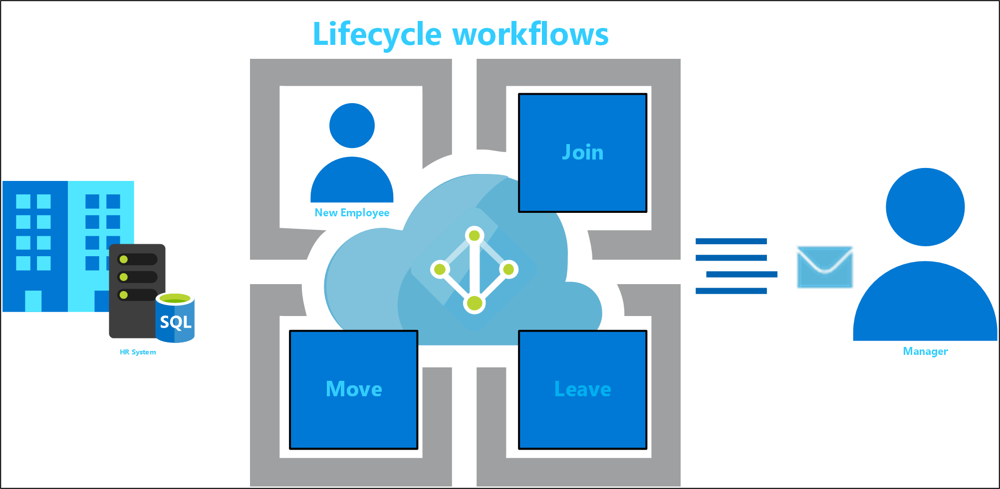

# What are Lifecycle Workflows? (Preview)

>[!IMPORTANT]
>Lifecycle workflows is currently in Private Preview. This preview version is provided without a service level agreement, and it is not recommended for production workloads. Certain features might not be supported or might have constrained capabilities. For more information, see Supplemental Terms of Use for Microsoft Azure Previews.

Lifecycle Workflows is a feature of Azure Active Directory (Azure AD) that enables you to manage Azure AD users. This management allows you to take the appropriate actions by triggering custom workflows that automate an organization’s processes. These processes include:

 - Join - When an individual comes into scope of needing access, an identity is needed by those applications. A new digital identity maybe required.
 - Move - When an individual moves between boundaries.  This movement may require additional access authorizations to be added or removed to their digital identity
 - Leave - When an individual leaves the scope of needing access, access may need to be removed. The identity may no longer be required by applications other than for audit or forensics purposes.

 

Workflows can be created to run pre-configured actions. These pre-configured actions, known as tasks, define what the workflow does. Lifecycle Workflows have many tasks automating basic actions for lifecycle management.

## Why use Lifecycle workflows?

Identity governance aims to address the following questions:

- Which users should have access to which resources?
- What are those users doing with that access?
- Are there effective organizational controls for managing access?
- Can auditors verify that the controls are working?

Anyone who wants to modernize their governance and identity lifecycle management process (for employees, contractors, vendors, partners and guests) should look in to using Lifecycle workflows. 

## How can Lifecycle Workflows help my organization?

In order to address the key governance questions, today's organizations need to ensure:

- That when a user joins the organization, they are ready to go on day one. They have the correct access to the information and applications they need. They have the required hardware necessary to do their job.
- That when users move between various entities within the company, it is done with as little effort as possible, and in the most cost-effective way. Mover scenarios can accomplish this task with the automation of adding and removing users from various groups, granting specific privileges and roles, and access to applications.
- That users who are no longer tied to the company for various reasons (termination, separation, leave of absence or retirement), have their access revoked in a timely manner. This revocation is critical to avoid negatively impacting not only the organization but, in some cases, their customers as well.

The following table summarizes in which areas lifecycle workflows can be used to meet your organizations goals:

|Area  |Description  |
|---------|---------|
|Authorization management     | Lifecycle workflows can ensure appropriate group and teams memberships.        |
|Credential management     | Lifecycle workflows can help with the initial credential distribution for new hires, such as sending the Temporary Access Pass to the manager.        |
|Service management     | Lifecycle workflows can send email notifications such as Welcome E-Mail for new hires and with its Logic App integration its able to open tickets in ITSM Tools such as ServiceNow.        |
|Account management     | Lifecycle workflows can enable/disable accounts.        |

## When to use Lifecycle Workflows

You can use Lifecycle workflows to address any of the following conditions:

**Automate group membership**: When groups in your organization are well-defined, you can automate user membership of these groups. Automated membership can be a new user joining the organization and being added to a group, or an existing user being removed from a group before being added to another group.
**Automate user onboarding**: Ensure users have what they need on day one by automating the onboarding process for users. Lifecycle Workflows allow you to enable user accounts and generate temporary passwords to be sent to the user's manager through email. Lifecycle Workflows also allow for the automation of sending new hire email.
**Automate hardware procurement**: When users join your organization or move between business units, they may require specific hardware for their role. Lifecycle workflows can automate this task so that the appropriate emails are sent, and the hardware requests are initiated. [via Logic Apps extensibility]
- **Automate user removal**: Making sure users who are leaving have their access to resources revoked is a key part of the identity lifecycle process. Lifecycle Workflows allow you to automate the disabling and removal of user accounts.

## License requirements

[!INCLUDE [Azure AD Premium P2 license](../../../includes/active-directory-p2-license.md)]

## Next steps
- [Create a custom workflow using the Azure Portal](tutorial-onboard-custom-workflow-portal.md)
- [Create a Lifecycle workflow](create-lifecycle-workflow.md)