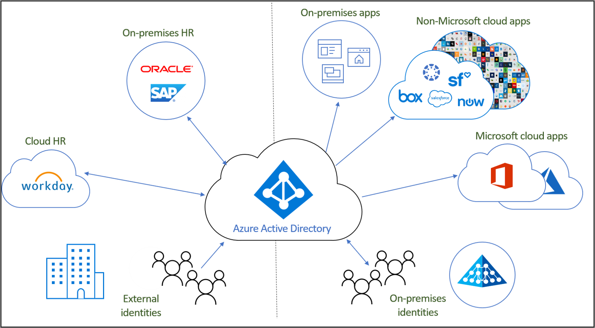

# What is identity lifecycle management?

Identity Governance helps organizations achieve a balance between productivity - How quickly can a person have access to the resources they need, such as when they join my organization? And security - How should their access change over time, such as due to changes to that person's employment status?

**Identity lifecycle management** is the foundation for Identity Governance, and effective governance at scale requires modernizing the identity lifecycle management infrastructure for applications. Identity Lifecycle Management aims to automate and manage the entire digital identity lifecycle process. 

## What is a digital identity?

A digital identity is information on an entity used by a one or more computing resources - such as operating systems or applications. These entities may represent people, organizations, applications, or devices.  The identity is usually described by the attributes that are associated with it, such as the name, identifiers, as well as properties such as roles used for access management.  These attributes help systems make determinations such who has access to what and who is allowed to use this or that system.  

## Managing the lifecycle of digital identities

Managing digital identities is a complex task, especially as it relates correlating real-world objects, such as a person and their relationship with an organization as an employee of that organization, with a digital representation.    In small organizations, keeping the digital representation of individuals who require an identity can be a manual process - when someone is hired, or a contractor arrives, an IT specialist can create an account for them in a directory, and assign them the access they need.  However, in mid-size and large organizations, automation can enable the organization to scale more effectively and keep the identities accurate.

The typical process for establishing identity lifecycle management in an organization follows these steps:

1. Determine whether there are already systems of record: data sources which the organization treats as authoritative.  For example, the organization may have an HR system Workday, and that system is authoritative for providing the current list of employees, and some of their properties such as the employee's name or department.  Or an email system such as Exchange Online may be authoritative for an employee's email address.

2. Connect those systems of record with one or more directories and databases used by applications, and resolve any inconsistencies between the directories and the systems of record. For example, a directory may have obsolete data, such as an account for a former employee, that is no longer needed. 

3. Determine what processes can be used to supply authoritative information in the absence of a system of record.  For example, if there are digital identities but visitors, but the organization has no database for visitors, then it may be necessary to find an alternate way to determine when an digital identity for a visitor is no longer needed.

4. Configure that changes from the system of record or other processes are replicated to each of the directories or databases that require an update.

## Identity lifecycle management for representing employees and other individuals with an organizational relationship

When planning identity lifecycle management for employees, or other individuals with an organizational relationship such as a contractor or student, many organizations model the "join, move, and leave" process.  These are:
	
   - Join - when an individual comes into scope of needing access, an identity is needed by those applications, so a new digital identity may need to be created if one is not already available
   - Move - when an individual moves between boundaries, that require additional access authorizations to be added or removed to their digital identity
   - Leave- when an individual leaves the scope of needing access, access may need to be removed, and subsequently the identity may no longer by required by applications other than for audit or forensics purposes

So for example, if a new employee joins your organization, who has never been affiliated with your organization before, that employee will require a new digital identity, represented as a user account in Azure AD.  The creation of this account would fall into a "Joiner" process, which could be automated if there was a system of record such as Workday that could indicate when the new employee starts work.  Later, if your organization has an employee move from say, Sales to Marketing, they would fall into a "Mover" process.  This would require removing the access rights they had in the Sales organization which they no longer require, and granting them rights in the Marketing organization that they new require.

## Identity lifecycle management for guests

Similar processes are also needed for guests and other users.  Azure AD entitlement management utilizes Azure AD business-to-business (B2B) to provide the lifecycle controls needed to collaborate with people outside your organization who require access to your organization's resources. With Azure AD B2B, external users authenticate to their home directory, but have a representation in your directory. The representation in your directory enables the user to be assigned access to your resources.  Entitlement management enables individuals outside your organization to request access, creating a digital identity for them as needed. These digital identities are automatically removed when the user loses access.  

## How does Azure AD automate identity lifecycle management?

Azure AD currently provides these features:

* Users representing employees can be automatically created and updated in Azure AD and Active Directory using [HR-driven provisioning](what-is-hr-driven-provisioning.md)
* Users already present in Active Directory can be automatically created and maintained in Azure AD using [inter-directory provisioning](what-is-inter-directory-provisioning.md)
* Users can be automatically assigned to groups based on their properties, using [dynamic groups](../external-identities/use-dynamic-groups.md#what-are-dynamic-groups) and can, upon request, be assigned to groups, Teams, Azure AD roles, Azure resource roles, and SharePoint Online sites, using [entitlement management](entitlement-management-scenarios.md) and [Privileged Identity Management](../privileged-identity-management/pim-configure.md)
* Updates to users can be automatically sent to more applications using [app provisioning](what-is-app-provisioning.md)

## Next steps 

- [What is provisioning?](what-is-provisioning.md)
- [Govern access for external users in Azure AD entitlement management](./entitlement-management-external-users.md)
- [What is HR driven provisioning?](what-is-hr-driven-provisioning.md)
- [What is app provisioning?](what-is-app-provisioning.md)
- [What is inter-directory provisioning?](what-is-inter-directory-provisioning.md)