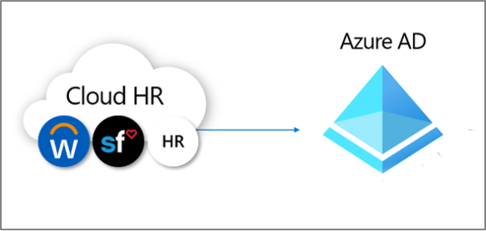
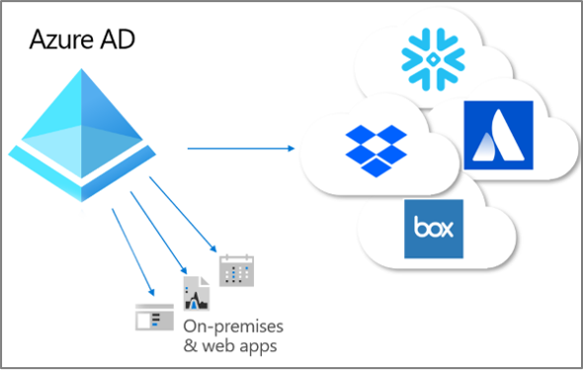
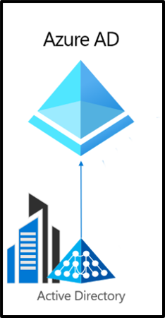

# What is provisioning?

Provisioning and deprovisioning are the processes that ensure consistency of digital identities across multiple systems.  These processes are typically used as part of [identity lifecycle management](what-is-identity-lifecycle-management.md).

**Provisioning** is the processes of creating an identity in a target system based on certain conditions.  **De-provisioning** is the process of removing the identity from the target system, when conditions are no longer met. **Synchronization** is the process of keeping the provisioned object, up to date, so that the source object and target object are similar.

For example, when a new employee joins your organization, that employee is entered in to the HR system.  At that point, provisioning **from** HR **to** Microsoft Entra ID can create a corresponding user account in Microsoft Entra ID. Applications which query Microsoft Entra ID can see the account for that new employee.  If there are applications that don't use Microsoft Entra ID, then provisioning **from** Microsoft Entra ID **to** those applications' databases, ensures that the user will be able to access all of the applications that the user needs access to.  This process allows the user to start work and have access to the applications and systems they need on day one.  Similarly, when their properties, such as their department or employment status, change in the HR system, synchronization of those updates from the HR system to Microsoft Entra ID, and furthermore to other applications and target databases, ensures consistency.

Microsoft Entra ID currently provides three areas of automated provisioning.  They are:  

- Provisioning from an external non-directory authoritative system of record to Microsoft Entra ID, via **[HR-driven provisioning](#hr-driven-provisioning)**  
- Provisioning from Microsoft Entra ID to applications, via **[App provisioning](#app-provisioning)**  
- Provisioning between Microsoft Entra ID and Active Directory Domain Services, via **[inter-directory provisioning](#inter-directory-provisioning)** 

## HR-driven provisioning

Provisioning from HR to Microsoft Entra ID involves the creation of objects, typically user identities representing each employee, but in some cases other objects representing departments or other structures, based on the information that is in your HR system.  

The most common scenario would be, when a new employee joins your company, they're entered into the HR system.  Once that occurs, they're automatically provisioned as a new user in Microsoft Entra ID, without needing administrative involvement for each new hire.  In general, provisioning from HR can cover the following scenarios.

- **Hiring new employees** - When a new employee is added to an HR system, a user account is automatically created in Active Directory, Microsoft Entra ID, and optionally in the directories for other  applications supported by Microsoft Entra ID, with write-back of the email address to the HR system.
- **Employee attribute and profile updates** - When an employee record is updated in that HR system (such as their name, title, or manager), their user account will be automatically updated in Active Directory, Microsoft Entra ID, and optionally other applications supported by Microsoft Entra ID.
- **Employee terminations** - When an employee is terminated in HR, their user account is automatically blocked from sign in or removed in Active Directory, Microsoft Entra ID, and in other applications.
- **Employee rehires** - When an employee is rehired in cloud HR, their old account can be automatically reactivated or reprovisioned (depending on your preference).

There are three deployment options for HR-driven provisioning with Microsoft Entra ID:

1. For organizations with a single subscription to Workday or SuccessFactors, and don't use Active Directory
1. For organizations with a single subscription to Workday or SuccessFactors, and have both Active Directory and Microsoft Entra ID
1. For organizations with multiple HR systems, or an on-premises HR system such as SAP, Oracle eBusiness or PeopleSoft

For more information, see [What is HR driven provisioning?](../app-provisioning/what-is-hr-driven-provisioning.md)

## App provisioning

In Microsoft Entra ID, the term **[app provisioning](../app-provisioning/user-provisioning.md)** refers to automatically creating copies of user identities in the applications that users need access to, for applications that have their own data store, distinct from Microsoft Entra ID or Active Directory. In addition to creating user identities, app provisioning includes the maintenance and removal of user identities from those apps, as the user's status or roles change. Common scenarios include provisioning a Microsoft Entra user into applications like [Dropbox](../saas-apps/dropboxforbusiness-provisioning-tutorial.md), [Salesforce](../saas-apps/salesforce-provisioning-tutorial.md), [ServiceNow](../saas-apps/servicenow-provisioning-tutorial.md), as each of these applications have their own user repository distinct from Microsoft Entra ID.

Microsoft Entra ID also supports provisioning users into applications hosted on-premises or in a virtual machine, without having to open up any firewalls. If your application supports [SCIM](https://aka.ms/scimoverview), or you've built a SCIM gateway to connect to your legacy application, you can use the Microsoft Entra provisioning agent to [directly connect](/azure/active-directory/app-provisioning/on-premises-scim-provisioning) with your application and automate provisioning and deprovisioning. If you have legacy applications that don't support SCIM and rely on an [LDAP](/azure/active-directory/app-provisioning/on-premises-ldap-connector-configure) user store or a [SQL](/azure/active-directory/app-provisioning/on-premises-sql-connector-configure) database, or that have a [SOAP or REST API](../app-provisioning/on-premises-web-services-connector.md), Microsoft Entra ID can support those as well.

For more information, see [What is app provisioning?](../app-provisioning/user-provisioning.md)

## Inter-directory provisioning

Many organizations rely upon both Active Directory and Microsoft Entra ID, and may have applications connected to Active Directory, such as on-premises file servers.

As many organizations historically have deployed HR-driven provisioning on-premises, they may already have user identities for all their employees in Active Directory. The most common scenario for inter-directory provisioning is when a user already in Active Directory is provisioned into Microsoft Entra ID. This provisioning is usually accomplished by Microsoft Entra Connect Sync or Microsoft Entra Connect cloud provisioning. 

In addition, organizations may wish to also provision to on-premises systems from Microsoft Entra ID. For example, an organization may have brought guests into the Microsoft Entra directory, but those guests will need access to on-premises Windows Integrated Authentication (WIA) based web applications via the app proxy. This scenario requires the provisioning of on-premises AD accounts for those users in Microsoft Entra ID.

For more information, see [What is inter-directory provisioning?](../hybrid/what-is-inter-directory-provisioning.md)

 
## Next steps

- [What is identity lifecycle management?](what-is-identity-lifecycle-management.md)
- [What is HR driven provisioning?](../app-provisioning/what-is-hr-driven-provisioning.md)
- [What is app provisioning?](../app-provisioning/user-provisioning.md)
- [What is inter-directory provisioning?](../hybrid/what-is-inter-directory-provisioning.md)
