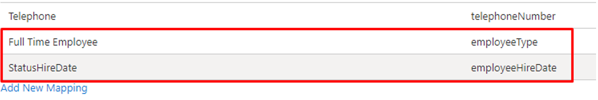

# Lifecycle workflows - FAQs

In this article, you'll find questions to commonly asked questions about [Lifecycle Workflows](what-are-lifecycle-workflows.md). Check back to this page frequently as changes happen often, and answers are continually being added.

## Frequently asked questions

### Can I create custom workflows for guests?

Yes, custom workflows can be configured for members or guests in your tenant. Workflows can run for all types of external guests, external members, internal guests and internal members.

### Why do I see "Lifecycle Management" instead of "Lifecycle Workflows"?
For a small portion of our customers, Lifecycle Workflows may still be listed under the former name Lifecycle Management in the audit logs and enterprise applications.

### Do I need to map employeeHireDate in provisioning apps like WorkDay?

Yes, key user properties like employeeHireDate and employeeType are supported for user provisioning from HR apps like WorkDay. To use these properties in Lifecycle workflows, you need to map them in the provisioning process to ensure the values are set. The following is an example of the mapping: 

For more information on syncing employee attributes in Lifecycle Workflows, see: [How to synchronize attributes for Lifecycle workflows](how-to-lifecycle-workflow-sync-attributes.md)

### How do I see more details and parameters of tasks and the attributes that are being updated? 

Some tasks do update existing attributes; however, we don’t currently share those specific details. As these tasks are updating attributes related to other Microsoft Entra features, so you can find that info in those docs. For temporary access pass, we're writing to the appropriate attributes listed [here](/graph/api/resources/temporaryaccesspassauthenticationmethod). 

### Is it possible for me to create new tasks and how? For example, triggering other graph APIs/web hooks?

We currently don’t support the ability to create new tasks outside of the set of tasks supported in the task templates. As an alternative, you may accomplish this by setting up a logic app and then creating a logic apps task in Lifecycle Workflows with the URL. For more information, see [Trigger Logic Apps based on custom task extensions](trigger-custom-task.md)

## Next steps

- [What are Lifecycle workflows?](what-are-lifecycle-workflows.md)
