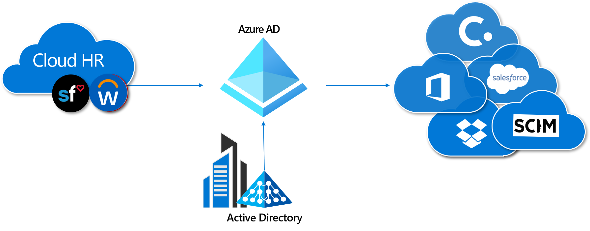
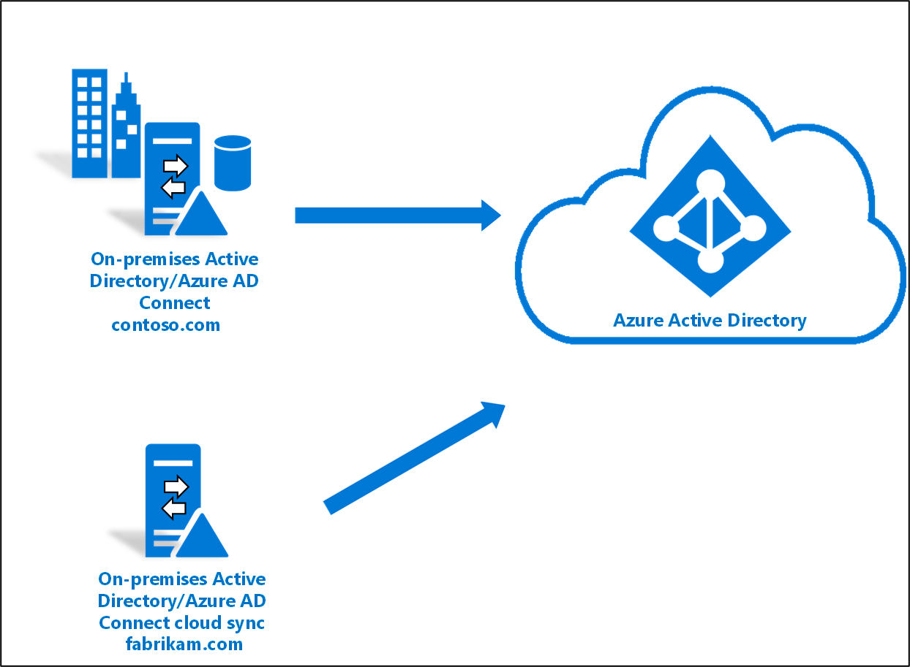
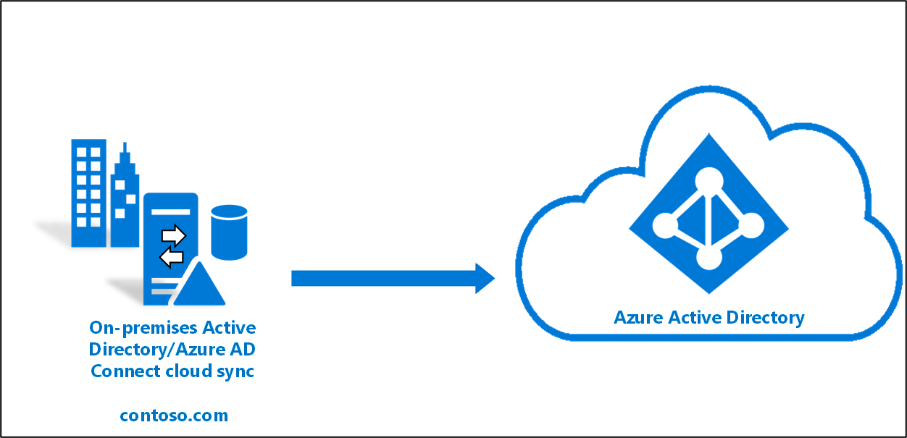
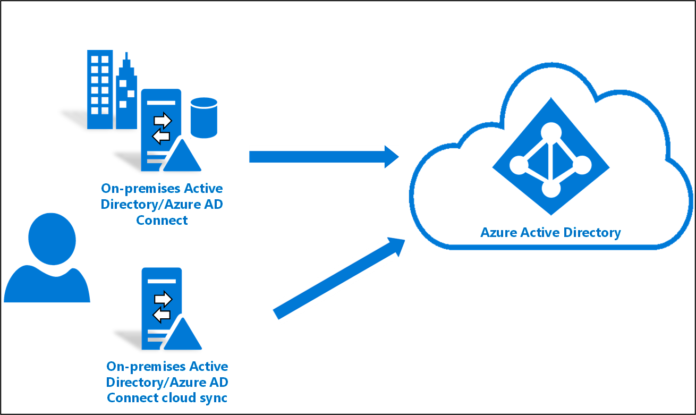

# Cloud sync deep dive - how it works

## Overview of components

Cloud sync is built on top of the Microsoft Entra services and has 2 key components:

- **Provisioning agent**: The Microsoft Entra Connect cloud provisioning agent is the same agent as Workday inbound and built on the same server-side technology as app proxy and Pass Through Authentication. It requires an outbound connection only and agents are auto-updated. 
- **Provisioning service**: Same provisioning service as outbound provisioning and Workday inbound provisioning, which uses a scheduler-based model. Cloud sync provisions change every 2 mins.

## Initial setup
During initial setup, a few things are done that makes cloud sync happen. 

- **During agent installation**: You configure the agent for the AD domains you want to provision from.  This configuration registers the domains in the hybrid identity service and establishes an outbound connection to the service bus listening for requests.
- **When you enable provisioning**: You select the AD domain and enable provisioning, which runs every 2 mins. Optionally you may deselect password hash sync and define notification email. You can also manage attribute transformation using Microsoft Graph APIs.

## Agent installation
The following items occur when the cloud provisioning agent is installed.

- First, the Installer installs the Agent binaries and the Agent Service running under the Virtual Service Account (NETWORK SERVICE\AADProvisioningAgent).  A virtual service account is a special type of account that doesn't have a password and is managed by Windows.
- The Installer then starts the Wizard.
- The Wizard will prompt for Microsoft Entra credentials, will then authenticate, and retrieve a token.
- The wizard then asks for the current machine Domain Administrators credentials.
- Using these credentials, the agent general managed service account (GMSA) for this domain is either created or located and reused if it already exists.
- The agent service is now reconfigured to run under the GMSA.
- The wizard now asks for domain configuration along with the Enterprise Admin (EA)/Domain Admin(DA) Account for each domain you want the agent to service.
- The GMSA account is then updated with permissions that enable it access to each domain entered during setup.
- Next, the wizard triggers agent registration
- The agent creates a certificate and using the Microsoft Entra token, registers itself and the certificate with the Hybrid Identity Service(HIS) Registration Service
- The Wizard triggers an AgentResourceGrouping call. This call to HIS Admin Service is to assign the agent to one or more AD Domains in the HIS configuration.
- The wizard now restarts the agent service.
- The agent calls a Bootstrap Service on restart (and every 10 mins afterwards) to check for configuration updates.  The bootstrap service validates the agent identity.  It also updates the last bootstrap time.  This is important because if agents don't bootstrap, they aren't getting updated Service Bus endpoints and may not be able to receive requests. 

## What is System for Cross-domain Identity Management (SCIM)?

The [SCIM specification](https://tools.ietf.org/html/draft-scim-core-schema-01) is a standard that is used to automate the exchanging of user or group identity information between identity domains such as Microsoft Entra ID. SCIM is becoming the de facto standard for provisioning and, when used with federation standards like SAML or OpenID Connect, provides administrators an end-to-end standards-based solution for access management.

The Microsoft Entra Connect cloud provisioning agent uses SCIM with Microsoft Entra ID to provision and deprovision users and groups.

## Synchronization flow

Once you've installed the agent and enabled provisioning, the following flow occurs.

1.  Once configured, the Microsoft Entra provisioning service calls the Microsoft Entra hybrid service to add a request to the Service bus. The agent constantly maintains an outbound connection to the Service Bus listening for requests and picks up the System for Cross-domain Identity Management (SCIM) request immediately. 
2.  The agent breaks up the request into separate queries based on object type. 
3.  AD returns the result to the agent and the agent filters this data before sending it to Microsoft Entra ID.  
4.  Agent returns the SCIM response to Microsoft Entra ID.  These responses are based on the filtering that happened within the agent.  The agent uses scoping to filter the results. 
5.  The provisioning service writes the changes to Microsoft Entra ID.
6.  If a delta Sync occurs, as opposed to a full sync, then the cookie/watermark is used. New queries will get changes from that cookie/watermark onwards.

## Supported scenarios:
The following scenarios are supported for cloud sync.

- **Existing hybrid customer with a new forest**: Microsoft Entra Connect Sync is used for primary forests. Cloud sync is used for provisioning from an AD forest (including disconnected). For more information, see the tutorial [here](tutorial-existing-forest.md).

 
- **New hybrid customer**:      Microsoft Entra Connect Sync isn't used. Cloud sync is used for provisioning from an AD forest.  For more information, see the tutorial [here](tutorial-single-forest.md).
 
 

- **Existing hybrid customer**: Microsoft Entra Connect Sync is used for primary forests. Cloud sync is piloted for a small set of users in the primary forests [here](tutorial-existing-forest.md).

 

For more information, see [Supported topologies](plan-cloud-sync-topologies.md).

## Next steps 

- [What is provisioning?](../what-is-provisioning.md)
- [What is Microsoft Entra Cloud Sync?](what-is-cloud-sync.md)
