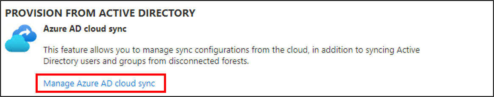

# Install the Azure AD Connect provisioning agent by using a CLI and PowerShell
This article shows you how to install the Azure Active Directory (Azure AD) Connect provisioning agent by using PowerShell cmdlets.
 
>[!NOTE]
>This article deals with installing the provisioning agent by using the command-line interface (CLI). For information on how to install the Azure AD Connect provisioning agent by using the wizard, see [Install the Azure AD Connect provisioning agent](how-to-install.md).

## Prerequisite

The Windows server must have TLS 1.2 enabled before you install the Azure AD Connect provisioning agent by using PowerShell cmdlets. To enable TLS 1.2, follow the steps in [Prerequisites for Azure AD Connect cloud sync](how-to-prerequisites.md#tls-requirements).

>[!IMPORTANT]
>The following installation instructions assume that all the [prerequisites](how-to-prerequisites.md) were met.

## Install the Azure AD Connect provisioning agent by using PowerShell cmdlets 

[!INCLUDE [portal updates](~/articles/active-directory/includes/portal-update.md)]

 1. Sign in to the server you use with enterprise admin permissions.
 2. Sign in to the [Azure portal](https://portal.azure.com), and then go to **Azure Active Directory**.
 3. On the menu on the left, select **Azure AD Connect**.
 4. Select **Manage cloud sync**.
     [](media/how-to-install/new-install-1.png#lightbox)</br>
 5. At the top, click **Download agent**.
    [](media/how-to-install/new-install-2.png#lightbox)</br>
 6. On the right, click **Accept terms and download**.
 7. For the purposes of these instructions, the agent was downloaded to the C:\temp folder.
 8. Install ProvisioningAgent in quiet mode.
       ```
      $installerProcess = Start-Process 'c:\temp\AADConnectProvisioningAgentSetup.exe' /quiet -NoNewWindow -PassThru 
      $installerProcess.WaitForExit()

       ```
 9. Import the Provisioning Agent PS module.
       ```
       Import-Module "C:\Program Files\Microsoft Azure AD Connect Provisioning Agent\Microsoft.CloudSync.PowerShell.dll" 
       ```
 10. Connect to Azure AD by using an account with the hybrid identity role. You can customize this section to fetch a password from a secure store. 
       ```
       $hybridAdminPassword = ConvertTo-SecureString -String "Hybrid identity admin password" -AsPlainText -Force 
    
       $hybridAdminCreds = New-Object System.Management.Automation.PSCredential -ArgumentList ("HybridIDAdmin@contoso.onmicrosoft.com", $hybridAdminPassword) 
       
       Connect-AADCloudSyncAzureAD -Credential $hybridAdminCreds 
       ```
 11. Add the gMSA account, and provide credentials of the domain admin to create the default gMSA account.
       ```
       $domainAdminPassword = ConvertTo-SecureString -String "Domain admin password" -AsPlainText -Force 
    
       $domainAdminCreds = New-Object System.Management.Automation.PSCredential -ArgumentList ("DomainName\DomainAdminAccountName", $domainAdminPassword) 
    
       Add-AADCloudSyncGMSA -Credential $domainAdminCreds 
       ```
 12. Or use the preceding cmdlet to provide a precreated gMSA account.
       ```
       Add-AADCloudSyncGMSA -CustomGMSAName preCreatedGMSAName$ 
       ```
 13. Add the domain.
       ```
       $contosoDomainAdminPassword = ConvertTo-SecureString -String "Domain admin password" -AsPlainText -Force 
    
       $contosoDomainAdminCreds = New-Object System.Management.Automation.PSCredential -ArgumentList ("DomainName\DomainAdminAccountName", $contosoDomainAdminPassword) 
    
       Add-AADCloudSyncADDomain -DomainName contoso.com -Credential $contosoDomainAdminCreds 
       ```
 14. Or use the preceding cmdlet to configure preferred domain controllers.
       ```
       $preferredDCs = @("PreferredDC1", "PreferredDC2", "PreferredDC3") 
    
       Add-AADCloudSyncADDomain -DomainName contoso.com -Credential $contosoDomainAdminCreds -PreferredDomainControllers $preferredDCs 
       ```
 15. Repeat the previous step to add more domains. Provide the account names and domain names of the respective domains.
 16. Restart the service.
       ```
       Restart-Service -Name AADConnectProvisioningAgent  
       ```
 17. Go to the Azure portal to create the cloud sync configuration.

## Provisioning agent gMSA PowerShell cmdlets
Now that you've installed the agent, you can apply more granular permissions to the gMSA. For information and step-by-step instructions on how to configure the permissions, see [Azure AD Connect cloud provisioning agent gMSA PowerShell cmdlets](how-to-gmsa-cmdlets.md).

## Installing against US government cloud
By default, the Azure Active Directory (Azure AD) Connect provisioning agent installs against the default Azure cloud environment.  If you are installing the agent for use in the US government cloud do the following:

- In step #8, add **ENVIRONMENTNAME=AzureUSGovernment** to the command line like the example.
    ```
    $installerProcess = Start-Process -FilePath "c:\temp\AADConnectProvisioningAgent.Installer.exe" -ArgumentList "/quiet ENVIRONMENTNAME=AzureUSGovernment" -NoNewWindow -PassThru 
    $installerProcess.WaitForExit()
   ```

## Next steps 

- [What is provisioning?](../what-is-provisioning.md)
- [Azure AD Connect cloud provisioning agent gMSA PowerShell cmdlets](how-to-gmsa-cmdlets.md)
- [What is Azure AD Connect cloud sync?](what-is-cloud-sync.md)
