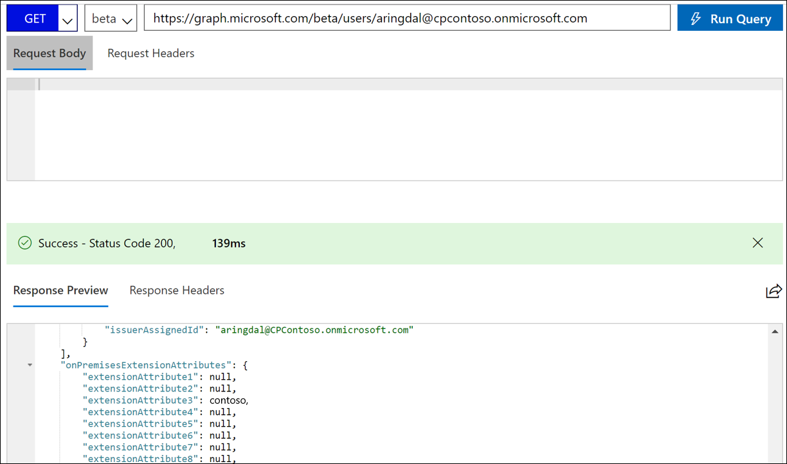

# Transformations

With a transformation, you can change the default behavior of how an attribute is synchronized with Microsoft Entra ID by using cloud sync.

To do this task, you need to edit the schema and then resubmit it via a web request.

For more information on cloud sync attributes, see [Understanding the Microsoft Entra schema](concept-attributes.md).


## Retrieve the schema
To retrieve the schema, follow the steps in [View the schema](concept-attributes.md#view-the-schema). 

## Custom attribute mapping
To add a custom attribute mapping, follow these steps.

1. Copy the schema into a text or code editor such as [Visual Studio Code](https://code.visualstudio.com/).
1. Locate the object that you want to update in the schema.

   </br>
1. Locate the code for `ExtensionAttribute3` under the user object.

    ```
                            {
                                "defaultValue": null,
                                "exportMissingReferences": false,
                                "flowBehavior": "FlowWhenChanged",
                                "flowType": "Always",
                                "matchingPriority": 0,
                                "targetAttributeName": "ExtensionAttribute3",
                                "source": {
                                    "expression": "Trim([extensionAttribute3])",
                                    "name": "Trim",
                                    "type": "Function",
                                    "parameters": [
                                        {
                                            "key": "source",
                                            "value": {
                                                "expression": "[extensionAttribute3]",
                                                "name": "extensionAttribute3",
                                                "type": "Attribute",
                                                "parameters": []
                                            }
                                        }
                                    ]
                                }
                            },
    ```
1. Edit the code so that the company attribute is mapped to `ExtensionAttribute3`.

   ```
                                    {
                                        "defaultValue": null,
                                        "exportMissingReferences": false,
                                        "flowBehavior": "FlowWhenChanged",
                                        "flowType": "Always",
                                        "matchingPriority": 0,
                                        "targetAttributeName": "ExtensionAttribute3",
                                        "source": {
                                            "expression": "Trim([company])",
                                            "name": "Trim",
                                            "type": "Function",
                                            "parameters": [
                                                {
                                                    "key": "source",
                                                    "value": {
                                                        "expression": "[company]",
                                                        "name": "company",
                                                        "type": "Attribute",
                                                        "parameters": []
                                                    }
                                                }
                                            ]
                                        }
                                    },
   ```
 1. Copy the schema back into Graph Explorer, change the **Request Type** to **PUT**, and select **Run Query**.

    

 1. Now, in the portal, go to the cloud sync configuration and select **Restart provisioning**.

    

 1. After a little while, verify the attributes are being populated by running the following query in Graph Explorer: `https://graph.microsoft.com/beta/users/{Azure AD user UPN}`.
 1. You should now see the value.

    

## Custom attribute mapping with function
For more advanced mapping, you can use functions that allow you to manipulate the data and create values for attributes to suit your organization's needs.

To do this task, follow the previous steps and then edit the function that's used to construct the final value.

For information on the syntax and examples of expressions, see [Writing expressions for attribute mappings in Microsoft Entra ID](reference-expressions.md).


## Next steps 

- [What is provisioning?](../what-is-provisioning.md)
- [What is Microsoft Entra Cloud Sync?](what-is-cloud-sync.md)
