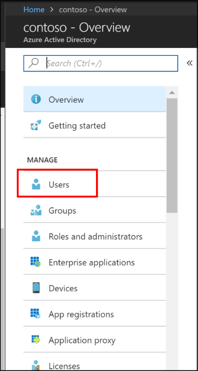

# Tutorial: Basic Active Directory environment

This tutorial walks you through creating a basic Active Directory environment. 


You can use the environment you create in the tutorial to test various aspects of hybrid identity scenarios and will be a prerequisite for some of the tutorials.  If you already have an existing Active Directory environment you can use that as a substitute.  This information is provided for individuals who may be starting from nothing.

This tutorial consists of
## Prerequisites
The following are prerequisites required for completing this tutorial
- A computer with [Hyper-V](/windows-server/virtualization/hyper-v/hyper-v-technology-overview) installed.  It's suggested to do this on either a [Windows 10](/virtualization/hyper-v-on-windows/about/supported-guest-os) or a [Windows Server 2016](/windows-server/virtualization/hyper-v/supported-windows-guest-operating-systems-for-hyper-v-on-windows) computer.
- An [external network adapter](/virtualization/hyper-v-on-windows/quick-start/connect-to-network) to allow the virtual machine to communicate with the internet.
- An [Azure subscription](https://azure.microsoft.com/free)
- A copy of Windows Server 2016
- [Microsoft .NET framework 4.7.1](https://dotnet.microsoft.com/download/dotnet-framework/net471)

> [!NOTE]
> This tutorial uses PowerShell scripts so that you can create the tutorial environment in the quickest amount of time.  Each of the scripts uses variables that are declared at the beginning of the scripts.  You can and should change the variables to reflect your environment.
>
>The scripts used create a general Active Directory environment prior to installing the Azure AD Connect cloud provisioning agent.  They are relevant for all of the tutorials.
>
> Copies of the PowerShell scripts that are used in this tutorial are available on GitHub [here](https://github.com/billmath/tutorial-phs).

## Create a virtual machine
The first thing that you need to do, in order to get our hybrid identity environment up and running is to create a virtual machine that will be used as our on-premises Active Directory server.  Do the following:

1. Open up the PowerShell ISE as Administrator.
2. Run the following script.

    ```powershell
    #Declare variables
    $VMName = 'DC1'
    $Switch = 'External'
    $InstallMedia = 'D:\ISO\en_windows_server_2016_updated_feb_2018_x64_dvd_11636692.iso'
    $Path = 'D:\VM'
    $VHDPath = 'D:\VM\DC1\DC1.vhdx'
    $VHDSize = '64424509440'

    #Create New Virtual Machine
    New-VM -Name $VMName -MemoryStartupBytes 16GB -BootDevice VHD -Path $Path -NewVHDPath $VHDPath -NewVHDSizeBytes $VHDSize  -Generation 2 -Switch $Switch  

    #Set the memory to be non-dynamic
    Set-VMMemory $VMName -DynamicMemoryEnabled $false

    #Add DVD Drive to Virtual Machine
    Add-VMDvdDrive -VMName $VMName -ControllerNumber 0 -ControllerLocation 1 -Path $InstallMedia

    #Mount Installation Media
    $DVDDrive = Get-VMDvdDrive -VMName $VMName

    #Configure Virtual Machine to Boot from DVD
    Set-VMFirmware -VMName $VMName -FirstBootDevice $DVDDrive 
    ```

## Complete the operating system deployment
In order to finish building the virtual machine, you need to finish the operating system installation.

1. Hyper-V Manager, double-click on the virtual machine
2. Click on the Start button.
3. You'll be prompted to ‘Press any key to boot from CD or DVD’. Go ahead and do so.
4. On the Windows Server start up screen select your language and click **Next**.
5. Click **Install Now**.
6. Enter your license key and click **Next**.
7. Check **I accept the license terms and click **Next**.
8. Select **Custom:  Install Windows Only (Advanced)**
9. Click **Next**
10. Once the installation has completed, restart the virtual machine, sign-in and run Windows updates to ensure the VM is the most up-to-date.  Install the latest updates.

## Install Active Directory prerequisites
Now that you have a virtual machine up, you need to do a few things prior to installing Active Directory.  That is, you need to rename the virtual machine, set a static IP address and DNS information, and install the Remote Server Administration tools.   Do the following:

1. Open up the PowerShell ISE as Administrator.
2. Run the following script.

    ```powershell
    #Declare variables
    $ipaddress = "10.0.1.117" 
    $ipprefix = "24" 
    $ipgw = "10.0.1.1" 
    $ipdns = "10.0.1.117"
    $ipdns2 = "8.8.8.8" 
    $ipif = (Get-NetAdapter).ifIndex 
    $featureLogPath = "c:\poshlog\featurelog.txt" 
    $newname = "DC1"
    $addsTools = "RSAT-AD-Tools" 

    #Set static IP address
    New-NetIPAddress -IPAddress $ipaddress -PrefixLength $ipprefix -InterfaceIndex $ipif -DefaultGateway $ipgw 

    # Set the DNS servers
    Set-DnsClientServerAddress -InterfaceIndex $ipif -ServerAddresses ($ipdns, $ipdns2)

    #Rename the computer 
    Rename-Computer -NewName $newname -force 

    #Install features 
    New-Item $featureLogPath -ItemType file -Force 
    Add-WindowsFeature $addsTools 
    Get-WindowsFeature | Where installed >>$featureLogPath 

    #Restart the computer 
    Restart-Computer
    ```

## Create a Windows Server AD environment
Now that you have the VM created and it has been renamed and has a static IP address, you can go ahead and install and configure Active Directory Domain Services.  Do the following:

1. Open up the PowerShell ISE as Administrator.
2. Run the following script.

    ```powershell
    #Declare variables
    $DatabasePath = "c:\windows\NTDS"
    $DomainMode = "WinThreshold"
    $DomainName = "contoso.com"
    $DomaninNetBIOSName = "CONTOSO"
    $ForestMode = "WinThreshold"
    $LogPath = "c:\windows\NTDS"
    $SysVolPath = "c:\windows\SYSVOL"
    $featureLogPath = "c:\poshlog\featurelog.txt" 
    $Password = "Pass1w0rd"
    $SecureString = ConvertTo-SecureString $Password -AsPlainText -Force

    #Install AD DS, DNS and GPMC 
    start-job -Name addFeature -ScriptBlock { 
    Add-WindowsFeature -Name "ad-domain-services" -IncludeAllSubFeature -IncludeManagementTools 
    Add-WindowsFeature -Name "dns" -IncludeAllSubFeature -IncludeManagementTools 
    Add-WindowsFeature -Name "gpmc" -IncludeAllSubFeature -IncludeManagementTools } 
    Wait-Job -Name addFeature 
    Get-WindowsFeature | Where installed >>$featureLogPath

    #Create New AD Forest
    Install-ADDSForest -CreateDnsDelegation:$false -DatabasePath $DatabasePath -DomainMode $DomainMode -DomainName $DomainName -SafeModeAdministratorPassword $SecureString -DomainNetbiosName $DomainNetBIOSName -ForestMode $ForestMode -InstallDns:$true -LogPath $LogPath -NoRebootOnCompletion:$false -SysvolPath $SysVolPath -Force:$true
    ```

## Create a Windows Server AD user
Now that you have our Active Directory environment, you need to a test account.  This account will be created in our on-premises AD environment and then synchronized to Azure AD.  Do the following:

1. Open up the PowerShell ISE as Administrator.
2. Run the following script.

    ```powershell
    # Filename:    4_CreateUser.ps1
    # Description: Creates a user in Active Directory.  This is part of
    #              the Azure AD Connect password hash sync tutorial.
    #
    # DISCLAIMER:
    # Copyright (c) Microsoft Corporation. All rights reserved. This 
    # script is made available to you without any express, implied or 
    # statutory warranty, not even the implied warranty of 
    # merchantability or fitness for a particular purpose, or the 
    # warranty of title or non-infringement. The entire risk of the 
    # use or the results from the use of this script remains with you.
    #
    #
    #
    #
    #Declare variables
    $Givenname = "Allie"
    $Surname = "McCray"
    $Displayname = "Allie McCray"
    $Name = "amccray"
    $Password = "Pass1w0rd"
    $Identity = "CN=ammccray,CN=Users,DC=contoso,DC=com"
    $SecureString = ConvertTo-SecureString $Password -AsPlainText -Force


    #Create the user
    New-ADUser -Name $Name -GivenName $Givenname -Surname $Surname -DisplayName $Displayname -AccountPassword $SecureString

    #Set the password to never expire
    Set-ADUser -Identity $Identity -PasswordNeverExpires $true -ChangePasswordAtLogon $false -Enabled $true
    ```


## Create an Azure AD tenant

[!INCLUDE [portal updates](~/articles/active-directory/includes/portal-update.md)]

Now you need to create an Azure AD tenant so that you can synchronize our users to the cloud.  To create a new Azure AD tenant, do the following.

1. Sign in to the [Azure portal](https://portal.azure.com) and sign in with an account that has an Azure subscription.
2. Select the **plus icon (+)** and search for **Azure Active Directory**.
3. Select **Azure Active Directory** in the search results.
4. Select **Create**.</br>
</br>
5. Provide a **name for the organization** along with the **initial domain name**. Then select **Create**. This will create your directory.
6. Once this has completed, click the **here** link, to manage the directory.

## Create a global administrator in Azure AD
Now that you have an Azure AD tenant, you'll create a global administrator account.  To create the global administrator account do the following.

1.  Under **Manage**, select **Users**.</br>
</br>
2.  Select **All users** and then select **+ New user**.
3.  Provide a name and username for this user. This will be your Global Administrator for the tenant. You'll also want to change the **Directory role** to **Global administrator.** You can also show the temporary password. When you're done, select **Create**.</br>
</br>
4. Once this has completed, open a new web browser and sign-in to myapps.microsoft.com using the new global administrator account and the temporary password.
5. Change the password for the global administrator to something that you'll remember.

## Optional:  Additional server and forest
The following is an optional section that provides steps to creating an additional server and or forest.  This can be used in some of the more advanced tutorials such as [Pilot for Azure AD Connect to cloud sync](tutorial-pilot-aadc-aadccp.md).

If you only need an additional server, you can stop after the - **Create the virtual machine** step and join the server to the existing domain that was created above.  

### Create a virtual machine

1. Open up the PowerShell ISE as Administrator.
2. Run the following script.

    ```powershell
    # Filename:    1_CreateVM_CP.ps1
    # Description: Creates a VM to be used in the tutorial.
    #
    # DISCLAIMER:
    # Copyright (c) Microsoft Corporation. All rights reserved. #This script is made available to you without any express, implied or statutory warranty, not even the implied warranty of merchantability or fitness for a particular purpose, or the warranty of title or non-infringement. The entire risk of the use or the results from the use of this script remains with you.
    #
    #
    #
    #
    #Declare variables
    $VMName = 'CP1'
    $Switch = 'External'
    $InstallMedia = 'D:\ISO\en_windows_server_2016_updated_feb_2018_x64_dvd_11636692.iso'
    $Path = 'D:\VM'
    $VHDPath = 'D:\VM\CP1\CP1.vhdx'
    $VHDSize = '64424509440'

    #Create New Virtual Machine
    New-VM -Name $VMName -MemoryStartupBytes 16GB -BootDevice VHD -Path $Path -NewVHDPath $VHDPath -NewVHDSizeBytes $VHDSize  -Generation 2 -Switch $Switch  

    #Set the memory to be non-dynamic
    Set-VMMemory $VMName -DynamicMemoryEnabled $false

    #Add DVD Drive to Virtual Machine
    Add-VMDvdDrive -VMName $VMName -ControllerNumber 0 -ControllerLocation 1 -Path $InstallMedia

    #Mount Installation Media
    $DVDDrive = Get-VMDvdDrive -VMName $VMName

    #Configure Virtual Machine to Boot from DVD
    Set-VMFirmware -VMName $VMName -FirstBootDevice $DVDDrive
    ```

### Complete the operating system deployment
In order to finish building the virtual machine, you need to finish the operating system installation.

1. Hyper-V Manager, double-click on the virtual machine
2. Click on the Start button.
3. You'll be prompted to ‘Press any key to boot from CD or DVD’. Go ahead and do so.
4. On the Windows Server start up screen select your language and click **Next**.
5. Click **Install Now**.
6. Enter your license key and click **Next**.
7. Check **I accept the license terms and click **Next**.
8. Select **Custom:  Install Windows Only (Advanced)**
9. Click **Next**
10. Once the installation has completed, restart the virtual machine, sign-in and run Windows updates to ensure the VM is the most up-to-date.  Install the latest updates.

### Install Active Directory prerequisites
Now that you have a virtual machine up, you need to do a few things prior to installing Active Directory.  That is, you need to rename the virtual machine, set a static IP address and DNS information, and install the Remote Server Administration tools.   Do the following:

1. Open up the PowerShell ISE as Administrator.
2. Run the following script.

    ```powershell
    # Filename:    2_ADPrep_CP.ps1
    # Description: Prepares your environment for Active Directory.  This is part of
    #              the Azure AD Connect password hash sync tutorial.
    #
    # DISCLAIMER:
    # Copyright (c) Microsoft Corporation. All rights reserved. This 
    # script is made available to you without any express, implied or 
    # statutory warranty, not even the implied warranty of 
    # merchantability or fitness for a particular purpose, or the 
    # warranty of title or non-infringement. The entire risk of the 
    # use or the results from the use of this script remains with you.
    #
    #
    #
    #
    #Declare variables
    $ipaddress = "10.0.1.118" 
    $ipprefix = "24" 
    $ipgw = "10.0.1.1" 
    $ipdns = "10.0.1.118"
    $ipdns2 = "8.8.8.8" 
    $ipif = (Get-NetAdapter).ifIndex 
    $featureLogPath = "c:\poshlog\featurelog.txt" 
    $newname = "CP1"
    $addsTools = "RSAT-AD-Tools" 

    #Set static IP address
    New-NetIPAddress -IPAddress $ipaddress -PrefixLength $ipprefix -InterfaceIndex $ipif -DefaultGateway $ipgw 

    #Set the DNS servers
    Set-DnsClientServerAddress -InterfaceIndex $ipif -ServerAddresses ($ipdns, $ipdns2)

    #Rename the computer 
    Rename-Computer -NewName $newname -force 

    #Install features 
    New-Item $featureLogPath -ItemType file -Force 
    Add-WindowsFeature $addsTools 
    Get-WindowsFeature | Where installed >>$featureLogPath 

    #Restart the computer 
    Restart-Computer
    ```
### Create a Windows Server AD environment
Now that you have the VM created and it has been renamed and has a static IP address, you can go ahead and install and configure Active Directory Domain Services.  Do the following:

1. Open up the PowerShell ISE as Administrator.
2. Run the following script.

    ```powershell
    # Filename:    3_InstallAD_CP.ps1
    # Description: Creates an on-premises AD environment.  This is part of
    #              the Azure AD Connect password hash sync tutorial.
    #
    # DISCLAIMER:
    # Copyright (c) Microsoft Corporation. All rights reserved. This 
    # script is made available to you without any express, implied or 
    # statutory warranty, not even the implied warranty of 
    # merchantability or fitness for a particular purpose, or the 
    # warranty of title or non-infringement. The entire risk of the 
    # use or the results from the use of this script remains with you.
    #
    #
    #
    #
    #Declare variables
    $DatabasePath = "c:\windows\NTDS"
    $DomainMode = "WinThreshold"
    $DomainName = "fabrikam.com"
    $DomaninNetBIOSName = "FABRIKAM"
    $ForestMode = "WinThreshold"
    $LogPath = "c:\windows\NTDS"
    $SysVolPath = "c:\windows\SYSVOL"
    $featureLogPath = "c:\poshlog\featurelog.txt" 
    $Password = "Pass1w0rd"
    $SecureString = ConvertTo-SecureString $Password -AsPlainText -Force

    #Install AD DS, DNS and GPMC 
    start-job -Name addFeature -ScriptBlock { 
    Add-WindowsFeature -Name "ad-domain-services" -IncludeAllSubFeature -IncludeManagementTools 
    Add-WindowsFeature -Name "dns" -IncludeAllSubFeature -IncludeManagementTools 
    Add-WindowsFeature -Name "gpmc" -IncludeAllSubFeature -IncludeManagementTools } 
    Wait-Job -Name addFeature 
    Get-WindowsFeature | Where installed >>$featureLogPath

    #Create New AD Forest
    Install-ADDSForest -CreateDnsDelegation:$false -DatabasePath $DatabasePath -DomainMode $DomainMode -DomainName $DomainName -SafeModeAdministratorPassword $SecureString -DomainNetbiosName $DomainNetBIOSName -ForestMode $ForestMode -InstallDns:$true -LogPath $LogPath -NoRebootOnCompletion:$false -SysvolPath $SysVolPath -Force:$true
    ```

### Create a Windows Server AD user
Now that you have our Active Directory environment, you need to a test account.  This account will be created in our on-premises AD environment and then synchronized to Azure AD.  Do the following:

1. Open up the PowerShell ISE as Administrator.
2. Run the following script.

    ```powershell 
    # Filename:    4_CreateUser_CP.ps1
    # Description: Creates a user in Active Directory.  This is part of
    #              the Azure AD Connect password hash sync tutorial.
    #
    # DISCLAIMER:
    # Copyright (c) Microsoft Corporation. All rights reserved. This 
    # script is made available to you without any express, implied or 
    # statutory warranty, not even the implied warranty of 
    # merchantability or fitness for a particular purpose, or the 
    # warranty of title or non-infringement. The entire risk of the 
    # use or the results from the use of this script remains with you.
    #
    #
    #
    #
    #Declare variables
    $Givenname = "Anna"
    $Surname = "Ringdal"
    $Displayname = "Anna Ringdal"
    $Name = "aringdal"
    $Password = "Pass1w0rd"
    $Identity = "CN=aringdal,CN=Users,DC=fabrikam,DC=com"
    $SecureString = ConvertTo-SecureString $Password -AsPlainText -Force


    #Create the user
    New-ADUser -Name $Name -GivenName $Givenname -Surname $Surname -DisplayName $Displayname -AccountPassword $SecureString

    #Set the password to never expire
    Set-ADUser -Identity $Identity -PasswordNeverExpires $true -ChangePasswordAtLogon $false -Enabled $true
    ```

## Conclusion
Now you have an environment that can be used for existing tutorials and to test additional features cloud sync provides.

## Next steps 

- [What is provisioning?](../what-is-provisioning.md)
- [What is Azure AD Connect cloud sync?](what-is-cloud-sync.md)
