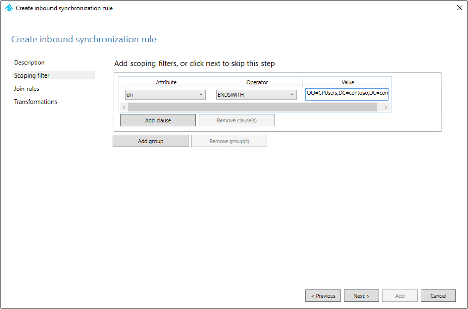
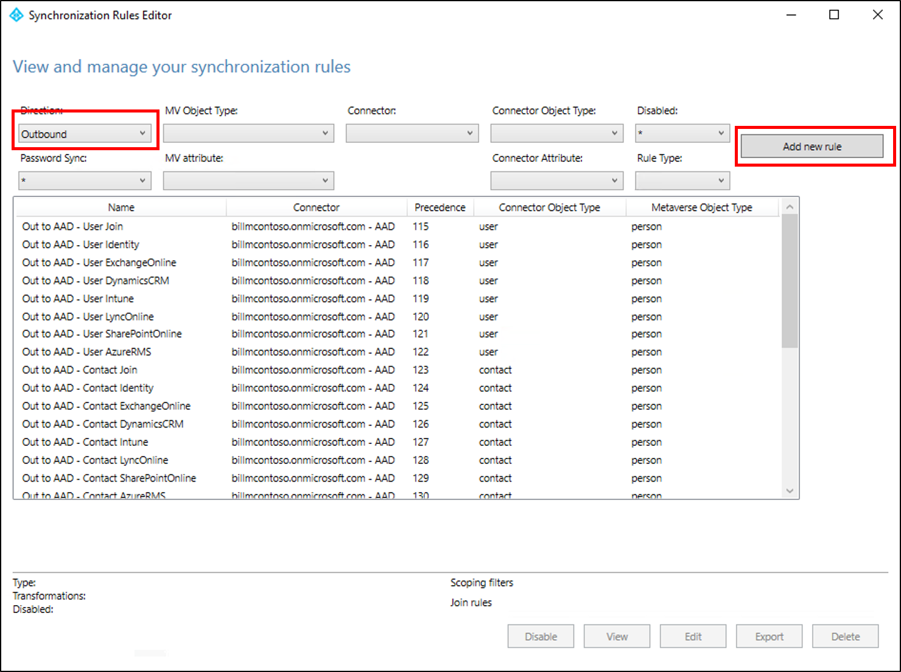
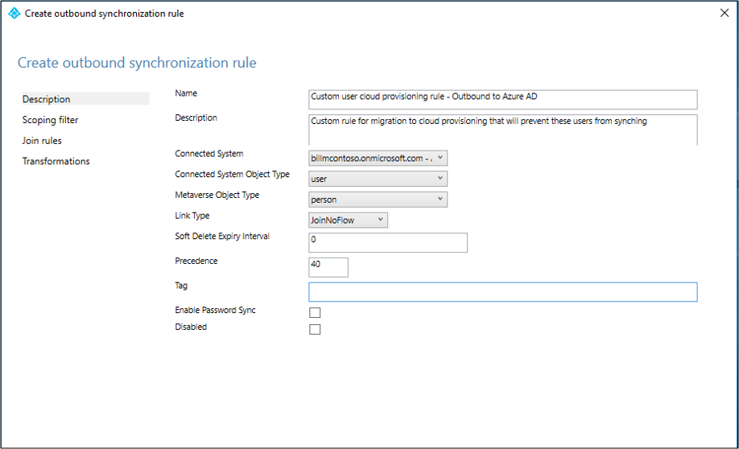
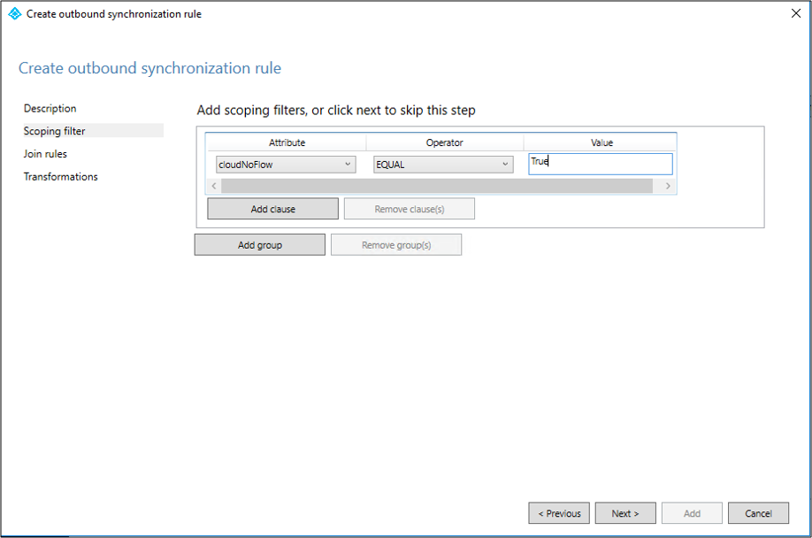

# Migrate to Microsoft Entra Cloud Sync for an existing synced AD forest

This tutorial walks you through how you would migrate to cloud sync for a test Active Directory forest that is already synced using Microsoft Entra Connect Sync.  

> [!NOTE]
> This article provides information for a basic migration and you should review the [Migrating to cloud sync](migrate-azure-ad-connect-to-cloud-sync.md) documentation before attempting to migrate your production environment.

## Considerations

Before you try this tutorial, consider the following items:

 1. Ensure that you're familiar with basics of cloud sync.
 2. Ensure that you're running Microsoft Entra Connect Sync version 1.4.32.0 or later and have configured the sync rules as documented.
 3. When piloting, you'll be removing a test OU or group from Microsoft Entra Connect Sync scope. Moving objects out of scope leads to deletion of those objects in Microsoft Entra ID.  

    - User objects, the objects in Microsoft Entra ID are soft-deleted and can be restored. 
    - Group objects, the objects in Microsoft Entra ID are hard-deleted and can't be restored. 
 
     A new link type has been introduced in Microsoft Entra Connect Sync, which will prevent the deletion in a piloting scenario.

 4. Ensure that the objects in the pilot scope have ms-ds-consistencyGUID populated so cloud sync hard matches the objects.

   > [!NOTE]
   > Microsoft Entra Connect Sync does not populate *ms-ds-consistencyGUID* by default for group objects.

 5. This configuration is for advanced scenarios. Ensure that you follow the steps documented in this tutorial precisely.

## Prerequisites

The following are prerequisites required for completing this tutorial

- A test environment with Microsoft Entra Connect Sync version 1.4.32.0 or later
- An OU or group that is in scope of sync and can be used the pilot. We recommend starting with a small set of objects.
- A server running Windows Server 2016 or later that will host the provisioning agent.
- Source anchor for Microsoft Entra Connect Sync should be either *objectGuid* or *ms-ds-consistencyGUID*

## Update Microsoft Entra Connect

As a minimum, you should have [Microsoft Entra Connect](https://www.microsoft.com/download/details.aspx?id=47594) 1.4.32.0. To update Microsoft Entra Connect Sync, complete the steps in [Microsoft Entra Connect: Upgrade to the latest version](../connect/how-to-upgrade-previous-version.md).  

## Back up your Microsoft Entra Connect configuration
Before making any changes, you should back up your Microsoft Entra Connect configuration.  This way, you can roll back to your previous configuration.  See [Import and export Microsoft Entra Connect configuration settings](../connect/how-to-connect-import-export-config.md) for more information.

## Stop the scheduler

Microsoft Entra Connect Sync synchronizes changes occurring in your on-premises directory using a scheduler. In order to modify and add custom rules, you want to disable the scheduler so that synchronizations won't run while you're working making the changes. To stop the scheduler, use the following steps:

1. On the server that is running Microsoft Entra Connect Sync open PowerShell with Administrative Privileges.
2. Run `Stop-ADSyncSyncCycle`.  Hit Enter.
3. Run `Set-ADSyncScheduler -SyncCycleEnabled $false`.

>[!NOTE]
>If you are running your own custom scheduler for Microsoft Entra Connect Sync, then please disable the scheduler.

## Create custom user inbound rule
In the Microsoft Entra Connect Synchronization Rules editor, you need to create an inbound sync rule that filters out users in the OU you identified previously.  The inbound sync rule is a join rule with a target attribute of cloudNoFlow.  This rule tells Microsoft Entra Connect not to synchronize attributes for these users.  For more information, see [Migrating to cloud sync](migrate-azure-ad-connect-to-cloud-sync.md) documentation before attempting to migrate your production environment.

 1. Launch the synchronization editor from the application menu in desktop as shown below:
 
     

 2. Select **Inbound** from the drop-down list for Direction and select **Add new rule**.

     

 3. On the **Description** page, enter the following and select **Next**:

    - **Name:** Give the rule a meaningful name
    - **Description:** Add a meaningful description
    - **Connected System:** Choose the AD connector that you're writing the custom sync rule for
    - **Connected System Object Type:** User
    - **Metaverse Object Type:** Person
    - **Link Type:** Join
    - **Precedence:** Provide a value that is unique in the system
    - **Tag:** Leave this empty

    

 4. On the **Scoping filter** page, enter the OU or security group that you want the pilot based off.  To filter on OU, add the OU portion of the distinguished name. This rule will be applied to all users who are in that OU. So, if DN ends with "OU=CPUsers,DC=contoso,DC=com, you would add this filter.  Then select **Next**.

    |Rule|Attribute|Operator|Value|
    |-----|----|----|-----|
    |Scoping OU|DN|ENDSWITH|Distinguished name of the OU.|
    |Scoping group||ISMEMBEROF|Distinguished name of the security group.|

    

 5. On the **Join** rules page, select **Next**.
 6. On the **Transformations** page, add a Constant transformation: flow True to cloudNoFlow attribute. Select **Add**.

     

Same steps need to be followed for all object types (user, group and contact). Repeat steps per configured AD Connector / per AD forest.

## Create custom user outbound rule
You'll also need an outbound sync rule with a link type of JoinNoFlow and the scoping filter that has the cloudNoFlow attribute set to True.  This rule tells Microsoft Entra Connect not to synchronize attributes for these users. For more information, see [Migrating to cloud sync](migrate-azure-ad-connect-to-cloud-sync.md) documentation before attempting to migrate your production environment.

 1. Select **Outbound** from the drop-down list for Direction and select **Add rule**.

     

 2. On the **Description** page, enter the following and select **Next**:

    - **Name:** Give the rule a meaningful name
    - **Description:** Add a meaningful description
    - **Connected System:** Choose the Microsoft Entra connector that you're writing the custom sync rule for
    - **Connected System Object Type:** User
    - **Metaverse Object Type:** Person
    - **Link Type:** JoinNoFlow
    - **Precedence:** Provide a value that is unique in the system 
    - **Tag:** Leave this empty

    

 3. On the **Scoping filter** page, choose **cloudNoFlow** equal **True**. Then select **Next**.

     

 4. On the **Join** rules page, select **Next**.
 5. On the **Transformations** page, select **Add**.

Same steps need to be followed for all object types (user, group and contact).

## Install the Microsoft Entra Provisioning Agent

If you're using the  [Basic AD and Azure environment](tutorial-basic-ad-azure.md) tutorial, it would be CP1. To install the agent, follow these steps: 

[!INCLUDE [active-directory-cloud-sync-how-to-install](../../../../includes/active-directory-cloud-sync-how-to-install.md)]

## Verify agent installation

[!INCLUDE [active-directory-cloud-sync-how-to-verify-installation](../../../../includes/active-directory-cloud-sync-how-to-verify-installation.md)]

## Configure Microsoft Entra Cloud Sync

Use the following steps to configure provisioning:

 [!INCLUDE [sign in](../../../../includes/cloud-sync-sign-in.md)] 
 3. Select **New configuration**.
 :::image type="content" source="media/how-to-configure/new-ux-configure-1.png" alt-text="Screenshot of adding a configuration." lightbox="media/how-to-configure/new-ux-configure-1.png":::
 4. On the configuration screen, select your domain and whether to enable password hash sync.  Click **Create**.  
 
 :::image type="content" source="media/how-to-configure/new-ux-configure-2.png" alt-text="Screenshot of a new configuration." lightbox="media/how-to-configure/new-ux-configure-2.png":::

 5.  The **Get started** screen will open.  

  :::image type="content" source="media/how-to-configure/new-ux-configure-3.png" alt-text="Screenshot of the getting started screen." lightbox="media/how-to-configure/new-ux-configure-3.png":::

 6.  On the **Get started** screen, click either **Add scoping filters** next to the **Add scoping filters** icon or on the click **Scoping filters** on the left under **Manage**.

   :::image type="content" source="media/how-to-configure/new-ux-configure-5.png" alt-text="Screenshot of scoping filters." lightbox="media/how-to-configure/new-ux-configure-5.png":::
 
 7. Select the scoping filter. For this tutorial select:
     - **Selected organizational units**: Scopes the configuration to apply to specific OUs. 
 8. In the box, enter "OU=CPUsers,DC=contoso,DC=com".
 
   :::image type="content" source="media/tutorial-migrate-aadc-aadccp/configure-1.png" alt-text="Screenshot of the scoping filter." lightbox="media/tutorial-migrate-aadc-aadccp/configure-1.png":::
 
 9.  Click **Add**. Click **Save**.

 

## Start the scheduler

Microsoft Entra Connect Sync synchronizes changes occurring in your on-premises directory using a scheduler. Now that you've modified the rules, you can restart the scheduler.  Use the following steps:

1. On the server that is running Microsoft Entra Connect Sync open PowerShell with Administrative Privileges
2. Run `Set-ADSyncScheduler -SyncCycleEnabled $true`.
3. Run `Start-ADSyncSyncCycle`, then press <kbd>Enter</kbd>.

> [!NOTE]
> If you are running your own custom scheduler for Microsoft Entra Connect Sync, then please enable the scheduler.

Once the scheduler is enabled, Microsoft Entra Connect will stop exporting any changes on objects with `cloudNoFlow=true` in the metaverse, unless any reference attribute (such as `manager`) is being updated. In case there's any reference attribute update on the object, Microsoft Entra Connect will ignore the `cloudNoFlow` signal and export all updates on the object.

## Something went wrong

In case the pilot doesn't work as expected, you can go back to the Microsoft Entra Connect Sync setup by following the steps below:

1. Disable provisioning configuration in the portal.
2. Disable all the custom sync rules created for Cloud Provisioning using the Sync Rule Editor tool. Disabling should cause full sync on all the connectors.

## Next steps

- [What is provisioning?](../what-is-provisioning.md)
- [What is Microsoft Entra Cloud Sync?](what-is-cloud-sync.md)
