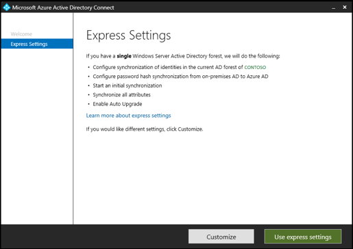
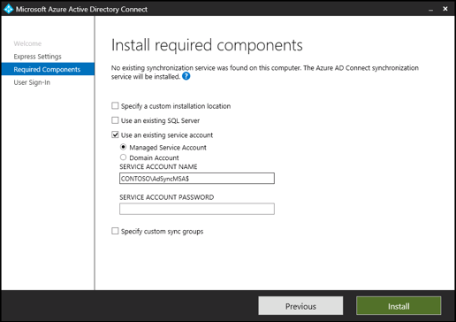

# ADSync service account
Azure AD Connect installs an on-premises service which orchestrates synchronization between Active Directory and Azure Active Directory.  The Microsoft Azure AD Sync synchronization service (ADSync) runs on a server in your on-premises environment.  The credentials for the service are set by default in the Express installations but may be customized to meet your organizational security requirements.  These credentials are not used to connect to your on-premises forests or Azure Active Directory.

Choosing the ADSync service account is an important planning decision to make prior to installing Azure AD Connect.  Any attempt to change the credentials after installation will result in the service failing to start, losing access to the synchronization database, and failing to authenticate with your connected directories (Azure and AD DS).  No synchronization will occur until the original credentials are restored.

## The default ADSync service account

When run on a member server, the AdSync service runs in the context of a Virtual Service Account (VSA).  Due to a product limitation, a custom service account is created when installed on a domain controller.  If the Express settings service account does not meet your organizational security requirements, deploy Azure AD Connect by choosing the Customize option.  Then choose the service account option which meets your organization’s requirements.

>[!NOTE]
>The default service account when installed on a domain controller is of the form Domain\AAD_InstallationIdentifier.  The password for this account is randomly generated and presents significant challenges for recovery and password rotation.  Microsoft recommends customizing the service account during initial installation on a domain controller to use either a standalone or group Managed Service Account (sMSA / gMSA)

|Azure AD Connect location|Service account created|
|-----|-----|
|Member Server|NT SERVICE\ADSync|
|Domain Controller|Domain\AAD_74dc30c01e80 (see note)|

## Custom ADSync service accounts
Microsoft recommends running the ADSync service in the context of either a Virtual Service Account or a standalone or group Managed Service Account.  Your domain administrator may also choose to create a service account provisioned to meet your specific organizational security requirements.   To customize the service account used during installation, choose the Customize option on the Express Settings page below.   The following options are available:

- default account – Azure AD Connect will provision the service account as described above
- managed service account – use a standalone or group MSA provisioned by your administrator
- domain account – use a domain service account provisioned by your administrator





## Diagnosing ADSync service account changes
Changing the credentials for the ADSync service after installation will result in the service failing to start, losing access to the synchronization database, and failing to authenticate with your connected directories (Azure and AD DS).  Granting database access to the new ADSync service account is insufficient to recover from this issue. No synchronization will occur until the original credentials are restored.

The ADSync service will issue an error level message to the event log when it is unable to start.  The content of the message will vary depending on whether the built-in database (localdb) or full SQL is in use.  The following are examples of the event log entries that may be present.

### Example 1

The AdSync service encryption keys could not be found and have been recreated.  Synchronization will not occur until this issue is corrected.

Troubleshooting this Issue
The Microsoft Azure AD Sync encryption keys will become inaccessible if the AdSync service Log On credentials are changed.  If the credentials have been changed, use the Services application to change the Log On account back to its originally configured value (ex. NT SERVICE\AdSync) and restart the service.  This will immediately restore correct operation of the AdSync service.

Please see the following [article](https://go.microsoft.com/fwlink/?linkid=2086764) for further information.

### Example 2

The service was unable to start because a connection to the local database (localdb)
could not be established.

Troubleshooting this Issue
The Microsoft Azure AD Sync service will lose permission to access the local database provider if the AdSync service Log On credentials are changed.  If the credentials have been changed use the Services application to change the Log On account back to its originally configured value (ex. NT SERVICE\AdSync) and restart the service.  This will immediately restore correct operation of the AdSync service.

Please see the following [article](https://go.microsoft.com/fwlink/?linkid=2086764) for further information.

Additional Details
The following error information was returned by the provider:
 

``` 
OriginalError=0x80004005 OLEDB Provider error(s): 
Description  = 'Login timeout expired'
Failure Code = 0x80004005
Minor Number = 0 
Description  = 'A network-related or instance-specific error has occurred while establishing a connection to SQL Server. Server is not found or not accessible. Check if instance name is correct and if SQL Server is configured to allow remote connections. For more information see SQL Server Books Online.'
```
## Next steps
Learn more about [Integrating your on-premises identities with Azure Active Directory](whatis-hybrid-identity.md).
