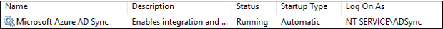
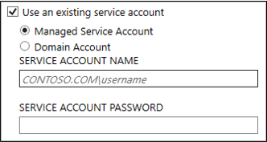

# ADSync service account
Azure AD Connect installs an on-premises service which orchestrates synchronization between Active Directory and Azure Active Directory.  The Microsoft Azure AD Sync synchronization service (ADSync) runs on a server in your on-premises environment.  The credentials for the service are set by default in the Express installations but may be customized to meet your organizational security requirements.  These credentials are not used to connect to your on-premises forests or Azure Active Directory.

Choosing the ADSync service account is an important planning decision to make prior to installing Azure AD Connect.  Any attempt to change the credentials after installation will result in the service failing to start, losing access to the synchronization database, and failing to authenticate with your connected directories (Azure and AD DS).  No synchronization will occur until the original credentials are restored.

The sync service can run under different accounts. It can run under a Virtual Service Account (VSA), a Managed Service Account (gMSA/sMSA), or a regular User Account. The supported options were changed with the 2017 April release and 2021 March release of Azure AD Connect when you do a fresh installation. If you upgrade from an earlier release of Azure AD Connect, these additional options are not available. 

|Type of account|Installation option|Description| 
|-----|------|-----|
|Virtual Service Account|Express and custom, 2017 April and later| A Virtual Service Account is used for all express installations, except for installations on a Domain Controller. When using custom installation, it is the default option unless another option is used.| 
|Managed Service Account|Custom, 2017 April and later|If you use a remote SQL Server, then we recommend using a group Managed Service Account. |
|Managed Service Account|Express and custom, 2021 March and later|A standalone Managed Service Account prefixed with ADSyncMSA_ is created during installation for express installations when installed on a Domain Controller. When using custom installation, it is the default option unless another option is used.|
|User Account|Express and custom, 2017 April to 2021 March|A User Account prefixed with AAD_ is created during installation for express installations when installed on a Domain Controller. When using custom installation, it is the default option unless another option is used.|
|User Account|Express and custom, 2017 March and earlier|A User Account prefixed with AAD_ is created during installation for express installations. When using custom installation, another account can be specified.| 

>[!IMPORTANT]
> If you use Connect with a build from 2017 March or earlier, then you should not reset the password on the service account since Windows destroys the encryption keys for security reasons. You cannot change the account to any other account without reinstalling Azure AD Connect. If you upgrade to a build from 2017 April or later, then it is supported to change the password on the service account, but you cannot change the account used. 

> [!IMPORTANT]
> You can only set the service account on first installation. It is not supported to change the service account after the installation has been completed. If you need to change the service account password, this is supported and instructions can be found [here](how-to-connect-sync-change-serviceacct-pass.md).

The following is a table of the default, recommended, and supported options for the sync service account. 

Legend: 

- **Bold** indicates the default option and, in most cases, the recommended option. 
- *Italic* indicates the recommended option when it is not the default option. 
- Non-bold - Supported option 
- Local account - Local user account on the server 
- Domain account - Domain user account 
- sMSA - [standalone Managed Service account](https://docs.microsoft.com/previous-versions/windows/it-pro/windows-server-2008-R2-and-2008/dd548356(v=ws.10))
- gMSA - [group Managed Service account](https://docs.microsoft.com/previous-versions/windows/it-pro/windows-server-2012-R2-and-2012/hh831782(v=ws.11)) 

 ||**LocalDB  Express**|**LocalDB/LocalSQL  Custom**|**Remote SQL  Custom**|
|-----|-----|-----|-----|
|**domain-joined machine**|**VSA**|**VSA**  *sMSA*  *gMSA*  Local account  Domain account| *gMSA*  Domain account|
|Domain Controller| **sMSA**|**sMSA**  *gMSA*  Domain account|*gMSA* Domain account| 

## Virtual Service Account 

A Virtual Service Account is a special type of managed local account that does not have a password and is automatically managed by Windows. 

 

The Virtual Service Account is intended to be used with scenarios where the sync engine and SQL are on the same server. If you use remote SQL, then we recommend using a group Managed Service Account instead. 

The Virtual Service Account cannot be used on a Domain Controller due to [Windows Data Protection API (DPAPI)](https://msdn.microsoft.com/library/ms995355.aspx) issues. 

## Managed Service Account 

If you use a remote SQL Server, then we recommend to using a group Managed Service Account. For more information on how to prepare your Active Directory for group Managed Service account, see [Group Managed Service Accounts Overview](https://docs.microsoft.com/previous-versions/windows/it-pro/windows-server-2012-R2-and-2012/hh831782(v=ws.11)). 

To use this option, on the [Install required components](how-to-connect-install-custom.md#install-required-components) page, select **Use an existing service account**, and select **Managed Service Account**. 

 

It is also supported to use a standalone managed service account. However, these can only be used on the local machine and there is no benefit to using them over the default Virtual Service Account. 

### Auto-generated standalone Managed Service Account 

If you install Azure AD Connect on a Domain Controller, a standalone Managed Service Account is created by the installation wizard (unless you specify the account to use in custom settings). The account is prefixed **ADSyncMSA_** and used for the actual sync service to run as. 

This account is a managed domain account that does not have a password and is automatically managed by Windows. 

This account is intended to be used with scenarios where the sync engine and SQL are on the Domain Controller. 

## User Account 

A local service account is created by the installation wizard (unless you specify the account to use in custom settings). The account is prefixed AAD_ and used for the actual sync service to run as. If you install Azure AD Connect on a Domain Controller, the account is created in the domain. The AAD_ service account must be located in the domain if: 
- you use a remote server running SQL Server 
- you use a proxy that requires authentication 

 

The account is created with a long complex password that does not expire. 

This account is used to store passwords for the other accounts in a secure way. These other accounts passwords are stored encrypted in the database. The private keys for the encryption keys are protected with the cryptographic services secret-key encryption using Windows Data Protection API (DPAPI). 

If you use a full SQL Server, then the service account is the DBO of the created database for the sync engine. The service will not function as intended with any other permission. A SQL login is also created. 

The account is also granted permission to files, registry keys, and other objects related to the Sync Engine. 

## Next steps
Learn more about [Integrating your on-premises identities with Azure Active Directory](whatis-hybrid-identity.md).
