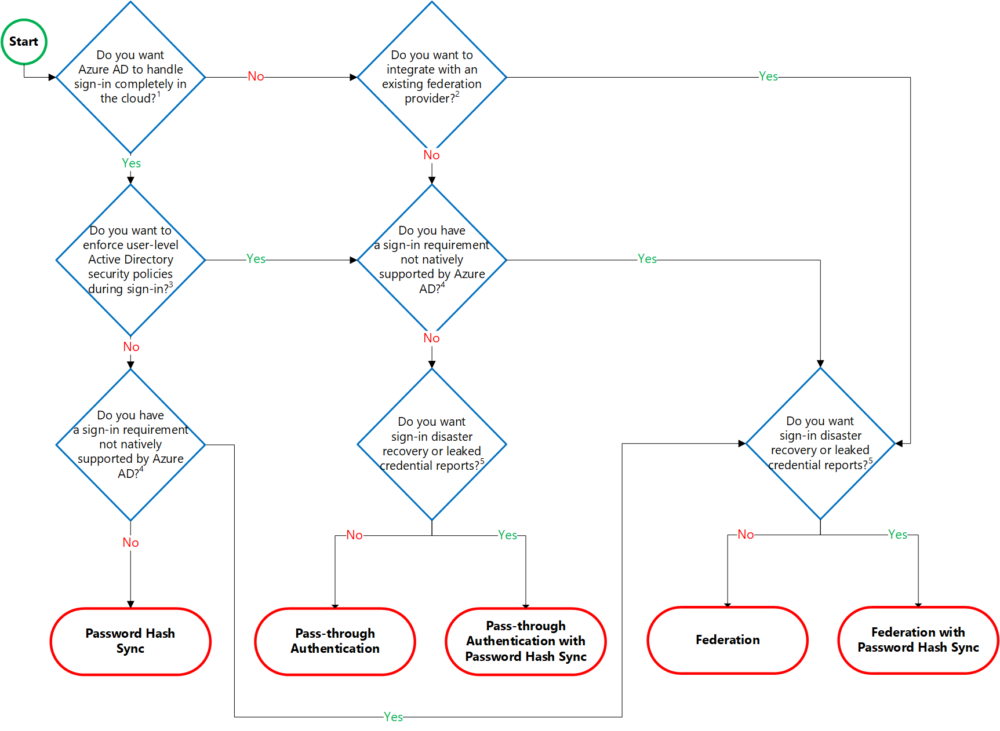
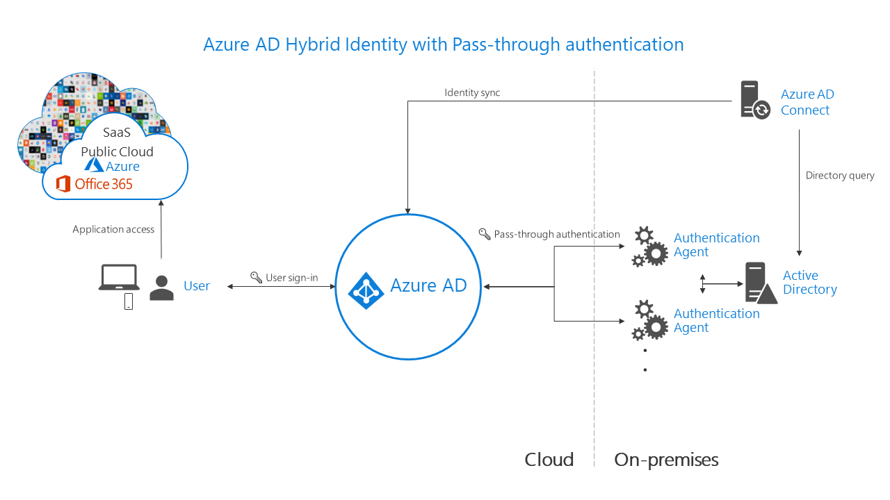

# Choose the right authentication method for your Azure Active Directory hybrid identity solution

Choosing the correct authentication method is the first concern for organizations wanting to move their apps to the cloud. Don't take this decision lightly, for the following reasons:

1. It's the first decision for an organization that wants to move to the cloud.

2. The authentication method is a critical component of an organization's presence in the cloud. It controls access to all cloud data and resources.

3. It's the foundation of all the other advanced security and user experience features in Azure AD.

Identity is the new control plane of IT security, so authentication is an organization's access guard to the new cloud world. Organizations need an identity control plane that strengthens their security and keeps their cloud apps safe from intruders.

> [!NOTE]
> Changing your authentication method requires planning, testing, and potentially downtime. [Staged rollout](./how-to-connect-staged-rollout.md) is a great way to test users' migration from federation to cloud authentication.

### Out of scope
Organizations that don't have an existing on-premises directory footprint aren't the focus of this article. Typically, those businesses create identities only in the cloud, which doesn't require a hybrid identity solution. Cloud-only identities exist solely in the cloud and aren't associated with corresponding on-premises identities.

## Authentication methods
When the Azure AD hybrid identity solution is your new control plane, authentication is the foundation of cloud access. Choosing the correct authentication method is a crucial first decision in setting up an Azure AD hybrid identity solution. The authentication method you choose, is configured by using Azure AD Connect, which also provisions users in the cloud.

To choose an authentication method, you need to consider the time, existing infrastructure, complexity, and cost of implementing your choice. These factors are different for every organization and might change over time.

>[!VIDEO https://www.youtube.com/embed/YtW2cmVqSEw]

Azure AD supports the following authentication methods for hybrid identity solutions.

### Cloud authentication
When you choose this authentication method, Azure AD handles users' sign-in process. Coupled with single sign-on (SSO), users can sign in to cloud apps without having to reenter their credentials. With cloud authentication, you can choose from two options:

**Azure AD password hash synchronization**. The simplest way to enable authentication for on-premises directory objects in Azure AD. Users can use the same username and password that they use on-premises without having to deploy any other infrastructure. Some premium features of Azure AD, like Identity Protection and [Azure AD Domain Services](../../../active-directory-domain-services/tutorial-create-instance.md), require password hash synchronization, no matter which authentication method you choose.

> [!NOTE]
> Passwords are never stored in clear text or encrypted with a reversible algorithm in Azure AD. For more information on the actual process of password hash synchronization, see [Implement password hash synchronization with Azure AD Connect sync](how-to-connect-password-hash-synchronization.md).

**Azure AD Pass-through Authentication**. Provides a simple password validation for Azure AD authentication services by using a software agent that runs on one or more on-premises servers. The servers validate the users directly with your on-premises Active Directory, which ensures that the password validation doesn't happen in the cloud.

Companies with a security requirement to immediately enforce on-premises user account states, password policies, and sign-in hours might use this authentication method. For more information on the actual pass-through authentication process, see [User sign-in with Azure AD pass-through authentication](how-to-connect-pta.md).

### Federated authentication
When you choose this authentication method, Azure AD hands off the authentication process to a separate trusted authentication system, such as on-premises Active Directory Federation Services (AD FS), to validate the user's password.

The authentication system can provide other advanced authentication requirements, for example, third-party multifactor authentication.

The following section helps you decide which authentication method is right for you by using a decision tree. It helps you determine whether to deploy cloud or federated authentication for your Azure AD hybrid identity solution.

## Decision tree

Details on decision questions:

1. Azure AD can handle sign-in for users without relying on on-premises components to verify passwords.
2. Azure AD can hand off user sign-in to a trusted authentication provider such as Microsoft's AD FS.
3. If you need to apply, user-level Active Directory security policies such as account expired, disabled account, password expired, account locked out, and sign-in hours on each user sign-in, Azure AD requires some on-premises components.
4. Sign-in features not natively supported by Azure AD:
   * Sign-in using third-party authentication solution.
   * Multi-site on-premises authentication solution.
5. Azure AD Identity Protection requires Password Hash Sync regardless of which sign-in method you choose, to provide the *Users with leaked credentials* report. Organizations can fail over to Password Hash Sync if their primary sign-in method fails and it was configured before the failure event.

> [!NOTE]
> Azure AD Identity Protection require [Azure AD Premium P2](https://www.microsoft.com/security/business/identity-access-management/azure-ad-pricing) licenses.

## Detailed considerations

### Cloud authentication: Password hash synchronization

* **Effort**. Password hash synchronization requires the least effort regarding deployment, maintenance, and infrastructure.  This level of effort typically applies to organizations that only need their users to sign in to Microsoft 365, SaaS apps, and other Azure AD-based resources. When turned on, password hash synchronization is part of the Azure AD Connect sync process and runs every two minutes.

* **User experience**. To improve users' sign-in experience, use [Azure AD joined devices](../../devices/concept-directory-join.md) or [Hybrid Azure AD joined devices](../../devices/how-to-hybrid-join.md). If you can't join your Windows devices to Azure AD, we recommend deploying seamless SSO with password hash synchronization. Seamless SSO eliminates unnecessary prompts when users are signed in.

* **Advanced scenarios**. If organizations choose to, it's possible to use insights from identities with Azure AD Identity Protection reports with Azure AD Premium P2. An example is the leaked credentials report. Windows Hello for Business has [specific requirements when you use password hash synchronization](/windows/access-protection/hello-for-business/hello-identity-verification). [Azure AD Domain Services](../../../active-directory-domain-services/tutorial-create-instance.md) requires password hash synchronization to provision users with their corporate credentials in the managed domain.

	Organizations that require multi-factor authentication with password hash synchronization must use Azure AD Multi-Factor Authentication or [Conditional Access custom controls](../../conditional-access/controls.md#custom-controls-preview). Those organizations can't use third-party or on-premises multifactor authentication methods that rely on federation.

> [!NOTE]
> Azure AD Conditional Access require [Azure AD Premium P1](https://www.microsoft.com/security/business/identity-access-management/azure-ad-pricing) licenses.

* **Business continuity**. Using password hash synchronization with cloud authentication is highly available as a cloud service that scales to all Microsoft datacenters. To make sure password hash synchronization doesn't go down for extended periods, deploy a second Azure AD Connect server in staging mode in a standby configuration.

* **Considerations**. Currently, password hash synchronization doesn't immediately enforce changes in on-premises account states. In this situation, a user has access to cloud apps until the user account state is synchronized to Azure AD. Organizations might want to overcome this limitation by running a new synchronization cycle after administrators do bulk updates to on-premises user account states. An example is disabling accounts.

> [!NOTE]
> The password expired and account locked-out states aren't currently synced to Azure AD with Azure AD Connect. When you change a user's password and set the *user must change password at next logon* flag, the password hash will not be synced to Azure AD with Azure AD Connect until the user changes their password.

Refer to [implementing password hash synchronization](how-to-connect-password-hash-synchronization.md) for deployment steps.

### Cloud authentication: Pass-through Authentication  

* **Effort**. For pass-through authentication, you need one or more (we recommend three) lightweight agents installed on existing servers. These agents must have access to your on-premises Active Directory Domain Services, including your on-premises AD domain controllers. They need outbound access to the Internet and access to your domain controllers. For this reason, it's not supported to deploy the agents in a perimeter network.

	Pass-through Authentication requires unconstrained network access to domain controllers. All network traffic is encrypted and limited to authentication requests. For more information on this process, see the [security deep dive](how-to-connect-pta-security-deep-dive.md) on pass-through authentication.

* **User experience**. To improve users' sign-in experience, use [Azure AD joined devices](../../devices/concept-directory-join.md) or [Hybrid Azure AD joined devices](../../devices/how-to-hybrid-join.md). If you can't join your Windows devices to Azure AD, we recommend deploying seamless SSO with password hash synchronization. Seamless SSO eliminates unnecessary prompts when users are signed in.

* **Advanced scenarios**. Pass-through Authentication enforces the on-premises account policy at the time of sign-in. For example, access is denied when an on-premises user's account state is disabled, locked out, or their [password expires](how-to-connect-pta-faq.yml#what-happens-if-my-user-s-password-has-expired-and-they-try-to-sign-in-by-using-pass-through-authentication-) or the logon attempt falls outside the hours when the user is allowed to sign in.

	Organizations that require multi-factor authentication with pass-through authentication must use Azure AD Multi-Factor Authentication (MFA) or [Conditional Access custom controls](../../conditional-access/controls.md#custom-controls-preview). Those organizations can't use a third-party or on-premises multifactor authentication method that relies on federation. Advanced features require that password hash synchronization is deployed whether or not you choose pass-through authentication. An example is the leaked credentials report of Identity Protection.

* **Business continuity**. We recommend that you deploy two extra pass-through authentication agents. These extras are in addition to the first agent on the Azure AD Connect server. This other deployment ensures high availability of authentication requests. When you have three agents deployed, one agent can still fail when another agent is down for maintenance.

	There's another benefit to deploying password hash synchronization in addition to pass-through authentication. It acts as a backup authentication method when the primary authentication method is no longer available.

* **Considerations**. You can use password hash synchronization as a backup authentication method for pass-through authentication, when the agents can't validate a user's credentials due to a significant on-premises failure. Fail over to password hash synchronization doesn't happen automatically and you must use Azure AD Connect to switch the sign-on method manually.

	For other considerations on Pass-through Authentication, including Alternate ID support, see [frequently asked questions](how-to-connect-pta-faq.yml).

Refer to [implementing pass-through authentication](how-to-connect-pta.md) for deployment steps.

### Federated authentication

* **Effort**. A federated authentication system relies on an external trusted system to authenticate users. Some companies want to reuse their existing federated system investment with their Azure AD hybrid identity solution. The maintenance and management of the federated system falls outside the control of Azure AD. It's up to the organization by using the federated system to make sure it's deployed securely and can handle the authentication load.

* **User experience**. The user experience of federated authentication depends on the implementation of the features, topology, and configuration of the federation farm. Some organizations need this flexibility to adapt and configure the access to the federation farm to suit their security requirements. For example, it's possible to configure internally connected users and devices to sign in users automatically, without prompting them for credentials. This configuration works because they already signed in to their devices. If necessary, some advanced security features make users' sign-in process more difficult.

* **Advanced scenarios**. A federated authentication solution is required when customers have an authentication requirement that Azure AD doesn't support natively. See detailed information to help you [choose the right sign-in option](/archive/blogs/samueld/choosing-the-right-sign-in-option-to-connect-to-azure-ad-office-365). Consider the following common requirements:

  * Third-party multifactor providers requiring a federated identity provider.
  * Authentication by using third-party authentication solutions. See the [Azure AD federation compatibility list](how-to-connect-fed-compatibility.md).
  * Sign in that requires a sAMAccountName, for example DOMAIN\username, instead of a User Principal Name (UPN), for example, user@domain.com.

* **Business continuity**. Federated systems typically require a load-balanced array of servers, known as a farm. This farm is configured in an internal network and perimeter network topology to ensure high availability for authentication requests.

	Deploy password hash synchronization along with federated authentication as a backup authentication method when the primary authentication method is no longer available. An example is when the on-premises servers aren't available. Some large enterprise organizations require a federation solution to support multiple Internet ingress points configured with geo-DNS for low-latency authentication requests.

* **Considerations**. Federated systems typically require a more significant investment in on-premises infrastructure. Most organizations choose this option if they already have an on-premises federation investment. And  if it's a strong business requirement to use a single-identity provider. Federation is more complex to operate and troubleshoot compared to cloud authentication solutions.

For a nonroutable domain that can't be verified in Azure AD, you need extra configuration to implement user ID sign in. This requirement is known as Alternate login ID support. See [Configuring Alternate Login ID](/windows-server/identity/ad-fs/operations/configuring-alternate-login-id) for limitations and requirements. If you choose to use a third-party multi-factor authentication provider with federation, ensure the provider supports WS-Trust to allow devices to join Azure AD.

Refer to [Deploying Federation Servers](/windows-server/identity/ad-fs/deployment/deploying-federation-servers) for deployment steps.

> [!NOTE]
> When you deploy your Azure AD hybrid identity solution, you must implement one of the supported topologies of Azure AD Connect. Learn more about supported and unsupported configurations at [Topologies for Azure AD Connect](plan-connect-topologies.md).

## Architecture diagrams

The following diagrams outline the high-level architecture components required for each authentication method you can use with your Azure AD hybrid identity solution. They provide an overview to help you compare the differences between the solutions.

* Simplicity of a password hash synchronization solution:

	

* Agent requirements of pass-through authentication, using two agents for redundancy:

	

* Components required for federation in your perimeter and internal network of your organization:

	

## Comparing methods

|Consideration|Password hash synchronization|Pass-through Authentication|Federation with AD FS|
|:-----|:-----|:-----|:-----|
|Where does authentication happen?|In the cloud|In the cloud, after a secure password verification exchange with the on-premises authentication agent|On-premises|
|What are the on-premises server requirements beyond the provisioning system: Azure AD Connect?|None|One server for each additional authentication agent|Two or more AD FS servers  Two or more WAP servers in the perimeter/DMZ network|
|What are the requirements for on-premises Internet and networking beyond the provisioning system?|None|[Outbound Internet access](how-to-connect-pta-quick-start.md) from the servers running authentication agents|[Inbound Internet access](/windows-server/identity/ad-fs/overview/ad-fs-requirements) to WAP servers in the perimeter  Inbound network access to AD FS servers from WAP servers in the perimeter  Network load balancing|
|Is there a TLS/SSL certificate requirement?|No|No|Yes|
|Is there a health monitoring solution?|Not required|Agent status provided by the [Azure portal](tshoot-connect-pass-through-authentication.md)|[Azure AD Connect Health](how-to-connect-health-adfs.md)|
|Do users get single sign-on to cloud resources from domain-joined devices within the company network?|Yes with [Azure AD joined devices](../../devices/concept-directory-join.md), [Hybrid Azure AD joined devices](../../devices/how-to-hybrid-join.md), the [Microsoft Enterprise SSO plug-in for Apple devices](../../develop/apple-sso-plugin.md), or [Seamless SSO](how-to-connect-sso.md)|Yes with [Azure AD joined devices](../../devices/concept-directory-join.md), [Hybrid Azure AD joined devices](../../devices/how-to-hybrid-join.md), the [Microsoft Enterprise SSO plug-in for Apple devices](../../develop/apple-sso-plugin.md), or [Seamless SSO](how-to-connect-sso.md)|Yes|
|What sign-in types are supported?|UserPrincipalName + password  Windows-Integrated Authentication by using [Seamless SSO](how-to-connect-sso.md)  [Alternate login ID](how-to-connect-install-custom.md)  [Azure AD Joined Devices](../../devices/concept-directory-join.md)  [Hybrid Azure AD joined devices](../../devices/how-to-hybrid-join.md)  [Certificate and smart card authentication](../../authentication/concept-certificate-based-authentication-smartcard.md)|UserPrincipalName + password  Windows-Integrated Authentication by using [Seamless SSO](how-to-connect-sso.md)  [Alternate login ID](how-to-connect-pta-faq.yml)  [Azure AD Joined Devices](../../devices/concept-directory-join.md)  [Hybrid Azure AD joined devices](../../devices/how-to-hybrid-join.md)  [Certificate and smart card authentication](../../authentication/concept-certificate-based-authentication-smartcard.md)|UserPrincipalName + password  sAMAccountName + password  Windows-Integrated Authentication  [Certificate and smart card authentication](/windows-server/identity/ad-fs/operations/configure-user-certificate-authentication)  [Alternate login ID](/windows-server/identity/ad-fs/operations/configuring-alternate-login-id)|
|Is Windows Hello for Business supported?|[Key trust model](/windows/security/identity-protection/hello-for-business/hello-identity-verification)  [Hybrid Cloud Trust](/windows/security/identity-protection/hello-for-business/hello-hybrid-cloud-trust)|[Key trust model](/windows/security/identity-protection/hello-for-business/hello-identity-verification)  [Hybrid Cloud Trust](/windows/security/identity-protection/hello-for-business/hello-hybrid-cloud-trust)  *Both require Windows Server 2016 Domain functional level*|[Key trust model](/windows/security/identity-protection/hello-for-business/hello-identity-verification)  [Hybrid Cloud Trust](/windows/security/identity-protection/hello-for-business/hello-hybrid-cloud-trust)  [Certificate trust model](/windows/security/identity-protection/hello-for-business/hello-key-trust-adfs)|
|What are the multifactor authentication options?|[Azure AD MFA](/azure/multi-factor-authentication/)  [Custom Controls with Conditional Access*](../../conditional-access/controls.md)|[Azure AD MFA](/azure/multi-factor-authentication/)  [Custom Controls with Conditional Access*](../../conditional-access/controls.md)|[Azure AD MFA](/azure/multi-factor-authentication/)  [Third-party MFA](/windows-server/identity/ad-fs/operations/configure-additional-authentication-methods-for-ad-fs)  [Custom Controls with Conditional Access*](../../conditional-access/controls.md)|
|What user account states are supported?|Disabled accounts (up to 30-minute delay)|Disabled accounts  Account locked out  Account expired  Password expired  Sign-in hours|Disabled accounts  Account locked out  Account expired  Password expired  Sign-in hours|
|What are the Conditional Access options?|[Azure AD Conditional Access, with Azure AD Premium](../../conditional-access/overview.md)|[Azure AD Conditional Access, with Azure AD Premium](../../conditional-access/overview.md)|[Azure AD Conditional Access, with Azure AD Premium](../../conditional-access/overview.md)  [AD FS claim rules](https://adfshelp.microsoft.com/AadTrustClaims/ClaimsGenerator)|
|Is blocking legacy protocols supported?|[Yes](../../conditional-access/overview.md)|[Yes](../../conditional-access/overview.md)|[Yes](/windows-server/identity/ad-fs/operations/access-control-policies-w2k12)|
|Can you customize the logo, image, and description on the sign-in pages?|[Yes, with Azure AD Premium](../../fundamentals/customize-branding.md)|[Yes, with Azure AD Premium](../../fundamentals/customize-branding.md)|[Yes](how-to-connect-fed-management.md)|
|What advanced scenarios are supported?|[Smart password lockout](../../authentication/howto-password-smart-lockout.md)  [Leaked credentials reports, with Azure AD Premium P2](../../identity-protection/overview-identity-protection.md)|[Smart password lockout](../../authentication/howto-password-smart-lockout.md)|Multisite low-latency authentication system  [AD FS extranet lockout](/windows-server/identity/ad-fs/operations/configure-ad-fs-extranet-soft-lockout-protection)  [Integration with third-party identity systems](how-to-connect-fed-compatibility.md)|

> [!NOTE]
> Custom controls in Azure AD Conditional Access do not currently support device registration.

## Recommendations
Your identity system ensures your users' access to apps that you migrate and make available in the cloud. Use or enable password hash synchronization with whichever authentication method you choose, for the following reasons:

1. **High availability and disaster recovery**. Pass-through Authentication and federation rely on on-premises infrastructure. For pass-through authentication, the on-premises footprint includes the server hardware and networking the Pass-through Authentication agents require. For federation, the on-premises footprint is even larger. It requires servers in your perimeter network to proxy authentication requests and the internal federation servers.

	To avoid single points of failure, deploy redundant servers. Then authentication requests will always be serviced if any component fails. Both pass-through authentication and federation also rely on domain controllers to respond to authentication requests, which can also fail. Many of these components need maintenance to stay healthy. Outages are more likely when maintenance isn't planned and implemented correctly.

2. **On-premises outage survival**.  The consequences of an on-premises outage due to a cyber-attack or disaster can be substantial, ranging from reputational brand damage to a paralyzed organization unable to deal with the attack. Recently, many organizations were victims of malware attacks, including targeted ransomware, which caused their on-premises servers to go down. When Microsoft helps customers deal with these kinds of attacks, it sees two categories of organizations:

   * Organizations that previously also turned on password hash synchronization on top of federated or pass-through authentication changed their primary authentication method to then use password hash synchronization. They were back online in a matter of hours. By using access to email via Microsoft 365, they worked to resolve issues and access other cloud-based workloads.

   * Organizations that didn't previously enable password hash synchronization had to resort to untrusted external consumer email systems for communications to resolve issues. In those cases, it took them weeks to restore their on-premises identity infrastructure, before users were able to sign in to cloud-based apps again.

3. **Identity protection**. One of the best ways to protect users in the cloud is Azure AD Identity Protection with Azure AD Premium P2. Microsoft continually scans the Internet for user and password lists that bad actors sell and make available on the dark web. Azure AD can use this information to verify if any of the usernames and passwords in your organization are compromised. Therefore, it's critical to enable password hash synchronization no matter which authentication method you use, whether it's federated or pass-through authentication. Leaked credentials are presented as a report. Use this information to block or force users to change their passwords when they try to sign in with leaked passwords.

## Conclusion

This article outlines various authentication options that organizations can configure and deploy to support access to cloud apps. To meet various business, security, and technical requirements, organizations can choose between password hash synchronization, Pass-through Authentication, and federation.

Consider each authentication method. Does the effort to deploy the solution, and the user's experience of the sign-in process address your business requirements? Evaluate whether your organization needs the advanced scenarios and business continuity features of each authentication method. Finally, evaluate the considerations of each authentication method. Do any of them prevent you from implementing your choice?

## Next steps

In today's world, threats are present 24 hours a day and come from everywhere. Implement the correct authentication method, and it will mitigate your security risks and protect your identities.

[Get started](../../fundamentals/active-directory-whatis.md) with Azure AD and deploy the right authentication solution for your organization.

If you're thinking about migrating from federated to cloud authentication, learn more about [changing the sign-in method](plan-connect-user-signin.md). To help you plan and implement the migration, use [these project deployment plans](../../fundamentals/deployment-plans.md), or consider using the new [Staged Rollout](how-to-connect-staged-rollout.md) feature to migrate federated users to using cloud authentication in a staged approach.
