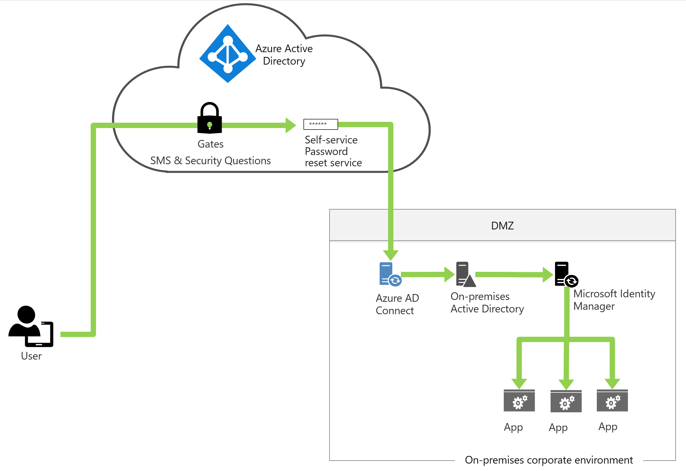
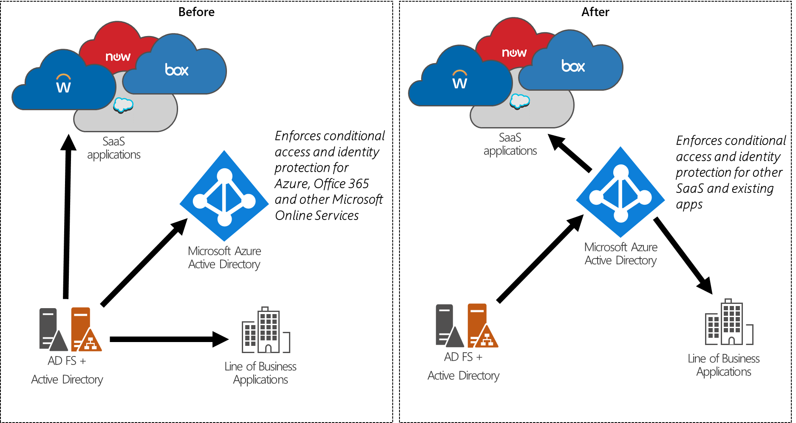

# How Microsoft Entra ID Delivers Cloud Governed Management for On-Premises Workloads

Microsoft Entra ID is a comprehensive identity as a service (IDaaS) solution used by millions of organizations that span all aspects of identity, access management, and security. Microsoft Entra ID holds more than a billion user identities and helps users sign in and securely access both:

* External resources, such as Microsoft 365, the [Microsoft Entra admin center](https://entra.microsoft.com), and thousands of other Software-as-a-Service (SaaS) applications.
* Internal resources, such as applications on an organization's corporate network and intranet, along with any cloud applications developed by that organization.

Organizations can use Microsoft Entra ID if they are 'pure cloud,' or as a 'hybrid' deployment if they have on-premises workloads. A hybrid deployment of Microsoft Entra ID can be part of a strategy for an organization to migrate its IT assets to the cloud, or to continue to integrate existing on-premises infrastructure alongside new cloud services.

Historically, 'hybrid' organizations have seen Microsoft Entra ID as an extension of their existing on-premises infrastructure. In these deployments, the on-premises identity governance administration, Windows Server Active Directory or other in-house directory systems, are the control points, and users and groups are synced from those systems to a cloud directory such as Microsoft Entra ID. Once those identities are in the cloud, they can be made available to Microsoft 365, Azure, and other applications.

As organizations move more of their IT infrastructure along with their applications to the cloud, many are looking for the improved security and simplified management capabilities of identity management as a service. The cloud-delivered IDaaS features in Microsoft Entra ID accelerate the transition to cloud governed management by providing the solutions and capabilities that allow organizations to quickly adopt and move more of their identity management from traditional on-premises systems to Microsoft Entra ID, while continuing to support existing as well as new applications.

This paper outlines Microsoft's strategy for hybrid IDaaS and describes how organizations can use Microsoft Entra ID for their existing applications.

## The Microsoft Entra ID approach to cloud governed identity management

As organizations transition to the cloud, they need assurances that they have controls over their complete environment - more security and more visibility into activities, supported by automation, and proactive insights. "**Cloud governed management**" describes how organizations manage and govern their users, applications, groups, and devices from the cloud.

In this modern world, organizations need to be able to manage effectively at scale, because of the proliferation of SaaS applications and the increasing role of collaboration and external identities. The new risk landscape of the cloud means an organization must be more responsive - a malicious actor who compromises a cloud user could affect cloud and on-premises applications.

In particular, hybrid organizations need to be able to delegate and automate tasks, which historically IT did manually. To automate tasks, they need APIs and processes that orchestrate the lifecycle of the different identity-related resources (users, groups, applications, devices), so they can delegate the day-to-day management of those resources to more individuals outside of core IT staff. Microsoft Entra ID addresses these requirements through user account management and native authentication for users without requiring on-premises identity infrastructure. Not building out on-premises infrastructure can benefit organizations that have new communities of users, such as business partners, which didn't originate in their on-premises directory, but whose access management is critical to achieving business outcomes.

In addition, management isn't complete without governance --- and governance in this new world is an integrated part of the identity system rather than an add-on. Identity governance gives organizations the ability to manage the identity and access lifecycle across employees, business partners and vendors, and services and applications.

Incorporating identity governance makes it easier to enable the organization to transition to cloud governed management, allows IT to scale, addresses new challenges with guests and provides deeper insights and automation than what customers had with on-premises infrastructure. Governance in this new world means the ability for an organization to have transparency, visibility, and proper controls on the access to resources within the organization. With Microsoft Entra ID, security operations and audit teams have visibility into who has --- and who should have - access to what resources in the organization (on what devices), what those users are doing with that access, and whether the organization has and uses appropriate controls to remove or restrict access in accordance with company or regulatory policies.

The new management model benefits organizations with both SaaS and line-of-business (LOB) applications, as they are more easily able to manage and secure access to those applications. By integrating applications with Microsoft Entra ID, organizations will be able to use and manage access across both cloud and on-premises originated identities consistently. Application lifecycle management becomes more automated, and Microsoft Entra ID provides rich insights into application usage that wasn't easily achievable in on-premises identity management. Through the Microsoft Entra ID, Microsoft 365 groups and Teams self-service features, organizations can easily create groups for access management and collaboration and add or remove users in the cloud to enable collaboration and access management requirements.

Selecting the right Microsoft Entra capabilities for cloud governed management depends upon the applications to be used, and how those applications will be integrated with Microsoft Entra ID. The following sections outline the approaches to take for AD-integrated applications, and applications that use federation protocols (for example, SAML, OAuth, or OpenID Connect).

## Cloud governed management for AD-integrated applications

Microsoft Entra ID improves the management for an organization's on-premises Active Directory-integrated applications through secure remote access and Conditional Access to those applications. In addition, Microsoft Entra ID also provides account lifecycle management and credential management for the user's existing AD accounts, including:

* **Secure remote access and Conditional Access for on-premises applications**

For many organizations, the first step in managing access from the cloud for on-premises AD-integrated web and remote desktop-based applications is to deploy the [application proxy](../../app-proxy/application-proxy.md) in front of those applications to provide secure remote access.

After a single sign-on to Microsoft Entra ID, users can access both cloud and on-premises applications through an external URL or an internal application portal. For example, Application Proxy  provides remote access and single sign-on to Remote Desktop, SharePoint, as well as apps such as Tableau and Qlik, and line of business (LOB) applications. Furthermore, Conditional Access policies can include displaying the [terms of use](../../conditional-access/terms-of-use.md) and [ensuring the user has agreed to them](../../conditional-access/require-tou.md) before being able to access an application.

* **Automatic lifecycle management for Active Directory accounts**

Identity governance helps organizations achieve a balance between *productivity* --- how quickly can a person have access to the resources they need, such as when they join the organization? --- and *security* --- how should their access change over time, such as when that person's employment status changes? Identity lifecycle management is the foundation for identity governance, and effective governance at scale requires modernizing the identity lifecycle management infrastructure for applications.

For many organizations, identity lifecycle for employees is tied to the representation of that user in a human capital management (HCM) system. For organizations using Workday as their HCM system, Microsoft Entra ID can ensure user accounts in AD are [automatically provisioned and deprovisioned for workers in Workday](../../saas-apps/workday-inbound-tutorial.md). Doing so leads to improved user productivity through automation of birthright accounts and manages risk by ensuring application access is automatically updated when a user changes roles or leaves the organization. The Workday-driven user provisioning [deployment plan](https://aka.ms/WorkdayDeploymentPlan) is a step-by-step guide that walks organizations through the best practices implementation of Workday to Active Directory User Provisioning solution in a five-step process.

Microsoft Entra ID P1 or P2 also includes Microsoft Identity Manager, which can import records from other on-premises HCM systems, including SAP, Oracle eBusiness, and Oracle PeopleSoft.

Business-to-business collaboration increasingly requires granting access to people outside your organization. [Microsoft Entra B2B](/azure/active-directory/b2b/) collaboration enables organizations to securely share their applications and services with guest users and external partners while maintaining control over their own corporate data.

Microsoft Entra ID can [automatically create accounts in AD for guest users](../../external-identities/hybrid-cloud-to-on-premises.md) as needed, enabling business guests to access on-premises AD-integrated applications without needing another password. Organizations can set up [multifactor authentication policies for guest user](../../external-identities/authentication-conditional-access.md)s so MFA checks are done during application proxy authentication. Also, any [access reviews](../../governance/manage-guest-access-with-access-reviews.md) that are done on cloud B2B users apply to on-premises users. For example, if the cloud user is deleted through lifecycle management policies, the on-premises user is also deleted.

**Credential management for Active Directory accounts**

Self-service password reset in Microsoft Entra ID allows users who have forgotten their passwords to be reauthenticated and reset their passwords, with the changed passwords [written to on-premises Active Directory](../../authentication/concept-sspr-writeback.md). The password reset process can also use the on-premises Active Directory password policies: When a user resets their password, it's checked to ensure it meets the on-premises Active Directory policy before committing it to that directory. The self-service password reset [deployment plan](../../authentication/howto-sspr-deployment.md) outlines best practices to roll out self-service password reset to users via web and Windows-integrated experiences.

Finally, for organizations that permit users to change their passwords in AD, AD can be configured to use the same password policy as the organization is using in Microsoft Entra ID through the [Microsoft Entra password protection feature](../../authentication/concept-password-ban-bad-on-premises.md), currently in public preview.

When an organization is ready to move an AD-integrated application to the cloud by moving the operating system hosting the application to Azure, [Microsoft Entra Domain Services](../../../active-directory-domain-services/overview.md) provides AD-compatible domain services (such as domain join, group policy, LDAP, and Kerberos/NTLM authentication). Microsoft Entra Domain Services integrates with the organization's existing Microsoft Entra tenant, making it possible for users to sign in using their corporate credentials. Additionally, existing groups and user accounts can be used to secure access to resources, ensuring a smoother 'lift-and-shift' of on-premises resources to Azure infrastructure services.

## Cloud governed management for on-premises federation-based applications

For an organization that already uses an on-premises identity provider, moving applications to Microsoft Entra ID enables more secure access and an easier administrative experience for federation management. Microsoft Entra ID enables configuring granular per-application access controls, including Microsoft Entra multifactor authentication, by using Microsoft Entra Conditional Access. Microsoft Entra ID supports more capabilities, including application-specific token signing certificates and configurable certificate expiration dates. These capabilities, tools, and guidance enable organizations to retire their on-premises identity providers. Microsoft's own IT, for one example, has moved 17,987 applications from Microsoft's internal Active Directory Federation Services (AD FS) to Microsoft Entra ID.

To begin migrating federated applications to Microsoft Entra ID as the identity provider, refer to https://aka.ms/migrateapps that includes links to:

* The white paper [Migrating Your Applications to Microsoft Entra ID](https://aka.ms/migrateapps/whitepaper), which presents the benefits of migration and describes how to plan for migration in four clearly-outlined phases: discovery, classification, migration, and ongoing management. You'll be guided through how to think about the process and break down your project into easy-to-consume pieces. Throughout the document are links to important resources that will help you along the way.

* The solution guide [Migrating Application Authentication from Active Directory Federation Services to Microsoft Entra ID](../../manage-apps/migrate-adfs-apps-stages.md) explores in more detail the same four phases of planning and executing an application migration project. In this guide, you'll learn how to apply those phases to the specific goal of moving an application from Active Directory Federation Services (AD FS) to Microsoft Entra ID.

* The [Active Directory Federation Services Migration Readiness Script](https://aka.ms/migrateapps/adfstools) can be run on existing on-premises Active Directory Federation Services (AD FS) servers to determine the readiness of applications for migration to Microsoft Entra ID.

## Ongoing access management across cloud and on-premises applications

Organizations need a process to manage access that is scalable. Users continue to accumulate access rights and end up with beyond what was initially provisioned for them. Furthermore, enterprise organizations need to be able to scale efficiently to develop and enforce access policy and controls on an ongoing basis.

Typically, IT delegates access approval decisions to business decision makers. Furthermore, IT can involve the users themselves. For example, users that access confidential customer data in a company's marketing application in Europe need to know the company's policies. Guest users also may be unaware of the handling requirements for data in an organization to which they've been invited.

Organizations can automate the access lifecycle process through technologies such as [dynamic groups](../../enterprise-users/groups-dynamic-membership.md), coupled with user provisioning to [SaaS applications](../../saas-apps/tutorial-list.md), or [applications integrated using the System for Cross-Domain Identity Management (SCIM)](../../app-provisioning/use-scim-to-provision-users-and-groups.md)) standard. Organizations also can control which [guest users have access to on-premises applications](../../external-identities/hybrid-cloud-to-on-premises.md). These access rights can then be regularly reviewed using recurring [Microsoft Entra access reviews](../../governance/access-reviews-overview.md).

## Future directions

In hybrid environments, Microsoft's strategy is to enable deployments where the **cloud is the control plane for identity**, and on-premises directories and other identity systems, such as Active Directory and other on-premises applications, are the target for provisioning users with access. This strategy will continue to ensure the rights, identities, and access in those applications and workloads that rely upon them. At this end state, organizations will be able to drive end-user productivity entirely from the cloud.

## Next steps

For more information on how to get started on this journey, see the [Microsoft Entra deployment plans](https://aka.ms/deploymentplans). These plans provide end-to-end guidance for deploying Microsoft Entra capabilities. Each plan explains the business value, planning considerations, design, and operational procedures needed to successfully roll out common Microsoft Entra capabilities. Microsoft continually updates the deployment plans with best practices learned from customer deployments and other feedback when we add new capabilities to managing from the cloud with Microsoft Entra ID.
