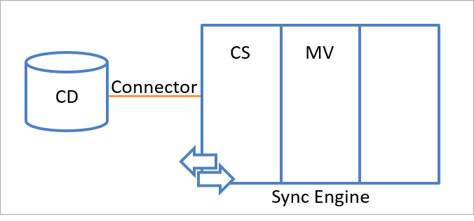
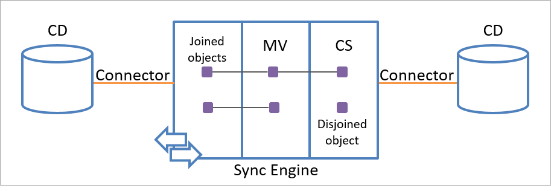

# Microsoft Entra Connect Sync: Understanding the architecture
This topic covers the basic architecture for Microsoft Entra Connect Sync. In many aspects, it is similar to its predecessors MIIS 2003, ILM 2007, and FIM 2010. Microsoft Entra Connect Sync is the evolution of these technologies. If you are familiar with any of these earlier technologies, the content of this topic will be familiar to you as well. If you are new to synchronization, then this topic is for you. It is however not a requirement to know the details of this topic to be successful in making customizations to Microsoft Entra Connect Sync (called sync engine in this topic).

## Architecture
The sync engine creates an integrated view of objects that are stored in multiple connected data sources and manages identity information in those data sources. This integrated view is determined by the identity information retrieved from connected data sources and a set of rules that determine how to process this information.

### Connected Data Sources and Connectors
The sync engine processes identity information from different data repositories, such as Active Directory or a SQL Server database. Every data repository that organizes its data in a database-like format and that provides standard data-access methods is a potential data source candidate for the sync engine. The data repositories that are synchronized by sync engine are called **connected data sources** or **connected directories** (CD).

The sync engine encapsulates interaction with a connected data source within a module called a **Connector**. Each type of connected data source has a specific Connector. The Connector translates a required operation into the format that the connected data source understands.

Connectors make API calls to exchange identity information (both read and write) with a connected data source. It is also possible to add a custom Connector using the extensible connectivity framework. The following illustration shows how a Connector connects a connected data source to the sync engine.

Data can flow in either direction, but it cannot flow in both directions simultaneously. In other words, a Connector can be configured to allow data to flow from the connected data source to sync engine or from sync engine to the connected data source, but only one of those operations can occur at any one time for one object and attribute. The direction can be different for different objects and for different attributes.

To configure a Connector, you specify the object types that you want to synchronize. Specifying the object types defines the scope of objects that are included in the synchronization process. The next step is to select the attributes to synchronize, which is known as an attribute inclusion list. These settings can be changed any time in response to changes to your business rules. When you use the Microsoft Entra Connect installation wizard, these settings are configured for you.

To export objects to a connected data source, the attribute inclusion list must include at least the minimum attributes required to create a specific object type in a connected data source. For example, the **sAMAccountName** attribute must be included in the attribute inclusion list to export a user object to Active Directory because all user objects in Active Directory must have a **sAMAccountName** attribute defined. Again, the installation wizard does this configuration for you.

If the connected data source uses structural components, such as partitions or containers to organize objects, you can limit the areas in the connected data source that are used for a given solution.

### Internal structure of the sync engine namespace
The entire sync engine namespace consists of two namespaces that store the identity information. The two namespaces are:

* The connector space (CS)
* The metaverse (MV)

The **connector space** is a staging area that contains representations of the designated objects from a connected data source and the attributes specified in the attribute inclusion list. The sync engine uses the connector space to determine what has changed in the connected data source and to stage incoming changes. The sync engine also uses the connector space to stage outgoing changes for export to the connected data source. The sync engine maintains a distinct connector space as a staging area for each Connector.

By using a staging area, the sync engine remains independent of the connected data sources and is not affected by their availability and accessibility. As a result, you can process identity information at any time by using the data in the staging area. The sync engine can request only the changes made inside the connected data source since the last communication session terminated or push out only the changes to identity information that the connected data source has not yet received, which reduces the network traffic between the sync engine and the connected data source.

In addition, sync engine stores status information about all objects that it stages in the connector space. When new data is received, sync engine always evaluates whether the data has already been synchronized.

The **metaverse** is a storage area that contains the aggregated identity information from multiple connected data sources, providing a single global, integrated view of all combined objects. Metaverse objects are created based on the identity information that is retrieved from the connected data sources and a set of rules that allow you to customize the synchronization process.

The following illustration shows the connector space namespace and the metaverse namespace within the sync engine.

## Sync engine identity objects
The objects in the sync engine are representations of either objects in the connected data source or the integrated view that sync engine has of those objects. Every sync engine object must have a globally unique identifier (GUID). GUIDs provide data integrity and express relationships between objects.

### Connector space objects
When sync engine communicates with a connected data source, it reads the identity information in the connected data source and uses that information to create a representation of the identity object in the connector space. You cannot create or delete these objects individually. However, you can manually delete all objects in a connector space.

All objects in the connector space have two attributes:

* A globally unique identifier (GUID)
* A distinguished name (also known as DN)

If the connected data source assigns a unique attribute to the object, then objects in the connector space can also have an anchor attribute. The anchor attribute uniquely identifies an object in the connected data source. The sync engine uses the anchor to locate the corresponding representation of this object in the connected data source. Sync engine assumes that the anchor of an object never changes over the lifetime of the object.

Many of the Connectors use a known unique identifier to generate an anchor automatically for each object when it is imported. For example, the Active Directory Connector uses the **objectGUID** attribute for an anchor. For connected data sources that do not provide a clearly defined unique identifier, you can specify anchor generation as part of the Connector configuration.

In that case, the anchor is built from one or more unique attributes of an object type, neither of which changes, and that uniquely identifies the object in the connector space (for example, an employee number or a user ID).

A connector space object can be one of the following:

* A staging object
* A placeholder

### Staging Objects
A staging object represents an instance of the designated object types from the connected data source. In addition to the GUID and the distinguished name, a staging object always has a value that indicates the object type.

Staging objects that have been imported always have a value for the anchor attribute. Staging objects that have been newly provisioned by sync engine and are in the process of being created in the connected data source do not have a value for the anchor attribute.

Staging objects also carry current values of business attributes, and operational information needed by sync engine to perform the synchronization process. Operational information includes flags that indicate the type of updates that are staged on the staging object. If a staging object has received new identity information from the connected data source that has not yet been processed, the object is flagged as **pending import**. If a staging object has new identity information that has not yet been exported to the connected data source, it is flagged as **pending export**.

A staging object can be an import object or an export object. The sync engine creates an import object by using object information received from the connected data source. When sync engine receives information about the existence of a new object that matches one of the object types selected in the Connector, it creates an import object in the connector space as a representation of the object in the connected data source.

The following illustration shows an import object that represents an object in the connected data source.

The sync engine creates an export object by using object information in the metaverse. Export objects are exported to the connected data source during the next communication session. From the perspective of the sync engine, export objects do not exist in the connected data source yet. Therefore, the anchor attribute for an export object is not available. After it receives the object from sync engine, the connected data source creates a unique value for the anchor attribute of the object.

The following illustration shows how an export object is created by using identity information in the metaverse.

The sync engine confirms the export of the object by reimporting the object from the connected data source. Export objects become import objects when sync engine receives them during the next import from that connected data source.

### Placeholders
The sync engine uses a flat namespace to store objects. However, some connected data sources such as Active Directory use a hierarchical namespace. To transform information from a hierarchical namespace into a flat namespace, sync engine uses placeholders to preserve the hierarchy.

Each placeholder represents a component (for example, an organizational unit) of an object's hierarchical name that has not been imported into sync engine but is required to construct the hierarchical name. They fill gaps created by references in the connected data source to objects that are not staging objects in the connector space.

The sync engine also uses placeholders to store referenced objects that have not yet been imported. For example, if sync is configured to include the manager attribute for the *Abbie Spencer* object and the received value is an object that has not been imported yet, such as *CN=Lee Sperry,CN=Users,DC=fabrikam,DC=com*, the manager information is stored as placeholders in the connector space. If the manager object is later imported, the placeholder object is overwritten by the staging object that represents the manager.

### Metaverse objects
A metaverse object contains the aggregated view that sync engine has of the staging objects in the connector space. Sync engine creates metaverse objects by using the information in import objects. Several connector space objects can be linked to a single metaverse object, but a connector space object cannot be linked to more than one metaverse object.

Metaverse objects cannot be manually created or deleted. The sync engine automatically deletes metaverse objects that do not have a link to any connector space object in the connector space.

To map objects within a connected data source to a corresponding object type within the metaverse, sync engine provides an extensible schema with a predefined set of object types and associated attributes. You can create new object types and attributes for metaverse objects. Attributes can be single-valued or multivalued, and the attribute types can be strings, references, numbers, and Boolean values.

### Relationships between staging objects and metaverse objects
Within the sync engine namespace, the data flow is enabled by the link relationship between staging objects and metaverse objects. A staging object that is linked to a metaverse object is called a **joined object** (or **connector object**). A staging object that is not linked to a metaverse object is called a **disjoined object** (or **disconnector object**). The terms joined and disjoined are preferred to not confuse with the Connectors responsible for importing and exporting data from a connected directory.

Placeholders are never linked to a metaverse object

A joined object comprises a staging object and its linked relationship to a single metaverse object. Joined objects are used to synchronize attribute values between a connector space object and a metaverse object.

When a staging object becomes a joined object during synchronization, attributes can flow between the staging object and the metaverse object. Attribute flow is bidirectional and is configured by using import attribute rules and export attribute rules.

A single connector space object can be linked to only one metaverse object. However, each metaverse object can be linked to multiple connector space objects in the same or in different connector spaces, as shown in the following illustration.

The linked relationship between the staging object and a metaverse object is persistent and can be removed only by rules that you specify.

A disjoined object is a staging object that is not linked to any metaverse object. The attribute values of a disjoined object are not processed any further within the metaverse. The attribute values of the corresponding object in the connected data source are not updated by sync engine.

By using disjoined objects, you can store identity information in sync engine and process it later. Keeping a staging object as a disjoined object in the connector space has many advantages. Because the system has already staged the required information about this object, it is not necessary to create a representation of this object again during the next import from the connected data source. This way, sync engine always has a complete snapshot of the connected data source, even if there is no current connection to the connected data source. Disjoined objects can be converted into joined objects, and vice versa, depending on the rules that you specify.

An import object is created as a disjoined object. An export object must be a joined object. The system logic enforces this rule and deletes every export object that is not a joined object.

## Sync engine identity management process
The identity management process controls how identity information is updated between different connected data sources. Identity management occurs in three processes:

* Import
* Synchronization
* Export

During the import process, sync engine evaluates the incoming identity information from a connected data source. When changes are detected, it either creates new staging objects or updates existing staging objects in the connector space for synchronization.

During the synchronization process, sync engine updates the metaverse to reflect changes that have occurred in the connector space and updates the connector space to reflect changes that have occurred in the metaverse.

During the export process, sync engine pushes out changes that are staged on staging objects and that are flagged as pending export.

The following illustration shows where each of the processes occurs as identity information flows from one connected data source to another.

### Import process
During the import process, sync engine evaluates updates to identity information. Sync engine compares the identity information received from the connected data source with the identity information about a staging object and determines whether the staging object requires updates. If it is necessary to update the staging object with new data, the staging object is flagged as pending import.

By staging objects in the connector space before synchronization, sync engine can process only the identity information that has changed. This process provides the following benefits:

* **Efficient synchronization**. The amount of data processed during synchronization is minimized.
* **Efficient resynchronization**. You can change how sync engine processes identity information without reconnecting the sync engine to the data source.
* **Opportunity to preview synchronization**. You can preview synchronization to verify that your assumptions about the identity management process are correct.

For each object specified in the Connector, the sync engine first tries to locate a representation of the object in the connector space of the Connector. Sync engine examines all staging objects in the connector space and tries to find a corresponding staging object that has a matching anchor attribute. If no existing staging object has a matching anchor attribute, sync engine tries to find a corresponding staging object with the same distinguished name.

When sync engine finds a staging object that matches by distinguished name but not by anchor, the following special behavior occurs:

* If the object located in the connector space has no anchor, then sync engine removes this object from the connector space and marks the metaverse object it is linked to as **retry provisioning on next synchronization run**. Then it creates the new import object.
* If the object located in the connector space has an anchor, then sync engine assumes that this object has either been renamed or deleted in the connected directory. It assigns a temporary, new distinguished name for the connector space object so that it can stage the incoming object. The old object then becomes **transient**, waiting for the Connector to import the rename or deletion to resolve the situation.

Transient objects are not always a problem, and you might see them even in a healthy environment. With [Microsoft Entra Connect Sync V2 endpoint API](how-to-connect-sync-endpoint-api-v2.md), transient objects should auto-resolve in subsequent delta synchronization cycles. A common example where you might find transient objects being generated occurs on Microsoft Entra Connect servers installed in staging mode, when an admin permanently deletes an object directly in Microsoft Entra ID using PowerShell and later synchronizes the object again.

If sync engine locates a staging object that corresponds to the object specified in the Connector, it determines what kind of changes to apply. For example, sync engine might rename or delete the object in the connected data source, or it might only update the object’s attribute values.

Staging objects with updated data are marked as pending import. Different types of pending imports are available. Depending on the result of the import process, a staging object in the connector space has one of the following pending import types:

* **None**. No changes to any of the attributes of the staging object are available. Sync engine does not flag this type as pending import.
* **Add**. The staging object is a new import object in the connector space. Sync engine flags this type as pending import for additional processing in the metaverse.
* **Update**. Sync engine finds a corresponding staging object in the connector space and flags this type as pending import so that updates to the attributes can be processed in the metaverse. Updates include object renaming.
* **Delete**. Sync engine finds a corresponding staging object in the connector space and flags this type as pending import so that the joined object can be deleted.
* **Delete/Add**. Sync engine finds a corresponding staging object in the connector space, but the object types do not match. In this case, a delete-add modification is staged. A delete-add modification indicates to the sync engine that a complete resynchronization of this object must occur because different sets of rules apply to this object when the object type changes.

By setting the pending import status of a staging object, it is possible to reduce significantly the amount of data processed during synchronization because doing so allows the system to process only those objects that have updated data.

### Synchronization process
Synchronization consists of two related processes:

* Inbound synchronization, when the content of the metaverse is updated by using the data in the connector space.
* Outbound synchronization, when the content of the connector space is updated by using data in the metaverse.

By using the information staged in the connector space, the inbound synchronization process creates an integrated view of the data in the metaverse that is stored in the connected data sources. Either all staging objects or only those with a pending import information are aggregated, depending on how the rules are configured.

The outbound synchronization process updates export objects when metaverse objects change.

Inbound synchronization creates the integrated view in the metaverse of the identity information that is received from the connected data sources. Sync engine can process identity information at any time by using the latest identity information that it has from the connected data source.

**Inbound synchronization**

Inbound synchronization includes the following processes:

* **Provision** (also called **Projection** if it is important to distinguish this process from outbound synchronization provisioning). The Sync engine creates a new metaverse object based on a staging object and links them. Provision is an object-level operation.
* **Join**. The Sync engine links a staging object to an existing metaverse object. A join is an object-level operation.
* **Import attribute flow**. Sync engine updates the attribute values, called attribute flow, of the object in the metaverse. Import attribute flow is an attribute-level operation that requires a link between a staging object and a metaverse object.

Provision is the only process that creates objects in the metaverse. Provision affects only import objects that are disjoined objects. During provision, sync engine creates a metaverse object that corresponds to the object type of the import object and establishes a link between both objects, thus creating a joined object.

The join process also establishes a link between import objects and a metaverse object. The difference between join and provision is that the join process requires that the import object are linked to an existing metaverse object, where the provision process creates a new metaverse object.

Sync engine tries to join an import object to a metaverse object by using criteria that is specified in the Synchronization Rule configuration.

During the provision and join processes, sync engine links a disjoined object to a metaverse object, making them joined. After these object-level operations are completed, sync engine can update the attribute values of the associated metaverse object. This process is called import attribute flow.

Import attribute flow occurs on all import objects that carry new data and are linked to a metaverse object.

**Outbound synchronization**

Outbound synchronization updates export objects when a metaverse object change but is not deleted. The objective of outbound synchronization is to evaluate whether changes to metaverse objects require updates to staging objects in the connector spaces. In some cases, the changes can require that staging objects in all connector spaces be updated. Staging objects that are changed are flagged as pending export, making them export objects. These export objects are later pushed out to the connected data source during the export process.

Outbound synchronization has three processes:

* **Provisioning**
* **Deprovisioning**
* **Export attribute flow**

Provisioning and deprovisioning are both object-level operations. Deprovisioning depends on provisioning because only provisioning can initiate it. Deprovisioning is triggered when provisioning removes the link between a metaverse object and an export object.

Provisioning is always triggered when changes are applied to objects in the metaverse. When changes are made to metaverse objects, sync engine can perform any of the following tasks as part of the provisioning process:

* Create joined objects, where a metaverse object is linked to a newly created export object.
* Rename a joined object.
* Disjoin links between a metaverse object and staging objects, creating a disjoined object.

If provisioning requires sync engine to create a new connector object, the staging object to which the metaverse object is linked is always an export object, because the object does not yet exist in the connected data source.

If provisioning requires sync engine to disjoin a joined object, creating a disjoined object, deprovisioning is triggered. The deprovisioning process deletes the object.

During deprovisioning, deleting an export object does not physically delete the object. The object is flagged as **deleted**, which means that the delete operation is staged on the object.

Export attribute flow also occurs during the outbound synchronization process, similar to the way that import attribute flow occurs during inbound synchronization. Export attribute flow occurs only between metaverse and export objects that are joined.

### Export process
During the export process, sync engine examines all export objects that are flagged as pending export in the connector space, and then sends updates to the connected data source.

The sync engine can determine the success of an export but it cannot sufficiently determine that the identity management process is complete. Objects in the connected data source can always be changed by other processes. Because sync engine does not have a persistent connection to the connected data source, it is not sufficient to make assumptions about the properties of an object in the connected data source based only on a successful export notification.

For example, a process in the connected data source could change the object’s attributes back to their original values (that is, the connected data source could overwrite the values immediately after the data is pushed out by sync engine and successfully applied in the connected data source).

The sync engine stores export and import status information about each staging object. If values of the attributes that are specified in the attribute inclusion list have changed since the last export, the storage of import and export status enables sync engine to react appropriately. Sync engine uses the import process to confirm attribute values that have been exported to the connected data source. A comparison between the imported and exported information, as shown in the following illustration, enables sync engine to determine whether the export was successful or if it needs to be repeated.

For example, if sync engine exports attribute C, which has a value of 5, to a connected data source, it stores C=5 in its export status memory. Each additional export on this object results in an attempt to export C=5 to the connected data source again because sync engine assumes that this value has not been persistently applied to the object (that is, unless a different value was imported recently from the connected data source). The export memory is cleared when C=5 is received during an import operation on the object.

## Next steps
Learn more about the [Microsoft Entra Connect Sync](how-to-connect-sync-whatis.md) configuration.

Learn more about [Integrating your on-premises identities with Microsoft Entra ID](../whatis-hybrid-identity.md).
