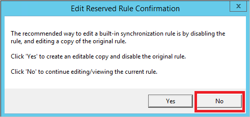
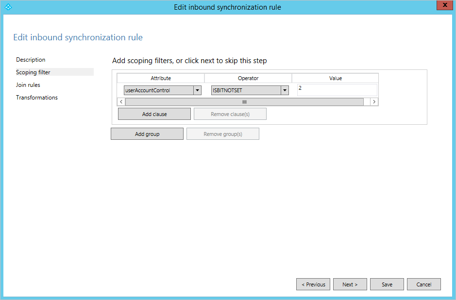
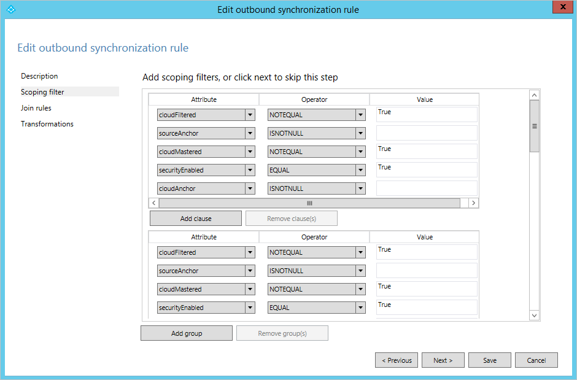

# Microsoft Entra Connect Sync: Understanding the default configuration
This article explains the out-of-box configuration rules. It documents the rules and how these rules impact the configuration. It also walks you through the default configuration of Microsoft Entra Connect Sync. The goal is that the reader understands how the configuration model, named declarative provisioning, is working in a real-world example. This article assumes that you have already installed and configure Microsoft Entra Connect sync using the installation wizard.

To understand the details of the configuration model, read [Understanding Declarative Provisioning](concept-azure-ad-connect-sync-declarative-provisioning.md).

<a name='out-of-box-rules-from-on-premises-to-azure-ad'></a>

## Out-of-box rules from on-premises to Microsoft Entra ID
The following expressions can be found in the out-of-box configuration.

### User out-of-box rules
These rules also apply to the iNetOrgPerson object type.

A user object must satisfy the following to be synchronized:

* Must have a sourceAnchor.
* After the object has been created in Microsoft Entra ID, then sourceAnchor cannot change. If the value is changed on-premises, the object stops synchronizing until the sourceAnchor is changed back to its previous value.
* Must have the accountEnabled (userAccountControl) attribute populated. With an on-premises Active Directory, this attribute is always present and populated.

The following user objects are **not** synchronized to Microsoft Entra ID:

* `IsPresent([isCriticalSystemObject])`. Ensure many out-of-box objects in Active Directory, such as the built-in administrator account, are not synchronized.
* `IsPresent([sAMAccountName]) = False`. Ensure user objects with no sAMAccountName attribute are not synchronized. This case would only practically happen in a domain upgraded from NT4.
* `Left([sAMAccountName], 4) = "AAD_"`, `Left([sAMAccountName], 5) = "MSOL_"`. Do not synchronize the service account used by Microsoft Entra Connect Sync and its earlier versions.
* Do not synchronize Exchange accounts that would not work in Exchange Online.
  * `[sAMAccountName] = "SUPPORT_388945a0"`
  * `Left([mailNickname], 14) = "SystemMailbox{"`
  * `(Left([mailNickname], 4) = "CAS_" && (InStr([mailNickname], "}") > 0))`
  * `(Left([sAMAccountName], 4) = "CAS_" && (InStr([sAMAccountName], "}")> 0))`
* Do not synchronize objects that would not work in Exchange Online.
  `CBool(IIF(IsPresent([msExchRecipientTypeDetails]),BitAnd([msExchRecipientTypeDetails],&H21C07000) > 0,NULL))`  
  This bitmask (&H21C07000) would filter out the following objects:
  * Mail-enabled Public Folder (In Preview as of version 1.1.524.0)
  * System Attendant Mailbox
  * Mailbox Database Mailbox (System Mailbox)
  * Universal Security Group (wouldn't apply for a user, but is present for legacy reasons)
  * Non-Universal Group (wouldn't apply for a user, but is present for legacy reasons)
  * Mailbox Plan
  * Discovery Mailbox
* `CBool(InStr(DNComponent(CRef([dn]),1),"\\0ACNF:")>0)`. Do not synchronize any replication victim objects.

The following attribute rules apply:

* `sourceAnchor <- IIF([msExchRecipientTypeDetails]=2,NULL,..)`. The sourceAnchor attribute is not contributed from a linked mailbox. It is assumed that if a linked mailbox has been found, the actual account is joined later.
* Exchange related attributes are only synchronized if the attribute **mailNickName** has a value.
* When there are multiple forests, then attributes are consumed in the following order:
  1. Attributes related to sign-in (for example userPrincipalName) are contributed from the forest with an enabled account.
  2. Attributes that can be found in an Exchange GAL (Global Address List) are contributed from the forest with an Exchange Mailbox.
  3. If no mailbox can be found, then these attributes can come from any forest.
  4. Exchange related attributes (technical attributes not visible in the GAL) are contributed from the forest where `mailNickname ISNOTNULL`.
  5. If there are multiple forests that would satisfy one of these rules, then the creation order (date/time) of the Connectors (forests) is used to determine which forest contributes the attributes. The first forest connected will be the first forest to sync. 

### Contact out-of-box rules
A contact object must satisfy the following to be synchronized:

* Must have mail attribute value.
* The contact must be mail-enabled. It is verified with the following rules:
  * `IsPresent([proxyAddresses]) = True)`. The proxyAddresses attribute must be populated.
  * A primary email address can be found in either the proxyAddresses attribute or the mail attribute. The presence of an \@ is used to verify that the content is an email address. One of these two rules must be evaluated to True.
    * `(Contains([proxyAddresses], "SMTP:") > 0) && (InStr(Item([proxyAddresses], Contains([proxyAddresses], "SMTP:")), "@") > 0))`. Is there an entry with "SMTP:" and if there is, can an \@ be found in the string?
    * `(IsPresent([mail]) = True && (InStr([mail], "@") > 0)`. Is the mail attribute populated and if it is, can an \@ be found in the string?

The following contact objects are **not** synchronized to Microsoft Entra ID:

* `IsPresent([isCriticalSystemObject])`. Ensure no contact objects marked as critical are synchronized. Shouldn't be any with a default configuration.
* `((InStr([displayName], "(MSOL)") > 0) && (CBool([msExchHideFromAddressLists])))`.
* `(Left([mailNickname], 4) = "CAS_" && (InStr([mailNickname], "}") > 0))`. These objects wouldn't work in Exchange Online.
* `CBool(InStr(DNComponent(CRef([dn]),1),"\\0ACNF:")>0)`. Do not synchronize any replication victim objects.

### Group out-of-box rules
A group object must satisfy the following to be synchronized:

* Must have less than 250,000 members. This count is the number of members in the on-premises group.
  * If it has more members before synchronization starts the first time, the group is not synchronized.
  * If the number of members grow from when it was initially created, then when it reaches 250,000 members it stops synchronizing until the membership count is lower than 250,000 again.
  * Note: The 250,000 membership count is also enforced by Microsoft Entra ID. You are not able to synchronize groups with more members even if you modify or remove this rule.
* If the group is a **Distribution Group**, then it must also be mail enabled. See [Contact out-of-box rules](#contact-out-of-box-rules) for this rule is enforced.

The following group objects are **not** synchronized to Microsoft Entra ID:

* `IsPresent([isCriticalSystemObject])`. Ensure many out-of-box objects in Active Directory, such as the built-in administrators group, are not synchronized.
* `[sAMAccountName] = "MSOL_AD_Sync_RichCoexistence"`. Legacy group used by DirSync.
* `BitAnd([msExchRecipientTypeDetails],&amp;H40000000)`. Role Group.
* `CBool(InStr(DNComponent(CRef([dn]),1),"\\0ACNF:")>0)`. Do not synchronize any replication victim objects.

### ForeignSecurityPrincipal out-of-box rules
FSPs are joined to "any" (\*) object in the metaverse. In reality, this join only happens for users and security groups. This configuration ensures that cross-forest memberships are resolved and represented correctly in Microsoft Entra ID.

### Computer out-of-box rules
A computer object must satisfy the following to be synchronized:

* `userCertificate ISNOTNULL`. Only Windows 10 computers populate this attribute. All computer objects with a value in this attribute are synchronized.

## Understanding the out-of-box rules scenario
In this example, we are using a deployment with one account forest (A), one resource forest (R), and one Microsoft Entra directory.


In this configuration, it is assumed there is an enabled account in the account forest and a disabled account in the resource forest with a linked mailbox.

Our goal with the default configuration is:

* Attributes related to sign-in are synchronized from the forest with the enabled account.
* Attributes that can be found in the GAL (Global Address List) are synchronized from the forest with the mailbox. If no mailbox can be found, any other forest is used.
* If a linked mailbox is found, the linked enabled account must be found for the object to be exported to Microsoft Entra ID.

### Synchronization Rule Editor
The configuration can be viewed and changed with the tool Synchronization Rules Editor (SRE) and a shortcut to it can be found in the start menu.


The SRE is a resource kit tool and it is installed with Microsoft Entra Connect Sync. To be able to start it, you must be a member of the ADSyncAdmins group. When it starts, you see something like this:


In this pane, you see all Synchronization Rules created for your configuration. Each line in the table is one Synchronization Rule. To the left under Rule Types, the two different types are listed: Inbound and Outbound. Inbound and Outbound is from the view of the metaverse. You are mainly going to focus on the inbound rules in this overview. The actual list of Synchronization Rules depends on the detected schema in AD. In the picture above, the account forest (fabrikamonline.com) does not have any services, such as Exchange and Lync, and no Synchronization Rules have been created for these services. However, in the resource forest (res.fabrikamonline.com) you find Synchronization Rules for these services. The content of the rules is different depending on the version detected. For example, in a deployment with Exchange 2013 there are more attribute flows configured than in Exchange 2010/2007.

### Synchronization Rule
A Synchronization Rule is a configuration object with a set of attributes flowing when a condition is satisfied. It is also used to describe how an object in a connector space is related to an object in the metaverse, known as **join** or **match**. The Synchronization Rules have a precedence value indicating how they relate to each other. A Synchronization Rule with a lower numeric value has a higher precedence and in an attribute flow conflict, higher precedence wins the conflict resolution.

As an example, look at the Synchronization Rule **In from AD – User AccountEnabled**. Mark this line in the SRE and select **Edit**.

Since this rule is an out-of-box rule, you receive a warning when you open the rule. You should not make any [changes to out-of-box rules](how-to-connect-sync-best-practices-changing-default-configuration.md), so you are asked what your intentions are. In this case, you only want to view the rule. Select **No**.



A Synchronization Rule has four configuration sections: Description, Scoping filter, Join rules, and Transformations.

#### Description
The first section provides basic information such as a name and description.


You also find information about which connected system this rule is related to, which object type in the connected system it applies to, and the metaverse object type. The metaverse object type is always person regardless when the source object type is a user, iNetOrgPerson, or contact. The metaverse object type should never change so it is created as a generic type. The Link Type can be set to Join, StickyJoin, or Provision. This setting works together with the Join Rules section and is covered later.

You can also see that this sync rule is used for password sync. If a user is in scope for this sync rule, the password is synchronized from on-premises to cloud (assuming you have enabled the password sync feature).

#### Scoping filter
The Scoping Filter section is used to configure when a Synchronization Rule should apply. Since the name of the Synchronization Rule you are looking at indicates it should only be applied for enabled users, the scope is configured so the AD attribute **userAccountControl** must not have the bit 2 set. When the sync engine finds a user in AD, it applies this sync rule when **userAccountControl** is set to the decimal value 512 (enabled normal user). It does not apply the rule when the user has **userAccountControl** set to 514 (disabled normal user).



The scoping filter has Groups and Clauses that can be nested. All clauses inside a group must be satisfied for a Synchronization Rule to apply. When multiple groups are defined, then at least one group must be satisfied for the rule to apply. That is, a logical OR is evaluated between groups and a logical AND is evaluated inside a group. An example of this configuration can be found in the outbound Synchronization Rule **Out to Microsoft Entra ID – Group Join**. There are several synchronization filter groups, for example one for security groups (`securityEnabled EQUAL True`) and one for distribution groups (`securityEnabled EQUAL False`).



This rule is used to define which Groups should be provisioned to Microsoft Entra ID. Distribution Groups must be mail enabled to be synchronized with Microsoft Entra ID, but for security groups an email is not required.

#### Join rules
The third section is used to configure how objects in the connector space relate to objects in the metaverse. The rule you have looked at earlier does not have any configuration for Join Rules, so instead you are going to look at **In from AD – User Join**.


The content of the join rule depends on the matching option selected in the installation wizard. For an inbound rule, the evaluation starts with an object in the source connector space and each group in the join rules is evaluated in sequence. If a source object is evaluated to match exactly one object in the metaverse using one of the join rules, the objects are joined. If all rules have been evaluated and there is no match, then the Link Type on the description page is used. If this configuration is set to **Provision**, then a new object is created in the target, the metaverse, if at least one attribute in the join criteria is present (has a value). To provision a new object to the metaverse is also known as to **project** an object to the metaverse.

The join rules are only evaluated once. When a connector space object and a metaverse object are joined, they remain joined as long as the scope of the Synchronization Rule is still satisfied.

When evaluating Synchronization Rules, only one Synchronization Rule with join rules defined must be in scope. If multiple Synchronization Rules with join rules are found for one object, an error is thrown. For this reason, the best practice is to have only one Synchronization Rule with join defined when multiple Synchronization Rules are in scope for an object. In the out-of-box configuration for Microsoft Entra Connect Sync, these rules can be found by looking at the name and find those with the word **Join** at the end of the name. A Synchronization Rule without any join rules defined applies the attribute flows when another Synchronization Rule joined the objects together or provisioned a new object in the target.

If you look at the picture above, you can see that the rule is trying to join **objectSID** with **msExchMasterAccountSid** (Exchange) and **msRTCSIP-OriginatorSid** (Lync), which is what we expect in an account-resource forest topology. You find the same rule on all forests. The assumption is that every forest could be either an account or resource forest. This configuration also works if you have accounts that live in a single forest and do not have to be joined.

#### Transformations
The transformation section defines all attribute flows that apply to the target object when the objects are joined and the scope filter is satisfied. Going back to the **In from AD – User AccountEnabled** Synchronization Rule, you find the following transformations:


To put this configuration in context, in an Account-Resource forest deployment, it is expected to find an enabled account in the account forest and a disabled account in the resource forest with Exchange and Lync settings. The Synchronization Rule you are looking at contains the attributes required for sign-in and these attributes should flow from the forest where there is an enabled account. All these attribute flows are put together in one Synchronization Rule.

A transformation can have different types: Constant, Direct, and Expression.

* A constant flow always flows a hardcoded value. In the case above, it always sets the value **True** in the metaverse attribute named **accountEnabled**.
* A direct flow always flows the value of the attribute in the source to the target attribute as-is.
* The third flow type is Expression and it allows for more advanced configurations.

The expression language is VBA (Visual Basic for Applications), so people with experience of Microsoft Office or VBScript will recognize the format. Attributes are enclosed in square brackets, [attributeName]. Attribute names and function names are case-sensitive, but the Synchronization Rules Editor evaluates the expressions and provide a warning if the expression is not valid. All expressions are expressed on a single line with nested functions. To show the power of the configuration language, here is the flow for pwdLastSet, but with additional comments inserted:

```
// If-then-else
IIF(
// (The evaluation for IIF) Is the attribute pwdLastSet present in AD?
IsPresent([pwdLastSet]),
// (The True part of IIF) If it is, then from right to left, convert the AD time format to a .NET datetime, change it to the time format used by Azure AD, and finally convert it to a string.
CStr(FormatDateTime(DateFromNum([pwdLastSet]),"yyyyMMddHHmmss.0Z")),
// (The False part of IIF) Nothing to contribute
NULL
)
```

See [Understanding Declarative Provisioning Expressions](concept-azure-ad-connect-sync-declarative-provisioning-expressions.md) for more information on the expression language for attribute flows.

### Precedence
You have now looked at some individual Synchronization Rules, but the rules work together in the configuration. In some cases, an attribute value is contributed from multiple synchronization rules to the same target attribute. In this case, attribute precedence is used to determine which attribute wins. As an example, look at the attribute sourceAnchor. This attribute is an important attribute to be able to sign in to Microsoft Entra ID. You can find an attribute flow for this attribute in two different Synchronization Rules, **In from AD – User AccountEnabled** and **In from AD – User Common**. Due to Synchronization Rule precedence, the sourceAnchor attribute is contributed from the forest with an enabled account first when there are several objects joined to the metaverse object. If there are no enabled accounts, then the sync engine uses the catch-all Synchronization Rule **In from AD – User Common**. This configuration ensures that even for accounts that are disabled, there is still a sourceAnchor.


The precedence for Synchronization Rules is set in groups by the installation wizard. All rules in a group have the same name, but they are connected to different connected directories. The installation wizard gives the rule **In from AD – User Join** highest precedence and it iterates over all connected AD directories. It then continues with the next groups of rules in a predefined order. Inside a group, the rules are added in the order the Connectors were added in the wizard. If another Connector is added through the wizard, the Synchronization Rules are reordered and the new Connector’s rules are inserted last in each group.

### Putting it all together
We now know enough about Synchronization Rules to be able to understand how the configuration works with the different Synchronization Rules. If you look at a user and the attributes that are contributed to the metaverse, the rules are applied in the following order:

| Name | Comment |
|:--- |:--- |
| In from AD – User Join |Rule for joining connector space objects with metaverse. |
| In from AD – UserAccount Enabled |Attributes required for sign-in to Microsoft Entra ID and Microsoft 365. We want these attributes from the enabled account. |
| In from AD – User Common from Exchange |Attributes found in the Global Address List. We assume the data quality is best in the forest where we have found the user’s mailbox. |
| In from AD – User Common |Attributes found in the Global Address List. In case we didn’t find a mailbox, any other joined object can contribute the attribute value. |
| In from AD – User Exchange |Only exists if Exchange has been detected. It flows all infrastructure Exchange attributes. |
| In from AD – User Lync |Only exists if Lync has been detected. It flows all infrastructure Lync attributes. |

## Next steps
* Read more about the configuration model in [Understanding Declarative Provisioning](concept-azure-ad-connect-sync-declarative-provisioning.md).
* Read more about the expression language in [Understanding Declarative Provisioning Expressions](concept-azure-ad-connect-sync-declarative-provisioning-expressions.md).
* Continue reading how the out-of-box configuration works in [Understanding Users and Contacts](concept-azure-ad-connect-sync-user-and-contacts.md)
* See how to make a practical change using declarative provisioning in [How to make a change to the default configuration](how-to-connect-sync-change-the-configuration.md).

**Overview topics**

* [Microsoft Entra Connect Sync: Understand and customize synchronization](how-to-connect-sync-whatis.md)
* [Integrating your on-premises identities with Microsoft Entra ID](../whatis-hybrid-identity.md)
