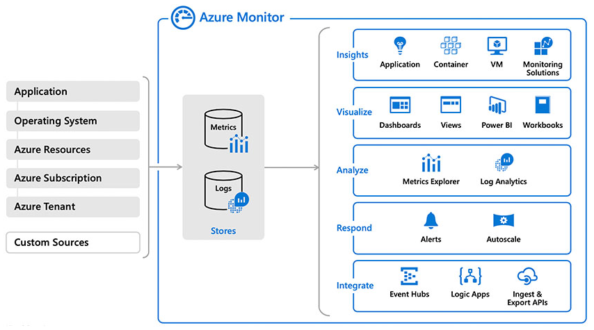

# Four steps to a strong identity foundation with Microsoft Entra ID

Managing access to apps and data can no longer rely on the traditional network security boundary strategies such as perimeter networks and firewalls because of the rapid movement of apps to the cloud. Now organizations must trust their identity solution to control who and what has access to the organization's apps and data. More organizations are allowing employees to bring their own devices to work and use their devices from anywhere they can connect to the Internet from. Ensuring those devices are compliant and secure has become an important consideration in the identity solution an organization chooses to implement. In today's digital workplace, [identity is the primary control plane](https://www.microsoft.com/security/technology/identity-access-management?rtc=1) of any organization moving to the cloud.

In adopting a Microsoft Entra hybrid identity solution, organizations gain access to premium features that unlock productivity through automation, delegation, self-service, and single sign-on capabilities. It allows employees to access company resources from wherever they need to do their work while allowing IT teams to govern that access and ensure that the right people have the right access to the right resources for the right time to establish secure productivity.

Based on our learnings, this checklist of best practices helps you quickly deploy recommended actions to build a *strong* identity foundation in your organization:

* Connect to apps easily
* Establish one identity for every user automatically
* Empower your users securely
* Operationalize your insights

## Step 1 - Connect to apps easily

By connecting your apps with Microsoft Entra ID, you can improve end-user productivity and security by enabling single sign-on (SSO) and performing automatic user provisioning. By managing your apps in a single place, Microsoft Entra ID, you can minimize administrative overhead and achieve a single point of control for your security and compliance policies.

This section covers your options for managing user access to apps, enabling secure remote access to internal apps, and the benefits of migrating your apps to Microsoft Entra ID.

### Make apps available to your users seamlessly

Microsoft Entra ID enables administrators to [add applications](../../manage-apps/add-application-portal.md) to the Microsoft Entra application gallery in the [Microsoft Entra admin center](https://entra.microsoft.com) . Adding applications to the Enterprise applications gallery makes it easier for you to configure applications to use Microsoft Entra ID as your identity provider. It also lets you manage user access to the application with Conditional Access policies and configure single sign-on (SSO) to applications so that users don't have to enter their passwords repeatedly and are automatically signed into both on-premises and cloud-based applications.

Once applications are integrated into Microsoft Entra gallery, users can see apps that are assigned to them and search and request other apps as needed. Microsoft Entra ID provides [several methods](../../manage-apps/end-user-experiences.md) for users to access their apps:

* My Apps portal
* Microsoft 365 app launcher
* Direct sign-on to federated apps
* Direct sign-on links

To learn more about user access to apps, see [Step 3](#step-3---empower-your-users-securely).

### Migrate apps from Active Directory Federation Services to Microsoft Entra ID

Migrating single sign-on configuration from Active Directory Federation Services (ADFS) to Microsoft Entra ID enables additional capabilities on security, a more consistent manageability, and collaboration. For optimal results, we recommend that you migrate your apps from AD FS to Microsoft Entra ID. Bringing your application authentication and authorization to Microsoft Entra ID provides you with the following benefits:

* Managing cost
* Managing risk
* Increasing productivity
* Addressing compliance and governance

### Enable secure remote access to apps

[Microsoft Entra application proxy](../../app-proxy/what-is-application-proxy.md) provides a simple solution for organizations to publish on-premises apps to the cloud for remote users who need access to internal apps in a secure manner. After single sign-on to Microsoft Entra ID, users can access both cloud and on-premises applications through external URLs or the My Apps portal.

Microsoft Entra application proxy offers the following benefits:

* Extending Microsoft Entra ID to on-premises resources
  * Cloud-scale security and protection
  * Features like Conditional Access and Multi-Factor Authentication that are easy to enable
* No components needed in the perimeter network such as VPN and traditional reverse proxy solutions
* No inbound connections required
* Single sign-on (SSO) across devices, resources, and apps in the cloud and on-premises
* Empowers end users to be productive anytime and anywhere

### Discover Shadow IT with Microsoft Defender for Cloud Apps

In modern enterprises, IT departments are often not aware of all cloud applications that are used by the users to do their work. When IT admins are asked how many cloud apps they think their employees use, on average they say 30 or 40. In reality, the average is over 1,000 separate apps being used by employees in your organization. 80% of employees use non-sanctioned apps that no one has reviewed and may not be compliant with your security and compliance policies.

[Microsoft Defender for Cloud Apps](/cloud-app-security/what-is-cloud-app-security) can help you identify useful apps that are popular with users that IT may sanction and integrate in Microsoft Entra ID so that users benefit from capabilities such as SSO and Conditional Access.

<em>"**Defender for Cloud Apps** helps us ensure that our people are properly using our cloud and SaaS applications, in ways that support the foundational security policies that help protect Accenture."</em> --- [John Blasi, Managing Director, Information Security, Accenture](https://customers.microsoft.com/story/accenture-professional-services-cloud-app-security)

In addition to detecting shadow IT, Microsoft Defender for Cloud Apps can also determine the risk level of apps, prevent unauthorized access to corporate data, possible data leakage, and other security risks inherent in the applications.

## Step 2 - Establish one identity for every user automatically

Bringing on-premises and cloud-based directories together in a Microsoft Entra hybrid identity solution allows you to reuse your existing on-premises Active Directory investment by provisioning your existing identities in the cloud. The solution synchronizes on-premises identities with Microsoft Entra ID, while IT keeps the on-premises Active Directory running with any existing governance solutions as the primary source of truth for identities. Microsoft's Microsoft Entra hybrid identity solution spans on-premises and cloud-based capabilities, creating a common user identity for authentication and authorization to all resources regardless of their location.

Integrate your on-premises directories with Microsoft Entra ID to make your users more productive. Prevent users from using multiple accounts across apps and services by providing a common identity to access both cloud and on-premises resources. Using multiple accounts is a pain point for end users and IT alike. From an end-user perspective, having multiple accounts means having to remember multiple passwords. To avoid this, many users reuse the same password for each account, which is bad from a security perspective. From an IT perspective, reuse often leads to more password resets and helpdesk costs along with the end-user complaints.

Microsoft Entra Connect is the tool that is used to synchronize your on-premises identities to Microsoft Entra ID, which can then be used to access integrated applications. Once the identities are in Microsoft Entra ID, they can be provisioned to SaaS applications like Salesforce or Concur.

In this section, we list recommendations for providing high availability, modern authentication for the cloud, and reducing your on-premises footprint.

> [!NOTE]
> If you want to learn more about Microsoft Entra Connect, see [What is Microsoft Entra Connect Sync?](./how-to-connect-sync-whatis.md)

### Set up a staging server for Microsoft Entra Connect and keep it up-to-date

Microsoft Entra Connect plays a key role in the provisioning process. If the Server running Microsoft Entra Connect goes offline for any reason, changes to on-premises won't be updated in the cloud and cause access issues to users. It's important to define a failover strategy that allows administrators to quickly resume synchronization after the Microsoft Entra Connect server goes offline.

To provide high availability in the event your primary Microsoft Entra Connect server goes offline, it's recommended that you deploy a separate [staging server](./how-to-connect-sync-staging-server.md) for Microsoft Entra Connect. With a server in staging mode, you can make changes to the configuration and preview the changes before you make the server active. It also allows you to run full import and full synchronization to verify that all changes are expected before you make these changes into your production environment. Deploying a staging server allows the administrator to "promote" it to production by a simple configuration switch. Having a standby server configured in staging mode also allows you to introduce a new server if decommissioning the old one.

> [!TIP]
> Microsoft Entra Connect is updated on a regular basis. Therefore, it's strongly recommended that you keep the staging server current in order to take advantage of the performance improvements, bug fixes, and new capabilities that each new version provides.

### Enable cloud authentication

Organizations with on-premises Active Directory should extend their directory to Microsoft Entra ID using Microsoft Entra Connect and configure the appropriate authentication method. [Choosing the correct authentication method](./choose-ad-authn.md) for your organization is the first step in your journey of moving apps to the cloud. It's a critical component since it controls access to all cloud data and resources.

The simplest and recommended method to enable cloud authentication for on-premises directory objects in Microsoft Entra ID is [Password Hash Synchronization](./how-to-connect-password-hash-synchronization.md) (PHS). Alternatively, some organizations may consider enabling [Pass-through Authentication](./how-to-connect-pta-quick-start.md) (PTA).

Whether you choose PHS or PTA, don't forget to consider [SSO](./how-to-connect-sso.md) to allow users to access apps without constantly entering their username and password. SSO can be achieved by using [Microsoft Entra hybrid joined](../../devices/concept-hybrid-join.md) or [Microsoft Entra joined](../../devices/concept-directory-join.md) devices while keeping access to on-premises resources. For devices that can’t be Microsoft Entra joined,  [Seamless single sign-on (Seamless SSO)](how-to-connect-sso-quick-start.md) helps provide those capabilities. Without single sign-on, users must remember application-specific passwords and sign into each application. Likewise, IT staff needs to create and update user accounts for each application such as Microsoft 365, Box, and Salesforce. Users need to remember their passwords, plus spend the time to sign into each application. Providing a standardized single sign-on mechanism to the entire enterprise is crucial for best user experience, reduction of risk, ability to report, and governance.

For organizations already using AD FS or another on-premises authentication provider, moving to Microsoft Entra ID as your identity provider can reduce complexity and improve availability. Unless you have specific use cases for using federation, we recommend migrating from federated authentication to either PHS or PTA. Doing this you can enjoy the benefits of a reduced on-premises footprint, and the flexibility the cloud offers with improved user experiences. For more information, see [Migrate from federation to password hash synchronization for Microsoft Entra ID](./migrate-from-federation-to-cloud-authentication.md).

### Enable automatic deprovisioning of accounts

Enabling automated provisioning and deprovisioning to your applications is the best strategy for governing the lifecycle of identities across multiple systems. Microsoft Entra ID supports [automated, policy-based provisioning and deprovisioning](../../app-provisioning/configure-automatic-user-provisioning-portal.md) of user accounts to various popular SaaS applications such as ServiceNow and Salesforce, and others that implement the [SCIM 2.0 protocol](../../app-provisioning/use-scim-to-provision-users-and-groups.md). Unlike traditional provisioning solutions, which require custom code or manual uploading of CSV files, the provisioning service is hosted in the cloud, and features pre-integrated connectors that can be set up and managed using the [Microsoft Entra admin center](https://entra.microsoft.com). A key benefit of automatic deprovisioning is that it helps secure your organization by instantly removing users' identities from key SaaS apps when they leave the organization.

To learn more about automatic user account provisioning and how it works, see [Automate User Provisioning and Deprovisioning to SaaS Applications with Microsoft Entra ID](../../app-provisioning/user-provisioning.md).

## Step 3 - Empower your users securely

In today's digital workplace, it's important to balance security with productivity. However, end users often push back on security measures that slow their productivity and access to apps. To help address this, Microsoft Entra ID provides self-service capabilities that enable users to remain productive while minimizing administrative overhead.

This section lists recommendations for removing friction from your organization by empowering your users while remaining vigilant.

### Enable Self-Service Password Reset for all users

Azure's [self-service password reset](../../authentication/tutorial-enable-sspr.md) (SSPR) offers a simple means for IT administrators to allow users to reset and unlock their passwords or accounts without administrator intervention. The system includes detailed reporting that tracks when users access the system, along with notifications to alert you to misuse or abuse.

By default, Microsoft Entra ID unlocks accounts when it performs a password reset. However, when you enable Microsoft Entra Connect [integration on-premises](../../authentication/concept-sspr-howitworks.md#on-premises-integration), you can also separate those two operations, which enable users to unlock their account without having to reset the password.

### Ensure all users are registered for MFA and SSPR

Azure provides reports that are used by organizations to ensure users are registered for MFA and SSPR. Users who haven't registered may need to be educated on the process.

The MFA [sign-ins report](../../authentication/howto-mfa-reporting.md) includes information about MFA usage and gives you insights into how MFA is working in your organization. Having access to sign-in activity (and audits and risk detections) for Microsoft Entra ID is crucial for troubleshooting, usage analytics, and forensics investigations.

Likewise, the [Self-service Password Management report](../../authentication/howto-sspr-reporting.md) can be used to determine who has (or hasn't) registered for SSPR.

### Self-service app management

Before your users can self-discover applications from their access panel, you need to enable [self-service application access](../../manage-apps/manage-self-service-access.md) to any applications that you wish to allow users to self-discover and request access to them. The request can optionally require approval before access being granted. 

### Self-service group management

Assigning users to applications is best mapped when using groups, because they allow great flexibility and ability to manage at scale:

* Attribute-based using dynamic group membership
* Delegation to app owners

Microsoft Entra ID provides the ability to manage access to resources using security groups and Microsoft 365 groups. These groups are managed by a group owner who can approve or deny membership requests and delegate control of group membership. The [self-service group management](../../enterprise-users/groups-self-service-management.md) feature, saves time by allowing group owners who aren't assigned an administrative role to create and manage groups without having to rely on administrators to handle their requests.

## Step 4 - Operationalize your insights

Auditing and logging of security-related events and related alerts are essential components of an efficient strategy to ensure that users remain productive and your organization is secure. Security logs and reports can help answer question such as:

* Are you using what you're paying for?
* Is there anything suspicious or malicious happening in my tenant?
* Who was impacted during a security incident?

Security logs and reports provide you with an electronic record of activities and help you detect patterns that may indicate attempted or successful attacks. You can use auditing to monitor user activity, document regulatory compliance, do forensic analysis, and more. Alerts provide notifications of security events.

### Assign least privileged admin roles for operations

As you think about your approach to operations, there are a couple levels of administration to consider. The first level places the burden of administration on your Hybrid Identity Administrator(s). Always using the Hybrid Identity Administrator role, might be appropriate for smaller companies. But for larger organizations with help desk personnel and administrators responsible for specific tasks, assigning the role of Hybrid Identity Administrator can be a security risk since it provides those individuals with the ability to manage tasks that are beyond their capabilities. 

In this case, you should consider the next level of administration. Using Microsoft Entra ID, you can designate end users as "limited administrators" who can manage tasks in less-privileged roles. For example, you might assign your help desk personnel the [security reader](../../roles/permissions-reference.md#security-reader) role to provide them with the ability to manage security-related features with read-only access. Or perhaps it makes sense to assign the [authentication administrator](../../roles/permissions-reference.md#authentication-administrator) role to individuals to give them the ability to reset non-password credentials or read and configure Azure Service Health.

To learn more, see [Administrator role permissions in Microsoft Entra ID](../../roles/permissions-reference.md).

### Monitor hybrid components (Microsoft Entra Connect Sync, AD FS) using Microsoft Entra Connect Health

Microsoft Entra Connect and AD FS are critical components that can potentially break lifecycle management and authentication and ultimately lead to outages. Therefore, you should deploy Microsoft Entra Connect Health for monitoring and reporting of these components.

To learn more, go read [Monitor AD FS using Microsoft Entra Connect Health](./how-to-connect-health-adfs.md).

### Use Azure Monitor to collect data logs for analytics

[Azure Monitor](../../../azure-monitor/overview.md) is a unified monitoring portal for all Microsoft Entra logs, which provides deep insights, advanced analytics, and smart machine learning. With Azure Monitor, you can consume metrics and logs within the portal and via APIs to gain more visibility into the state and performance of your resources. It enables a single pane of glass experience within the portal while enabling a wide range of product integrations via APIs and data export options that support traditional third-party SIEM systems. Azure Monitor also gives you the ability to configure alert rules to get notified or to take automated actions on issues impacting your resources.

### Create custom dashboards for your leadership and your day to day

Organizations that don't have a SIEM solution can use Azure Monitor workbooks for Microsoft Entra ID(../reports-monitoring/howto-use-azure-monitor-workbooks). The integration contains pre-built workbooks and templates to help you understand how your users adopt and use Microsoft Entra features, which allows you to gain insights into all the activities within your directory. You can also create your own workbooks and share with your leadership team to report on day-to-day activities. Workbooks are a great way to monitor your business and see all of your most important metrics at a glance. 

### Understand your support call drivers

When you implement a hybrid identity solution as outlined in this article, you should ultimately notice a reduction in your support calls. Common issues such as forgotten passwords and account lockouts are mitigated by implementing Azure's self-service password reset, while enabling self-service application access allows users to self-discover and request access to applications without relying on your IT staff.

If you don't observe a reduction in support calls, we recommend that you analyze your support call drivers in an attempt to confirm if SSPR, or self-service application access has been configured correctly or if there are any other new issues that can be systematically addressed.

*"In our digital transformation journey, we needed a reliable identity and access management provider to facilitate seamless yet secure integration between us, partners and cloud service providers, for an effective ecosystem; Microsoft Entra ID was the best option offering us the needed capabilities and visibility that enabled us to detect and respond to risks."* --- [Yazan Almasri, Global Information Security Director, Aramex](https://customers.microsoft.com/story/aramex-azure-active-directory-travel-transportation-united-arab-emirates-en)

### Monitor your usage of apps to drive insights

In addition to discovering Shadow IT, monitoring app usage across your organization using [Microsoft Defender for Cloud Apps](/cloud-app-security/what-is-cloud-app-security) can help your organization as you move to take full advantage of the promise of cloud applications. It can help keep you in control of your assets through improved visibility into activity and increase the protection of critical data across cloud applications. Monitoring app usage in your organization using Defender for Cloud Apps can help you answer the following questions:

* What unsanctioned apps are employees using to store data in?
* Where and when is sensitive data being stored in the cloud?
* Who is accessing sensitive data in the cloud?

*"With Defender for Cloud Apps, we can quickly spot anomalies and take action."* --- [Eric LePenske, Senior Manager, Information Security, Accenture](https://customers.microsoft.com/story/accenture-professional-services-cloud-app-security)

## Summary

There are many aspects to implementing a hybrid Identity solution, but this four-step checklist helps you quickly accomplish an identity infrastructure that enables users to be more productive and secure.

* Connect to apps easily
* Establish one identity for every user automatically
* Empower your users securely
* Operationalize your insights

We hope this document is a useful roadmap to establishing a strong identity foundation for your organization.

## Identity checklist

We recommend that you print the following checklist for reference as you begin your journey to a more solid identity foundation in your organization.

### Today

|Done?|Item|
|:-|:-|
||Pilot Self- Service Password Reset (SSPR) for a group|
||Monitor hybrid components using Microsoft Entra Connect Health|
||Assign least privileged admin roles for operation|
||Discover Shadow IT with Microsoft Defender for Cloud Apps|
||Use Azure Monitor to collect data logs for analysis|

### Next two weeks

|Done?|Item|
|:-|:-|
||Make an app available for your users|
||Pilot Microsoft Entra provisioning for a SaaS app of choice|
||Setup a staging server for Microsoft Entra Connect and keep it up-to-date|
||Start migrating apps from ADFS to Microsoft Entra ID|
||Create custom dashboards for your leadership and your day to day|

### Next month

|Done?|Item|
|:-|:-|
||Monitor your usage of apps to drive insights|
||Pilot secure remote access to apps|
||Ensure all users are registered for MFA and SSPR|
||Enable cloud authentication|

### Next three months

|Done?|Item|
|:-|:-|
||Enable self-service app management|
||Enable self-service group management|
||Monitor your usage of apps to drive insights|
||Understand your support call drivers|

## Next steps

Learn how you can increase your secure posture using the capabilities of Microsoft Entra ID and this five-step checklist - [Five steps to securing your identity infrastructure](../../../security/fundamentals/steps-secure-identity.md).

Learn how the identity features in Microsoft Entra ID can help you accelerate your transition to cloud governed management by providing the solutions and capabilities that allow organizations to quickly adopt and move more of their identity management from traditional on-premises systems to Microsoft Entra ID - [How Microsoft Entra ID Delivers Cloud Governed Management for on-premises Workloads](./cloud-governed-management-for-on-premises.md).
