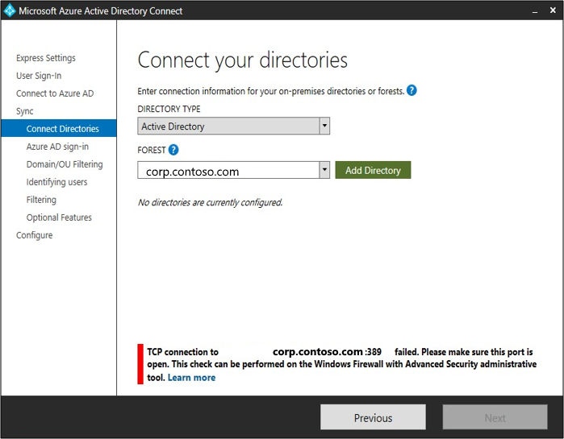

# Troubleshoot Microsoft Entra connectivity with the ADConnectivityTool PowerShell module

The ADConnectivity tool is a PowerShell module that is used in one of the following:

- During installation, when a network connectivity problem prevents the successful validation of the Active Directory credentials.
- Post installation by a user who calls the functions from a PowerShell session.

The tool is located in: **C:\Program Files\Microsoft Entra Connect\Tools\ADConnectivityTool.psm1**.

## ADConnectivityTool during installation

On the **Connect your directories** page, in the Microsoft Entra Connect Wizard, if a network issue occurs, the ADConnectivityTool will automatically use one of its functions to determine what is going on.  The  following items can be considered network issues:

- The name of the Forest the user provided was typed wrongly, or said Forest doesn’t exist 
- UDP port 389 is closed in the Domain Controllers associated with the Forest the user provided
- The credentials provided in the ‘AD forest account’ window doesn’t have privileges to retrieve the Domain Controllers associated with the target Forest
- Any of the TCP ports 53, 88 or 389 are closed in the Domain Controllers associated with the Forest the user provided 
- Both UDP 389 and a TCP port (or ports) are closed
- DNS couldn't be resolved for the provided Forest and\or its associated Domain Controllers

Whenever any of these issues are found, a related error message is displayed in the AADConnect Wizard:

For example, when we're attempting to add a directory on the **Connect your directories** screen, Microsoft Entra Connect needs to verify this and expects to be able to communicate with a domain controller over port 389.  If it can't, we'll see the error that is shown in the screenshot.  

What is actually happening behind the scenes, is that Microsoft Entra Connect is calling the `Start-NetworkConnectivityDiagnosisTools` function.  This function is called when the validation of credentials fails due to a network connectivity issue.

Finally, a detailed log file is generated whenever the tool is called from the wizard. The log is located in **C:\ProgramData\AADConnect\ADConnectivityTool-\<date>-\<time>.log**

## ADConnectivityTools post installation
After Microsoft Entra Connect has been installed, any of the functions in the ADConnectivityTools PowerShell module can be used.  

You can find reference information on the functions in the [ADConnectivityTools Reference](reference-connect-adconnectivitytools.md)

### Start-ConnectivityValidation

We're going to call out this function because it can **only** be called manually once the ADConnectivityTool.psm1 has been imported into PowerShell. 

This function executes the same logic that the  Microsoft Entra Connect Wizard runs to validate the provided AD Credentials.  However it provides a much more verbose explanation about the problem and a suggested solution. 

The connectivity validation consists of the following steps:
-	Get Domain FQDN (fully qualified domain name) object
-	Validate that, if the user selected ‘Create new AD account’, these credentials belong to the Enterprise Administrators group
-	Get Forest FQDN object
-	Confirm that at least one domain associated with the previously obtained Forest FQDN object is reachable
-	Verify that the functional level of the forest is Windows Server 2003 or greater.

The user will be able to add a Directory if all these actions were executed successfully.

If the user runs this function, after a problem is solved (or if no problem exists at all), the output will indicate for the user to go back to the Microsoft Entra Connect Wizard and try inserting the credentials again.

## Next Steps
- [Microsoft Entra Connect: Accounts and permissions](reference-connect-accounts-permissions.md)
- [Express Installation](how-to-connect-install-express.md)
- [Custom Installation](how-to-connect-install-custom.md)
- [ADConnectivityTools Reference](reference-connect-adconnectivitytools.md)
