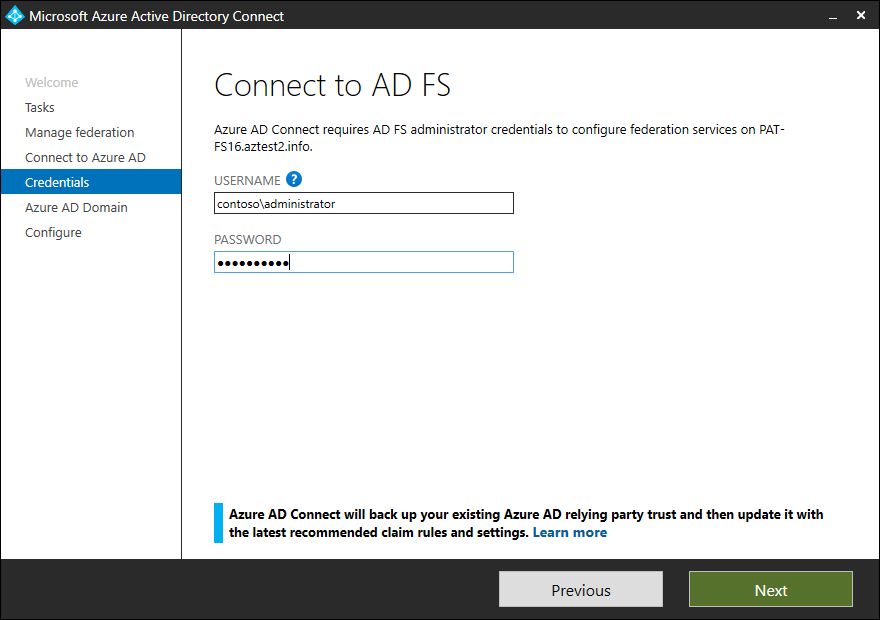
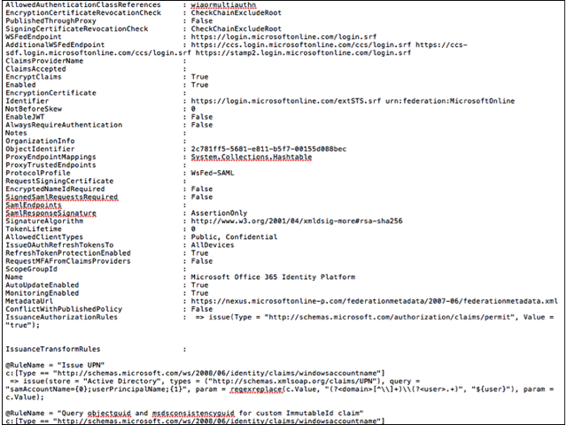

# Manage AD FS trust with Microsoft Entra ID using Microsoft Entra Connect

## Overview

When you federate your on-premises environment with Microsoft Entra ID, you establish a trust relationship between the on-premises identity provider and Microsoft Entra ID.  Microsoft Entra Connect can manage federation between on-premises Active Directory Federation Service (AD FS) and Microsoft Entra ID. This article provides an overview of:

* The various settings configured on the trust by Microsoft Entra Connect.
* The issuance transform rules (claim rules) set by Microsoft Entra Connect.
* How to back up and restore your claim rules between upgrades and configuration updates.
* Best practice for securing and monitoring the AD FS trust with Microsoft Entra ID.

## Settings controlled by Microsoft Entra Connect

Microsoft Entra Connect manages **only** settings related to Microsoft Entra ID trust. Microsoft Entra Connect does not modify any settings on other relying party trusts in AD FS. The following table indicates settings that are controlled by Microsoft Entra Connect.

| Setting | Description |
| :--- | :--- |
| Token signing certificate | Microsoft Entra Connect can be used to reset and recreate the trust with Microsoft Entra ID. Microsoft Entra Connect does a one-time immediate rollover of token signing certificates for AD FS and updates the Microsoft Entra domain federation settings.|
| Token signing algorithm | Microsoft recommends using SHA-256 as the token signing algorithm. Microsoft Entra Connect can detect if the token signing algorithm is set to a value less secure than SHA-256. It will update the setting to SHA-256 in the next possible configuration operation. Other relying party trust must be updated to use the new token signing certificate. |
| Microsoft Entra ID trust identifier | Microsoft Entra Connect sets the correct identifier value for the Microsoft Entra ID trust. AD FS uniquely identifies the Microsoft Entra ID trust using the identifier value. |
| Microsoft Entra endpoints | Microsoft Entra Connect makes sure that the endpoints configured for the Microsoft Entra ID trust are always as per the latest recommended values for resiliency and performance. |
| Issuance transform rules | There are numbers of claim rules which are needed for optimal performance of features of Microsoft Entra ID in a federated setting. Microsoft Entra Connect makes sure that the Microsoft Entra ID trust is always configured with the right set of recommended claim rules. |
| Alternate-id | If sync is configured to use alternate-id, Microsoft Entra Connect configures AD FS to perform authentication using alternate-id. |
| Automatic metadata update | Trust with Microsoft Entra ID is configured for automatic metadata update. AD FS periodically checks the metadata of Microsoft Entra ID trust and keeps it up-to-date in case it changes on the Microsoft Entra ID side. |
| Integrated Windows authentication (IWA) | During Microsoft Entra hybrid join operation, IWA is enabled for device registration to facilitate Microsoft Entra hybrid join for downlevel devices |

## Execution flows and federation settings configured by Microsoft Entra Connect

Microsoft Entra Connect does not update all settings for Microsoft Entra ID trust during configuration flows. The settings modified depend on which task or execution flow is being executed. The following table lists the settings impacted in different execution flows.

| Execution flow | Settings impacted |
| :--- | :--- |
| First pass installation (express) | None |
| First pass installation (new AD FS farm) | A new AD FS farm is created and a trust with Microsoft Entra ID is created from scratch. |
| First pass installation (existing AD FS farm, existing Microsoft Entra ID trust) | Microsoft Entra ID trust identifier, Issuance transform rules, Microsoft Entra endpoints, Alternate-id (if necessary), automatic metadata update |
| Reset Microsoft Entra ID trust | Token signing certificate, Token signing algorithm, Microsoft Entra ID trust identifier, Issuance transform rules, Microsoft Entra endpoints, Alternate-id (if necessary), automatic metadata update |
| Add federation server | None |
| Add WAP server | None |
| Device options | Issuance transform rules, IWA for device registration |
| Add federated domain | If the domain is being added for the first time, that is, the setup is changing from single domain federation to multi-domain federation – Microsoft Entra Connect will recreate the trust from scratch. If the trust with Microsoft Entra ID is already configured for multiple domains, only Issuance transform rules are modified |
| Update TLS | None |

During all operations, in which, any setting is modified, Microsoft Entra Connect makes a backup of the current trust settings at **%ProgramData%\AADConnect\ADFS**

> [!NOTE]
> Prior to version 1.1.873.0, the backup consisted of only issuance transform rules and they were backed up in the wizard trace log file.

## Issuance transform rules set by Microsoft Entra Connect

Microsoft Entra Connect makes sure that the Microsoft Entra ID trust is always configured with the right set of recommended claim rules. Microsoft recommends using Microsoft Entra Connect for managing your Microsoft Entra ID trust. This section lists the issuance transform rules set and their description.

| Rule name | Description |
| --- | --- |
| Issue UPN | This rule queries the value of userprincipalname as from the attribute configured in sync settings for userprincipalname.|
| Query objectguid and msdsconsistencyguid for custom ImmutableId claim | This rule adds a temporary value in the pipeline for objectguid and msdsconsistencyguid value if it exists |
| Check for the existence of msdsconsistencyguid | Based on whether the value for msdsconsistencyguid exists or not, we set a temporary flag to direct what to use as ImmutableId |
| Issue msdsconsistencyguid as Immutable ID if it exists | Issue msdsconsistencyguid as ImmutableId if the value exists |
| Issue objectGuidRule if msdsConsistencyGuid rule does not exist | If the value for msdsconsistencyguid does not exist, the value of objectguid will be issued as ImmutableId |
| Issue nameidentifier | This rule issues value for the nameidentifier claim.|
| Issue accounttype for domain-joined computers | If the entity being authenticated is a domain joined device, this rule issues the account type as DJ signifying a domain joined device |
| Issue AccountType with the value USER when it is not a computer account | If the entity being authenticated is a user, this rule issues the account type as User |
| Issue issuerid when it is not a computer account | This rule issues the issuerId value when the authenticating entity is not a device. The value is created via a regex, which is configured by Microsoft Entra Connect. The regex is created after taking into consideration all the domains federated using Microsoft Entra Connect. |
| Issue issuerid for DJ computer auth | This rule issues the issuerId value when the authenticating entity is a device |
| Issue onpremobjectguid for domain-joined computers | If the entity being authenticated is a domain joined device, this rule issues the on-premises objectguid for the device |
| Pass through primary SID | This rule issues the primary SID of the authenticating entity |
| Pass through claim - insideCorporateNetwork | This rule issues a claim that helps Microsoft Entra ID know if the authentication is coming from inside corporate network or externally |
| Pass Through Claim – Psso |   |
| Issue Password Expiry Claims | This rule issues three claims for password expiration time, number of days for the password to expire of the entity being authenticated and URL where to route for changing the password.|
| Pass through claim – authnmethodsreferences | The value in the claim issued under this rule indicates what type of authentication was performed for the entity |
| Pass through claim - multifactorauthenticationinstant | The value of this claim specifies the time, in UTC, when the user last performed multiple factor authentication. |
| Pass through claim - AlternateLoginID | This rule issues the AlternateLoginID claim if the authentication was performed using alternate login ID. |

> [!NOTE]
> The claim rules for Issue UPN and ImmutableId will differ if you use non-default choice during Microsoft Entra Connect configuration

## Restore issuance transform rules

Microsoft Entra Connect version 1.1.873.0 or later makes a backup of the Microsoft Entra ID trust settings whenever an update is made to the Microsoft Entra ID trust settings. The Microsoft Entra ID trust settings are backed up at **%ProgramData%\AADConnect\ADFS**. The file name is in the following format AadTrust-&lt;date&gt;-&lt;time&gt;.txt, for example - AadTrust-20180710-150216.txt

You can restore the issuance transform rules using the suggested steps below

1. Open the AD FS management UI in Server Manager
2. Open the Microsoft Entra ID trust properties by going **AD FS &gt; Relying Party Trusts &gt; Microsoft Office 365 Identity Platform &gt; Edit Claims Issuance Policy**
3. Click on **Add rule**
4. In the claim rule template, select Send Claims Using a Custom Rule and click **Next**
5. Copy the name of the claim rule from backup file and paste it in the field **Claim rule name**
6. Copy the claim rule from backup file into the text field for **Custom rule** and click **Finish**

> [!NOTE]
> Make sure that your additional rules do not conflict with the rules configured by Microsoft Entra Connect.

## Best practice for securing and monitoring the AD FS trust with Microsoft Entra ID
When you federate your AD FS with Microsoft Entra ID, it is critical that the federation configuration (trust relationship configured between AD FS and Microsoft Entra ID) is monitored closely, and any unusual or suspicious activity is captured. To do so, we recommend setting up alerts and getting notified whenever any changes are made to the federation configuration. To learn how to setup alerts, see [Monitor changes to federation configuration](how-to-connect-monitor-federation-changes.md). 

If you are using cloud Azure MFA, for multi factor authentication, with federated users, we highly recommend enabling additional security protection.  This security protection prevents bypassing of cloud Azure MFA when federated with Microsoft Entra ID. When enabled, for a federated domain in your Microsoft Entra tenant, it ensures that a bad actor cannot bypass Azure MFA by imitating that a multi factor authentication has already been performed by the identity provider. The protection can be enabled via new security setting, `federatedIdpMfaBehavior`.For additional information see [Best practices for securing Active Directory Federation Services](/windows-server/identity/ad-fs/deployment/best-practices-securing-ad-fs#enable-protection-to-prevent-by-passing-of-cloud-azure-mfa-when-federated-with-azure-ad)

## Next steps
* [Manage and customize Active Directory Federation Services using Microsoft Entra Connect](how-to-connect-fed-management.md)
