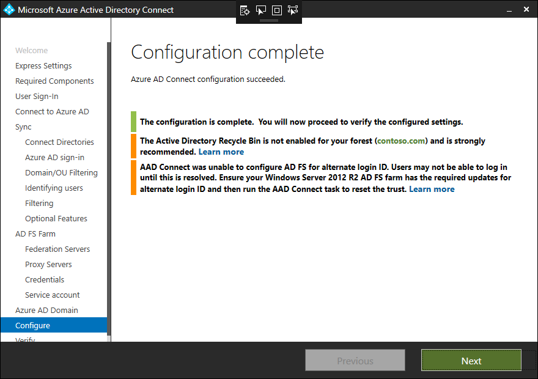

# Manage and customize AD FS by using Microsoft Entra Connect

This article describes how to manage and customize Active Directory Federation Services (AD FS) by using Microsoft Entra Connect. 

You'll also learn about other common AD FS tasks that you might need to perform to completely configure an AD FS farm. These tasks are listed in the following table:

| Task | Description |
|:--- |:--- |
| **Manage AD FS** | |
| [Repair the trust](#repairthetrust) |Learn how to repair the federation trust with Microsoft 365. |
| [Federate with Microsoft Entra ID by using an alternative sign-in ID](#alternateid) | Learn how to configure federation by using an alternative sign-in ID.  |
| [Add an AD FS server](#addadfsserver) |Learn how to expand an AD FS farm with an extra AD FS server. |
| [Add an AD FS Web Application Proxy (WAP) server](#addwapserver) |Learn how to expand an AD FS farm with an additional WAP server. |
| [Add a federated domain](#addfeddomain) |Learn how to add a federated domain. |
| [Update the TLS/SSL certificate](how-to-connect-fed-ssl-update.md)| Learn how to update the TLS/SSL certificate for an AD FS farm. |
| **Customize AD FS** | |
| [Add a custom company logo or illustration](#customlogo) |Learn how to customize an AD FS sign-in page with a company logo and illustration. |
| [Add a sign-in description](#addsignindescription) |Learn how to add a sign-in page description. |
| [Modify AD FS claim rules](#modclaims) |Learn how to modify AD FS claims for various federation scenarios. |

## Manage AD FS

You can perform various AD FS-related tasks in Microsoft Entra Connect with minimal user intervention by using the Microsoft Entra Connect wizard. After you've finished installing Microsoft Entra Connect by running the wizard, you can run it again to perform other tasks.

<a name="repairthetrust"></a>

## Repair the trust 

You can use Microsoft Entra Connect to check the current health of the AD FS and Microsoft Entra ID trust and then take appropriate actions to repair the trust. To repair your Microsoft Entra ID and AD FS trust, do the following:

1. Select **Repair Microsoft Entra ID and ADFS Trust** from the list of tasks.

   

1. On the **Connect to Microsoft Entra ID** page, provide your Hybrid Identity Administrator credentials for Microsoft Entra ID, and then select **Next**.

   

1. On the **Remote access credentials** page, enter the credentials for the domain administrator.

   

1. Select **Next**.

   Microsoft Entra Connect checks for certificate health and shows any issues.

   

   The **Ready to configure** page shows the list of actions that will be performed to repair the trust.

   

1. Select **Install** to repair the trust.

> [!NOTE]
> Microsoft Entra Connect can repair or act on only certificates that are self-signed. Microsoft Entra Connect can't repair third-party certificates.

## <a name="alternateid"></a>Federate with Microsoft Entra ID by using alternateID 

We recommend that you keep the *on-premises* User Principal Name (UPN) and the *cloud* User Principal Name the same. If the on-premises UPN uses a non-routable domain (for example, Contoso.local) or can't be changed because of local application dependencies, we recommend setting up an alternative sign-in ID.  By using an alternative sign-in ID, you can configure a sign-in experience where users can sign in with an attribute other than their UPN, such as an email address. 

The choice of UPN in Microsoft Entra Connect defaults to the userPrincipalName attribute in Active Directory. If you choose any other attribute for the UPN and are federating by using AD FS, Microsoft Entra Connect configures AD FS for an alternative sign-in ID. 

An example of choosing a different attribute for the UPN is shown in the following image:


Configuring an alternative sign-in ID for AD FS consists of two main steps:

1. **Configure the right set of issuance claims**: The issuance claim rules in the Microsoft Entra ID relying party trust are modified to use the selected UserPrincipalName attribute as the alternative ID of the user.

1. **Enable an alternative sign-in ID in the AD FS configuration**: The AD FS configuration is updated so that AD FS can look up users in the appropriate forests by using the alternative ID. This configuration is supported for AD FS on Windows Server 2012 R2 (with KB2919355) or later. If the AD FS servers are 2012 R2, Microsoft Entra Connect checks for the presence of the required KB. If the KB isn't detected, a warning is displayed after the configuration is completed, as shown in the following image:

    

    If there's a missing KB, you can remedy the configuration by installing the required [KB2919355](https://go.microsoft.com/fwlink/?LinkID=396590). You can then follow the instructions in [repair the trust](#repair-the-trust).

> [!NOTE]
> For more information about alternateID and steps to manually configure it, see [Configure an alternative sign-in ID](/windows-server/identity/ad-fs/operations/configuring-alternate-login-id).

## <a name="addadfsserver"></a>Add an AD FS server 

> [!NOTE]
> To add an AD FS server, Microsoft Entra Connect requires a PFX certificate. Therefore, you can perform this operation only if you configured the AD FS farm by using Microsoft Entra Connect.

1. Select **Deploy an additional Federation Server**, and then select **Next**.

   

1. On the **Connect to Microsoft Entra ID** page, enter your Hybrid Identity Administrator credentials for Microsoft Entra ID, and then select **Next**.

   

1. Provide the domain administrator credentials.

   

1. Microsoft Entra Connect asks for the password of the PFX file that you provided when you configured your new AD FS farm with Microsoft Entra Connect. Select **Enter Password** to provide the password for the PFX file.

   

   

1. On the **AD FS Servers** page, enter the server name or IP address to be added to the AD FS farm.

   

1. Select **Next**, and then continue completing the final **Configure** page. 

   After Microsoft Entra Connect has finished adding the servers to the AD FS farm, you'll be given the option to verify the connectivity.

   

    

## <a name="addwapserver"></a>Add an AD FS WAP server 

> [!NOTE]
> To add a Web Application Proxy server, Microsoft Entra Connect requires the PFX certificate. Therefore, you can perform this operation only after you've configured the AD FS farm by using Microsoft Entra Connect.

1. Select **Deploy Web Application Proxy** from the list of available tasks.

   

1. Provide the Azure Hybrid Identity Administrator credentials.

   

1. On the **Specify SSL certificate** page, provide the password for the PFX file that you provided when you configured the AD FS farm with Microsoft Entra Connect.
   

    

1. Add the server to be added as a WAP server. Because the WAP server might not be joined to the domain, the wizard asks for administrative credentials to the server being added.

   

1. On the **Proxy trust credentials** page, provide administrative credentials to configure the proxy trust and access the primary server in the AD FS farm.

   

1. On the **Ready to configure** page, the wizard shows the list of actions that will be performed.

   

1. Select **Install** to finish the configuration. After the configuration is complete, the wizard gives you the option to verify the connectivity to the servers. Select **Verify** to check connectivity.

   

## <a name="addfeddomain"></a>Add a federated domain 

It's easy to add a domain to be federated with Microsoft Entra ID by using Microsoft Entra Connect. Microsoft Entra Connect adds the domain for federation and modifies the claim rules to correctly reflect the issuer when you have multiple domains federated with Microsoft Entra ID.

1. To add a federated domain, select **Add an additional Microsoft Entra domain**.

   

1. On the next page of the wizard, provide the global administrator credentials for Microsoft Entra ID.

   

1. On the **Remote access credentials** page, provide the domain administrator credentials.

   

1. On the next page, the wizard provides a list of Microsoft Entra domains that you can federate your on-premises directory with. Choose the domain from the list.

   

    After you choose the domain, the wizard informs you about further actions that it will take and the impact of the configuration. In some cases, if you select a domain that isn't yet verified in Microsoft Entra ID, the wizard helps you verify the domain. For more information, see [Add your custom domain name to Microsoft Entra ID](../../fundamentals/add-custom-domain.md).

1. Select **Next**. 

   The **Ready to configure** page lists the actions that Microsoft Entra Connect will perform. 

   

1. Select **Install** to finish the configuration.

> [!NOTE]
> Users in the added federated domain must be synchronized before they can sign in to Microsoft Entra ID.

## Customize AD FS

The following sections provide details about some of the common tasks that you might have to perform to customize your AD FS sign-in page.

## <a name="customlogo"></a>Add a custom company logo or illustration 
To change the logo of the company that's displayed on the **Sign-in** page, use the following PowerShell cmdlet and syntax.

> [!NOTE]
> The recommended dimensions for the logo are 260 x 35 \@ 96 dpi with a file size no greater than 10 KB.

```azurepowershell-interactive
Set-AdfsWebTheme -TargetName default -Logo @{path="c:\Contoso\logo.PNG"}
```

> [!NOTE]
> The *TargetName* parameter is required. The default theme that's released with AD FS is named Default.

## <a name="addsignindescription"></a>Add a sign-in description 
To add a sign-in page description to the **Sign-in page**, use the following PowerShell cmdlet and syntax.

```azurepowershell-interactive
Set-AdfsGlobalWebContent -SignInPageDescriptionText "<p>Sign-in to Contoso requires device registration. Select <A href='http://fs1.contoso.com/deviceregistration/'>here</A> for more information.</p>"
```

## <a name="modclaims"></a>Modify AD FS claim rules 
AD FS supports a rich claim language that you can use to create custom claim rules. For more information, see [The Role of the Claim Rule Language](/previous-versions/windows/it-pro/windows-server-2012-R2-and-2012/dd807118(v=ws.11)).

The following sections describe how you can write custom rules for some scenarios that relate to Microsoft Entra ID and AD FS federation.

### Immutable ID conditional on a value being present in the attribute
Microsoft Entra Connect lets you specify an attribute to be used as a source anchor when objects are synced to Microsoft Entra ID. If the value in the custom attribute isn't empty, you might want to issue an immutable ID claim.

For example, you might select `ms-ds-consistencyguid` as the attribute for the source anchor and issue **ImmutableID** as `ms-ds-consistencyguid` in case the attribute has a value against it. If there's no value against the attribute, issue `objectGuid` as the immutable ID. You can construct the set of custom claim rules as described in the following section.

**Rule 1: Query attributes**

```claim-rule-language
c:[Type == "http://schemas.microsoft.com/ws/2008/06/identity/claims/windowsaccountname"]
=> add(store = "Active Directory", types = ("http://contoso.com/ws/2016/02/identity/claims/objectguid", "http://contoso.com/ws/2016/02/identity/claims/msdsconsistencyguid"), query = "; objectGuid,ms-ds-consistencyguid;{0}", param = c.Value);
```

In this rule, you're querying the values of `ms-ds-consistencyguid` and `objectGuid` for the user from Active Directory. Change the store name to an appropriate store name in your AD FS deployment. Also change the claims type to a proper claims type for your federation, as defined for `objectGuid` and `ms-ds-consistencyguid`.

Also, by using `add` and not `issue`, you avoid adding an outgoing issue for the entity, and can use the values as intermediate values. you'll issue the claim in a later rule after you establish which value to use as the immutable ID.

**Rule 2: Check to see whether ms-ds-consistencyguid exists for the user**

```claim-rule-language
NOT EXISTS([Type == "http://contoso.com/ws/2016/02/identity/claims/msdsconsistencyguid"])
=> add(Type = "urn:anandmsft:tmp/idflag", Value = "useguid");
```

This rule defines a temporary flag called `idflag` that's set to `useguid` if there's no `ms-ds-consistencyguid` populated for the user. The logic behind this is that AD FS doesn't allow empty claims. When you add claims `http://contoso.com/ws/2016/02/identity/claims/objectguid` and `http://contoso.com/ws/2016/02/identity/claims/msdsconsistencyguid` in Rule 1, you end up with an *msdsconsistencyguid* claim only if the value is populated for the user. If it isn't populated, AD FS sees that it will have an empty value and drops it immediately. All objects will have `objectGuid`, so that claim will always be there after Rule 1 is executed.

**Rule 3: Issue ms-ds-consistencyguid as immutable ID if it's present**

```claim-rule-language
c:[Type == "http://contoso.com/ws/2016/02/identity/claims/msdsconsistencyguid"]
=> issue(Type = "http://schemas.microsoft.com/LiveID/Federation/2008/05/ImmutableID", Value = c.Value);
```

This is an implicit `Exist` check. If the value for the claim exists, issue it as the immutable ID. The previous example uses the `nameidentifier` claim. You'll have to change this to the appropriate claim type for the immutable ID in your environment.

**Rule 4: Issue objectGuid as an immutable ID if ms-ds-consistencyGuid isn't present**

```claim-rule-language
c1:[Type == "urn:anandmsft:tmp/idflag", Value =~ "useguid"]
&& c2:[Type == "http://contoso.com/ws/2016/02/identity/claims/objectguid"]
=> issue(Type = "http://schemas.microsoft.com/LiveID/Federation/2008/05/ImmutableID", Value = c2.Value);
```

With this rule, you're simply checking the temporary flag `idflag`. You decide whether to issue the claim based on its value.

> [!NOTE]
> The sequence of these rules is important.

### SSO with a subdomain UPN

You can add more than one domain to be federated by using Microsoft Entra Connect, as described in [Add a new federated domain](#addadfsserver). Microsoft Entra Connect versions 1.1.553.0 and later create the correct claim rule for `issuerID` automatically. If you can't use Microsoft Entra Connect version 1.1.553.0 or later, we recommend that you use the [Microsoft Entra RPT Claim Rules](https://aka.ms/aadrptclaimrules) tool to generate and set correct claim rules for the Microsoft Entra ID relying party trust.

## Next steps

Learn more about [user sign-in options](plan-connect-user-signin.md).
