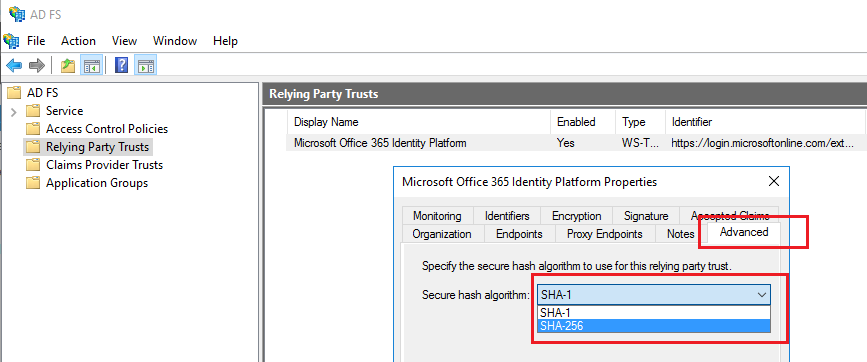

# Change signature hash algorithm for Microsoft 365 relying party trust
## Overview
Active Directory Federation Services (AD FS) signs its tokens to Microsoft Entra ID to ensure that they cannot be tampered with. This signature can be based on SHA1 or SHA256. Microsoft Entra ID now supports tokens signed with an SHA256 algorithm, and we recommend setting the token-signing algorithm to SHA256 for the highest level of security. This article describes the steps needed to set the token-signing algorithm to the more secure SHA256 level.

>[!NOTE]
>Microsoft recommends usage of SHA256 as the algorithm for signing tokens as it is more secure than SHA1 but SHA1 still remains a supported option.

## Change the token-signing algorithm
After you have set the signature algorithm with one of the two processes below, AD FS signs the tokens for Microsoft 365 relying party trust with SHA256. You don't need to make any extra configuration changes, and this change has no impact on your ability to access Microsoft 365 or other Microsoft Entra applications.

### AD FS management console
1. Open the AD FS management console on the primary AD FS server.
2. Expand the AD FS node and click **Relying Party Trusts**.
3. Right-click your Microsoft 365/Azure relying party trust and select **Properties**.
4. Select the **Advanced** tab and select the secure hash algorithm SHA256.
5. Click **OK**.

### AD FS PowerShell cmdlets
1. On any AD FS server, open PowerShell under administrator privileges.
2. Set the secure hash algorithm by using the **Set-AdfsRelyingPartyTrust** cmdlet.
   
   <code>Set-AdfsRelyingPartyTrust -TargetName 'Microsoft Office 365 Identity Platform' -SignatureAlgorithm 'https://www.w3.org/2001/04/xmldsig-more#rsa-sha256'</code>

## Also read
* [Repair Microsoft 365 trust with Microsoft Entra Connect](how-to-connect-fed-management.md#repairthetrust)
