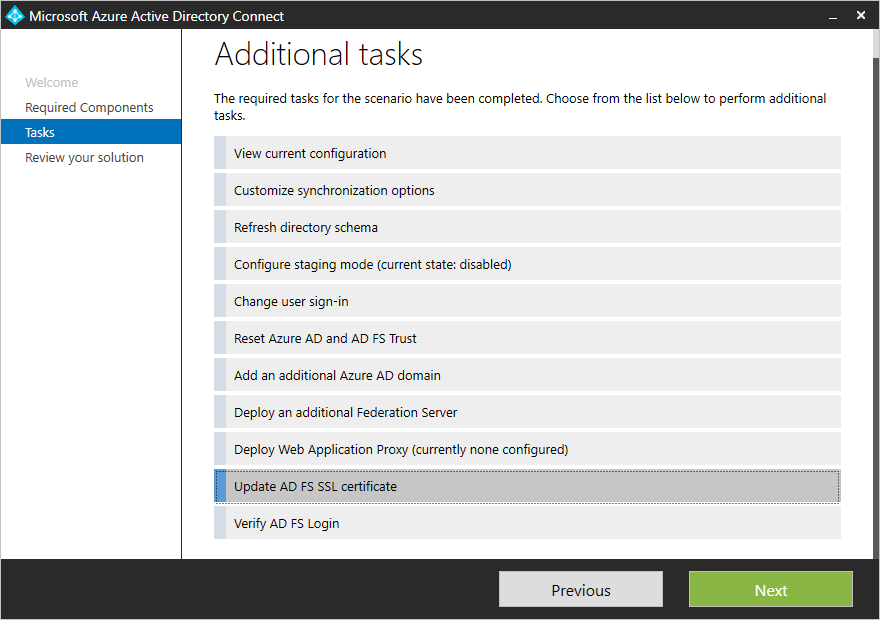
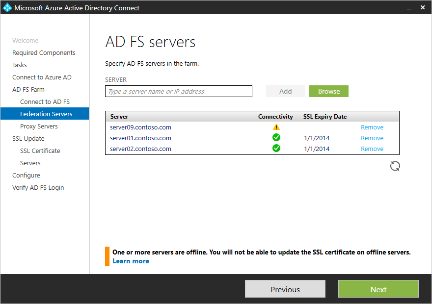

# Update the TLS/SSL certificate for an Active Directory Federation Services (AD FS) farm

## Overview
This article describes how you can use Microsoft Entra Connect to update the TLS/SSL certificate for an Active Directory Federation Services (AD FS) farm. You can use the Microsoft Entra Connect tool to easily update the TLS/SSL certificate for the AD FS farm even if the user sign-in method selected is not AD FS.

You can perform the whole operation of updating TLS/SSL certificate for the AD FS farm across all federation and Web Application Proxy (WAP) servers in three simple steps:

>[!NOTE]
>To learn more about certificates that are used by AD FS, see [Understanding certificates used by AD FS](/previous-versions/windows/it-pro/windows-server-2008-R2-and-2008/cc730660(v=ws.11)).

## Prerequisites

* **AD FS Farm**: Make sure that your AD FS farm is Windows Server 2012 R2-based or later.
* **Microsoft Entra Connect**: Ensure that the version of Microsoft Entra Connect is 1.1.553.0 or higher. You'll use the task **Update AD FS SSL certificate**.

## Step 1: Provide AD FS farm information

Microsoft Entra Connect attempts to obtain information about the AD FS farm automatically by:
1. Querying the farm information from AD FS (Windows Server 2016 or later).
2. Referencing the information from previous runs, which are stored locally with Microsoft Entra Connect.

You can modify the list of servers that are displayed by adding or removing the servers to reflect the current configuration of the AD FS farm. As soon as the server information is provided, Microsoft Entra Connect displays the connectivity and current TLS/SSL certificate status.

If the list contains a server that's no longer part of the AD FS farm, click **Remove** to delete the server from the list of servers in your AD FS farm.

>[!NOTE]
> Removing a server from the list of servers for an AD FS farm in Microsoft Entra Connect is a local operation and updates the information for the AD FS farm that Microsoft Entra Connect maintains locally. Microsoft Entra Connect doesn't modify the configuration on AD FS to reflect the change.    

## Step 2: Provide a new TLS/SSL certificate

After you've confirmed the information about AD FS farm servers, Microsoft Entra Connect asks for the new TLS/SSL certificate. Provide a password-protected PFX certificate to continue the installation.

After you provide the certificate, Microsoft Entra Connect goes through a series of prerequisites. Verify the certificate to ensure that the certificate is correct for the AD FS farm:

-	The subject name/alternate subject name for the certificate is either the same as the federation service name, or it's a wildcard certificate.
-	The certificate is valid for more than 30 days.
-	The certificate trust chain is valid.
-	The certificate is password protected.

## Step 3: Select servers for the update

In the next step, select the servers that need to have the TLS/SSL certificate updated. Servers that are offline can't be selected for the update.

After you complete the configuration, Microsoft Entra Connect displays the message that indicates the status of the update and provides an option to verify the AD FS sign-in.

   

## FAQs

* **What should be the subject name of the certificate for the new AD FS TLS/SSL certificate?**

    Microsoft Entra Connect checks if the subject name/alternate subject name of the certificate contains the federation service name. For example, if your federation service name is fs.contoso.com, the subject name/alternate subject name must be fs.contoso.com.  Wildcard certificates are also accepted.

* **Why am I asked for credentials again on the WAP server page?**

    If the credentials you provide for connecting to AD FS servers don't also have the privilege to manage the WAP servers, then Microsoft Entra Connect asks for credentials that have administrative privilege on the WAP servers.

* **The server is shown as offline. What should I do?**

    Microsoft Entra Connect can't perform any operation if the server is offline. If the server is part of the AD FS farm, then check the connectivity to the server. After you've resolved the issue, press the refresh icon to update the status in the wizard. If the server was part of the farm earlier but now no longer exists, click **Remove** to delete it from the list of servers that Microsoft Entra Connect maintains. Removing the server from the list in Microsoft Entra Connect doesn't alter the AD FS configuration itself. If you're using AD FS in Windows Server 2016 or later, the server remains in the configuration settings and will be shown again the next time the task is run.

* **Can I update a subset of my farm servers with the new TLS/SSL certificate?**

    Yes. You can always run the task **Update SSL Certificate** again to update the remaining servers. On the **Select servers for SSL certificate update** page, you can sort the list of servers on **SSL Expiry date** to easily access the servers that aren't updated yet.

* **I removed the server in the previous run, but it's still being shown as offline and listed on the AD FS Servers page. Why is the offline server still there even after I removed it?**

    Removing the server from the list in Microsoft Entra Connect doesn't remove it in the AD FS configuration. Microsoft Entra Connect references AD FS (Windows Server 2016 or higher) for any information about the farm. If the server is still present in the AD FS configuration, it will be listed back in the list.  

## Next steps

- [Microsoft Entra Connect and federation](how-to-connect-fed-whatis.md)
- [Active Directory Federation Services management and customization with Microsoft Entra Connect](how-to-connect-fed-management.md)
