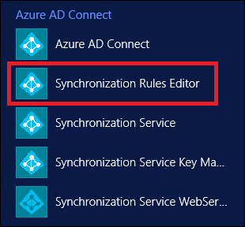
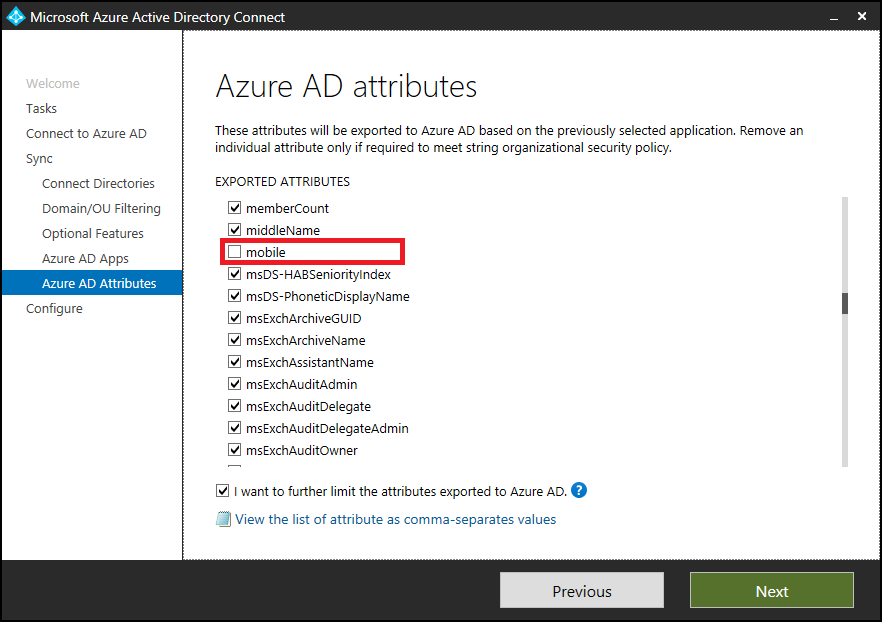
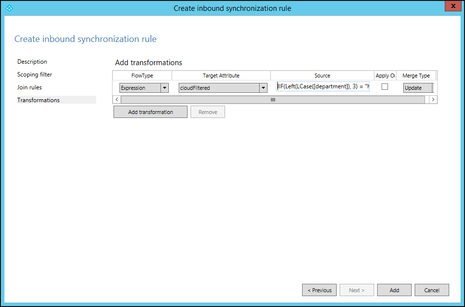
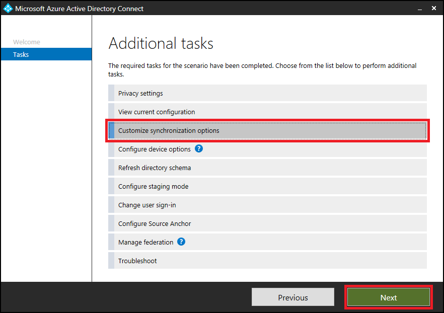
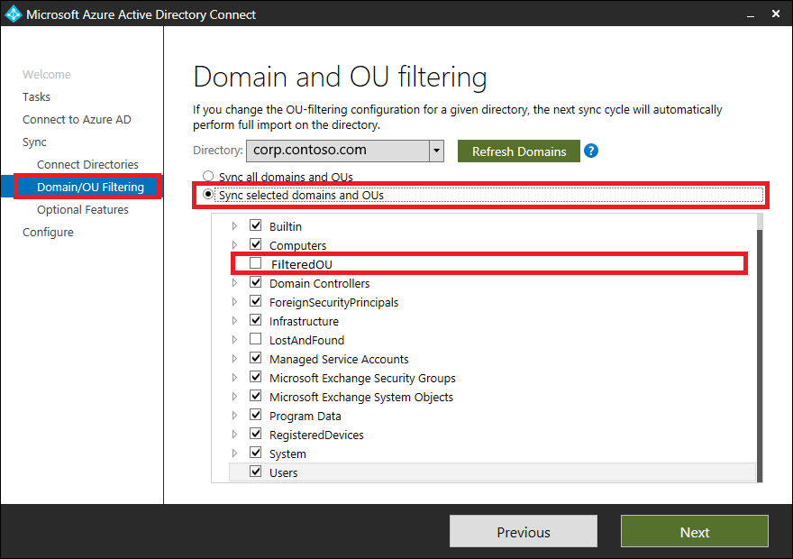
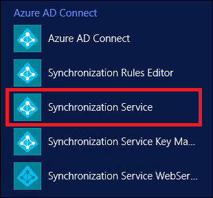
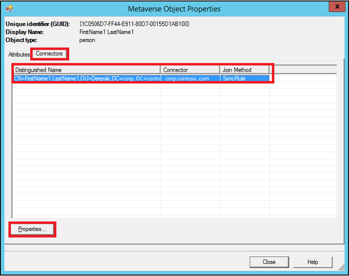
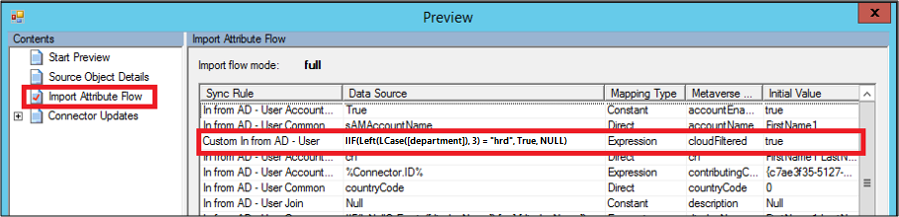

# Fix modified default rules in Microsoft Entra Connect

Microsoft Entra Connect uses default rules for synchronization.  Unfortunately, these rules don't apply universally to all organizations. Based on your requirements, you might need to modify them. This article discusses two examples of the most common customizations, and explains the correct way to achieve these customizations.

>[!NOTE] 
> Modifying existing default rules to achieve a needed customization isn't supported. If you do so, it prevents updating these rules to the latest version in future releases. You won't get the bug fixes you need, or new features. This document explains how to achieve the same result without modifying the existing default rules. 

## How to identify modified default rules
Starting with version 1.3.7.0 of Microsoft Entra Connect, it's easy to identify the modified default rule. Go to **Apps on Desktop**, and select **Synchronization Rules Editor**.

In the Editor, any modified default rules are shown with a warning icon in front of the name.

 A disabled rule with same name next to it also appears (this is the standard default rule).

## Common customizations
The following are common customizations to the default rules:

- Change attribute flow
- Change scoping filter
- Change join condition

Before you change any rules:

- Disable the sync scheduler. The scheduler runs every 30 minutes by default. Make sure it's not starting while you're making changes and troubleshooting your new rules. To temporarily disable the scheduler, start PowerShell, and run `Set-ADSyncScheduler -SyncCycleEnabled $false`.
 

- The change in scoping filter can result in deletion of objects in the target directory. Be careful before making any changes in the scoping of objects. We recommend that you make changes to a staging server before making changes on the active server.
- Run a preview on a single object, as mentioned in the [Validate Sync Rule](#validate-sync-rule) section, after adding any new rule.
- Run a full sync after adding a new rule or modifying any custom sync rule. This sync applies new rules to all the objects.

## Change attribute flow
There are three different scenarios for changing the attribute flow:
- Adding a new attribute.
- Overriding the value of an existing attribute.
- Choosing not to sync an existing attribute.

You can do these without altering standard default rules.

### Add a new attribute
If you find that an attribute is not flowing from your source directory to the target directory, use the [Microsoft Entra Connect Sync: Directory extensions](how-to-connect-sync-feature-directory-extensions.md) to fix this.

If the extensions don't work for you, try adding two new sync rules, described in the following sections.

#### Add an inbound sync rule
An inbound sync rule means the source for the attribute is a connector space, and the target is the metaverse. For example, to have a new attribute flow from on-premises Active Directory to Microsoft Entra ID, create a new inbound sync rule. Launch the **Synchronization Rules Editor**, select **Inbound** as the direction, and select **Add new rule**. 

 

Follow your own naming convention to name the rule. Here, we use **Custom In from AD - User**. This means that the rule is a custom rule, and is an inbound rule from the Active Directory connector space to the metaverse.   

 

Provide your own description of the rule, so that future maintenance of the rule is easy. For example, the description can be based on what the objective of the rule is, and why it's needed.

Make your selections for the **Connected System**, **Connected System Object Type**, and **Metaverse Object Type** fields.

Specify the precedence value from 0 through 99 (the lower the number, the higher the precedence). For the **Tag**, **Enable Password Sync**, and **Disabled** fields, use the default selections.

Keep **Scoping filter** empty. This means that the rule applies to all the objects joined between the Active Directory Connected System and the metaverse.

Keep **Join rules** empty. This means this rule uses the join condition defined in the standard default rule. This is another reason not to disable or delete the standard default rule. If there is no join condition, the attribute won't flow. 

Add appropriate transformations for your attribute. You can assign a constant, to make a constant value flow to your target attribute. You can use direct mapping between the source or target attribute. Or, you can use an expression for the attribute. Here are various [expression functions](./reference-connect-sync-functions-reference.md) you can use.

#### Add an outbound sync rule
To link the attribute to the target directory, you need to create an outbound rule. This means that the source is the metaverse, and the target is the connected system. To create an outbound rule, launch the **Synchronization Rules Editor**, change the **Direction** to **Outbound**, and select **Add new rule**. 

As with the inbound rule, you can use your own naming convention to name the rule. Select the **Connected System** as the Microsoft Entra tenant, and select the connected system object to which you want to set the attribute value. Set the precedence from 0 through 99. 

Keep **Scoping filter** and **Join rules** empty. Fill in the transformation as constant, direct, or expression. 

You now know how to make a new attribute for a user object flow from Active Directory to Microsoft Entra ID. You can use these steps to map any attribute from any object to source and target. For more information, see [Creating custom sync rules](how-to-connect-create-custom-sync-rule.md) and [Prepare to provision users](/microsoft-365/enterprise/prepare-for-directory-synchronization).

### Override the value of an existing attribute
You might want to override the value of an attribute that has already been mapped. For example, if you always want to set a null value to an attribute in Microsoft Entra ID, simply create an inbound rule only. Make the expression value, `AuthoritativeNull`, flow to the target attribute. 

>[!NOTE] 
> Use `AuthoritativeNull` instead of `Null` in this case. This is because the non-null value replaces the null value, even if it has lower precedence (a higher number value in the rule). `AuthoritativeNull`, on the other hand, isn't replaced with a non-null value by other rules. 

### Don’t sync existing attribute
If you want to exclude an attribute from syncing, use the attribute filtering feature provided in Microsoft Entra Connect. Launch **Microsoft Entra Connect** from the desktop icon, and then select **Customize synchronization options**.

 Make sure **Microsoft Entra app and attribute filtering** is selected, and select **Next**.

Clear the attributes that you want to exclude from syncing.

## Change scoping filter
Azure AD Sync takes care of most of the objects. You can reduce the scope of objects, and reduce the number of objects to be exported, without changing the standard default sync rules. 

Use one of the following methods to reduce the scope of the objects you're syncing:

- cloudFiltered attribute
- Organization unit filtering

If you reduce the scope of the users being synced, the password hash syncing also stops for the filtered-out users. If the objects are already syncing, after you reduce scope, the filtered-out objects are deleted from the target directory. For this reason, ensure that you scope very carefully.

>[!IMPORTANT] 
> Increasing the scope of objects configured by Microsoft Entra Connect isn't recommended. Doing so makes it difficult for the Microsoft support team to understand the customizations. If you must increase the scope of objects, edit the existing rule, clone it, and disable the original rule. 

### cloudFiltered attribute
You can't set this attribute in Active Directory. Set the value of this attribute by adding a new inbound rule. You can then use **Transformation** and **Expression** to set this attribute in the metaverse. The following example shows that you don’t want to sync all the users whose department name starts with **HRD** (case-insensitive):

`cloudFiltered <= IIF(Left(LCase([department]), 3) = "hrd", True, NULL)`

We first converted the department from source (Active Directory) to lowercase. Then, using the `Left` function, we took only the first three characters and compared it with `hrd`. If it matched, the value is set to `True`, otherwise `NULL`. In setting the value to null, some other rule with lower precedence (a higher number value) can write to it with a different condition. Run preview on one object to validate sync rule, as mentioned in the [Validate sync rule](#validate-sync-rule) section.

### Organizational unit filtering
You can create one or more organizational units (OUs), and move the objects you don’t want to sync to these OUs. Then, configure the OU filtering in Microsoft Entra Connect. Launch **Microsoft Entra Connect** from the desktop icon, and select the following options. You can also configure the OU filtering at the time of installation of Microsoft Entra Connect. 

Follow the wizard, and clear the OUs you don’t want to sync.

## Change join condition
Use the default join conditions configured by Microsoft Entra Connect. Changing default join conditions makes it difficult for Microsoft support to understand the customizations and support the product.

## Validate sync rule
You can validate the newly added sync rule by using the preview feature, without running the full sync cycle. In Microsoft Entra Connect, select **Synchronization Service**.

Select **Metaverse Search**. Select the scope object as **person**, select **Add Clause**, and mention your search criteria. Next, select **Search**, and double-click the object in the search results. Make sure that your data in Microsoft Entra Connect is up-to-date for that object, by running import and sync on the forest before you run this step.

On **Metaverse Object Properties**, select **Connectors**, select the object in the corresponding connector (forest), and select **Properties…**.

Select **Preview…**

In the Preview window, select **Generate Preview** and **Import Attribute Flow** in the left pane.

 
Here, notice that the newly added rule is run on the object, and has set the `cloudFiltered` attribute to true.

 
To compare the modified rule with the default rule, export both of the rules separately, as text files. These rules are exported as a PowerShell script file. You can compare them by using any file comparison tool (for example, windiff) to see the changes. 
 
Notice that in the modified rule, the `msExchMailboxGuid` attribute is changed to the **Expression** type, instead of **Direct**. Also, the value is changed to **NULL** and **ExecuteOnce** option. You can ignore Identified and Precedence differences. 

 
To fix your rules to change them back to default settings, delete the modified rule and enable the default rule. Ensure that you don't lose the customization you're trying to achieve. When you're ready, run **Full Synchronization**.

## Next steps
- [Hardware and prerequisites](how-to-connect-install-prerequisites.md) 
- [Express settings](how-to-connect-install-express.md)
- [Customized settings](how-to-connect-install-custom.md)
