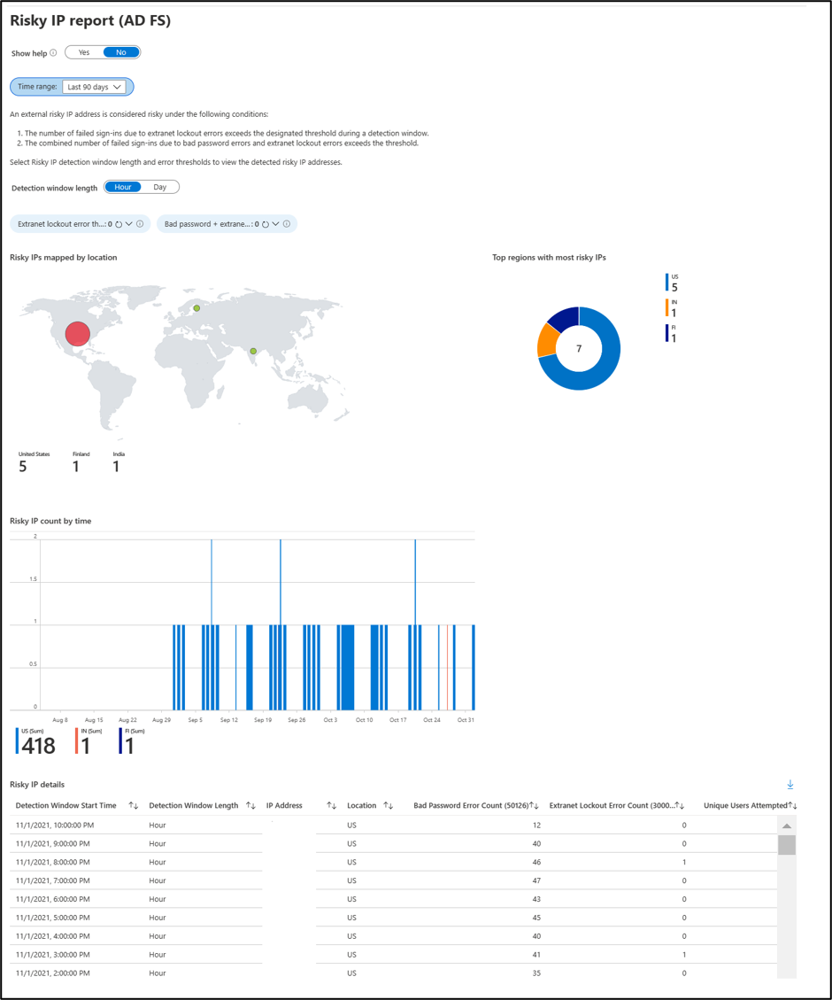
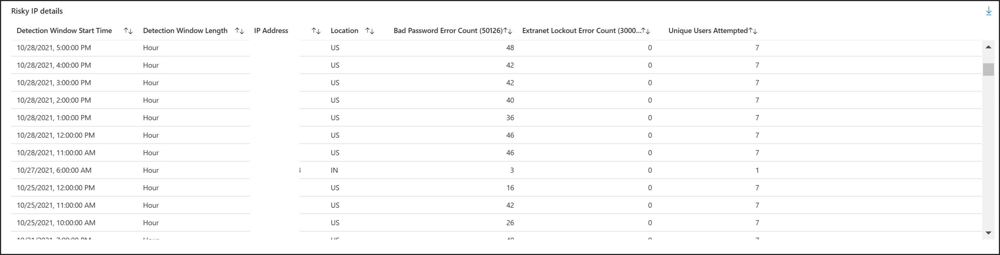
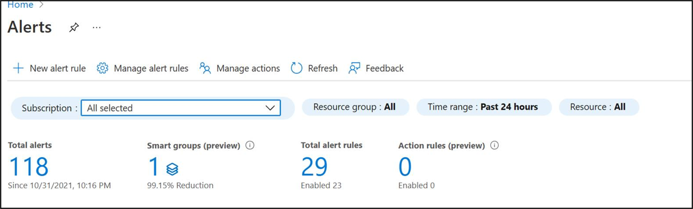

# Risky IP report workbook 
> [!NOTE]
> To use the Risky IP report workbook , you must enable ‘ADFSSignInLogs’ in the Diagnostic Settings blade. This is a Log Analytics stream with AD FS Sign-Ins sent to Azure AD through Connect Health. To learn more about AD FS Sign-Ins in Azure AD, view our documentation here.

AD FS customers may expose password authentication endpoints to the internet to provide authentication services for end users to access SaaS applications such as Microsoft 365. In this case, it is possible for a bad actor to attempt logins against your AD FS system to guess an end user’s password and get access to application resources. AD FS provides the extranet account lockout functionality to prevent these types of attacks since AD FS in Windows Server 2012 R2. If you are on a lower version, we strongly recommend that you upgrade your AD FS system to Windows Server 2016. <br />

Additionally, it is possible for a single IP address to attempt multiple logins against multiple users. In these cases, the number of attempts per user may be under the threshold for account lockout protection in AD FS. Azure AD Connect Health now provides the “Risky IP report” that detects this condition and notifies administrators. The following are the key benefits for this report: 
- Detection of IP addresses that exceed a threshold of failed password-based logins
- Supports failed logins due to bad password or due to extranet lockout state
- Supports enabling alerts through Azure Alerts
- Customizable threshold settings that match with the security policy of an organization
- Customizable queries and expanded visualizations for further analysis
- Expanded functionality from the previous Risky IP report, which will be deprecated after January 24, 2022.

## Requirements
1. Connect Health for AD FS installed and updated to the latest agent.
2. A Log Analytics Workspace with the “ADFSSignInLogs” stream enabled.
3. Permissions to use the Azure AD Monitor Workbooks. To use Workbooks, you need:
- An Azure Active Directory tenant with a premium (P1 or P2) license.
- Access to a Log Analytics Workspace and the following roles in Azure AD (if accessing Log Analytics through Azure portal): Security administrator, Security reader, Reports reader, Global administrator


## What is in the report?
The Risky IP report workbook is powered from data in the ADFSSignInLogs stream and can quickly visualize and analyze risky IPs. The parameters can be configured and customized for threshold counts. The workbook is also configurable based on queries, and each query can be updated and modified based on the organization’s needs.

The risky IP workbook analyzes data from ADFSSignInLogs to help you detect password spray or password brute force attacks. The workbook has two parts. The first part "Risky IP Analysis" identifies risky IP addresses based on designated error thresholds and detection window length. The second part provides the sign-in details and error counts for selected IPs.

[](./media/how-to-connect-health-adfs-risky-ip-workbook/workbook-template-overview-1.png#lightbox)

- The workook displays a map visualization and region breakdown for a quick analysis of risky IP location.
- Risky IP details table parallels the functionality of the past Risky IP report. For details on the fields in the table, view the below section.
- Risky IP timeline displays a quick view of any anomalies or spikes in requests in a timeline view
- Sign in details and error counts by IP allows a detailed filtered view by IP or user, to expand on the details table. 

Each item in the Risky IP report table shows aggregated information about failed AD FS sign-in activities which exceed designated threshold. It provides the following information:
[](./media/how-to-connect-health-adfs-risky-ip-workbook/risky-ip-table-1.png#lightbox)

| Report Item | Description |
| ------- | ----------- |
| Detection Window Start Time | Shows the time stamp based on Azure portal local time when the detection time window starts.<br /> All daily events are generated at mid-night UTC time. <br />Hourly events have the timestamp rounded to the beginning of the hour. You can find first activity start time from “firstAuditTimestamp” in the exported file. |
| Detection Window Length | Shows the type of detection time window. The aggregation trigger types are per hour or per day. This is helpful to detect versus a high frequency brute force attack versus a slow attack where the number of attempts is distributed throughout the day. |
| IP Address | The single risky IP address that had either bad password or extranet lockout sign-in activities. This could be an IPv4 or an IPv6 address. |
| Bad Password Error Count (50126) | The count of Bad Password error occurred from the IP address during the detection time window. The Bad Password errors can happen multiple times to certain users. Notice this does not include failed attempts due to expired passwords. |
| Extranet Lock Out Error Count (300030) | The count of Extranet Lockout error occurred from the IP address during the detection time window. The Extranet Lockout errors can happen multiple times to certain users. This will only be seen if Extranet Lockout is configured in AD FS (versions 2012R2 or higher). <b>Note</b> We strongly recommend turning this feature on if you allow extranet logins using passwords. |
| Unique Users Attempted | The count of unique user accounts attempted from the IP address during the detection time window. This provides a mechanism to differentiate a single user attack pattern versus multi-user attack pattern.  |

Filter the report by IP address or user name to see an expanded view of sign-ins details for each risky IP event.

## Accessing the workbook

[!INCLUDE [portal updates](~/articles/active-directory/includes/portal-update.md)]

To access the workbook:

1. Sign in to the [Azure portal](https://portal.azure.com).
2. Navigate to **Azure Active Directory** > **Monitoring** > **Workbooks**. 
3. Select the Risky IP report workbook. 

## Load balancer IP addresses in the list
Load balancer aggregate failed sign-in activities and hit the alert threshold. If you are seeing load balancer IP addresses, it is highly likely that your external load balancer is not sending the client IP address when it passes the request to the Web Application Proxy server. Please configure your load balancer correctly to pass forward client IP address. 

## Configure threshold settings
Alerting threshold can be updated through Threshold Settings. To start with, system has threshold set by default. Threshold settings can be set by either hour or day detection times, and can be customized in the filters.

[](./media/how-to-connect-health-adfs-risky-ip-workbook/threshold-settings-1.png#lightbox)

| Threshold Item | Description |
| --- | --- |
| Bad Password + Extranet Lockout Threshold  | Threshold setting to report the activity and trigger alert notification when the count of Bad Password plus the count of Extranet Lockout exceeds it per **hour or day**.|
| Extranet Lockout Error Threshold | Threshold setting to report the activity and trigger alert notification when the count of Extranet Lockout exceeds it per **hour or day**. Default value is 50.|

**Hour or Day** detection window length can be configured through the toggle button above the filters for customizing thresholds. 

<a name='configure-notification-alerts-using-azure-monitor-alerts-through-the-azure-portal'></a>

## Configure notification alerts using Azure Monitor Alerts through the Azure portal:
[](./media/how-to-connect-health-adfs-risky-ip-workbook/azure-alerts-rule-1.png#lightbox)
1. In the Azure portal, search for “Monitor” in the search bar to navigate to the Azure “Monitor” service. Select “Alerts” from the left menu, then “+ New alert rule”. 
2. On the “Create alert rule” blade:
   * Scope: Click “Select resource” and select your Log Analytics workspace that contains the ADFSSignInLogs you wish to monitor.
   * Condition: Click “Add condition”. Select “Log” for Signal type and “Log analytics” for Monitor service. Choose “Custom log search”. 

3. Configure the condition for triggering the alert. To match the email notifications in the Connect Health Risky IP Report, follow the instructions below.
   * Copy and paste the following query and specify the error count thresholds. This query generates the number of IPs that exceed the designated error thresholds.

```
ADFSSignInLogs
| extend ErrorCode = ResultType
| where ErrorCode in ("50126", "300030")
| summarize badPasswordErrorCount = countif(ErrorCode == "50126"), extranetLockoutErrorCount = countif(ErrorCode == "300030") by IPAddress
| where extranetLockoutErrorCount > [TODO: put error count threshold here] 
```
or for a combined threshold:
```
badPasswordErrorCount + extranetLockoutErrorCount > [TODO: put error count threshold here] // Customized thresholds
```

> [!NOTE]
> The alert logic means that the alert would be triggered if at least one IP from the extranet lockout error counts, or combined bad password and extranet lockout error counts exceeds the designated thresholds. You can select the frequency for evaluating the query to detect Risky IPs.


## FAQ
**Why am I seeing load balancer IP addresses in the report?**  <br />
If you are seeing load balancer IP addresses, it is highly likely that your external load balancer is not sending the client IP address when it passes the request to the Web Application Proxy server. Please configure your load balancer correctly to pass forward client IP address. 

**What do I do to block the IP address?**  <br />
You should add identified malicious IP address to the firewall or block in Exchange.   <br />

**Why am I not seeing any items in this report?** <br />
- 'ADFSSignInLogs' Log Analytics stream is not enabled in Diagnostic Settings.
- Failed sign-in activities are not exceeding the threshold settings.
- Ensure no “Health service is not up to date” alert active in your AD FS server list.  Read more about [how to troubleshoot this alert](how-to-connect-health-data-freshness.md)
- Audits is not enabled in AD FS farms.

## Next steps
* [Azure AD Connect Health](./whatis-azure-ad-connect.md)
* [Azure AD Connect Health Agent Installation](how-to-connect-health-agent-install.md)
