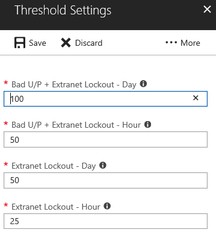

# The Risky IP report (preview)

Active Directory Federation Services (AD FS) customers may expose password authentication endpoints to the internet to provide authentication services for end users to access SaaS applications such as Microsoft 365. 

It's possible for a bad actor to attempt logins against your AD FS system to guess an end user’s password and get access to application resources. As of Windows Server 2012 R2, AD FS provides the extranet account lockout functionality to prevent these types of attacks. If you're on an earlier version, we strongly recommend that you upgrade your AD FS system to Windows Server 2016.

Additionally, it's possible for a single IP address to attempt multiple logins against multiple users. In these cases, the number of attempts per user might be under the threshold for account lockout protection in AD FS. 

Microsoft Entra Connect Health now provides the *Risky IP report*, which detects this condition and notifies administrators. Here are the key benefits of using this report: 

- Detects IP addresses that exceed a threshold of failed password-based logins
- Supports failed logins resulting from bad password or extranet lockout state
- Provides email notifications to alert administrators, with customizable email settings
- Provides customizable threshold settings that match the security policy of an organization
- Provides downloadable reports for offline analysis and integration with other systems via automation

> [!NOTE]
> To use this report, you must ensure that AD FS auditing is enabled. For more information, see [Enable auditing for AD FS](how-to-connect-health-agent-install.md#enable-auditing-for-ad-fs).
>
> To access this preview release, you need Global Administrator or [Security Reader](../../roles/permissions-reference.md#security-reader) permissions.  

## What's in the report?

The failed sign-in activity client IP addresses are aggregated through Web Application Proxy servers. Each item in the Risky IP report shows aggregated information about failed AD FS sign-in activities that have exceeded the designated threshold. 

The report provides the following information:

| Report&nbsp;item | Description |
| ------- | ----------- |
| Time Stamp | The time stamp that's based on [Microsoft Entra admin center](https://entra.microsoft.com) local time when the detection time window starts.  All daily events are generated at midnight UTC time.  Hourly events have the time stamp rounded to the beginning of the hour. You can find the first activity start time from “firstAuditTimestamp” in the exported file. |
| Trigger Type | The type of detection time window. The aggregation trigger types are per hour or per day. They're helpful in differentiating between a high-frequency brute force attack and a slow attack, where the number of attempts is distributed throughout the day. |
| IP Address | The single risky IP address that had either bad password or extranet lockout sign-in activities. It can be either an IPv4 or an IPv6 address. |
| Bad Password Error Count | The count of bad password errors that occur from the IP address during the detection time window. Bad password errors can happen multiple times to certain users. **Note**: This count doesn't include failed attempts resulting from expired passwords. |
| Extranet Lockout Error Count | The count of extranet lockout errors that occur from the IP address during the detection time window. The extranet lockout errors can happen multiple times to certain users. This count is displayed only if Extranet Lockout is configured in AD FS (versions 2012R2 and later). **Note**: We strongly recommend enabling this feature if you allow extranet logins that use passwords. |
| Unique Users Attempted | The count of unique user accounts that are attempted from the IP address during the detection time window. Differentiates between a single user attack pattern and a multi-user attack pattern.  |

For example, the following report item indicates that during the 6 PM to 7 PM window on February 28, 2018, the IP address *104.2XX.2XX.9* had no bad password errors and 284 extranet lockout errors. Fourteen unique users were affected within the criteria. The activity event exceeded the designated report's hourly threshold. 

> [!NOTE]
> - Only activities that exceed the designated threshold are displayed in the report list. 
> - This report tracks the past 30 days at most.
> - This alert report doesn't show Exchange IP addresses or private IP addresses. They are still included in the export list. 

## Load balancer IP addresses in the list

Your load balancer aggregate might have failed, causing it to hit the alert threshold. If you're seeing load balancer IP addresses, it's highly likely that your external load balancer isn't sending the client IP address when it passes the request to the Web Application Proxy server. Configure your load balancer correctly to pass forward the client IP address. 

## Download the Risky IP report 

Using the **Download** functionality, the whole risky IP address list in the past 30 days can be exported from the Connect Health Portal
The export result will include all the failed AD FS sign-in activities in each detection time window, so you can customize the filtering after the export. 
Besides the highlighted aggregations in the portal, the export result also shows more details about failed sign-in activities per IP address:

|  Report Item  |  Description  | 
| ------- | ----------- | 
| firstAuditTimestamp | The first time stamp when the failed activities started during the detection time window.  | 
| lastAuditTimestamp | The last time stamp when the failed activities ended during the detection time window.  | 
| attemptCountThresholdIsExceeded | The flag if the current activities are exceeding the alerting threshold.  | 
| isWhitelistedIpAddress | The flag if the IP address is filtered from alerting and reporting. Private IP addresses (*10.x.x.x, 172.x.x.x* and *192.168.x.x*) and Exchange IP addresses are filtered and marked as *True*. If you're seeing private IP address ranges, it's highly likely that your external load balancer isn't sending the client IP address when it passes the request to the Web Application Proxy server.  | 

## Configure notification settings

You can update the report's administrator contacts through the **Notification Settings**. By default, the risky IP alert email notification is in an *off* state. You can enable the notification by toggling the button under **Get email notifications for IP addresses exceeding failed activity threshold report**.

Like generic alert notification settings in Connect Health, it allows you to customize the designated notification recipient list about the Risky IP report from here. You can also notify all hybrid identity administrators while you're making the change. 

## Configure threshold settings

You can update the alerting threshold in **Threshold Settings**. The system threshold is set with default values, which are shown in the following screenshot and described in the table. 

The risk IP report threshold settings are separated into four categories.

| Threshold setting | Description |
| --- | --- |
| (Bad U/P + Extranet Lockout) / Day  | Reports the activity and triggers an alert notification when the count of Bad Password plus the count of Extranet Lockout exceeds the threshold, per *day*. The default value is 100.|
| (Bad U/P + Extranet Lockout) / Hour | Reports the activity and triggers an alert notification when the count of Bad Password plus the count of Extranet Lockout exceeds the threshold, per *hour*. The default value is 50.|
| Extranet Lockout / Day | Reports the activity and triggers an alert notification when the count of Extranet Lockout exceeds the threshold, per *day*. The default value is 50.|
| Extranet Lockout / Hour | Reports the activity and triggers an alert notification when the count of Extranet Lockout exceeds the threshold, per *hour*. The default value is 25.|

> [!NOTE]
> - The change of the report threshold will be applied an hour after the setting change. 
> - Existing reported items will not be affected by the threshold change. 
> - We recommend that you analyze the number of events reported within your environment and adjust the threshold appropriately. 
>
>

## FAQ

**Why am I seeing private IP address ranges in the report?**

Private IP addresses (*10.x.x.x, 172.x.x.x* and *192.168.x.x*) and Exchange IP addresses are filtered and marked as *True* in the IP approved list. If you're seeing private IP address ranges, it's highly likely that your external load balancer isn't sending the client IP address when it passes the request to the Web Application Proxy server.

**Why am I seeing load balancer IP addresses in the report?**

If you're seeing load balancer IP addresses, it's highly likely that your external load balancer isn't sending the client IP address when it passes the request to the Web Application Proxy server. Configure your load balancer correctly to pass forward the client IP address. 

**How can I block the IP address?**

You should add the identified malicious IP address to the firewall or block it in Exchange.

**Why can't I see any items in this report?**

- Failed sign-in activities aren't exceeding the threshold settings.
- Ensure that no “Health service isn't up to date” alert is active in your AD FS server list.  Read more about [how to troubleshoot this alert](how-to-connect-health-data-freshness.md).
- Audits aren't enabled in AD FS farms.

**Why can't I access the report?**

You need to have Global Administrator or [Security Reader](../../roles/permissions-reference.md#security-reader) permissions. Contact your Global Administrator for access.

## Next steps
* [Microsoft Entra Connect Health](./whatis-azure-ad-connect.md)
* [Microsoft Entra Connect Health agent installation](how-to-connect-health-agent-install.md)
