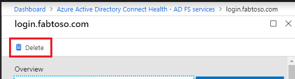

# Azure Active Directory Connect Health operations
This topic describes the various operations you can perform by using Azure Active Directory (Azure AD) Connect Health.

## Enable email notifications
You can configure the Azure AD Connect Health service to send email notifications when alerts indicate that your identity infrastructure is not healthy. This occurs when an alert is generated, and when it is resolved.

> [!NOTE]
> Email notifications are enabled by default.
>

### To enable Azure AD Connect Health email notifications
1. In the Azure portal, search for Azure AD Connect Health
2. Select **Sync errors**
3. Select **Notification Settings**.
5. At the email notification switch, select **ON**.
6. Select the check box if you want all Hybrid Identity Administrators to receive email notifications.
7. If you want to receive email notifications at any other email addresses, specify them in the **Additional Email Recipients** box. To remove an email address from this list, right-click the entry and select **Delete**.
8. To finalize the changes, click **Save**. Changes take effect only after you save.

>[!NOTE] 
> When there are issues processing synchronization requests in our backend service, this service sends a notification email with the details of the error to the administrative contact email address(es) of your tenant. We heard feedback from customers that in certain cases the volume of these messages is prohibitively large so we are changing the way we send these messages. 
>
> Instead of sending a message for every sync error every time it occurs we will send out a daily digest of all errors the backend service has returned. Sync error emails are sent once a day, based on the previous day's unresolved errors. So if the customer triggers an error, but resolves it fairly quickly, they will not get an email the following day. This enables customers to process these errors in a more efficient manner and reduces the number of duplicate error messages.

## Delete a server or service instance

>[!NOTE] 
> Azure AD premium license is required for the deletion steps.

In some instances, you might want to remove a server from being monitored. Here's what you need to know to remove a server from the Azure AD Connect Health service.

When you're deleting a server, be aware of the following:

* This action stops collecting any further data from that server. This server is removed from the monitoring service. After this action, you are not able to view new alerts, monitoring, or usage analytics data for this server.
* This action does not uninstall the Health Agent from your server. If you have not uninstalled the Health Agent before performing this step, you might see errors related to the Health Agent on the server.
* This action does not delete the data already collected from this server. That data is deleted in accordance with the Azure data retention policy.
* After performing this action, if you want to start monitoring the same server again, you must uninstall and reinstall the Health Agent on this server.

### Delete a server from the Azure AD Connect Health service

>[!NOTE] 
> Azure AD premium license is required for the deletion steps.

Azure AD Connect Health for Active Directory Federation Services (AD FS) and Azure AD Connect (Sync):

1. Open the **Server** blade from the **Server List** blade by selecting the server name to be removed.
2. On the **Server** blade, from the action bar, click **Delete**.

3. Confirm by typing the server name in the confirmation box.
4. Click **Delete**.

Azure AD Connect Health for Azure Active Directory Domain Services:

1. Open the **Domain Controllers** dashboard.
2. Select the domain controller to be removed.
3. From the action bar, click **Delete Selected**.
4. Confirm the action to delete the server.
5. Click **Delete**.

### Delete a service instance from Azure AD Connect Health service
In some instances, you might want to remove a service instance. Here's what you need to know to remove a service instance from the Azure AD Connect Health service.

When you're deleting a service instance, be aware of the following:

* This action removes the current service instance from the monitoring service.
* This action does not uninstall or remove the Health Agent from any of the servers that were monitored as part of this service instance. If you have not uninstalled the Health Agent before performing this step, you might see errors related to the Health Agent on the servers.
* All data from this service instance is deleted in accordance with the Azure data retention policy.
* After performing this action, if you want to start monitoring the service, uninstall and reinstall the Health Agent on all the servers. After performing this action, if you want to start monitoring the same server again, uninstall, reinstall, and register the Health Agent on that server.

#### To delete a service instance from the Azure AD Connect Health service
1. Open the **Service** blade from the **Service List** blade by selecting the service identifier (farm name) that you want to remove. 
2. On the **Service** blade, from the action bar, click **Delete**. 

3. Confirm by typing the service name in the confirmation box (for example: sts.contoso.com).
4. Click **Delete**.
     

[//]: # (Start of RBAC section)
## Manage access with Azure RBAC
[Azure role-based access control (Azure RBAC)](../../roles/permissions-reference.md) for Azure AD Connect Health provides access to users and groups other than Hybrid Identity Administrators. Azure RBAC assigns roles to the intended users and groups, and provides a mechanism to limit the Hybrid Identity Administrators within your directory.

### Roles
Azure AD Connect Health supports the following built-in roles:

| Role | Permissions |
| --- | --- |
| Owner |Owners can *manage access* (for example, assign a role to a user or group), *view all information* (for example, view alerts) from the portal, and *change settings* (for example, email notifications) within Azure AD Connect Health.  By default, Azure AD Hybrid Identity Administrators are assigned this role, and this cannot be changed. |
| Contributor |Contributors can *view all information* (for example, view alerts) from the portal, and *change settings* (for example, email notifications) within Azure AD Connect Health. |
| Reader |Readers can *view all information* (for example, view alerts) from the portal within Azure AD Connect Health. |

All other roles (such as User Access Administrators or DevTest Labs Users) have no impact to access within Azure AD Connect Health, even if the roles are available in the portal experience.

### Access scope
Azure AD Connect Health supports managing access at two levels:

* **All service instances**: This is the recommended path in most cases. It controls access for all service instances (for example, an AD FS farm) across all role types that are being monitored by Azure AD Connect Health.
* **Service instance**: In some cases, you might need to segregate access based on role types or by a service instance. In this case, you can manage access at the service instance level.  

Permission is granted if an end user has access either at the directory or service instance level.

### Allow users or groups access to Azure AD Connect Health
The following steps show how to allow access.
#### Step 1: Select the appropriate access scope
To allow a user access at the *all service instances* level within Azure AD Connect Health, open the main blade in Azure AD Connect Health. 

#### Step 2: Add users and groups, and assign roles
1. From the **Configure** section, click **Users**. 
   
2. Select **Add**.
3. In the **Select a role** pane, select a role (for example, **Owner**). 
   
4. Type the name or identifier of the targeted user or group. You can select one or more users or groups at the same time. Click **Select**.
   
5. Select **OK**. 
6. After the role assignment is complete, the users and groups appear in the list. 
   

Now the listed users and groups have access, according to their assigned roles.

> [!NOTE]
> * Global administrators always have full access to all the operations, but global administrator accounts are not present in the preceding list.
> * The Invite Users feature is not supported within Azure AD Connect Health.
>
>

#### Step 3: Share the blade location with users or groups
1. After you assign permissions, a user can access Azure AD Connect Health by going [here](https://aka.ms/aadconnecthealth).
2. On the blade, the user can pin the blade, or different parts of it, to the dashboard. Simply click the **Pin to dashboard** icon. 
   

> [!NOTE]
> A user with the Reader role assigned is not able to get Azure AD Connect Health extension from the Azure Marketplace. The user cannot perform the necessary "create" operation to do so. The user can still get to the blade by going to the preceding link. For subsequent usage, the user can pin the blade to the dashboard.
>
>

### Remove users or groups
You can remove a user or a group added to Azure AD Connect Health and Azure RBAC. Simply right-click the user or group, and select **Remove**. 

[//]: # (End of RBAC section)

## Next steps
* [Azure AD Connect Health](./whatis-azure-ad-connect.md)
* [Azure AD Connect Health Agent installation](how-to-connect-health-agent-install.md)
* [Using Azure AD Connect Health with AD FS](how-to-connect-health-adfs.md)
* [Using Azure AD Connect Health for sync](how-to-connect-health-sync.md)
* [Using Azure AD Connect Health with AD DS](how-to-connect-health-adds.md)
* [Azure AD Connect Health FAQ](reference-connect-health-faq.yml)
* [Azure AD Connect Health version history](reference-connect-health-version-history.md)
