# Custom installation of Azure Active Directory Connect
Use *custom settings* in Azure Active Directory (Azure AD) Connect when you want more options for the installation. Use these settings, for example, if you have multiple forests or if you want to configure optional features. Use custom settings in all cases where [express installation](how-to-connect-install-express.md) doesn't satisfy your deployment or topology needs.

Prerequisites:
- [Download Azure AD Connect](https://go.microsoft.com/fwlink/?LinkId=615771).
- Complete the prerequisite steps in [Azure AD Connect: Hardware and prerequisites](how-to-connect-install-prerequisites.md). 
- Make sure you have the accounts described in [Azure AD Connect accounts and permissions](reference-connect-accounts-permissions.md).

## Custom installation settings 

To set up a custom installation for Azure AD Connect, go through the wizard pages that the following sections describe.

### Express settings
On the **Express Settings** page, select **Customize** to start a customized-settings installation.  The rest of this article guides you through the custom installation process. Use the following links to quickly go to the information for a particular page:

- [Required Components](#install-required-components)
- [User Sign-In](#user-sign-in)
- [Connect to Azure AD](#connect-to-azure-ad)
- [Sync](#sync-pages)

### Install required components
When you install the synchronization services, you can leave the optional configuration section unselected. Azure AD Connect sets up everything automatically. It sets up a SQL Server 2019 Express LocalDB instance, creates the appropriate groups, and assign permissions. If you want to change the defaults, select the appropriate boxes.  The following table summarizes these options and provides links to additional information. 

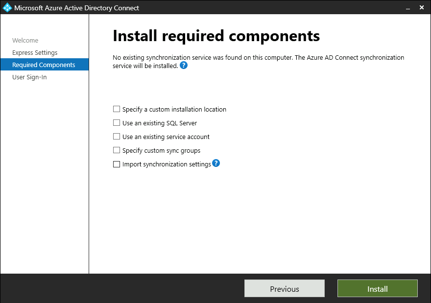

| Optional configuration | Description |
| --- | --- |
|Specify a custom installation location| Allows you to change the default installation path for Azure AD Connect.|
| Use an existing SQL Server |Allows you to specify the SQL Server name and instance name. Choose this option if you already have a database server that you want to use. For **Instance Name**, enter the instance name, a comma, and the port number if your SQL Server instance doesn't have browsing enabled.  Then specify the name of the Azure AD Connect database.  Your SQL privileges determine whether a new database can be created or your SQL administrator must create the database in advance.  If you have SQL Server administrator (SA) permissions, see [Install Azure AD Connect by using an existing database](how-to-connect-install-existing-database.md).  If you have delegated permissions (DBO), see [Install Azure AD Connect by using SQL delegated administrator permissions](how-to-connect-install-sql-delegation.md). |
| Use an existing service account |By default, Azure AD Connect provides a virtual service account for the synchronization services. If you use a remote instance of SQL Server or use a proxy that requires authentication, you can use a *managed service account* or a password-protected service account in the domain. In those cases, enter the account you want to use. To run the installation, you need to be an SA in SQL so you can create sign-in credentials for the service account. For more information, see [Azure AD Connect accounts and permissions](reference-connect-accounts-permissions.md#adsync-service-account).   By using the latest build, the SQL administrator can now provision the database out of band. Then the Azure AD Connect administrator can install it with database owner rights.  For more information, see [Install Azure AD Connect by using SQL delegated administrator permissions](how-to-connect-install-sql-delegation.md).|
| Specify custom sync groups |By default, when the synchronization services are installed, Azure AD Connect creates four groups that are local to the server. These groups are Administrators, Operators, Browse, and Password Reset. You can specify your own groups here. The groups must be local on the server. They can't be located in the domain. |
|Import synchronization settings|Allows you to import settings from other versions of Azure AD Connect.  For more information, see [Importing and exporting Azure AD Connect configuration settings](how-to-connect-import-export-config.md).|

### User sign-in
After installing the required components, select your users' single sign-on method. The following table briefly describes the available options. For a full description of the sign-in methods, see [User sign-in](plan-connect-user-signin.md).

| Single sign-on option | Description |
| --- | --- |
| Password hash synchronization |Users can sign in to Microsoft cloud services, such as Microsoft 365, by using the same password they use in their on-premises network. User passwords are synchronized to Azure AD as a password hash. Authentication occurs in the cloud. For more information, see [Password hash synchronization](how-to-connect-password-hash-synchronization.md). |
|Pass-through authentication|Users can sign in to Microsoft cloud services, such as Microsoft 365, by using the same password they use in their on-premises network.  User passwords are validated by being passed through to the on-premises Active Directory domain controller.
| Federation with AD FS |Users can sign in to Microsoft cloud services, such as Microsoft 365, by using the same password they use in their on-premises network.  Users are redirected to their on-premises Azure Directory Federation Services (AD FS) instance to sign in. Authentication occurs on-premises. |
| Federation with PingFederate|Users can sign in to Microsoft cloud services, such as Microsoft 365, by using the same password they use in their on-premises network.  Users are redirected to their on-premises PingFederate instance to sign in. Authentication occurs on-premises. |
| Do not configure |No user sign-in feature is installed or configured. Choose this option if you already have a third-party federation server or another solution in place. |
|Enable single sign-on|This option is available with both password hash sync and pass-through authentication. It provides a single sign-on experience for desktop users on corporate networks. For more information, see [Single sign-on](how-to-connect-sso.md).   **Note:** For AD FS customers, this option is unavailable. AD FS already offers the same level of single sign-on. 

### Connect to Azure AD
On the **Connect to Azure AD** page, enter a Hybrid Identity Administrator account and password. If you selected **Federation with AD FS** on the previous page, don't sign in with an account that's in a domain you plan to enable for federation. 

You might want to use an account in the default *onmicrosoft.com* domain, which comes with your Azure AD tenant. This account is used only to create a service account in Azure AD. It's not used after the installation finishes.
 
>[!NOTE]
>A best practice is to avoid using on-premises synced accounts for Azure AD role assignments. If the on premises account is compromised, this can be used to compromise your Azure AD resources as well.  For a complete list of best practices refer to [Best practices for Azure AD roles](../../roles/best-practices.md)
 

If your Global Administrator account has multifactor authentication enabled, you provide the password again in the sign-in window, and you must complete the multifactor authentication challenge. The challenge could be a verification code or a phone call.  

The Global Administrator account can also have [privileged identity management](../../privileged-identity-management/pim-getting-started.md) enabled.

To use authentication support for non-password scenarios such as federated accounts, smartcards and MFA scenarios, you can provide the switch **/InteractiveAuth** when starting the wizard. Using this switch will bypass the Wizard's authentication user interface and use the MSAL library's UI to handle the authentication.

If you see an error or have problems with connectivity, then see [Troubleshoot connectivity problems](tshoot-connect-connectivity.md).

## Sync pages

The following sections describe the pages in the **Sync** section.

### Connect your directories
To connect to Active Directory Domain Services (AD DS), Azure AD Connect needs the forest name and credentials of an account that has sufficient permissions.

After you enter the forest name and select  **Add Directory**, a window appears. The following table describes your options.

| Option | Description |
| --- | --- |
| Create new account | Create the AD DS account that Azure AD Connect needs to connect to the Active Directory forest during directory synchronization. After you select this option, enter the username and password for an enterprise admin account.  Azure AD Connect uses the provided enterprise admin account to create the required AD DS account. You can enter the domain part in either NetBIOS format or FQDN format. That is, enter *FABRIKAM\administrator* or *fabrikam.com\administrator*. |
| Use existing account | Provide an existing AD DS account that Azure AD Connect can use to connect to the Active Directory forest during directory synchronization. You can enter the domain part in either NetBIOS format or FQDN format. That is, enter *FABRIKAM\syncuser* or *fabrikam.com\syncuser*. This account can be a regular user account because it needs only the default read permissions. But depending on your scenario, you might need more permissions. For more information, see [Azure AD Connect accounts and permissions](reference-connect-accounts-permissions.md#create-the-ad-ds-connector-account). |

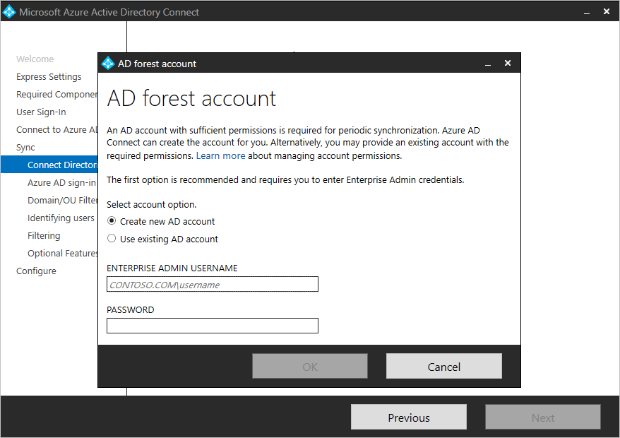

>[!NOTE]
> As of build 1.4.18.0, you can't use an enterprise admin or domain admin account as the AD DS connector account. When you select **Use existing account**, if you try to enter an enterprise admin account or a domain admin account, you see the following error: "Using  an Enterprise or Domain administrator account for your AD forest account is not allowed. Let Azure AD Connect create the account for you or specify a synchronization account with the correct permissions."
>

### Azure AD sign-in configuration
On the **Azure AD sign-in configuration** page, review the user principal name (UPN) domains in on-premises AD DS. These UPN domains have been verified in Azure AD. On this page, you configure the attribute to use for the userPrincipalName.

  

Review every domain that's marked as **Not Added** or **Not Verified**. Make sure that the domains you use have been verified in Azure AD. After you verify your domains, select the circular refresh icon. For more information, see [Add and verify the domain](../../fundamentals/add-custom-domain.md).

Users use the *userPrincipalName* attribute when they sign in to Azure AD and Microsoft 365. Azure AD should verify the domains, also known as the UPN-suffix, before users are synchronized. Microsoft recommends that you keep the default attribute userPrincipalName. 

If the userPrincipalName attribute is nonroutable and can't be verified, then you can select another attribute. You can, for example, select email as the attribute that holds the sign-in ID. When you use an attribute other than userPrincipalName, it's known as an *alternate ID*. 

The alternate ID attribute value must follow the RFC 822 standard. You can use an alternate ID with password hash sync, pass-through authentication, and federation. In Active Directory, the attribute can't be defined as multivalued, even if it has only a single value. For more information about the alternate ID, see [Pass-through authentication: Frequently asked questions](./how-to-connect-pta-faq.yml#does-pass-through-authentication-support--alternate-id--as-the-username--instead-of--userprincipalname--).

>[!NOTE]
> When you enable pass-through authentication, you must have at least one verified domain to continue through the custom installation process.

> [!WARNING]
> Alternate IDs aren't compatible with all Microsoft 365 workloads. For more information, see [Configuring alternate sign-in IDs](/windows-server/identity/ad-fs/operations/configuring-alternate-login-id).
>

### Domain and OU filtering
By default, all domains and organizational units (OUs) are synchronized. If you don't want to synchronize some domains or OUs to Azure AD, you can clear the appropriate selections.  

  

This page configures domain-based and OU-based filtering. If you plan to make changes, then see [Domain-based filtering](how-to-connect-sync-configure-filtering.md#domain-based-filtering) and [OU-based filtering](how-to-connect-sync-configure-filtering.md#organizational-unitbased-filtering). Some OUs are essential for functionality, so you should leave them selected.

If you use OU-based filtering with an Azure AD Connect version older than 1.1.524.0, new OUs are synchronized by default. If you don't want new OUs to be synchronized, then you can adjust the default behavior after the [OU-based filtering](how-to-connect-sync-configure-filtering.md#organizational-unitbased-filtering) step. For Azure AD Connect 1.1.524.0 or later, you can indicate whether you want new OUs to be synchronized.

If you plan to use [group-based filtering](#sync-filtering-based-on-groups), then make sure the OU with the group is included and isn't filtered by using OU-filtering. OU filtering is evaluated before group-based filtering is evaluated.

It's also possible that some domains are unreachable because of firewall restrictions. These domains are unselected by default, and they display a warning.  

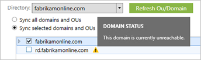  

If you see this warning, make sure that these domains are indeed unreachable and that the warning is expected.

### Uniquely identifying your users

On the **Identifying users** page, choose how to identify users in your on-premises directories and how to identify them by using the sourceAnchor attribute.

#### Select how users should be identified in your on-premises directories
By using the *Matching across forests* feature, you can define how users from your AD DS forests are represented in Azure AD. A user might be represented only once across all forests or might have a combination of enabled and disabled accounts. The user might also be represented as a contact in some forests.

| Setting | Description |
| --- | --- |
| [Users are represented only once across all forests](plan-connect-topologies.md#multiple-forests-single-azure-ad-tenant) |All users are created as individual objects in Azure AD. The objects aren't joined in the metaverse. |
| [Mail attribute](plan-connect-topologies.md#multiple-forests-single-azure-ad-tenant) |This option joins users and contacts if the mail attribute has the same value in different forests. Use this option when your contacts were created by using GALSync. If you choose this option, user objects whose mail attribute is unpopulated aren't synchronized to Azure AD. |
| [ObjectSID and msExchangeMasterAccountSID/ msRTCSIP-OriginatorSID attributes](plan-connect-topologies.md#multiple-forests-single-azure-ad-tenant) |This option joins an enabled user in an account forest with a disabled user in a resource forest. In Exchange, this configuration is known as a linked mailbox. You can use this option if you use only Lync and if Exchange isn't present in the resource forest. |
| SAMAccountName and MailNickName attributes |This option joins on attributes where the sign-in ID for the user is expected to be found. |
| Choose a specific attribute |This option allows you to select your own attribute. If you choose this option, user objects whose (selected) attribute is unpopulated aren't synchronized to Azure AD. **Limitation:** Only attributes that are already in the metaverse are available for this option. |

#### Select how users should be identified by using a source anchor
The *sourceAnchor* attribute is immutable during the lifetime of a user object. It's the primary key that links the on-premises user with the user in Azure AD.

| Setting | Description |
| --- | --- |
| Let Azure manage the source anchor | Select this option if you want Azure AD to pick the attribute for you. If you select this option, Azure AD Connect applies the sourceAnchor attribute selection logic that's described in [Using ms-DS-ConsistencyGuid as sourceAnchor](plan-connect-design-concepts.md#using-ms-ds-consistencyguid-as-sourceanchor). After the custom installation finishes, you see which attribute was picked as the sourceAnchor attribute. |
| Choose a specific attribute | Select this option if you want to specify an existing AD attribute as the sourceAnchor attribute. |

Because the sourceAnchor attribute can't be changed, you must choose an appropriate attribute. A good candidate is objectGUID. This attribute isn't changed unless the user account is moved between forests or domains. Don't choose attributes that can change when a person marries or changes assignments. 

You can't use attributes that include an at sign (@), so you can't use email and userPrincipalName. The attribute is also case sensitive, so when you move an object between forests, make sure to preserve uppercase and lowercase. Binary attributes are Base64-encoded, but other attribute types remain in their unencoded state. 

In federation scenarios and some Azure AD interfaces, the sourceAnchor attribute is also known as *immutableID*. 

For more information about the source anchor, see [Design concepts](plan-connect-design-concepts.md#sourceanchor).

### Sync filtering based on groups
The filtering-on-groups feature allows you to sync only a small subset of objects for a pilot. To use this feature, create a group for this purpose in your on-premises instance of Active Directory. Then add users and groups that should be synchronized to Azure AD as direct members. You can later add users or remove users from this group to maintain the list of objects that should be present in Azure AD. 

All objects that you want to synchronize must be direct members of the group. Users, groups, contacts, and computers or devices must all be direct members. Nested group membership isn't resolved. When you add a group as a member, only the group itself is added. Its members aren't added.

> [!WARNING]
> This feature is intended to support only a pilot deployment. Don't use it in a full production deployment.
>

In a full production deployment, it would be hard to maintain a single group and all of its objects to synchronize. Instead of the filtering-on-groups feature, use one of the methods described in [Configure filtering](how-to-connect-sync-configure-filtering.md).

### Optional features
On the next page, you can select optional features for your scenario.

>[!WARNING]
>Azure AD Connect versions 1.0.8641.0 and earlier rely on Azure Access Control Service for password writeback.  This service was retired on November 7, 2018.  If you use any of these versions of Azure AD Connect and have enabled password writeback, users might lose the ability to change or reset their passwords when the service is retired. These versions of Azure AD Connect don't support password writeback.
>
>For more information, see [Migrate from Azure Access Control Service](../../azuread-dev/active-directory-acs-migration.md).
>
>If you want to use password writeback, download the [latest version of Azure AD Connect](https://www.microsoft.com/download/details.aspx?id=47594).

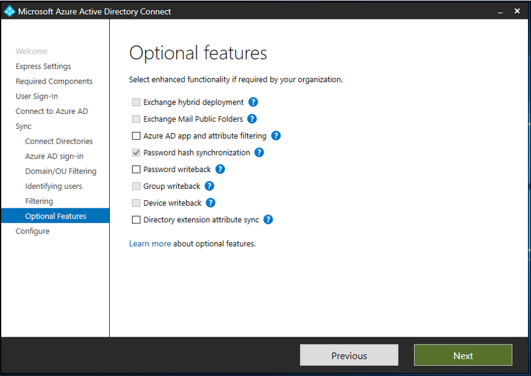

> [!WARNING]
> If Azure AD Sync or Direct Synchronization (DirSync) are active, don't activate any writeback features in Azure AD Connect.

| Optional features | Description |
| --- | --- |
| Exchange hybrid deployment |The Exchange hybrid deployment feature allows for the coexistence of Exchange mailboxes both on-premises and in Microsoft 365. Azure AD Connect synchronizes a specific set of [attributes](reference-connect-sync-attributes-synchronized.md#exchange-hybrid-writeback) from Azure AD back into your on-premises directory. |
| Exchange mail public folders | The Exchange mail public folders feature allows you to synchronize mail-enabled public-folder objects from your on-premises instance of Active Directory to Azure AD. Note that it is not supported to sync groups that contain public folders as members, and attempting to do so will result in a synchronization error. |
| Azure AD app and attribute filtering |By enabling Azure AD app and attribute filtering, you can tailor the set of synchronized attributes. This option adds two more configuration pages to the wizard. For more information, see [Azure AD app and attribute filtering](#azure-ad-app-and-attribute-filtering). |
| Password hash synchronization |If you selected federation as the sign-in solution, you can enable password hash synchronization. Then you can use it as a backup option.    If you selected pass-through authentication, you can enable this option to ensure support for legacy clients and to provide a backup.   For more information, see [Password hash synchronization](how-to-connect-password-hash-synchronization.md).|
| Password writeback |Use this option to ensure that password changes that originate in Azure AD are written back to your on-premises directory. For more information, see [Getting started with password management](../../authentication/tutorial-enable-sspr.md). |
| Group writeback |If you use Microsoft 365 Groups, then you can represent groups in your on-premises instance of Active Directory. This option is available only if you have Exchange in your on-premises instance of Active Directory. For more information, see [Azure AD Connect group writeback](how-to-connect-group-writeback-v2.md).|
| Device writeback |For conditional-access scenarios, use this option to write back device objects in Azure AD to your on-premises instance of Active Directory. For more information, see [Enabling device writeback in Azure AD Connect](how-to-connect-device-writeback.md). |
| Directory extension attribute sync |Select this option to sync specified attributes to Azure AD. For more information, see [Directory extensions](how-to-connect-sync-feature-directory-extensions.md). |

### Azure AD app and attribute filtering
If you want to limit which attributes synchronize to Azure AD, then start by selecting the services you use. If you change the selections on this page, you have to explicitly select a new service by rerunning the installation wizard.

Based on the services you selected in the previous step, this page shows all attributes that are synchronized. This list is a combination of all object types that are being synchronized. If you need some attributes to remain unsynchronized, you can clear the selection from those attributes.

> [!WARNING]
> Removing attributes can affect functionality. For best practices and recommendations, see [Attributes to synchronize](reference-connect-sync-attributes-synchronized.md#attributes-to-synchronize).
>

### Directory Extension attribute sync
You can extend the schema in Azure AD by using custom attributes that your organization added or by using other attributes in Active Directory. To use this feature, on the **Optional Features** page, select **Directory Extension attribute sync**. On the **Directory Extensions** page, you can select more attributes to sync.

>[!NOTE]
>The **Available Attributes** field is case sensitive.

For more information, see [Directory extensions](how-to-connect-sync-feature-directory-extensions.md).

### Enabling single sign-on
On the **Single sign-on** page, you configure single sign-on for use with password synchronization or pass-through authentication. You do this step once for each forest that's being synchronized to Azure AD. Configuration involves two steps:

1. Create the necessary computer account in your on-premises instance of Active Directory.
2. Configure the intranet zone of the client machines to support single sign-on.

#### Create the computer account in Active Directory
For each forest that has been added in Azure AD Connect, you need to supply domain administrator credentials so that the computer account can be created in each forest. The credentials are used only to create the account. They aren't stored or used for any other operation. Add the credentials on the **Enable single sign-on** page, as the following image shows.

>[!NOTE]
>You can skip forests where you don't want to use single sign-on.

#### Configure the intranet zone for client machines
To ensure that the client signs in automatically in the intranet zone, make sure the URL is part of the intranet zone. This step ensures that the domain-joined computer automatically sends a Kerberos ticket to Azure AD when it's connected to the corporate network.

On a computer that has Group Policy management tools:

1. Open the Group Policy management tools.
2. Edit the group policy that will be applied to all users. For example, the Default Domain policy.
3. Go to **User Configuration** > **Administrative Templates** > **Windows Components** > **Internet Explorer** > **Internet Control Panel** > **Security Page**. Then select **Site to Zone Assignment List**.
4. Enable the policy. Then, in the dialog box, enter a value name of `https://autologon.microsoftazuread-sso.com` and value of `1`. Your setup should look like the following image.
  
    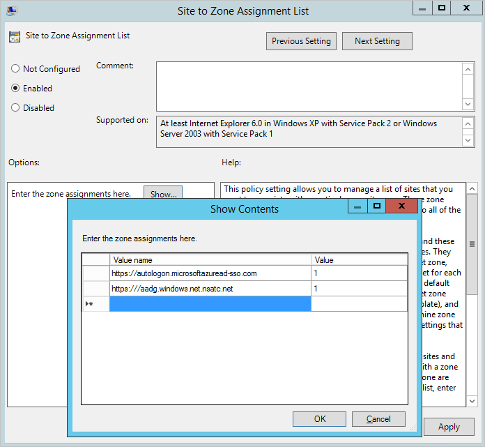

6. Select **OK** twice.

## Configuring federation with AD FS
You can configure AD FS with Azure AD Connect in just a few clicks. Before you start, you need:

* Windows Server 2012 R2 or later for the federation server. Remote management should be enabled.
* Windows Server 2012 R2 or later for the Web Application Proxy server. Remote management should be enabled.
* A TLS/SSL certificate for the federation service name that you intend to use (for example, sts.contoso.com).

>[!NOTE]
>You can update a TLS/SSL certificate for your AD FS farm by using Azure AD Connect even if you don't use it to manage your federation trust.

### AD FS configuration prerequisites
To configure your AD FS farm by using Azure AD Connect, ensure that WinRM is enabled on the remote servers. Make sure you've completed the other tasks in [Federation prerequisites](how-to-connect-install-prerequisites.md#prerequisites-for-federation-installation-and-configuration). Also make sure you follow the ports requirements that are listed in the [Azure AD Connect and Federation/WAP servers](reference-connect-ports.md#table-3---azure-ad-connect-and-ad-fs-federation-serverswap) table.

### Create a new AD FS farm or use an existing AD FS farm
You can use an existing AD FS farm or create a new one. If you choose to create a new one, you must provide the TLS/SSL certificate. If the TLS/SSL certificate is protected by a password, then you're prompted to provide the password.

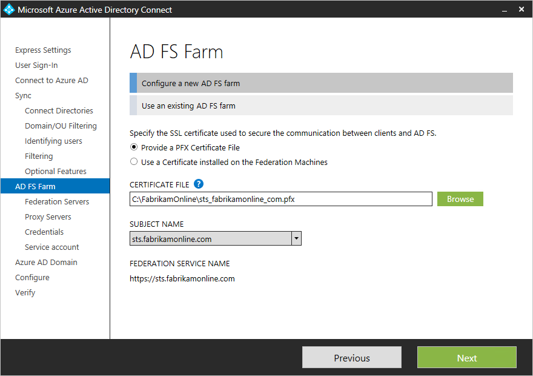

If you choose to use an existing AD FS farm, you see the page where you can configure the trust relationship between AD FS and Azure AD.

>[!NOTE]
>You can use Azure AD Connect to manage only one AD FS farm. If you have an existing federation trust where Azure AD is configured on the selected AD FS farm, Azure AD Connect re-creates the trust from scratch.

### Specify the AD FS servers
Specify the servers where you want to install AD FS. You can add one or more servers, depending on your capacity needs. Before you set up this configuration, join all AD FS servers to Active Directory. This step isn't required for the Web Application Proxy servers. 

Microsoft recommends installing a single AD FS server for test and pilot deployments. After the initial configuration, you can add and deploy more servers to meet your scaling needs by running Azure AD Connect again.

> [!NOTE]
> Before you set up this configuration, ensure that all of your servers are joined to an Azure AD domain.
>

### Specify the Web Application Proxy servers
Specify your Web Application Proxy servers. The Web Application Proxy server is deployed in your perimeter network, facing the extranet. It supports authentication requests from the extranet. You can add one or more servers, depending on your capacity needs. 

Microsoft recommends installing a single Web Application Proxy server for test and pilot deployments. After the initial configuration, you can add and deploy more servers to meet your scaling needs by running Azure AD Connect again. We recommend that you have an equivalent number of proxy servers to satisfy authentication from the intranet.

> [!NOTE]
> - If the account you use isn't a local admin on the Web Application Proxy servers, then you're prompted for admin credentials.
> - Before you specify Web Application Proxy servers, ensure that there's HTTP/HTTPS connectivity between the Azure AD Connect server and the Web Application Proxy server.
> - Ensure that there's HTTP/HTTPS connectivity between the Web Application Server and the AD FS server to allow authentication requests to flow through.
>

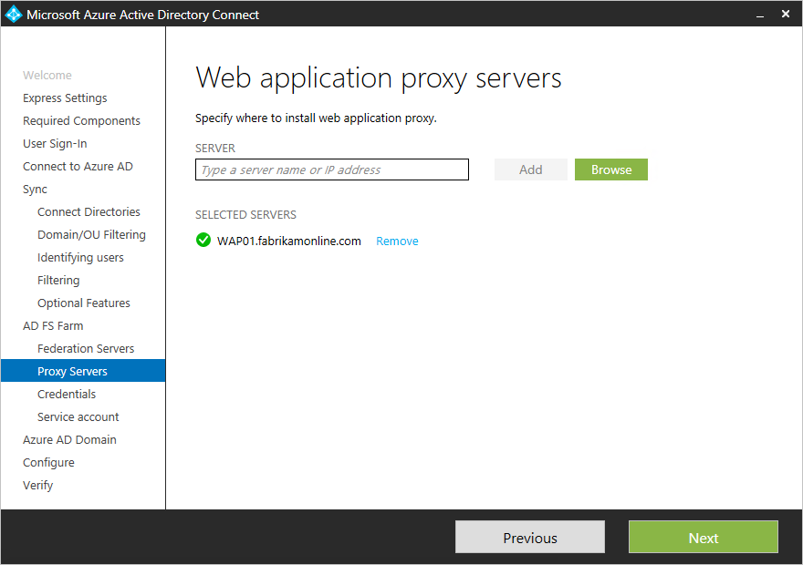

You're prompted to enter credentials so that the web application server can establish a secure connection to the AD FS server. These credentials must be for a local administrator account on the AD FS server.

### Specify the service account for the AD FS service
The AD FS service requires a domain service account to authenticate users and to look up user information in Active Directory. It can support two types of service accounts:

* **Group managed service account**: This account type was introduced into AD DS by Windows Server 2012. This type of account provides services such as AD FS. It's a single account in which you don't need to update the password regularly. Use this option if you already have Windows Server 2012 domain controllers in the domain that your AD FS servers belong to.
* **Domain user account**: This type of account requires you to provide a password and regularly update it when it expires. Use this option only when you don't have Windows Server 2012 domain controllers in the domain that your AD FS servers belong to.

If you selected **Create a group Managed Service Account** and this feature has never been used in Active Directory, then enter your enterprise admin credentials. These credentials are used to initiate the key store and enable the feature in Active Directory.

> [!NOTE]
> Azure AD Connect checks whether the AD FS service is already registered as a service principal name (SPN) in the domain.  AD DS doesn't allow duplicate SPNs to be registered at the same time.  If a duplicate SPN is found, you can't proceed further until the SPN is removed.

### Select the Azure AD domain that you want to federate
Use the **Azure AD Domain** page to set up the federation relationship between AD FS and Azure AD. Here, you configure AD FS to provide security tokens to Azure AD. You also configure Azure AD to trust the tokens from this AD FS instance. 

On this page, you can configure only a single domain in the initial installation. You can configure more domains later by running Azure AD Connect again.

### Verify the Azure AD domain selected for federation
When you select the domain that you want to federate, Azure AD Connect provides information that you can use to verify an unverified domain. For more information, see [Add and verify the domain](../../fundamentals/add-custom-domain.md).

> [!NOTE]
> Azure AD Connect tries to verify the domain during the configuration stage. If you don't add the necessary Domain Name System (DNS) records, the configuration can't be completed.
>

## Configuring federation with PingFederate
You can configure PingFederate with Azure AD Connect in just a few clicks. The following prerequisites are required:
- PingFederate 8.4 or later. For more information, see [PingFederate integration with Azure Active Directory and Microsoft 365](https://docs.pingidentity.com/access/sources/dita/topic?category=integrationdoc&resourceid=pingfederate_azuread_office365_integration) in the Ping Identity documentation.
- A TLS/SSL certificate for the federation service name that you intend to use (for example, sts.contoso.com).

### Verify the domain
After you choose to set up federation by using PingFederate, you're asked to verify the domain you want to federate.  Select the domain from the drop-down menu.

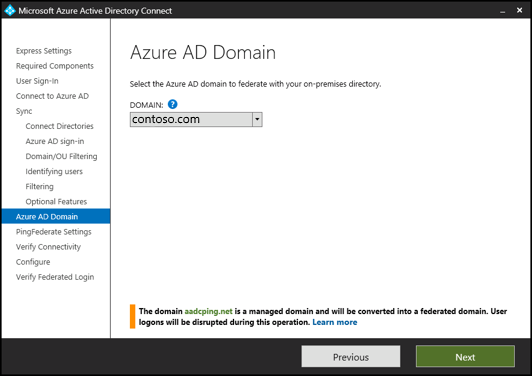

### Export the PingFederate settings

Configure PingFederate as the federation server for each federated Azure domain.  Select **Export Settings** to share this information with your PingFederate administrator.  The federation server administrator updates the configuration and then provides the PingFederate server URL and port number so that Azure AD Connect can verify the metadata settings.  

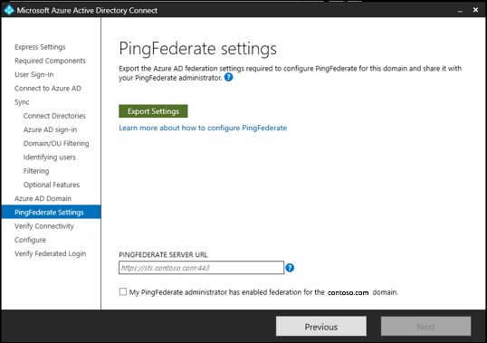

Contact your PingFederate administrator to resolve any validation issues.  The following image shows information about a PingFederate server that has no valid trust relationship with Azure.

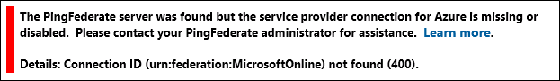

### Verify federation connectivity
Azure AD Connect attempts to validate the authentication endpoints that it retrieves from the PingFederate metadata in the previous step.  Azure AD Connect first attempts to resolve the endpoints by using your local DNS servers.  Next, it attempts to resolve the endpoints by using an external DNS provider.  Contact your PingFederate administrator to resolve any validation issues.  

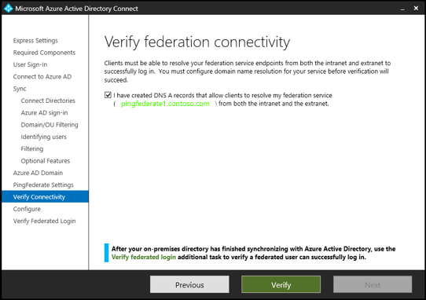

### Verify federation sign-in
Finally, you can verify the newly configured federated login flow by signing in to the federated domain. If your sign-in succeeds, then the federation with PingFederate is successfully configured.

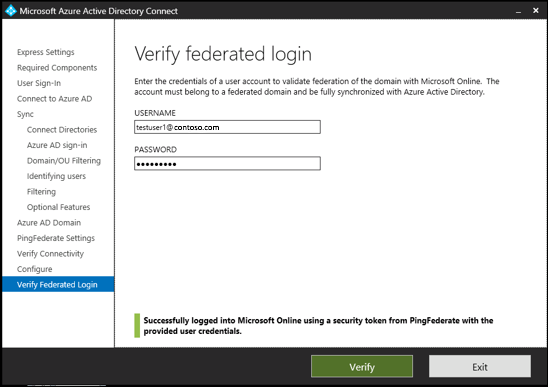

## Configure and verify pages
The configuration happens on the **Configure** page.

> [!NOTE]
> If you configured federation, then make sure that you have also configured [Name resolution for federation servers](how-to-connect-install-prerequisites.md#name-resolution-for-federation-servers) before you continue the installation.
>

### Use staging mode
It's possible to set up a new sync server in parallel with staging mode. If you want to use this setup, then only one sync server can export to one directory in the cloud. But if you want to move from another server, for example a server running DirSync, then you can enable Azure AD Connect in staging mode. 

When you enable the staging setup, the sync engine imports and synchronizes data as normal. But it exports no data to Azure AD or Active Directory. In staging mode, the password sync feature and password writeback feature are disabled.

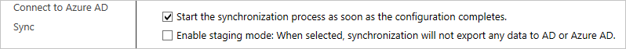

In staging mode, you can make required changes to the sync engine and review what will be exported. When the configuration looks good, run the installation wizard again and disable staging mode. 

Data is now exported to Azure AD from the server. Make sure to disable the other server at the same time so only one server is actively exporting.

For more information, see [Staging mode](how-to-connect-sync-staging-server.md).

### Verify your federation configuration
Azure AD Connect verifies the DNS settings when you select the **Verify** button. It checks the following settings:

* **Intranet connectivity**
    * Resolve federation FQDN: Azure AD Connect checks whether the DNS can resolve the federation FQDN to ensure connectivity. If Azure AD Connect can't resolve the FQDN, then the verification fails. To complete the verification, ensure that a DNS record is present for the federation service FQDN.
    * DNS A record: Azure AD Connect checks whether your federation service has an A record. In the absence of an A record, the verification fails. To complete the verification, create an A record (not a CNAME record) for your federation FQDN.
* **Extranet connectivity**
    * Resolve federation FQDN: Azure AD Connect checks whether the DNS can resolve the federation FQDN to ensure connectivity.

      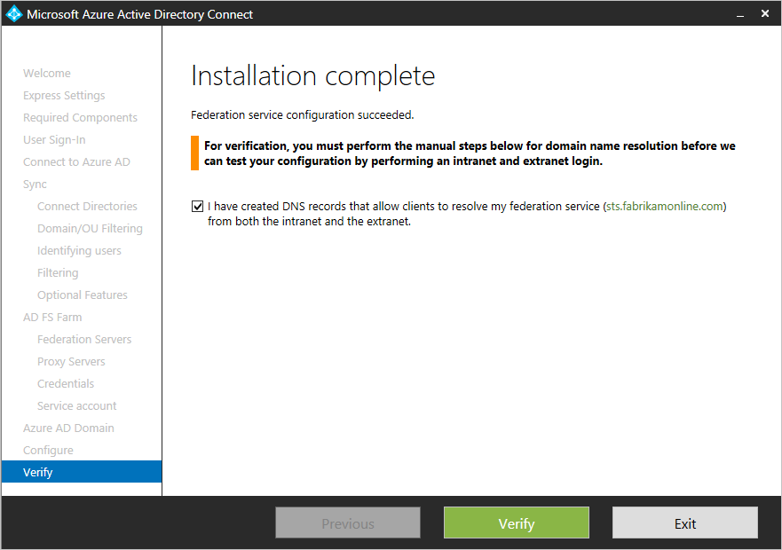

      

To validate end-to-end authentication, manually perform one or more of the following tests:

* When synchronization finishes, in Azure AD Connect, use the **Verify federated login** additional task to verify authentication for an on-premises user account that you choose.
* From a domain-joined machine on the intranet, ensure that you can sign in from a browser. Connect to https://myapps.microsoft.com. Then use your logged-on account to verify the sign-in. The built-in AD DS administrator account isn't synchronized, and you can't use it for verification.
* Ensure that you can sign in from a device on the extranet. On a home machine or a mobile device, connect to https://myapps.microsoft.com. Then provide your credentials.
* Validate rich client sign-in. Connect to https://testconnectivity.microsoft.com. Then select **Office 365** > **Office 365 Single Sign-On Test**.

## Troubleshoot
This section contains troubleshooting information that you can use if you have a problem while installing Azure AD Connect.

When you customize an Azure AD Connect installation, on the **Install required components** page, you can select **Use an existing SQL Server**. You might see the following error: "The ADSync database already contains data and cannot be overwritten. Please remove the existing database and try again."

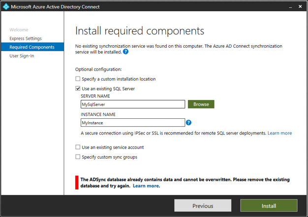

You see this error because a database named *ADSync* already exists on the SQL instance of SQL Server that you specified.

You typically see this error after you have uninstalled Azure AD Connect.  The database isn't deleted from the computer that runs SQL Server when you uninstall Azure AD Connect.

To fix this problem:

1. Check the ADSync database that Azure AD Connect used before it was uninstalled. Make sure that the database is no longer being used.

2. Back up the database.

3. Delete the database:
    1. Use **Microsoft SQL Server Management Studio** to connect to the SQL instance. 
    1. Find the **ADSync** database and right-click it.
    1. On the context menu, select **Delete**.
    1. Select **OK** to delete the database.

After you delete the ADSync database, select **Install** to retry the installation.

## Next steps
After the installation finishes, sign out of Windows. Then sign in again before you use Synchronization Service Manager or Synchronization Rule Editor.

Now that you have installed Azure AD Connect, you can [verify the installation and assign licenses](how-to-connect-post-installation.md).

For more information about the features that you enabled during the installation, see [Prevent accidental deletes](how-to-connect-sync-feature-prevent-accidental-deletes.md) and [Azure AD Connect Health](how-to-connect-health-sync.md).

For more information about other common topics, see [Azure AD Connect sync: Scheduler](how-to-connect-sync-feature-scheduler.md) and [Integrate your on-premises identities with Azure AD](../whatis-hybrid-identity.md).
