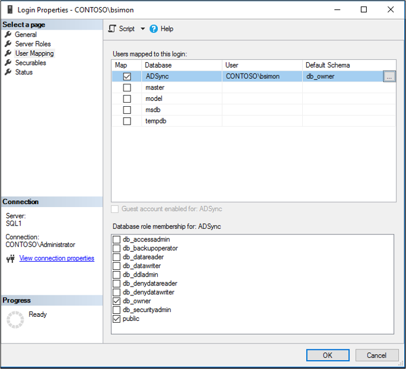

# Install Microsoft Entra Connect using SQL delegated administrator permissions
Prior to the latest Microsoft Entra Connect build, administrative delegation, when deploying configurations that required SQL, was not supported.  Users who wanted to install Microsoft Entra Connect needed to have server administrator (SA) permissions on the SQL server.

With the latest release of Microsoft Entra Connect, provisioning the database can now be performed out of band by the SQL administrator and then installed by the Microsoft Entra Connect administrator with database owner rights.

## Before you begin
To use this feature, you need to realize that there are several moving parts and each one may involve a different administrator in your organization.  The following table summarizes the individual roles and their respective duties in deploying Microsoft Entra Connect with this feature.

|Role|Description|
|-----|-----|
|Domain or Forest AD administrator|Creates the domain level service account that is used by Microsoft Entra Connect to run the sync service.  For more information on service accounts, see [Accounts and permissions](reference-connect-accounts-permissions.md).
|SQL administrator|Creates the ADSync database and grants login + dbo access to the Microsoft Entra Connect administrator and the service account created by the domain/forest admin.|
Microsoft Entra Connect administrator|Installs Microsoft Entra Connect and specifies the service account during custom installation.

## Steps for installing Microsoft Entra Connect using SQL delegated permissions
To provision the database out of band and install Microsoft Entra Connect with database owner permissions, use the following steps.

>[!NOTE]
>Although it is not required, it is **highly recommended** that the Latin1_General_CI_AS collation is selected when creating the database.

1. Have the SQL Administrator create the ADSync database with a case insensitive collation sequence **(Latin1_General_CI_AS)**.  The recovery model, compatibility level, and containment type are updated to the correct values when Microsoft Entra Connect is installed.  However the collation sequence must be set correctly by the SQL administrator otherwise Microsoft Entra Connect will block the installation.  To recover the SA must delete and recreate the database.
 
   
2. Grant the Microsoft Entra Connect administrator and the domain service account the following permissions:
   - SQL Login 
   - **database owner(dbo)** rights.
 
   

   >[!NOTE]
   >Microsoft Entra Connect does not support logins with a nested membership.  This means your Microsoft Entra Connect administrator account and domain service account must be linked to a login that is granted dbo rights.  It cannot simply be the member of a group that is assigned to a login with dbo rights.

3. Send an email to the Microsoft Entra Connect administrator indicating the SQL server and instance name that should be used when installing Microsoft Entra Connect.

## Additional information
Once the database is provisioned, the Microsoft Entra Connect administrator can install and configure on-premises synchronization at their convenience.

In case the SQL Administrator has restored ADSync database from a previous Microsoft Entra Connect backup, you will need to install the new Microsoft Entra Connect server by using an existing database. For more information on installing Microsoft Entra Connect with an existing database, see [Install Microsoft Entra Connect using an existing ADSync database](how-to-connect-install-existing-database.md).

## Next steps
- [Getting started with Microsoft Entra Connect using express settings](how-to-connect-install-express.md)
- [Custom installation of Microsoft Entra Connect](how-to-connect-install-custom.md)
- [Install Microsoft Entra Connect using an existing ADSync database](how-to-connect-install-existing-database.md)  
