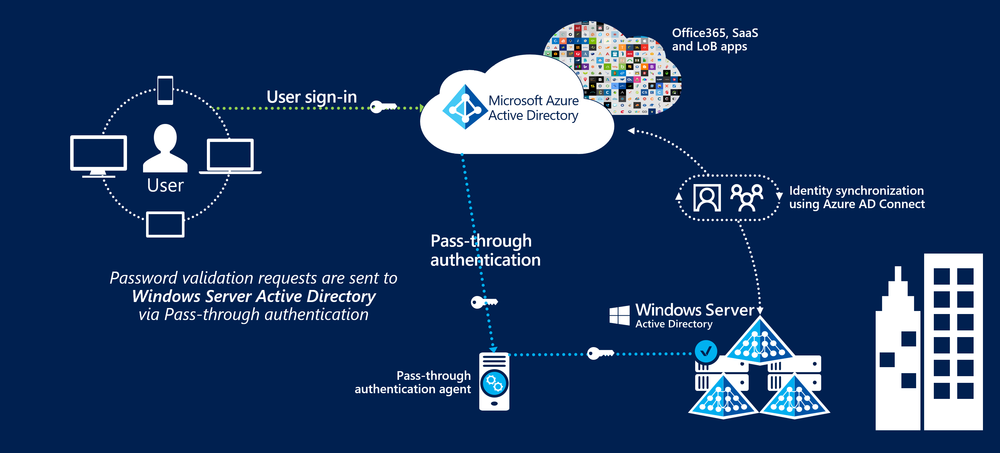

# User sign-in with Microsoft Entra pass-through authentication

## What is Microsoft Entra pass-through authentication?

Microsoft Entra pass-through authentication allows your users to sign in to both on-premises and cloud-based applications using the same passwords. This feature provides your users a better experience - one less password to remember, and reduces IT helpdesk costs because your users are less likely to forget how to sign in. When users sign in using Microsoft Entra ID, this feature validates users' passwords directly against your on-premises Active Directory.

>[!VIDEO https://www.youtube.com/embed/PyeAC85Gm7w]

This feature is an alternative to [Microsoft Entra Password Hash Synchronization](how-to-connect-password-hash-synchronization.md), which provides the same benefit of cloud authentication to organizations. However, certain organizations wanting to enforce their on-premises Active Directory security and password policies, can choose to use Pass-through Authentication instead. Review [this guide](./choose-ad-authn.md) for a comparison of the various Microsoft Entra sign-in methods and how to choose the right sign-in method for your organization.

You can combine Pass-through Authentication with the [Seamless single sign-on](how-to-connect-sso.md) feature. If you have Windows 10 or later machines, use [Microsoft Entra hybrid join (AADJ)](../../devices/how-to-hybrid-join.md). This way, when your users are accessing applications on their corporate machines inside your corporate network, they don't need to type in their passwords to sign in.

## Key benefits of using Microsoft Entra pass-through authentication

- *Great user experience*
  - Users use the same passwords to sign into both on-premises and cloud-based applications.
  - Users spend less time talking to the IT helpdesk resolving password-related issues.
  - Users can complete [self-service password management](../../authentication/concept-sspr-howitworks.md) tasks in the cloud.
- *Easy to deploy & administer*
  - No need for complex on-premises deployments or network configuration.
  - Needs just a lightweight agent to be installed on-premises.
  - No management overhead. The agent automatically receives improvements and bug fixes.
- *Secure*
  - On-premises passwords are never stored in the cloud in any form.
  - Protects your user accounts by working seamlessly with [Microsoft Entra Conditional Access policies](../../conditional-access/overview.md), including Multi-Factor Authentication (MFA), [blocking legacy authentication](../../conditional-access/concept-conditional-access-conditions.md) and by [filtering out brute force password attacks](../../authentication/howto-password-smart-lockout.md).
  - The agent only makes outbound connections from within your network. Therefore, there is no requirement to install the agent in a perimeter network, also known as a DMZ.
  - The communication between an agent and Microsoft Entra ID is secured using certificate-based authentication. These certificates are automatically renewed every few months by Microsoft Entra ID.
- *Highly available*
  - Additional agents can be installed on multiple on-premises servers to provide high availability of sign-in requests.

## Feature highlights

- Supports user sign-in into all web browser-based applications and into Microsoft Office client applications that use [modern authentication](https://aka.ms/modernauthga).
- Sign-in usernames can be either the on-premises default username (`userPrincipalName`) or another attribute configured in Microsoft Entra Connect (known as `Alternate ID`).
- The feature works seamlessly with [Conditional Access](../../conditional-access/overview.md) features such as Multi-Factor Authentication (MFA) to help secure your users.
- Integrated with cloud-based [self-service password management](../../authentication/concept-sspr-howitworks.md), including password writeback to on-premises Active Directory and password protection by banning commonly used passwords.
- Multi-forest environments are supported if there are forest trusts between your AD forests and if name suffix routing is correctly configured.
- It is a free feature, and you don't need any paid editions of Microsoft Entra ID to use it.
- It can be enabled via [Microsoft Entra Connect](../whatis-hybrid-identity.md).
- It uses a lightweight on-premises agent that listens for and responds to password validation requests.
- Installing multiple agents provides high availability of sign-in requests.
- It [protects](../../authentication/howto-password-smart-lockout.md) your on-premises accounts against brute force password attacks in the cloud.

## Next steps

- [Quickstart](how-to-connect-pta-quick-start.md) - Get up and running Microsoft Entra pass-through authentication.
- [Migrate your apps to Microsoft Entra ID](../../manage-apps/migration-resources.md): Resources to help you migrate application access and authentication to Microsoft Entra ID.
- [Smart Lockout](../../authentication/howto-password-smart-lockout.md) - Configure Smart Lockout capability on your tenant to protect user accounts.
- [Microsoft Entra hybrid join](../../devices/how-to-hybrid-join.md): Configure Microsoft Entra hybrid join capability on your tenant for SSO across your cloud and on-premises resources.  
- [Current limitations](how-to-connect-pta-current-limitations.md) - Learn which scenarios are supported and which ones are not.
- [Technical Deep Dive](how-to-connect-pta-how-it-works.md) - Understand how this feature works.
- [Frequently Asked Questions](how-to-connect-pta-faq.yml) - Answers to frequently asked questions.
- [Troubleshoot](tshoot-connect-pass-through-authentication.md) - Learn how to resolve common issues with the feature.
- [Security Deep Dive](how-to-connect-pta-security-deep-dive.md) - Additional deep technical information on the feature.
- [Microsoft Entra seamless SSO](how-to-connect-sso.md) - Learn more about this complementary feature.
- [UserVoice](https://feedback.azure.com/d365community/forum/22920db1-ad25-ec11-b6e6-000d3a4f0789) - For filing new feature requests.
