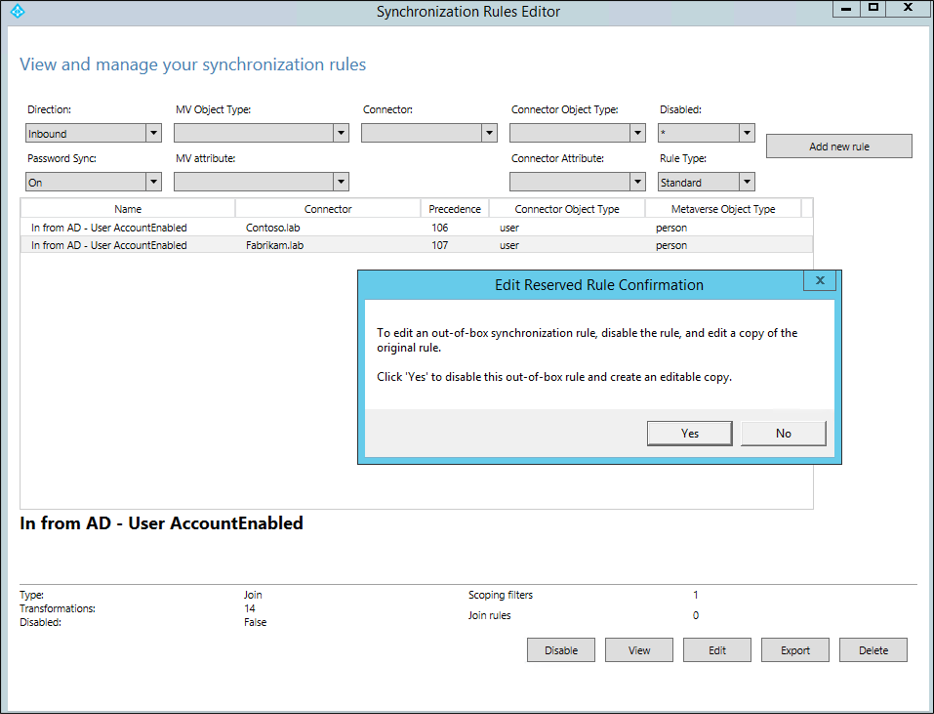
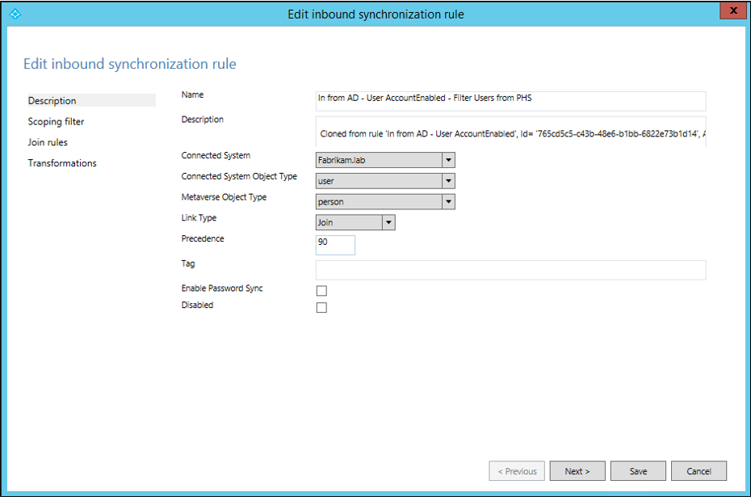
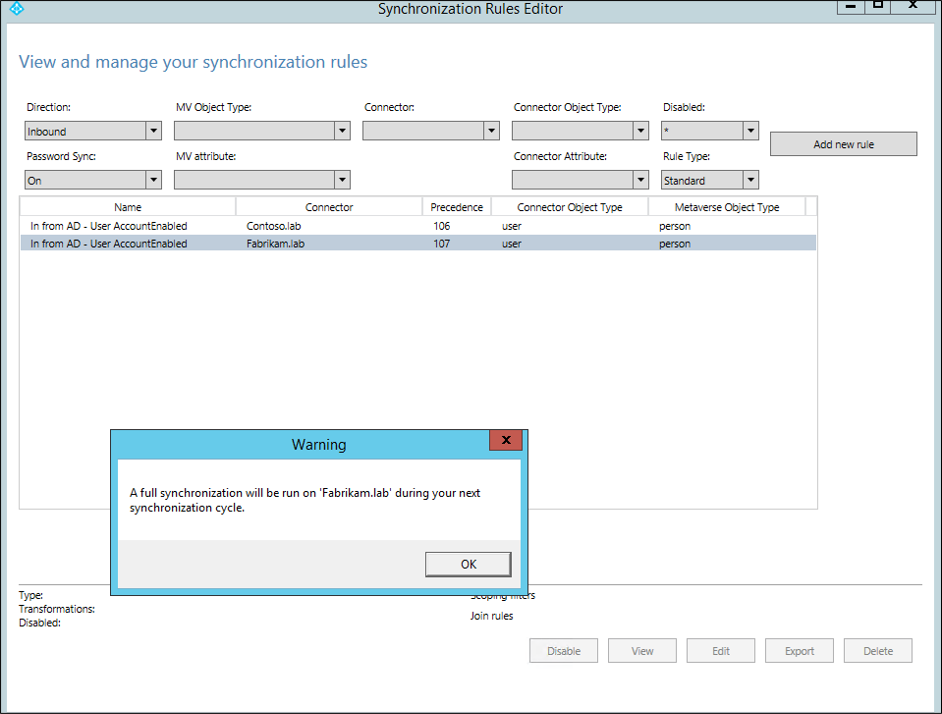
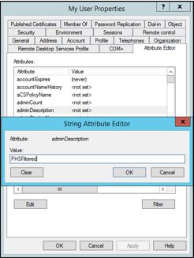
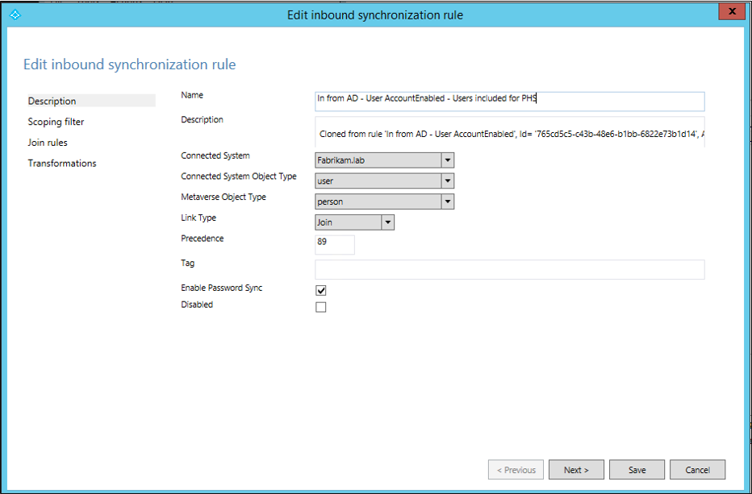
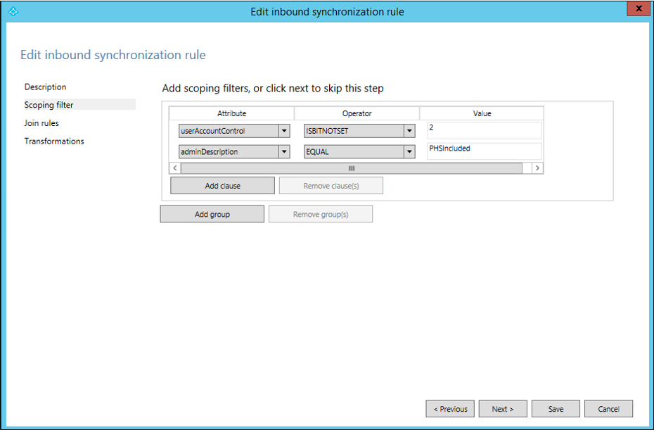
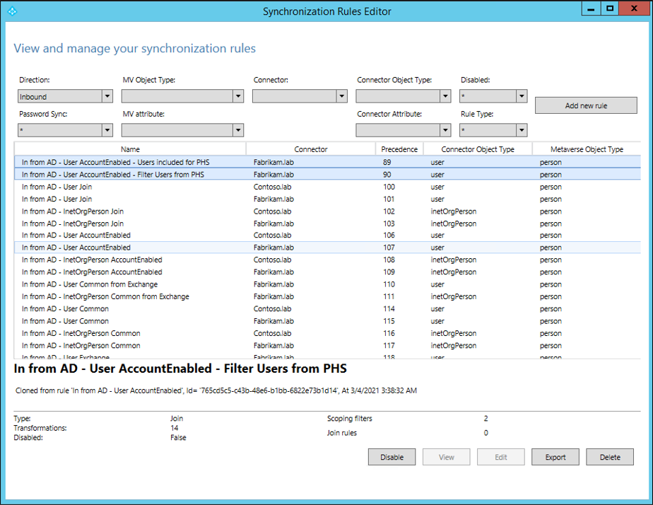
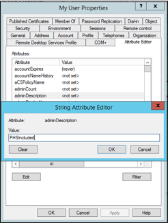

# Selective password hash synchronization configuration for Microsoft Entra Connect

[Password hash synchronization](whatis-phs.md) is one of the sign-in methods used to accomplish hybrid identity. Microsoft Entra Connect synchronizes a hash, of the hash, of a user's password from an on-premises Active Directory instance to a cloud-based Microsoft Entra instance.  By default, once it has been setup, password hash synchronization will occur on all of the users you are synchronizing.

If you'd like to have a subset of users excluded from synchronizing their password hash to Microsoft Entra ID, you can configure selective password hash synchronization using the guided steps provided in this article.

> [!IMPORTANT]
> Microsoft doesn't support modifying or operating Microsoft Entra Connect Sync outside of the configurations or actions that are formally documented. Any of these configurations or actions might result in an inconsistent or unsupported state of Microsoft Entra Connect Sync. As a result, Microsoft cannot guarantee that we will be able to provide efficient technical support for such deployments.

## Consider your implementation

To reduce the configuration administrative effort, you should first consider the number of user objects you wish to exclude from password hash synchronization. Verify which of the scenarios below, which are mutually exclusive, aligns with your requirements to select the right configuration option for you.
- If the number of users to **exclude** is **smaller** than the number of users to **include**, follow the steps in this [section](#excluded-users-is-smaller-than-included-users).
- If the number of users to **exclude** is **greater** than the number of users to **include**, follow the steps in this [section](#excluded-users-is-larger-than-included-users).

> [!IMPORTANT]
> With either configuration option chosen, a required initial sync (Full Sync) to apply the changes, will be performed automatically over the next sync cycle.

> [!IMPORTANT]
> Configuring selective password hash synchronization directly influences password writeback. Password changes or password resets that are initiated in Microsoft Entra ID write back to on-premises Active Directory only if the user is in scope for password hash synchronization.

> [!IMPORTANT]
> Selective password hash synchronization is supported in Microsoft Entra Connect 1.6.2.4 or later. If you are using a version lower than that, upgrade to the latest version.

### The adminDescription attribute

Both scenarios rely on setting the adminDescription attribute of users to a specific value.  This allows the rules to be applied and is what makes selective PHS work.

|Scenario|adminDescription value|
|-----|-----|
|Excluded users is smaller than included users|PHSFiltered|
|Excluded users is larger than included users|PHSIncluded|

This attribute can be set either:

- using the Active Directory Users and Computers UI
- using `Set-ADUser` PowerShell cmdlet.  For more information see [Set-ADUser](/powershell/module/activedirectory/set-aduser).

### Disable the synchronization scheduler:

Before you start either scenario, you must disable the synchronization scheduler while making changes to the sync rules.
 1. Start Windows PowerShell and enter.

     `Set-ADSyncScheduler -SyncCycleEnabled $false`

2. Confirm the scheduler is disabled by running the following cmdlet:

    `Get-ADSyncScheduler`

For more information on the scheduler see [Microsoft Entra Connect Sync scheduler](how-to-connect-sync-feature-scheduler.md).

## Excluded users is smaller than included users

The following section describes how to enable selective password hash synchronization when the number of users to **exclude** is **smaller** than the number of users to **include**.

> [!IMPORTANT]
> Before you proceed ensure the synchronization scheduler is disabled as outlined above.

- Create an editable copy of the **In from AD – User AccountEnabled** with the option to **enable password hash sync un-selected** and define its scoping filter
- Create another editable copy of the default **In from AD – User AccountEnabled** with the option to **enable password hash sync selected** and define its scoping filter
- Re-enable the synchronization scheduler
- Set the attribute value, in active directory, that was defined as scoping attribute on the users you want to allow in password hash synchronization.

> [!IMPORTANT]
> The steps provided to configure selective password hash synchronization will only affect user objects that have 
the attribute **adminDescription** populated in Active Directory with the value of **PHSFiltered**.
> If this attribute is not populated or the value is something other than **PHSFiltered** then these rules will not be applied to the user objects.

### Configure the necessary synchronization rules:

 1. Start the Synchronization Rules Editor and set the filters **Password Sync** to **On** and **Rule Type** to **Standard**.
     
 2. Select the rule **In from AD – User AccountEnabled** for the Active Directory forest Connector you want to configure selective password had hash synchronization on and click **Edit**. Select **Yes** in the next dialog box to create an editable copy of the original rule.
     
 3. The first rule will disable password hash sync.
 Provide the following name to the new custom rule: **In from AD - User AccountEnabled - Filter Users from PHS**.
 Change the precedence value to a number lower than 100 (for example **90** or whichever is the lowest value available in your environment).
 Make sure the checkboxes **Enable Password Sync** and **Disabled** are unchecked.
 Click **Next**.
     
 4. In **Scoping filter**, click **Add clause**.
 Select **adminDescription** in the attribute column, **EQUAL** in the Operator column and enter **PHSFiltered** as the value.
     
 5. No further changes are required. **Join rules** and **Transformations** should be left with the default copied settings so you can click **Save** now.
 Click **OK** in the warning dialog box informing a full synchronization will be run on the next synchronization cycle of the connector.
     
 6. Next, create another custom rule with password hash synchronization enabled. Select again the default rule **In from AD – User AccountEnabled** for the Active Directory forest you want to configure selective password had synchronization on and click **Edit**. Select **yes** in the next dialog box to create an editable copy of the original rule.
     
 7. Provide the following name to the new custom rule: **In from AD - User AccountEnabled - Users included for PHS**.
 Change the precedence value to a number lower than the rule previously created (In this example that'll be **89**).
 Make sure the checkbox **Enable Password Sync** is checked and the **Disabled** checkbox is unchecked.
 Click **Next**.  
     
 8. In **Scoping filter**, click **Add clause**.
 Select **adminDescription** in the attribute column, **NOTEQUAL** in the Operator column and enter **PHSFiltered** as the value.
     
 9. No further changes are required. **Join rules** and **Transformations** should be left with the default copied settings so you can click **Save** now.
 Click **OK** in the warning dialog box informing a full synchronization will be run on the next synchronization cycle of the connector.
     
 10. Confirm the rules creation. Remove the filters **Password Sync** **On** and **Rule Type** **Standard**. And you should see both new rules you just created.
     

### Re-enable synchronization scheduler:

Once you completed the steps to configure the necessary synchronization rules, re-enable the synchronization scheduler with the following steps:
 1. In Windows PowerShell run:

     `set-adsyncscheduler -synccycleenabled:$true`

 2. Then confirm it has been successfully enabled by running:

     `get-adsyncscheduler`

For more information on the scheduler see [Microsoft Entra Connect Sync scheduler](how-to-connect-sync-feature-scheduler.md).

### Edit users **adminDescription** attribute:

Once all configurations are complete, you need edit the attribute **adminDescription** for all users you wish to **exclude** from password hash synchronization in Active Directory and add the string used in the scoping filter: **PHSFiltered**.

  

You can also use the following PowerShell command to edit a user's **adminDescription** attribute:

`set-adusermyuser-replace@{adminDescription="PHSFiltered"}`

## Excluded users is larger than included users

The following section describes how to enable selective password hash synchronization when the number of users to **exclude** is **larger** than the number of users to **include**.

> [!IMPORTANT]
> Before you proceed ensure the synchronization scheduler is disabled as outlined above.

The following is a summary of the actions that will be taken in the steps below:

- Create an editable copy of the **In from AD – User AccountEnabled** with the option to **enable password hash sync un-selected** and define its scoping filter
- Create another editable copy of the default **In from AD – User AccountEnabled** with the option to **enable password hash sync selected** and define its scoping filter
- Re-enable the synchronization scheduler
- Set the attribute value, in active directory, that was defined as scoping attribute on the users you want to allow in password hash synchronization.

> [!IMPORTANT]
> The steps provided to configure selective password hash synchronization will only affect user objects that have 
the attribute **adminDescription** populated in Active Directory with the value of **PHSIncluded**.
> If this attribute is not populated or the value is something other than **PHSIncluded** then these rules will not be applied to the user objects.

### Configure the necessary synchronization rules:

 1. Start the synchronization Rules Editor and set the filters **Password Sync** **On** and **Rule Type** **Standard**.
     
 2. Select the rule **In from AD – User AccountEnabled** for the Active Directory forest you want to configure selective password had synchronization on and click **Edit**. Select **yes** in the next dialog box to create an editable copy of the original rule.
     
 3. The first rule will disable password hash sync.
 Provide the following name to the new custom rule: **In from AD - User AccountEnabled - Filter Users from PHS**.
 Change the precedence value to a number lower than 100 (for example **90** or whichever is the lowest value available in your environment).
 Make sure the checkboxes **Enable Password Sync** and **Disabled** are unchecked.
 Click **Next**.
     
 4. In **Scoping filter**, click **Add clause**.
Select **adminDescription** in the attribute column, **NOTEQUAL** in the Operator column and enter **PHSIncluded** as the value.
     
 5. No further changes are required. **Join rules** and **Transformations** should be left with the default copied settings so you can click **Save** now.
 Click **OK** in the warning dialog box informing a full synchronization will be run on the next synchronization cycle of the connector.
     
 6. Next, create another custom rule with password hash synchronization enabled. Select again the default rule **In from AD – User AccountEnabled** for the Active Directory forest you want to configure selective password had synchronization on and click **Edit**. Select **yes** in the next dialog box to create an editable copy of the original rule.
     
 7. Provide the following name to the new custom rule: **In from AD - User AccountEnabled - Users included for PHS**.
 Change the precedence value to a number lower than the rule previously created (In this example that'll be **89**).
 Make sure the checkbox **Enable Password Sync** is checked and the **Disabled** checkbox is unchecked.
 Click **Next**.
     
 8. In **Scoping filter**, click **Add clause**.
 Select **adminDescription** in the attribute column, **EQUAL** in the Operator column and enter **PHSIncluded** as the value.
     
 9. No further changes are required. **Join rules** and **Transformations** should be left with the default copied settings so you can click **Save** now.
 Click **OK** in the warning dialog box informing a full synchronization will be run on the next synchronization cycle of the connector.
     
 10. Confirm the rules creation. Remove the filters **Password Sync** **On** and **Rule Type** **Standard**. And you should see both new rules you just created.
     

### Re-enable synchronization scheduler:

Once you completed the steps to configure the necessary synchronization rules, re-enable the synchronization scheduler with the following steps:

1. In Windows PowerShell, run:

   `set-adsyncscheduler-synccycleenabled$true`

2. Then confirm it has been successfully enabled by running:

   `get-adsyncscheduler`

For more information on the scheduler see [Microsoft Entra Connect Sync scheduler](how-to-connect-sync-feature-scheduler.md).

### Edit users **adminDescription** attribute:

Once all configurations are complete, you need edit the attribute **adminDescription** for all users you wish to **include** for password hash synchronization in Active Directory and add the string used in the scoping filter: **PHSIncluded**.

  

You can also use the following PowerShell command to edit a user's **adminDescription** attribute:

`Set-ADUser myuser -Replace @{adminDescription="PHSIncluded"}`

## Next Steps

- [What is password hash synchronization?](whatis-phs.md)
- [How password hash sync works](how-to-connect-password-hash-synchronization.md)
