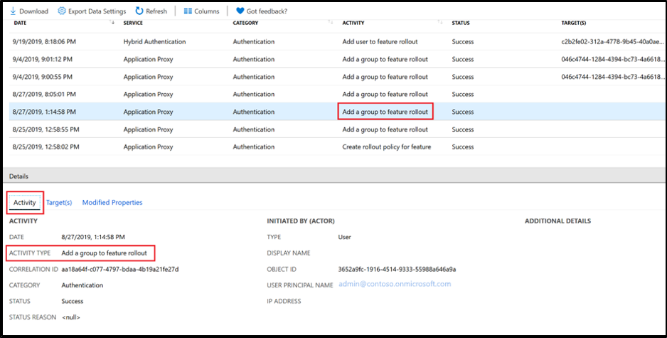
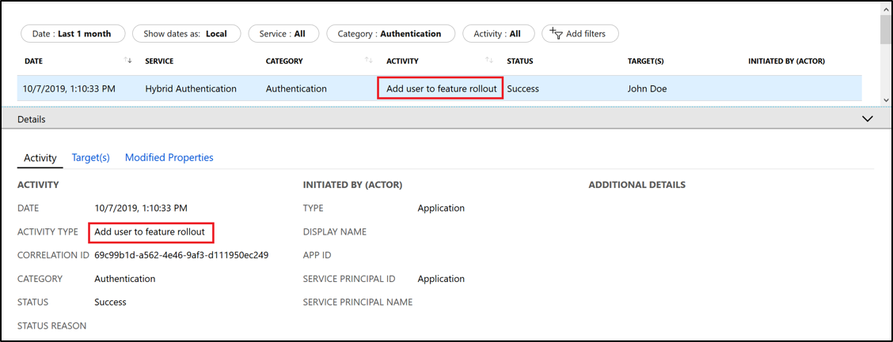
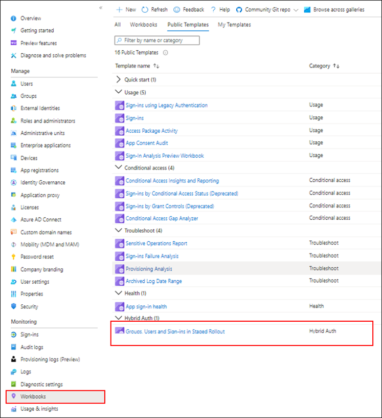

# Migrate to cloud authentication using Staged Rollout

Staged Rollout allows you to selectively test groups of users with cloud authentication capabilities like Microsoft Entra multifactor authentication, Conditional Access, Identity Protection for leaked credentials, Identity Governance, and others, before cutting over your domains. This article discusses how to make the switch. Before you begin the Staged Rollout, however, you should consider the implications if one or more of the following conditions is true:
    
-  You're currently using an on-premises multifactor authentication server. 
-  You're using smart cards for authentication. 
-  Your current server offers certain federation-only features.

Before you try this feature, we suggest that you review our guide on choosing the right authentication method. For more information, see the "Comparing methods" table in [Choose the right authentication method for your Microsoft Entra hybrid identity solution](./choose-ad-authn.md#comparing-methods).

For an overview of the feature, view this "What is Staged Rollout?" video:

>[!VIDEO https://www.microsoft.com/videoplayer/embed/RE3inQJ]

## Prerequisites

-   You have a Microsoft Entra tenant with [federated domains](./whatis-fed.md).

-   You have decided to move one of the following options:
    - **Password hash synchronization (sync)**. For more information, see [What is password hash sync](whatis-phs.md) 
    - **Pass-through authentication**. For more information, see [What is pass-through authentication](how-to-connect-pta.md)  
    - **Microsoft Entra Certificate-based authentication (CBA) settings**. For more information, see [Overview of Microsoft Entra certificate-based authentication](../../authentication/concept-certificate-based-authentication.md) 
    
    For both options, we recommend enabling single sign-on (SSO) to achieve a silent sign-in experience. 
    For Windows 7 or 8.1 domain-joined devices, we recommend using seamless SSO. For more information, see [What is seamless SSO](how-to-connect-sso.md). 
    For Windows 10, Windows Server 2016 and later versions, it's recommended to use SSO via [Primary Refresh Token (PRT)](../../devices/concept-primary-refresh-token.md) with [Microsoft Entra joined devices](../../devices/concept-directory-join.md), [Microsoft Entra hybrid joined devices](../../devices/concept-hybrid-join.md) or [personal registered devices](../../devices/concept-device-registration.md) via Add Work or School Account.

-   You have configured all the appropriate tenant-branding and Conditional Access policies you need for users who are being migrated to cloud authentication.

-   If you plan to use Microsoft Entra multifactor authentication, we recommend that you use [combined registration for self-service password reset (SSPR) and multifactor authentication](../../authentication/concept-registration-mfa-sspr-combined.md) to have your users register their authentication methods once. Note- when using SSPR to reset password or change password using MyProfile page while in Staged Rollout, Microsoft Entra Connect needs to sync the new password hash that can take up to 2 minutes after reset.

-   To use the Staged Rollout feature, you need to be a Hybrid Identity Administrator on your tenant.

-   To enable *seamless SSO* on a specific Active Directory forest, you need to be a domain administrator.

-  If you're deploying Hybrid Microsoft Entra ID or Microsoft Entra join, you must upgrade to Windows 10 1903 update.

## Supported scenarios

The following scenarios are supported for Staged Rollout. The feature works only for:

- Users who are provisioned to Microsoft Entra ID by using Microsoft Entra Connect. It doesn't apply to cloud-only users.

- User sign-in traffic on browsers and *modern authentication* clients. Applications or cloud services that use [legacy authentication](../../conditional-access/block-legacy-authentication.md) fall back to federated authentication flows. An example of legacy authentication might be Exchange online with modern authentication turned off, or Outlook 2010, which doesn't support modern authentication.

- Group size is currently limited to 50,000 users.  If you have groups that are larger than 50,000 users, it's recommended to split this group over multiple groups for Staged Rollout.

- Windows 10 Hybrid Join or Microsoft Entra join primary refresh token acquisition without line-of-sight to the federation server for Windows 10 version 1903 and newer, when user's UPN is routable and domain suffix is verified in Microsoft Entra ID.

- Autopilot enrollment is supported in Staged Rollout with Windows 10 version 1909 or later. 

## Unsupported scenarios

The following scenarios aren't supported for Staged Rollout:

- Legacy authentication such as POP3 and SMTP aren't supported.

- Certain applications send the "domain_hint" query parameter to Microsoft Entra ID during authentication. These flows continue, and users who are enabled for Staged Rollout continue to use federation for authentication.

<!-- -->

- Admins can roll out cloud authentication by using security groups. To avoid sync latency when you're using on-premises Active Directory security groups, we recommend that you use cloud security groups. The following conditions apply:

    - You can use a maximum of 10 groups per feature. That is, you can use 10 groups each for *password hash sync*, *pass-through authentication*, and *seamless SSO*.
    - Nested groups aren't supported. 
    - Dynamic groups aren't supported for Staged Rollout.
    - Contact objects inside the group block the group from being added.

- When you first add a security group for Staged Rollout, you're limited to 200 users to avoid a UX time-out. After you've added the group, you can add more users directly to it, as required.

- While users are in Staged Rollout with Password Hash Synchronization (PHS), by default no password expiration is applied. Password expiration can be applied by enabling "CloudPasswordPolicyForPasswordSyncedUsersEnabled". When "CloudPasswordPolicyForPasswordSyncedUsersEnabled" is enabled, password expiration policy is set to 90 days from the time password was set on-prem with no option to customize it. Programmatically updating PasswordPolicies attribute isn't supported while users are in Staged Rollout. To learn how to set 'CloudPasswordPolicyForPasswordSyncedUsersEnabled' see [Password expiration policy](./how-to-connect-password-hash-synchronization.md#cloudpasswordpolicyforpasswordsyncedusersenabled).

- Windows 10 Hybrid Join or Microsoft Entra join primary refresh token acquisition for Windows 10 version older than 1903. This scenario falls back to the WS-Trust endpoint of the federation server, even if the user signing in is in scope of Staged Rollout.

- Windows 10 Hybrid Join or Microsoft Entra join primary refresh token acquisition for all versions, when user's on-premises UPN isn't routable. This scenario falls back to the WS-Trust endpoint while in Staged Rollout mode, but stops working when staged migration is complete and user sign-on is no longer relying on federation server.

- If you have a nonpersistent VDI setup with Windows 10, version 1903 or later, you must remain on a federated domain. Moving to a managed domain isn't supported on nonpersistent VDI. For more information, see [Device identity and desktop virtualization](../../devices/howto-device-identity-virtual-desktop-infrastructure.md).

- If you have a Windows Hello for Business hybrid certificate trust with certs that are issued via your federation server acting as Registration Authority or smartcard users, the scenario isn't supported on a Staged Rollout. 

  >[!NOTE]
  >You still need to make the final cutover from federated to cloud authentication by using Microsoft Entra Connect or PowerShell. Staged Rollout doesn't switch domains from  federated to managed.  For more information about domain cutover, see [Migrate from federation to password hash synchronization](./migrate-from-federation-to-cloud-authentication.md) and [Migrate from federation to pass-through authentication](./migrate-from-federation-to-cloud-authentication.md).
  
## Get started with Staged Rollout

To test the *password hash sync* sign-in by using Staged Rollout, follow the prework instructions in the next section.

For information about which PowerShell cmdlets to use, see [Microsoft Entra ID 2.0 preview](/powershell/module/azuread/?view=azureadps-2.0-preview&preserve-view=true#staged_rollout).

## Prework for password hash sync

1. Enable *password hash sync* from the [Optional features](how-to-connect-install-custom.md#optional-features) page in Microsoft Entra Connect. 

   

1. Ensure that a full *password hash sync* cycle has run so that all the users' password hashes have been synchronized to Microsoft Entra ID. To check the status of *password hash sync*, you can use the PowerShell diagnostics in [Troubleshoot password hash sync with Microsoft Entra Connect Sync](tshoot-connect-password-hash-synchronization.md).

   

If you want to test *pass-through authentication* sign-in by using Staged Rollout, enable it by following the prework instructions in the next section.

## Prework for pass-through authentication

1. Identify a server that's running Windows Server 2012 R2 or later where you want the *pass-through authentication* agent to run. 

   **Don't** choose the Microsoft Entra Connect server. Ensure that the server is domain-joined, can authenticate selected users with Active Directory, and can communicate with Microsoft Entra ID on outbound ports and URLs. For more information, see the "Step 1: Check the prerequisites" section of [Quickstart: Microsoft Entra seamless single sign-on](how-to-connect-sso-quick-start.md).

1. [Download the Microsoft Entra Connect authentication agent](https://aka.ms/getauthagent), and install it on the server. 

1. To enable [high availability](how-to-connect-sso-quick-start.md), install extra authentication agents on other servers.

1. Make sure that you've configured your [Smart Lockout settings](../../authentication/howto-password-smart-lockout.md) appropriately. Doing so helps ensure that your users' on-premises Active Directory accounts don't get locked out by bad actors.

We recommend enabling *seamless SSO* irrespective of the sign-in method (*password hash sync* or *pass-through authentication*) you select for Staged Rollout. To enable *seamless SSO*, follow the prework instructions in the next section.

## Prework for seamless SSO

Enable *seamless SSO* on the Active Directory forests by using PowerShell. If you have more than one Active Directory forest, enable it for each forest individually. *Seamless SSO* is triggered only for users who are selected for Staged Rollout. It doesn't affect your existing federation setup.

Enable *seamless SSO* by doing the following tasks:

1. Sign in to Microsoft Entra Connect Server.

2. Go to the *%programfiles%\\Microsoft Entra Connect* folder.

3. Import the *seamless SSO* PowerShell module by running the following command: 

   `Import-Module .\AzureADSSO.psd1`

4. Run PowerShell as an administrator. In PowerShell, call `New-AzureADSSOAuthenticationContext`. This command opens a pane where you can enter your tenant's Hybrid Identity Administrator credentials.

5. Call `Get-AzureADSSOStatus | ConvertFrom-Json`. This command displays a list of Active Directory forests (see the "Domains" list) on which this feature has been enabled. By default, it's set to false at the tenant level.

   

6. Call `$creds = Get-Credential`. At the prompt, enter the domain administrator credentials for the intended Active Directory forest.

7. Call `Enable-AzureADSSOForest -OnPremCredentials $creds`. This command creates the AZUREADSSOACC computer account from the on-premises domain controller for the Active Directory forest that's required for *seamless SSO*.

8. *Seamless SSO* requires URLs to be in the intranet zone. To deploy those URLs by using group policies, see [Quickstart: Microsoft Entra seamless single sign-on](how-to-connect-sso-quick-start.md#step-3-roll-out-the-feature).

9. For a complete walkthrough, you can also download our [deployment plans](https://aka.ms/SeamlessSSODPDownload) for *seamless SSO*.

## Enable Staged Rollout

To roll out a specific feature (*pass-through authentication*, *password hash sync*, or *seamless SSO*) to a select set of users in a group, follow the instructions in the next sections.

### Enable a Staged Rollout of a specific feature on your tenant

[!INCLUDE [portal updates](~/articles/active-directory/includes/portal-update.md)]

You can roll out these options:

- **Password hash sync** + **Seamless SSO**
- **Pass-through authentication** + **Seamless SSO**
- **Not supported** - **Password hash sync** + **Pass-through authentication** + **Seamless SSO**
- **Certificate-based authentication settings**
- **Azure multifactor authentication**

To configure Staged Rollout, follow these steps:

1. Sign in to the [Microsoft Entra admin center](https://entra.microsoft.com) as at least a [Hybrid Identity Administrator](../../roles/permissions-reference.md#hybrid-identity-administrator).
2. Browse to **Identity** > **Hybrid management** > **Microsoft Entra Connect** > **Connect sync**.

1. On the *Microsoft Entra Connect* page, under the *Staged rollout of cloud authentication*, select the **Enable staged rollout for managed user sign-in** link. 

1. On the *Enable staged rollout feature* page, select the options you want to enable: [Password Hash Sync](./whatis-phs.md), [Pass-through authentication](./how-to-connect-pta.md), [Seamless single sign-on](./how-to-connect-sso.md), or [Certificate-based Authentication](../../authentication/certificate-based-authentication-federation-get-started.md). For example, if you want to enable **Password Hash Sync** and **Seamless single sign-on**, slide both controls to **On**.

1. Add groups to the features you selected. For example, *pass-through authentication* and *seamless SSO*. To avoid a time-out, ensure that the security groups contain no more than 200 members initially.

   

   >[!NOTE]
   >The members in a group are automatically enabled for Staged Rollout. Nested and dynamic groups are not supported for Staged Rollout.
   >When adding a new group, users in the group (up to 200 users for a new group) will be updated to use managed auth immediately. 
   >Editing a group (adding or removing users), it can take up to 24 hours for changes to take effect.
   >Seamless SSO will apply only if users are in the Seamless SSO group and also in either a PTA or PHS group.

## Auditing

We've enabled audit events for the various actions we perform for Staged Rollout:

- Audit event when you enable a Staged Rollout for *password hash sync*, *pass-through authentication*, or *seamless SSO*.

  >[!NOTE]
  >An audit event is logged when *seamless SSO* is turned on by using Staged Rollout.

  

  

- Audit event when a group is added to *password hash sync*, *pass-through authentication*, or *seamless SSO*.

  >[!NOTE]
  >An audit event is logged when a group is added to *password hash sync* for Staged Rollout.

  

  

- Audit event when a user who was added to the group is enabled for Staged Rollout.

  

  

## Validation

To test the sign-in with *password hash sync* or *pass-through authentication* (username and password sign-in), do the following tasks:

1. On the extranet, go to the [Apps page](https://myapps.microsoft.com) in a private browser session, and then enter the UserPrincipalName (UPN) of the user account that's selected for Staged Rollout.

   Users who have been targeted for Staged Rollout aren't redirected to your federated login page. Instead, they're asked to sign in on the Microsoft Entra tenant-branded sign-in page.

1. Ensure that the sign-in successfully appears in the [Microsoft Entra sign-in activity report](../../reports-monitoring/concept-sign-ins.md) by filtering with the UserPrincipalName.

To test sign-in with *seamless SSO*:

1. On the intranet, go to the [Apps page](https://myapps.microsoft.com) in a private browser session, and then enter the UserPrincipalName (UPN) of the user account that's selected for Staged Rollout.

   Users who have been targeted for Staged Rollout of *seamless SSO* are presented with a "Trying to sign you in ..." message before they're silently signed in.

1. Ensure that the sign-in successfully appears in the [Microsoft Entra sign-in activity report](../../reports-monitoring/concept-sign-ins.md) by filtering with the UserPrincipalName.

   To track user sign-ins that still occur on Active Directory Federation Services (AD FS) for selected Staged Rollout users, follow the instructions at [AD FS troubleshooting: Events and logging](/windows-server/identity/ad-fs/troubleshooting/ad-fs-tshoot-logging#types-of-events). Check vendor documentation about how to check this on third-party federation providers.
   
    >[!NOTE]
    >While users are in Staged Rollout with PHS, changing passwords might take up to 2 minutes to take effect due to sync time. Make sure to set expectations with your users to avoid helpdesk calls after they changed their password.

## Monitoring
You can monitor the users and groups added or removed from Staged Rollout and users sign-ins while in Staged Rollout, using the new Hybrid Auth workbooks in the [Microsoft Entra admin center](https://entra.microsoft.com).

 

## Remove a user from Staged Rollout

Removing a user from the group disables Staged Rollout for that user. To disable the Staged Rollout feature, slide the control back to **Off**.

## Frequently asked questions

**Q: Can I use this capability in production?**

A: Yes, you can use this feature in your production tenant, but we recommend that you first try it out in your test tenant.

**Q: Can this feature be used to maintain a permanent "co-existence," where some users use federated authentication and others use cloud authentication?**

A: No, this feature is designed for testing cloud authentication. After successful testing, a few groups of users you should cut over to cloud authentication. We don't recommend using a permanent mixed state, because this approach could lead to unexpected authentication flows.

**Q: Can I use PowerShell to perform Staged Rollout?**

A: Yes. To learn how to use PowerShell to perform Staged Rollout, see [Microsoft Entra ID Preview](/powershell/module/azuread/?view=azureadps-2.0-preview&preserve-view=true#staged_rollout).

## Next steps
- [Microsoft Entra ID 2.0 preview](/powershell/module/azuread/?view=azureadps-2.0-preview&preserve-view=true#staged_rollout)
- [Change the sign-in method to password hash synchronization](./migrate-from-federation-to-cloud-authentication.md)
- [Change sign-in method to pass-through authentication](./migrate-from-federation-to-cloud-authentication.md)
- [Staged Rollout interactive guide](https://mslearn.cloudguides.com/en-us/guides/Test%20migration%20to%20cloud%20authentication%20using%20staged%20rollout%20in%20Azure%20AD)
