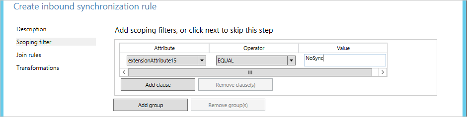
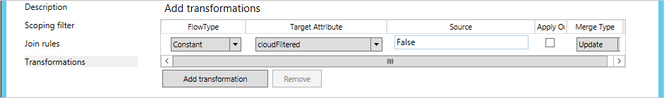
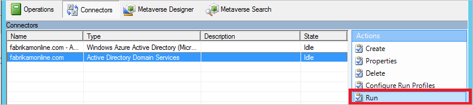

# Microsoft Entra Connect Sync: Configure filtering
By using filtering, you can control which objects appear in Microsoft Entra ID from your on-premises directory. The default configuration takes all objects in all domains in the configured forests. In general, this is the recommended configuration. Users using Microsoft 365 workloads, such as Exchange Online and Skype for Business, benefit from a complete Global Address List so they can send email and call everyone. With the default configuration, they would have the same experience that they would have with an on-premises implementation of Exchange or Lync.

In some cases however, you're required to make some changes to the default configuration. Here are some examples:

* You run a pilot for Azure or Microsoft 365 and you only want a subset of users in Microsoft Entra ID. In the small pilot, it's not important to have a complete Global Address List to demonstrate the functionality.
* You have many service accounts and other nonpersonal accounts that you don't want in Microsoft Entra ID.
* For compliance reasons, you don't delete any user accounts on-premises. You only disable them. But in Microsoft Entra ID, you only want active accounts to be present.

This article covers how to configure the different filtering methods.

> [!IMPORTANT]
> Microsoft doesn't support modifying or operating Microsoft Entra Connect Sync outside of the actions that are formally documented. Any of these actions might result in an inconsistent or unsupported state of Microsoft Entra Connect Sync. As a result, Microsoft can't provide technical support for such deployments.

## Basics and important notes
In Microsoft Entra Connect Sync, you can enable filtering at any time. If you start with a default configuration of directory synchronization and then configure filtering, the objects that are filtered out are no longer synchronized to Microsoft Entra ID. Because of this change, any objects in Microsoft Entra ID that were previously synchronized but were then filtered are deleted in Microsoft Entra ID.

Before you start making changes to filtering, make sure that you [disable the built-in scheduler](#disable-the-synchronization-scheduler) so you don't accidentally export changes that you haven't yet verified to be correct.

Because filtering can remove many objects at the same time, you want to make sure that your new filters are correct before you start exporting any changes to Microsoft Entra ID. After you've completed the configuration steps, we strongly recommend that you follow the [verification steps](#apply-and-verify-changes) before you export and make changes to Microsoft Entra ID.

To protect you from deleting many objects by accident, the feature "[prevent accidental deletes](how-to-connect-sync-feature-prevent-accidental-deletes.md)" is on by default. If you delete many objects due to filtering (500 by default), you need to follow the steps in this article to allow the deletes to go through to Microsoft Entra ID.

If you use a build before November 2015 ([1.0.9125](reference-connect-version-history.md)), make a change to a filter configuration, and use password hash synchronization, then you need to trigger a full sync of all passwords after you've completed the configuration. For steps on how to trigger a password full sync, see [Trigger a full sync of all passwords](tshoot-connect-password-hash-synchronization.md#trigger-a-full-sync-of-all-passwords). If you're on build 1.0.9125 or later, then the regular **full synchronization** action also calculates whether passwords should be synchronized and if this extra step is no longer required.

If **user** objects were inadvertently deleted in Microsoft Entra ID because of a filtering error, you can recreate the user objects in Microsoft Entra ID by removing your filtering configurations. Then you can synchronize your directories again. This action restores the users from the recycle bin in Microsoft Entra ID. However, you can't undelete other object types. For example, if you accidentally delete a security group and it was used to ACL a resource, the group and its ACLs can't be recovered.

Microsoft Entra Connect only deletes objects that it has once considered to be in scope. If there are objects in Microsoft Entra ID that were created by another sync engine and these objects aren't in scope, adding filtering doesn't remove them. For example, if you start with a DirSync server that created a complete copy of your entire directory in Microsoft Entra ID, and you install a new Microsoft Entra Connect Sync server in parallel with filtering enabled from the beginning, Microsoft Entra Connect doesn't remove the extra objects that are created by DirSync.

The filtering configuration is retained when you install or upgrade to a newer version of Microsoft Entra Connect. It's always a best practice to verify that the configuration wasn't inadvertently changed after an upgrade to a newer version before running the first synchronization cycle.

If you have more than one forest, then you must apply the filtering configurations that are described in this topic to every forest (assuming that you want the same configuration for all of them).

### Disable the synchronization scheduler
To disable the built-in scheduler that triggers a synchronization cycle every 30 minutes, follow these steps:

1. Open Windows Powershell, import the ADSync module and disable the scheduler using the following commands

```Powershell
import-module ADSync
Set-ADSyncScheduler -SyncCycleEnabled $False
```

2. Make the changes that are documented in this article. Then re-enable the scheduler again with the following command

```Powershell
Set-ADSyncScheduler -SyncCycleEnabled $True
```

## Filtering options
You can apply the following filtering configuration types to the directory synchronization tool:

* [**Group-based**](#group-based-filtering): Filtering based on a single group can only be configured on initial installation by using the installation wizard.
* [**Domain-based**](#domain-based-filtering): By using this option, you can select which domains synchronize to Microsoft Entra ID. You can also add and remove domains from the sync engine configuration when you make changes to your on-premises infrastructure after you install Microsoft Entra Connect Sync.
* [**Organizational unit (OU)–based**](#organizational-unitbased-filtering): By using this option, you can select which OUs synchronize to Microsoft Entra ID. This option is for all object types in selected OUs.
* [**Attribute-based**](#attribute-based-filtering): By using this option, you can filter objects based on attribute values on the objects. You can also have different filters for different object types.

You can use multiple filtering options at the same time. For example, you can use OU-based filtering to only include objects in one OU. At the same time, you can use attribute-based filtering to filter the objects further. When you use multiple filtering methods, the filters use a logical "AND" between the filters.

## Domain-based filtering
This section provides you with the steps to configure your domain filter. If you added or removed domains in your forest after you installed Microsoft Entra Connect, you also have to update the filtering configuration.

To change domain-based filtering, run the installation wizard: [domain and OU filtering](how-to-connect-install-custom.md#domain-and-ou-filtering). The installation wizard automates all the tasks that are documented in this topic.


## Organizational unit–based filtering
To change OU-based filtering, run the installation wizard: [domain and OU filtering](how-to-connect-install-custom.md#domain-and-ou-filtering). The installation wizard automates all the tasks that are documented in this topic.

> [!IMPORTANT]
> If you explicitly select an OU for synchronization, Microsoft Entra Connect will add the DistinguishedName of that OU in the inclusion list for the domain's sync scope. However, if you later rename that OU in Active Directory, the DistinguishedName of the OU is changed, and consequently, Microsoft Entra Connect will no longer consider that OU in sync scope. This will not cause an immediate issue, but upon a full import step, Microsoft Entra Connect will reevaluate the sync scope and delete (i.e. obsolete) any objects out of sync scope, which can potentially cause an unexpected mass deletion of objects in Microsoft Entra ID. To prevent this issue, after renaming a OU, run Microsoft Entra Connect Wizard and re-select the OU to be again included in sync scope.

## Attribute-based filtering
Make sure that you're using the November 2015 ([1.0.9125](reference-connect-version-history.md)) or later build for these steps to work.

> [!IMPORTANT]
>Microsoft recommends to not modify the default rules created by **Microsoft Entra Connect**. If you want to modify the rule, then clone it, and disable the original rule. Make any changes to the cloned rule. Please note that by doing so (disabling original rule) you will miss any bug fixes or features enabled through that rule.

Attribute-based filtering is the most flexible way to filter objects. You can use the power of [declarative provisioning](concept-azure-ad-connect-sync-declarative-provisioning.md) to control almost every aspect of when an object is synchronized to Microsoft Entra ID.

You can apply [inbound](#inbound-filtering) filtering from Active Directory to the metaverse, and [outbound](#outbound-filtering) filtering from the metaverse to Microsoft Entra ID. We recommend that you apply inbound filtering because that is the easiest to maintain. You should only use outbound filtering if it's required to join objects from more than one forest before the evaluation can take place.

### Inbound filtering
Inbound filtering uses the default configuration, where objects going to Microsoft Entra ID must have the metaverse attribute cloudFiltered not set to a value to be synchronized. If this attribute's value is set to **True**, then the object isn't synchronized. It shouldn't be set to **False**, by design. To make sure other rules have the ability to contribute a value, this attribute is only supposed to have the values **True** or **NULL** (absent).

Note that Microsoft Entra Connect is designed to clean up the objects it was responsible to provision in Microsoft Entra ID. If the system hasn't provisioned the object in Microsoft Entra ID in the past, but it gets the Microsoft Entra object during an import step, it correctly assumes that this object was created in Microsoft Entra ID by some other system. Microsoft Entra Connect doesn't clean up these types of Microsoft Entra objects, even when the metaverse attribute `cloudFiltered` is set to **True**.

In inbound filtering, you use the power of **scope** to determine which objects to synchronize or not synchronize. This is where you make adjustments to fit your own organization's requirements. The scope module has a **group** and a **clause** to determine when a sync rule is in scope. A group contains one or many clauses. There is a logical "AND" between multiple clauses, and a logical "OR" between multiple groups.

Let us look at an example:  
  
This should be read as **(department = IT) OR (department = Sales AND c = US)**.

In the following samples and steps, you use the user object as an example, but you can use this for all object types.

In the following samples, the precedence value starts with 50. This can be any number not used, but should be lower than 100.

#### Negative filtering: "do not sync these"
In the following example, you filter out (not synchronize) all users where **extensionAttribute15** has the value **NoSync**.

1. Sign in to the server that is running Microsoft Entra Connect Sync by using an account that is a member of the **ADSyncAdmins** security group.
2. Start **Synchronization Rules Editor** from the **Start** menu.
3. Make sure **Inbound** is selected, and click **Add New Rule**.
4. Give the rule a descriptive name, such as "*In from AD – User DoNotSyncFilter*". Select the correct forest, select **User** as the **CS object type**, and select **Person** as the **MV object type**. In **Link Type**, select **Join**. In **Precedence**, type a value that isn't currently used by another synchronization rule (for example 50), and then click **Next**.  
     
5. In **Scoping filter**, click **Add Group**, and click **Add Clause**. In **Attribute**, select **ExtensionAttribute15**. Make sure that **Operator** is set to **EQUAL**, and type the value **NoSync** in the **Value** box. Click **Next**.  
     
6. Leave the **Join** rules empty, and then click **Next**.
7. Click **Add Transformation**, select the **FlowType** as **Constant**, and select **cloudFiltered** as the **Target Attribute**. In the **Source** text box, type **True**. Click **Add** to save the rule.  
   
8. To complete the configuration, you need to run a **Full sync**. Continue reading the section [Apply and verify changes](#apply-and-verify-changes).

#### Positive filtering: "only sync these"
Expressing positive filtering can be more challenging because you also have to consider objects that aren't obvious to be synchronized, such as conference rooms. You are also going to override the default filter in the out-of-box rule **In from AD - User Join**. When you create your custom filter, make sure to not include critical system objects, replication conflict objects, special mailboxes, and the service accounts for Microsoft Entra Connect.

The positive filtering option requires two sync rules. You need one rule (or several) with the correct scope of objects to synchronize. You also need a second catch-all sync rule that filters out all objects that haven't yet been identified as an object that should be synchronized.

In the following example, you only synchronize user objects where the department attribute has the value **Sales**.

1. Sign in to the server that is running Microsoft Entra Connect Sync by using an account that is a member of the **ADSyncAdmins** security group.
2. Start **Synchronization Rules Editor** from the **Start** menu.
3. Make sure **Inbound** is selected, and click **Add New Rule**.
4. Give the rule a descriptive name, such as "*In from AD – User Sales sync*". Select the correct forest, select **User** as the **CS object type**, and select **Person** as the **MV object type**. In **Link Type**, select **Join**. In **Precedence**, type a value that isn't currently used by another synchronization rule (for example 51), and then click **Next**.  
     
5. In **Scoping filter**, click **Add Group**, and click **Add Clause**. In **Attribute**, select **department**. Make sure that Operator is set to **EQUAL**, and type the value **Sales** in the **Value** box. Click **Next**.  
     
6. Leave the **Join** rules empty, and then click **Next**.
7. Click **Add Transformation**, select **Constant** as the **FlowType**, and select the **cloudFiltered** as the **Target Attribute**. In the **Source** box, type **False**. Click **Add** to save the rule.  
     
   This is a special case where you explicitly set cloudFiltered to **False**.
8. We now have to create the catch-all sync rule. Give the rule a descriptive name, such as "*In from AD – User Catch-all filter*". Select the correct forest, select **User** as the **CS object type**, and select **Person** as the **MV object type**. In **Link Type**, select **Join**. In **Precedence**, type a value that isn't currently used by another Synchronization Rule (for example 99). You've selected a precedence value that is higher (lower precedence) than the previous sync rule. But you've also left some room so that you can add more filtering sync rules later when you want to start synchronizing additional departments. Click **Next**.  
     
9. Leave **Scoping filter** empty, and click **Next**. An empty filter indicates that the rule is to be applied to all objects.
10. Leave the **Join** rules empty, and then click **Next**.
11. Click **Add Transformation**, select **Constant** as the **FlowType**, and select **cloudFiltered** as the **Target Attribute**. In the **Source** box, type **True**. Click **Add** to save the rule.  
      
12. To complete the configuration, you need to run a **Full sync**. Continue reading the section [Apply and verify changes](#apply-and-verify-changes).

If you need to, you can create more rules of the first type where you include more objects in the synchronization.

### Outbound filtering
In some cases, it's necessary to do the filtering only after the objects have joined in the metaverse. For example, it might be necessary to look at the mail attribute from the resource forest, and the userPrincipalName attribute from the account forest, to determine if an object should be synchronized. In these cases, you create the filtering on the outbound rule.

In this example, you change the filtering so that only users that have both their mail and userPrincipalName ending in @contoso.com are synchronized:

1. Sign in to the server that is running Microsoft Entra Connect Sync by using an account that is a member of the **ADSyncAdmins** security group.
2. Start **Synchronization Rules Editor** from the **Start** menu.
3. Under **Rules Type**, click **Outbound**.
4. Depending on the version of Connect you use, either find the rule named **Out to Microsoft Entra ID – User Join** or **Out to Microsoft Entra ID - User Join SOAInAD**, and click **Edit**.
5. In the pop-up, answer **Yes** to create a copy of the rule.
6. On the **Description** page, change **Precedence** to an unused value, such as 50.
7. Click **Scoping filter** on the left-hand navigation, and then click **Add clause**. In **Attribute**, select **mail**. In **Operator**, select **ENDSWITH**. In **Value**, type **\@contoso.com**, and then click **Add clause**. In **Attribute**, select **userPrincipalName**. In **Operator**, select **ENDSWITH**. In **Value**, type **\@contoso.com**.
8. Click **Save**.
9. To complete the configuration, you need to run a **Full sync**. Continue reading the section [Apply and verify changes](#apply-and-verify-changes).

## Apply and verify changes
After you've made your configuration changes, you must apply them to the objects that are already present in the system. It might also be that the objects that aren't currently in the sync engine should be processed (and the sync engine needs to read the source system again to verify its content).

If you changed the configuration by using **domain** or **organizational-unit** filtering, then you need to do a **Full import**, followed by **Delta synchronization**.

If you changed the configuration by using **attribute** filtering, then you need to do a **Full synchronization**.

Do the following steps:

1. Start **Synchronization Service** from the **Start** menu.
2. Select **Connectors**. In the **Connectors** list, select the Connector where you made a configuration change earlier. In **Actions**, select **Run**.  
     
3. In **Run profiles**, select the operation that was mentioned in the previous section. If you need to run two actions, run the second after the first one has finished. (The **State** column is **Idle** for the selected connector.)

After the synchronization, all changes are staged to be exported. Before you actually make the changes in Microsoft Entra ID, you want to verify that all these changes are correct.

1. Start a command prompt, and go to `%ProgramFiles%\Microsoft Azure AD Sync\bin`.
2. Run `csexport "Name of Connector" %temp%\export.xml /f:x`.  
   The name of the Connector is in Synchronization Service. It has a name similar to "contoso.com – Microsoft Entra ID" for Microsoft Entra ID.
3. Run `CSExportAnalyzer %temp%\export.xml > %temp%\export.csv`.
4. You now have a file in %temp% named export.csv that can be examined in Microsoft Excel. This file contains all the changes that are about to be exported.
5. Make the necessary changes to the data or configuration, and run these steps again (Import, Synchronize, and Verify) until the changes that are about to be exported are what you expect.

When you're satisfied, export the changes to Microsoft Entra ID.

1. Select **Connectors**. In the **Connectors** list, select the Microsoft Entra Connector. In **Actions**, select **Run**.
2. In **Run profiles**, select **Export**.
3. If your configuration changes delete many objects, then you see an error in the export when the number is more than the configured threshold (by default 500). If you see this error, then you need to temporarily disable the "[prevent accidental deletes](how-to-connect-sync-feature-prevent-accidental-deletes.md)" feature.

Now it's time to enable the scheduler again.

1. Start **Task Scheduler** from the **Start** menu.
2. Directly under **Task Scheduler Library**, find the task named **Azure AD Sync Scheduler**, right-click, and select **Enable**.

## Group-based filtering
You can configure group-based filtering the first time that you install Microsoft Entra Connect by using [custom installation](how-to-connect-install-custom.md#sync-filtering-based-on-groups). It's intended for a pilot deployment where you want only a small set of objects to be synchronized. When you disable group-based filtering, it can't be enabled again. It's *not supported* to use group-based filtering in a custom configuration. It's only supported to configure this feature by using the installation wizard. When you've completed your pilot, then use one of the other filtering options in this topic. When using OU-based filtering in conjunction with group-based filtering, the OU(s) where the group and its members are located must be included.

When synchronizing multiple AD forests, you can configure group-based filtering by specifying a different group for each AD connector. If you wish to synchronize a user in one AD forest and the same user has one or more corresponding objects in other AD forests, you must ensure that the user object and all its corresponding objects are within group-based filtering scope. For examples:

* You have a user in one forest that has a corresponding FSP (Foreign Security Principal) object in another forest. Both objects must be within group-based filtering scope. Otherwise, the user will not be synchronized to Microsoft Entra ID.

* You have a user in one forest that has a corresponding resource account (e.g., linked mailbox) in another forest. Further, you have configured Microsoft Entra Connect to link the user with the resource account. Both objects must be within group-based filtering scope. Otherwise, the user will not be synchronized to Microsoft Entra ID.

* You have a user in one forest that has a corresponding mail contact in another forest. Further, you have configured Microsoft Entra Connect to link the user with the mail contact. Both objects must be within group-based filtering scope. Otherwise, the user will not be synchronized to Microsoft Entra ID.


## Next steps
- Learn more about [Microsoft Entra Connect Sync](how-to-connect-sync-whatis.md) configuration.
- Learn more about [integrating your on-premises identities with Microsoft Entra ID](../whatis-hybrid-identity.md).
