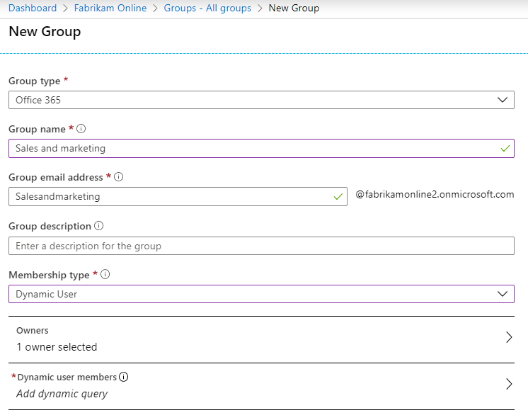
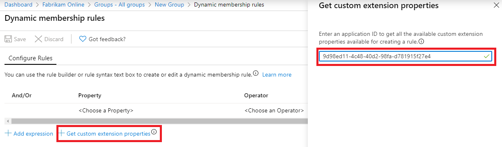
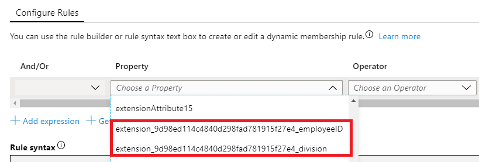

# Microsoft Entra Connect Sync: Directory extensions
You can use directory extensions to extend the schema in Microsoft Entra ID with your own attributes from on-premises Active Directory. This feature enables you to build LOB apps by consuming attributes that you continue to manage on-premises. These attributes can be consumed through [extensions](/graph/extensibility-overview). You can see the available attributes by using [Microsoft Graph Explorer](https://developer.microsoft.com/graph/graph-explorer). You can also use this feature to create dynamic groups in Microsoft Entra ID.

At present, no Microsoft 365 workload consumes these attributes.

>[!IMPORTANT]
>If you have exported a configuration that contains a custom rule used to synchronize directory extension attributes and you attempt to import this rule in to a new or existing installation of Microsoft Entra Connect, the rule will be created during import, but the directory extension attributes will not be mapped.  You will need to re-select the directory extension attributes and re-associate them with the rule or recreate the rule entirely to fix this.

## Customize which attributes to synchronize with Microsoft Entra ID

You configure which additional attributes you want to synchronize in the custom settings path in the installation wizard.

> [!NOTE]
> In Microsoft Entra Connect versions earlier than 1.2.65.0, the search box for **Available Attributes** is case-sensitive.

  

The installation shows the following attributes, which are valid candidates:

* User and Group object types
* Single-valued attributes: String, Boolean, Integer, Binary
* Multi-valued attributes: String, Binary

> [!NOTE]
> Not all features in Microsoft Entra ID support multi valued extension attributes. Please refer to the documentation of the feature in which you plan to use these attributes to confirm they are supported.
The list of attributes is read from the schema cache that's created during installation of Microsoft Entra Connect. If you have extended the Active Directory schema with additional attributes, you must [refresh the schema](how-to-connect-installation-wizard.md#refresh-directory-schema) before these new attributes are visible.

An object in Microsoft Entra ID can have up to 100 attributes for directory extensions. The maximum length is 250 characters. If an attribute value is longer, the sync engine truncates it.

> [!NOTE]
> It is not supported to sync constructed attributes, such as msDS-UserPasswordExpiryTimeComputed. If you upgrade from an old version of AADConnect you may still see these attributes show up in the installation wizard, you should not enable them though. Their value will not sync to Microsoft Entra ID if you do. 
> You can read more about constructed attributes in [this article](/openspecs/windows_protocols/ms-adts/a3aff238-5f0e-4eec-8598-0a59c30ecd56).
> You should also not attempt to sync [Non-replicated attributes](/windows/win32/ad/attributes), such as badPwdCount, Last-Logon, and Last-Logoff, as their values will not be synced to Microsoft Entra ID.

## Configuration changes in Microsoft Entra ID made by the wizard

During installation of Microsoft Entra Connect, an application is registered where these attributes are available. You can see this application in the [Microsoft Entra admin center](https://entra.microsoft.com). Its name is always **Tenant Schema Extension App**.

>[!NOTE]
> The **Tenant Schema Extension App** is a system-only application that can't be deleted and attribute extension definitions can't be removed.

Make sure you select **All applications** to see this app.

The attributes are prefixed with **extension \_{ApplicationId}\_**. ApplicationId has the same value for all attributes in your Microsoft Entra tenant. You will need this value for all other scenarios in this topic.

## Viewing attributes using the Microsoft Graph API

These attributes are now available through the Microsoft Graph API, by using [Microsoft Graph Explorer](https://developer.microsoft.com/graph/graph-explorer#).

>[!NOTE]
> In the Microsoft Graph API, you need to ask for the attributes to be returned. Explicitly select the attributes like this: `https://graph.microsoft.com/beta/users/abbie.spencer@fabrikamonline.com?$select=extension_9d98ed114c4840d298fad781915f27e4_employeeID,extension_9d98ed114c4840d298fad781915f27e4_division`.
>
> For more information, see [Microsoft Graph: Use query parameters](/graph/query-parameters#select-parameter).

>[!NOTE]
> It is not supported to sync attribute values from AADConnect to extension attributes that are not created by AADConnect. Doing so may produce performance issues and unexpected results. Only extension attributes that are created as shown in the above are supported for synchronization.

## Use the attributes in dynamic groups

One of the more useful scenarios is to use these attributes in dynamic security or Microsoft 365 groups.

1. Create a new group in Microsoft Entra ID. Give it a good name and make sure the **Membership type** is **Dynamic User**.

   

2. Select to **Add dynamic query**. If you look at the properties, then you will not see these extended attributes. You need to add them first. Click **Get custom extension properties**, enter the Application ID, and click **Refresh properties**.

    

3. Open the property drop-down and note that the attributes you added are now visible.

   

   Complete the expression to suit your requirements. In our example, the rule is set to **(user.extension_9d98ed114c4840d298fad781915f27e4_division -eq "Sales and marketing")**.

4. After the group has been created, give Microsoft Entra some time to populate the members and then review the members.

     

## Next steps
Learn more about the [Microsoft Entra Connect Sync](how-to-connect-sync-whatis.md) configuration.

Learn more about [Integrating your on-premises identities with Microsoft Entra ID](../whatis-hybrid-identity.md).
